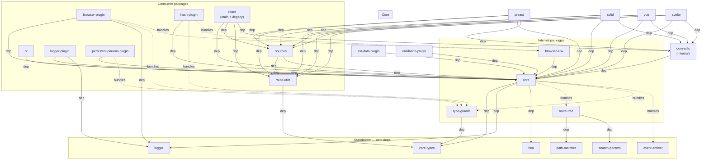
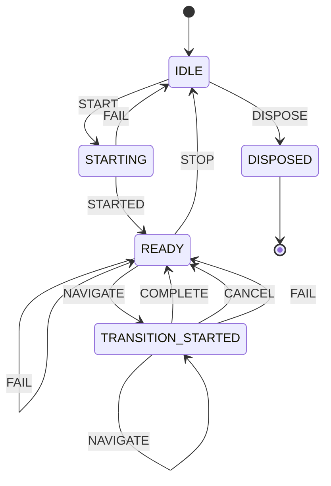
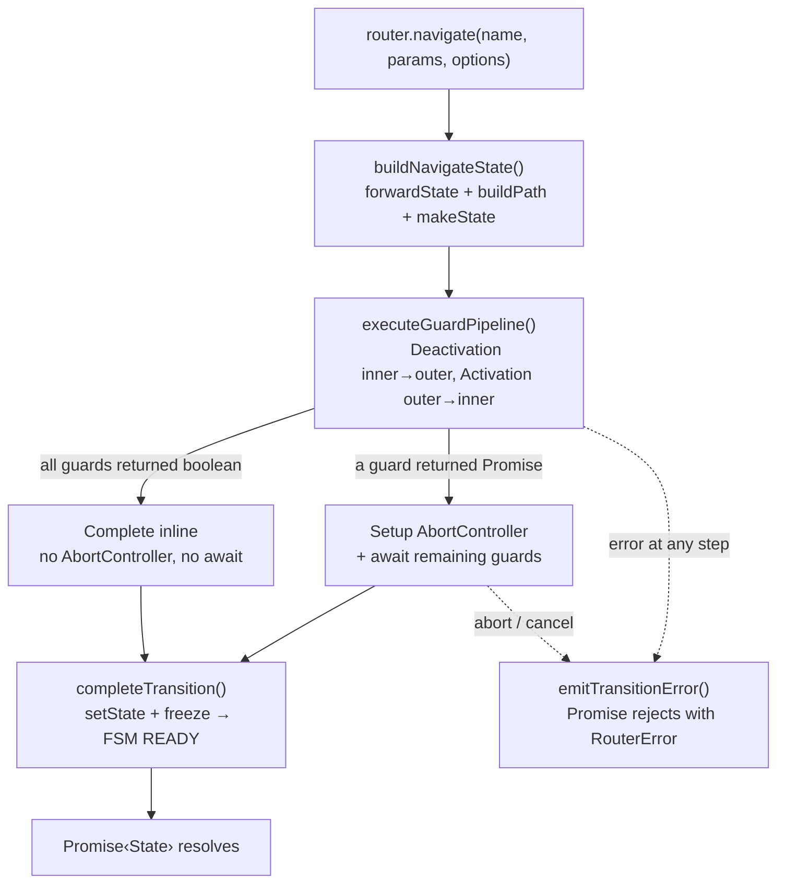

# Architecture

> High-level system design for contributors. See [Glossary](https://github.com/greydragon888/real-router/wiki/glossary) for project-specific terminology.

## Bird's Eye View

Real-Router is a **named, hierarchical, state-driven router** for JavaScript applications. Routes form a dot-notation tree (`users.profile.edit`), navigation is guarded by lifecycle functions, and the entire lifecycle is driven by a single finite state machine — no boolean flags, no ad-hoc state.

Key technical choices:

- **Segment Trie** for URL matching — O(segments) traversal, O(1) for static routes
- **Facade + Namespaces** — thin Router class delegates to single-responsibility namespace modules
- **Optimistic sync execution** — navigation runs synchronously unless a guard returns a Promise
- **Plugin interception** — plugins wrap router methods (onion-layer), they cannot block transitions
- **Deeply frozen state** — all `State` objects are `Object.freeze()`'d, never mutated

## Package Map

```
real-router/
├── packages/
│   ├── core/                      # Router implementation (facade + namespaces)
│   ├── core-types/                # @real-router/types — shared TypeScript types
│   ├── react/                     # React integration (dual entry: main for 19.2+, /legacy for 18+)
│   ├── preact/                     # Preact integration (hooks, components, Suspense)
│   ├── solid/                     # Solid.js integration (hooks, components, directives)
│   ├── vue/                       # Vue 3 integration (composables, components, directives)
│   ├── svelte/                    # Svelte 5 integration (composables, components, actions)
│   ├── sources/                   # Subscription layer for UI bindings (useSyncExternalStore)
│   ├── rx/                        # Reactive Observable API (state$, events$, operators)
│   ├── browser-plugin/            # Browser History API synchronization
│   ├── hash-plugin/               # Hash-based routing (#/path)
│   ├── logger-plugin/             # Development logging with timing and param diffs
│   ├── persistent-params-plugin/  # Parameter persistence across navigations
│   ├── ssr-data-plugin/           # SSR per-route data loading via start() interceptor
│   ├── validation-plugin/         # Opt-in argument validation (DX-only, 100% tree-shakeable)
│   ├── route-utils/               # Route tree queries and segment testing
│   ├── logger/                    # Isomorphic structured logging
│   ├── fsm/                       # Finite state machine engine (internal, published by accident)
│   ├── dom-utils/                 # Shared DOM utilities for adapters: route announcer, link helpers (internal)
│   ├── browser-env/               # Shared browser abstractions for plugins (internal)
│   ├── event-emitter/             # Generic typed event emitter (internal)
│   ├── route-tree/                # Route tree building, validation, matcher facade (internal)
│   ├── path-matcher/              # Segment Trie URL matching and path building (internal)
│   ├── search-params/             # Query string handling (internal)
│   └── type-guards/               # Runtime type validation (internal)
├── examples/
│   ├── shared/                    # Shared store, API, abilities, styles
│   ├── react/    (16 examples)    # React 19.2+ examples + 8 e2e suites
│   ├── preact/   (11 examples)    # Preact examples + 8 e2e suites
│   ├── solid/    (14 examples)    # Solid.js examples + 8 e2e suites
│   ├── vue/      (14 examples)    # Vue 3 SFC examples + 8 e2e suites
│   ├── svelte/   (15 examples)    # Svelte 5 examples + 8 e2e suites
│   │   ├── ssr/                    # Server-side rendering with Express + Vite
│   │   └── ssg/                   # Static site generation with Vite
```

**Public packages** (published to npm): `core`, `core-types`, `react`, `preact`, `solid`, `vue`, `svelte`, `sources`, `rx`, `browser-plugin`, `hash-plugin`, `logger-plugin`, `persistent-params-plugin`, `ssr-data-plugin`, `validation-plugin`, `route-utils`, `logger`

**Internal packages** (bundled into consumers, not on npm): `route-tree`, `path-matcher`, `search-params`, `type-guards`, `event-emitter`, `browser-env`, `dom-utils`

## Package Dependencies



Solid arrows = runtime `dependencies`. Dashed arrows = bundled at build time (consumer's bundle includes the internal package).

## Core Architecture

The `core` package uses a **facade + namespaces** pattern:

```
Router.ts (facade) ─────────────────────────────────────────────────
    │
    ├── RouterFSM              — finite state machine (lifecycle + navigation state)
    │
    ├── RoutesNamespace        — route tree, path operations, forwarding
    ├── StateNamespace         — current/previous state storage
    ├── NavigationNamespace    — navigate(), transition pipeline
    ├── OptionsNamespace       — router configuration
    ├── DependenciesStore      — dependency injection container (plain store)
    ├── EventBusNamespace      — FSM + EventEmitter encapsulation, events, subscribe
    ├── PluginsNamespace       — plugin lifecycle management
    ├── RouteLifecycleNamespace — canActivate/canDeactivate guards
    └── RouterLifecycleNamespace — start/stop operations

api/ (standalone functions — tree-shakeable, access router via WeakMap)
    ├── getRoutesApi(router)      — route CRUD
    ├── getDependenciesApi(router) — dependency CRUD
    ├── getLifecycleApi(router)   — guard management
    ├── getPluginApi(router)      — plugin infrastructure, interception, router extension
    └── cloneRouter(router, deps) — SSR cloning

wiring/ (construction-time, Builder+Director pattern)
    ├── RouterWiringBuilder    — namespace dependency wiring
    └── wireRouter             — calls wire methods in correct order
```

Router.ts is a thin facade (~640 lines). All business logic lives in namespaces. Standalone API functions in `api/` access router internals via a `WeakMap<Router, RouterInternals>` registry — this enables tree-shaking.

## Router FSM

All router lifecycle and navigation state is managed by a single finite state machine:



| State                | Description                                          |
| -------------------- | ---------------------------------------------------- |
| `IDLE`               | Router not started or stopped                        |
| `STARTING`           | Initializing (synchronous window before first await) |
| `READY`              | Ready for navigation                                 |
| `TRANSITION_STARTED` | Navigation in progress                               |
| `DISPOSED`           | Terminal state, no transitions out                   |

FSM events trigger observable emissions via `fsm.on(from, event, action)`:

- `STARTED` → `emitRouterStart()`
- `NAVIGATE` → `emitTransitionStart()`
- `COMPLETE` → `emitTransitionSuccess()`
- `CANCEL` → `emitTransitionCancel()`
- `FAIL` → `emitTransitionError()`
- `STOP` → `emitRouterStop()`

## Navigation Pipeline

All navigation methods return `Promise<State>`. The pipeline uses **optimistic sync execution** — guards run synchronously until one returns a Promise, then switches to the async path.



On error at any step: `emitTransitionError()`, Promise rejects with `RouterError`.

**`navigateToNotFound()`** bypasses this pipeline entirely — sets state directly and emits only `TRANSITION_SUCCESS` (no guards, no AbortController, no `TRANSITION_START`). Always uses `replace: true`.

**Cancellation sources:** external AbortController (`opts.signal`), concurrent navigation (aborts previous), `stop()`, `dispose()`. AbortController is only created on the async path.

## Extension Points

| Extension   | Purpose                        | Scope     | Can Block |
| ----------- | ------------------------------ | --------- | --------- |
| **Guards**  | Route access control           | Per-route | Yes       |
| **Plugins** | React to events, extend router | Global    | No        |

### Plugin Interception

Plugins intercept router methods via `addInterceptor()` on `PluginApi`:

| Method         | Signature                                                 | Used by                         |
| -------------- | --------------------------------------------------------- | ------------------------------- |
| `start`        | `(path?: string) => Promise<State>`                       | browser-plugin, ssr-data-plugin |
| `buildPath`    | `(route: string, params?: Params) => string`              | persistent-params-plugin        |
| `forwardState` | `(routeName: string, routeParams: Params) => SimpleState` | persistent-params-plugin        |

Multiple interceptors per method execute in **LIFO** order (last-registered wraps first). Each receives `next` (original or previously-wrapped function) plus the method's arguments. Applied via `createInterceptable()` in `RouterInternals`.

### Router Extension

Plugins extend the router instance with new properties via `extendRouter()` on `PluginApi`. Throws `RouterError(PLUGIN_CONFLICT)` if any key already exists (atomic validation). Extensions are tracked in `RouterInternals.routerExtensions` and cleaned up on unsubscribe or `dispose()`.

### Validator Slot

`@real-router/validation-plugin` uses a unique extension mechanism — not interceptors, not event listeners, but a **nullable validator slot** in `RouterInternals`:

```typescript
ctx.validator?.routes.validateBuildPathArgs(route); // no-op when null
```

The slot is typed as `RouterValidator | null`. The plugin sets it on registration, clears it on teardown. All core call sites use optional chaining — zero overhead when absent.

## Invariants

These are deliberately designed constraints. Violating them will break the system in subtle ways.

### State & Immutability

- **All `State` objects are deeply frozen** (`Object.freeze`). Never mutate — always create new.
- **Router options are immutable** — deep-frozen at construction time.

### FSM & Events

- **All router events are consequences of FSM transitions** — never manual calls. No boolean flags (`#started`, `#active`, `#navigating` — all removed).
- **`dispose()` is terminal** — DISPOSED state has no outbound transitions. All mutating methods throw `RouterError(ROUTER_DISPOSED)` after disposal.

### Guards & Plugins

- **Guards return `boolean | Promise<boolean>` only** — no redirects, no state modification, no `State` return.
- **Plugins are observers** — they react to events but cannot block or modify the transition pipeline.
- **Guard execution order is fixed**: deactivation innermost → outermost, then activation outermost → innermost.
- **`navigateToNotFound()` bypasses both** — no guards run, plugins only see `onTransitionSuccess`.

### Navigation

- **Concurrent navigation cancels previous** — the previous internal AbortController is aborted, promise rejects with `TRANSITION_CANCELLED`.
- **Navigating FROM `UNKNOWN_ROUTE` auto-forces `replace: true`** — prevents browser history pollution with 404 entries.
- **Fire-and-forget is safe** — `navigate()` internally suppresses unhandled rejections for expected errors (`SAME_STATES`, `TRANSITION_CANCELLED`, `ROUTER_NOT_STARTED`, `ROUTE_NOT_FOUND`).

### Packages

- **Internal packages are never imported by end users** — they are bundled into consumer packages at build time.
- **`core` never depends on browser APIs** — platform-agnostic. The `start(path)` method requires a path; browser-plugin makes it optional by injecting `browser.getLocation()` via interceptor.

## Boundaries

### Layer Rules

```
┌──────────────────────────────────────────────────────────────────┐
│                     Consumer Packages                            │
├──────────────────────────────────────────────────────────────────┤
│ react │ preact │ solid │ vue │ svelte │ browser-plugin │ ... │
├──────────────────────────────────────────────────────────────────┤
│                           Core                                   │
├──────────────────────────────────────────────────────────────────┤
│                      core  +  core-types                         │
├──────────────────────────────────────────────────────────────────┤
│                     Foundation (internal)                        │
├──────────────────────────────────────────────────────────────────┤
│  route-tree │ path-matcher │ search-params │ event-emitter │ ... │
└──────────────────────────────────────────────────────────────────┘
```

**ALLOWED:**

- Consumer packages depend on `core` and `core-types`
- Consumer packages bundle internal packages as needed (`type-guards`, `browser-env`)
- Foundation packages depend on each other (`route-tree` → `path-matcher`, `search-params`)
- `browser-env` is the **only** package that touches `window`, `history`, `addEventListener`

**FORBIDDEN:**

- Foundation packages must not depend on `core`
  - Exception: `browser-env` depends on `core` for `Router`, `PluginApi`, `RouterError` types
- Consumer packages must not depend on each other's internals
- No package may bypass the plugin system to mutate router state directly
- No circular dependencies between packages

### Extension Boundaries

- Plugins extend the router **only** via `extendRouter()` — never by mutating the router prototype or internals
- Interceptors wrap methods **only** from `InterceptableMethodMap` — the set is fixed at compile time
- Guards registered via route config are tracked separately from guards registered via `addActivateGuard()` — `replace()` clears only definition-sourced guards

## Cross-Cutting Concerns

### Error Handling

All navigation errors are `RouterError` instances with typed `code` from `errorCodes`. Common rejections (`SAME_STATES`, `ROUTER_NOT_STARTED`, `ROUTE_NOT_FOUND`) return **pre-allocated** `Promise.reject()` instances — zero allocation per rejection.

### Testing Strategy

- **100% code coverage** enforced in CI across all packages
- **Property-based testing** (fast-check) for URL encoding, parameter serialization, route tree operations
- **310 stress tests** — concurrent navigations, guard removal mid-execution, route CRUD under load, heap snapshots confirming zero memory leaks, SPA simulations for Vue and Svelte adapters
- **Playwright e2e testing** — 522 test cases across 41 suites covering all 5 framework adapters. Tests verify real browser behavior: navigation, guards, data loading, error handling, hash routing, nested routes, dynamic routes, async guards. Turbo-cached via `test:e2e` task.
- **Mutation testing** (Stryker) validates test suite quality beyond line coverage
- **`lint:e2e`** pre-commit check — verifies every example with `playwright.config.ts` has at least one spec file

### Build System

pnpm monorepo with Turborepo for task orchestration. Dual ESM/CJS output via tsdown (Rolldown-based bundler). Internal packages are bundled into consumers — not separate npm artifacts. `workspace:^` protocol for inter-package dependencies. All turbo tasks use `outputLogs: "errors-only"` — silent on success, full output on failure. `build:verbose`/`test:verbose` scripts override to full output for debugging. Turbo `test:e2e` task caches Playwright results based on source + spec + config inputs.

### Performance Hot Path

The navigate path is heavily optimized:

- **Optimistic sync execution** — no AbortController/Promise on the sync path
- **FSM `forceState()`** — bypasses `send()` dispatch for NAVIGATE/COMPLETE transitions
- **EventEmitter explicit params** — `emit(name, a?, b?, c?, d?)` avoids V8 rest-param array allocation
- **Cached error rejections** — pre-allocated for common error codes
- **Single-pass freeze** — `freezeStateInPlace` in one recursive traversal

## See Also

- `packages/core/CLAUDE.md` — detailed core internals for AI agents
- `IMPLEMENTATION_NOTES.md` — infrastructure and tooling decisions
- [Wiki](https://github.com/greydragon888/real-router/wiki) — full user documentation
- [Glossary](https://github.com/greydragon888/real-router/wiki/glossary) — project-specific terminology
