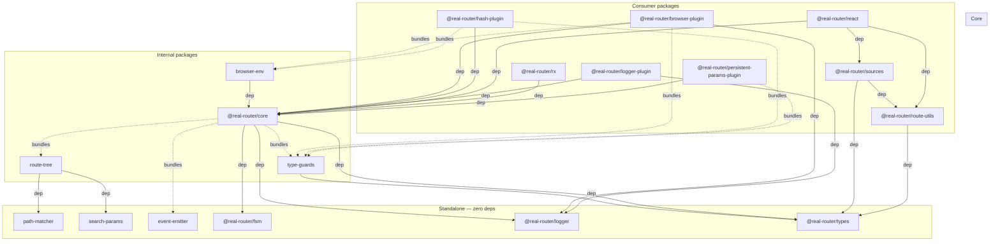
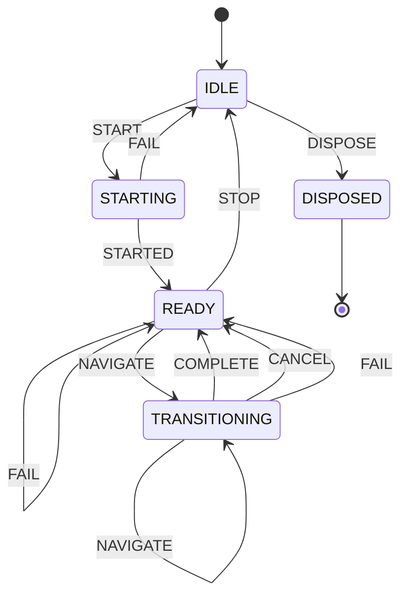

# Architecture

> High-level system design for AI agents and contributors

## Package Structure

```
real-router/
├── packages/
│   ├── core/                      # Router implementation (facade + namespaces)
│   ├── core-types/                # @real-router/types — shared TypeScript types
│   ├── react/                     # React integration (Provider, hooks, components)
│   ├── sources/                   # @real-router/sources — subscription layer for UI bindings
│   ├── rx/                        # Reactive Observable API (state$, events$, operators)
│   ├── browser-plugin/            # Browser History API synchronization
│   ├── hash-plugin/               # Hash-based routing (#/path)
│   ├── logger-plugin/             # Development logging with timing
│   ├── persistent-params-plugin/  # Parameter persistence
│   ├── route-utils/               # @real-router/route-utils — route tree queries and segment testing
│   ├── logger/                    # @real-router/logger — isomorphic logging
│   ├── fsm/                       # @real-router/fsm — finite state machine engine (internal)
│   ├── browser-env/               # Shared browser abstractions for plugins (internal)
│   ├── event-emitter/             # Generic typed event emitter (internal)
│   ├── route-tree/                # Route tree building, validation, matcher factory (internal)
│   ├── path-matcher/              # Segment Trie URL matching and path building (internal)
│   ├── search-params/             # Query string handling (internal)
│   └── type-guards/               # Runtime type validation (internal)
```

## Package Dependencies



**Public packages:** `@real-router/core`, `@real-router/types`, `@real-router/react`, `@real-router/sources`, `@real-router/rx`, `@real-router/browser-plugin`, `@real-router/hash-plugin`, `@real-router/logger-plugin`, `@real-router/persistent-params-plugin`, `@real-router/route-utils`

**Internal packages (bundled into consumers):** `route-tree`, `path-matcher`, `search-params`, `type-guards`, `event-emitter`, `browser-env`

**Internal packages (separate, not bundled):** `@real-router/logger`, `@real-router/fsm`

## Core Architecture

The `@real-router/core` package uses a **facade + namespaces** pattern:

```
Router.ts (facade) ─────────────────────────────────────────────────
    │
    ├── RouterFSM              — finite state machine (lifecycle + navigation state)
    │
    ├── RoutesNamespace        — route tree, path operations, forwarding
    ├── StateNamespace         — current/previous state storage
    ├── NavigationNamespace    — navigate(), transition pipeline
    ├── OptionsNamespace       — router configuration
    ├── DependenciesStore      — dependency injection container (plain store)
    ├── EventBusNamespace     — FSM + EventEmitter encapsulation, events, subscribe
    ├── PluginsNamespace       — plugin lifecycle management
    ├── RouteLifecycleNamespace — canActivate/canDeactivate guards
    └── RouterLifecycleNamespace — start/stop operations

api/ (standalone functions — tree-shakeable, access router via WeakMap)
    ├── getRoutesApi(router)      — route CRUD, addRoute/removeRoute
    ├── getDependenciesApi(router) — dependency CRUD, set/get/remove
    ├── getLifecycleApi(router)   — guard management, addActivateGuard/addDeactivateGuard
    ├── getPluginApi(router)      — plugin infrastructure, interception, router extension
    └── cloneRouter(router, deps) — SSR cloning support

wiring/ (construction-time, Builder+Director pattern)
    ├── RouterWiringBuilder    — Builder: namespace dependency wiring (10 methods)
    └── wireRouter             — Director: calls wire methods in correct order
```

**Key principle:** Router.ts is a thin facade (~640 lines). All business logic lives in namespaces. All lifecycle state is driven by a single FSM — no boolean flags. Namespace dependency wiring is delegated to `RouterWiringBuilder` (Builder+Director pattern).

**Standalone API:** Functions in `api/` access router internals via a `WeakMap<Router, RouterInternals>` registry. This decouples the API surface from the Router class and enables tree-shaking — only imported API functions are bundled.

**Detailed documentation:** [packages/core/CLAUDE.md](packages/core/CLAUDE.md)

## Router FSM

All router lifecycle and navigation state is managed by a single finite state machine:



| State           | Description                                          |
| --------------- | ---------------------------------------------------- |
| `IDLE`          | Router not started or stopped                        |
| `STARTING`      | Initializing (synchronous window before first await) |
| `READY`         | Ready for navigation                                 |
| `TRANSITIONING` | Navigation in progress                               |
| `DISPOSED`      | Terminal state, no transitions out                   |

FSM events trigger observable emissions via `fsm.on(from, event, action)`:

- `STARTED` → `emitRouterStart()`
- `NAVIGATE` → `emitTransitionStart()`
- `COMPLETE` → `emitTransitionSuccess()`
- `CANCEL` → `emitTransitionCancel()`
- `FAIL` → `emitTransitionError()`
- `STOP` → `emitRouterStop()`

**Key invariant:** All router events are consequences of FSM transitions, never manual calls.

**`dispose()`** permanently terminates the router (IDLE → DISPOSED). Unlike `stop()`, it cannot be restarted. All mutating methods throw `RouterError(ROUTER_DISPOSED)` after disposal. Idempotent — safe to call multiple times.

## Data Flow

### Navigation Pipeline

All navigation methods return `Promise<State>` (async/await):

```
const state = await router.navigate(name, params, options)
                     │
                     ▼
             ┌───────────────┐
             │ Build target  │  RoutesNamespace.buildState()
             │    state      │  + forwardState() resolution
             └───────┬───────┘
                     │
                     ▼
             ┌───────────────┐
             │AbortController│  Internal controller created per navigation
             │    setup      │  External opts.signal linked if provided
             └───────┬───────┘
                     │
                     ▼
             ┌───────────────┐
             │  Deactivation │  canDeactivate guards (signal as 3rd param)
             │    guards     │  (innermost → outermost)
             └───────┬───────┘
                     │
                     ▼
             ┌───────────────┐
             │  Activation   │  canActivate guards (signal as 3rd param)
             │    guards     │  (outermost → innermost)
             └───────┬───────┘
                     │
                     ▼
             ┌───────────────┐
             │  setState()   │  Freeze & store state
             │  + FSM send   │  COMPLETE → emitTransitionSuccess
             └───────┬───────┘
                     │
                     ▼
             ┌───────────────┐
             │   Plugins     │  onTransitionSuccess()
             │               │
             └───────┬───────┘
                     │
                     ▼
               Promise resolves with state
               (or rejects with RouterError)
```

On error at any step: FSM sends `FAIL` → `emitTransitionError()`, Promise rejects with `RouterError`.

**Cancellation sources:** `signal.aborted` (external AbortController), concurrent navigation (aborts previous controller), `stop()`, `dispose()`. All checked via `isCancelled = () => signal.aborted || !deps.isActive()`.

### Navigation API

All navigation methods use Promise-based async/await:

```typescript
// Navigate to a route
const state = await router.navigate("users", { id: "123" });

// Navigate to default route
const state = await router.navigateToDefault();

// Start the router
const state = await router.start("/users/123");

// Error handling
try {
  await router.navigate("admin");
} catch (err) {
  if (err instanceof RouterError) {
    // ROUTE_NOT_FOUND, CANNOT_ACTIVATE, CANNOT_DEACTIVATE,
    // TRANSITION_CANCELLED, SAME_STATES, ROUTER_DISPOSED
  }
}

// Concurrent navigation cancels previous
router.navigate("slow-route");
router.navigate("fast-route"); // Previous promise rejects with TRANSITION_CANCELLED

// Cancel via AbortController
const controller = new AbortController();
router.navigate("route", {}, { signal: controller.signal });
controller.abort(); // rejects with TRANSITION_CANCELLED

// Permanent disposal (cannot restart)
router.dispose();
```

**Guards** (`GuardFn`) return `boolean | Promise<boolean>` and receive an optional `AbortSignal`:

```typescript
import { getLifecycleApi } from "@real-router/core";

const lifecycle = getLifecycleApi(router);
lifecycle.addActivateGuard("admin", () => (toState, fromState, signal) => {
  return isAuthenticated; // true = allow, false = block
});
```

### Plugin Interception

Plugins intercept router methods via a universal `addInterceptor()` API, accessed through `getPluginApi()`:

```typescript
const api = getPluginApi(router);

// Intercept forwardState to merge persistent params
const unsub = api.addInterceptor(
  "forwardState",
  (next, routeName, routeParams) => {
    const result = next(routeName, routeParams);
    return { ...result, params: withPersistentParams(result.params) };
  },
);

// Intercept start to make path optional (browser-plugin injects location)
api.addInterceptor("start", (next, path) =>
  next(path ?? browser.getLocation()),
);
```

**`InterceptableMethodMap`** defines which methods can be intercepted:

| Method         | Signature                                                 | Used by                  |
| -------------- | --------------------------------------------------------- | ------------------------ |
| `start`        | `(path?: string) => Promise<State>`                       | browser-plugin           |
| `buildPath`    | `(route: string, params?: Params) => string`              | persistent-params-plugin |
| `forwardState` | `(routeName: string, routeParams: Params) => SimpleState` | persistent-params-plugin |

Multiple interceptors per method execute in FIFO order. Each receives `next` (the original or previously-wrapped function) plus the method's arguments. `addInterceptor()` returns an unsubscribe function.

Interceptors are applied via `createInterceptable()` in `RouterInternals`, ensuring all call paths (facade, wiring, plugins) are intercepted.

### Router Extension

Plugins can formally extend the router instance with new properties via `extendRouter()`:

```typescript
const api = getPluginApi(router);

const removeExtensions = api.extendRouter({
  buildUrl: (name, params) => buildUrlImpl(name, params),
  matchUrl: (url) => matchUrlImpl(url),
});
```

**Conflict detection:** Throws `RouterError(PLUGIN_CONFLICT)` if any key already exists on the router. Validation is atomic — all keys checked before any assigned.

**Cleanup:** Returns unsubscribe function. Extensions are also tracked in `RouterInternals.routerExtensions` for safety-net cleanup during `dispose()`.

## State Management

### Immutability

All states are **deeply frozen** via `Object.freeze()`:

```typescript
const state = router.getState();
state.params.id = "new"; // ❌ TypeError: Cannot assign to read only property
```

### State Structure

```typescript
interface State {
  name: string; // "users.profile"
  path: string; // "/users/123"
  params: Params; // { id: "123" }
  meta?: {
    id?: number; // Unique transition ID
    params?: Params; // Original params before forwarding
    options?: object; // Navigation options
  };
  transition?: {
    // Set after every successful navigation (deeply frozen)
    phase: TransitionPhase; // "deactivating" | "activating"
    from?: string; // Previous route name (undefined on start())
    reason: TransitionReason; // "success" | "blocked" | "cancelled" | "error"
    segments: {
      deactivated: string[]; // Segments leaving
      activated: string[]; // Segments entering
      intersection: string; // Common ancestor
    };
  };
}
```

## Extension Points

| Extension   | Purpose                        | Scope     | Can Block |
| ----------- | ------------------------------ | --------- | --------- |
| **Guards**  | Route access control           | Per-route | Yes       |
| **Plugins** | React to events, extend router | Global    | No        |

### Guard vs Plugin Decision

- Need to **block** a specific route? → Guard (`addActivateGuard`/`addDeactivateGuard`)
- Need to **observe** without modifying? → Plugin

## Resource Limits

Router enforces configurable limits to prevent resource exhaustion:

```typescript
createRouter(routes, {
  limits: {
    maxPlugins: 100, // Default: 50
    maxDependencies: 200, // Default: 100
  },
});
```

| Limit                  | Default | Protects Against                            |
| ---------------------- | ------- | ------------------------------------------- |
| `maxPlugins`           | 50      | Plugin stack overflow                       |
| `maxDependencies`      | 100     | Circular/excessive dependencies             |
| `maxListeners`         | 10,000  | Event listener memory leaks                 |
| `warnListeners`        | 1,000   | Warn threshold for possible leaks (0 = off) |
| `maxEventDepth`        | 5       | Recursive event infinite loops              |
| `maxLifecycleHandlers` | 200     | Guard function accumulation                 |

**Design:**

- **Centralized** — All limits defined in `core/constants.ts` (`DEFAULT_LIMITS`, `LIMIT_BOUNDS`)
- **Immutable** — Set at creation, cannot change at runtime
- **Injected** — Router calls `namespace.setLimits()` during initialization
- **0 = unlimited** — Any limit set to 0 disables the check

## Route Tree

Routes form a hierarchical tree structure:

```
Routes:
  { name: "users", path: "/users" }
  { name: "users.list", path: "/" }
  { name: "users.profile", path: "/:id" }
  { name: "users.profile.settings", path: "/settings" }

Tree:
  @@router-root@@
  └── users (/users)
      ├── list (/)
      └── profile (/:id)
          └── settings (/settings)

Full paths:
  users                  → /users
  users.list             → /users/
  users.profile          → /users/:id
  users.profile.settings → /users/:id/settings
```

**Path matching:** O(segments) Segment Trie traversal (via `path-matcher`)
**Route lookup:** O(1) Map-based

## SSR Support

```typescript
import { cloneRouter } from "@real-router/core";

// Server: clone router per request
const serverRouter = cloneRouter(router, { request: req });
await serverRouter.start(req.url);

// Client: hydrate with same state
await router.start(window.location.pathname);
```

`cloneRouter()` rebuilds route tree from definitions (each clone gets independent tree), copies mutable state (dependencies, options, plugins, guards).

## See Also

- [packages/core/CLAUDE.md](packages/core/CLAUDE.md) — Detailed core architecture
- [IMPLEMENTATION_NOTES.md](IMPLEMENTATION_NOTES.md) — Infrastructure decisions
- [Wiki](https://github.com/greydragon888/real-router/wiki) — Full documentation
