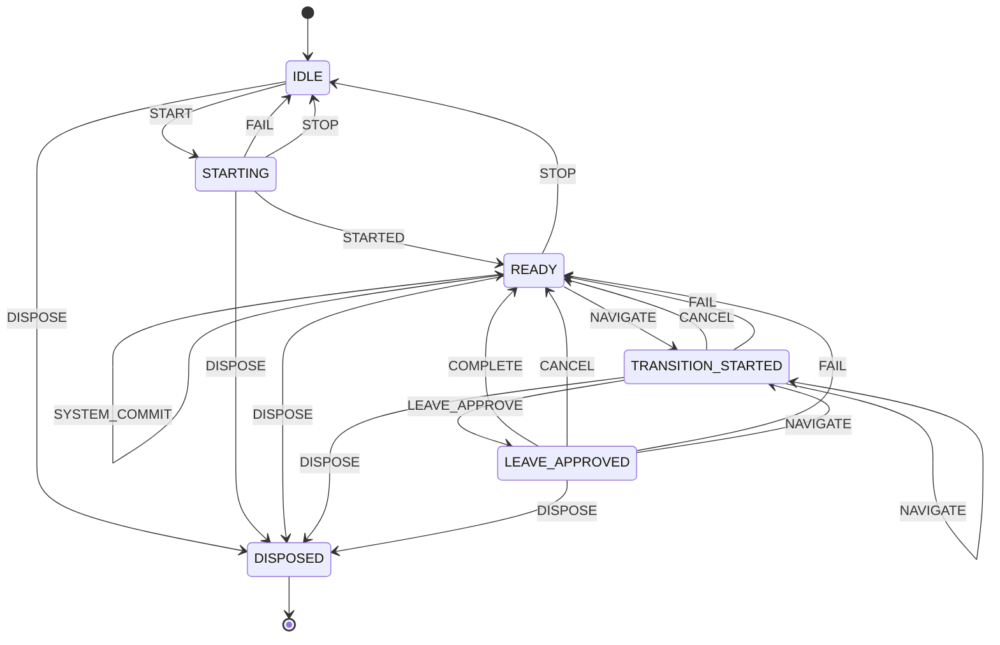
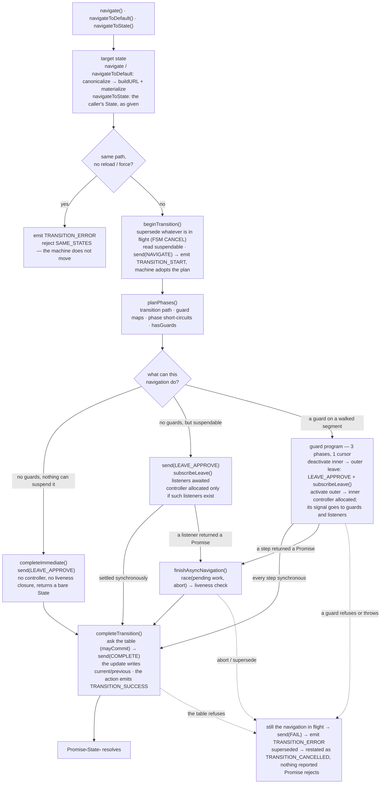

# Architecture

> High-level system design for contributors. See [Glossary](https://github.com/greydragon888/real-router/wiki/glossary) for project-specific terminology.

## Bird's Eye View

Real-Router is a **named, hierarchical, state-driven router** for JavaScript applications. Routes form a dot-notation tree (`users.profile.edit`), navigation is guarded by lifecycle functions, and the entire lifecycle is driven by a single finite state machine — no boolean flags, no ad-hoc state.

Key technical choices:

- **Segment Trie** for URL matching — O(segments) traversal, O(1) for static routes
- **Facade + Namespaces** — thin Router class delegates to single-responsibility namespace modules
- **Optimistic sync execution** — navigation runs synchronously unless a guard returns a Promise
- **Plugin interception** — plugins wrap router methods (onion-layer), they cannot block transitions
- **Deeply frozen state** — all `State` objects are `Object.freeze()`'d, never mutated

## Package Map

```
real-router/
├── packages/
│   ├── core/                      # Router implementation (facade + namespaces); routing engine at src/engine; navigation delivery at src/pipeline; channel correctness at src/channels; public types in src/types, exposed at @real-router/core/types
│   ├── react/                     # React integration (triple entry: main for 19.2+, /legacy for 18+, /ink for Ink 7+ terminal UIs)
│   ├── preact/                     # Preact integration (hooks, components, Suspense)
│   ├── solid/                     # Solid.js integration (hooks, components, directives)
│   ├── vue/                       # Vue 3 integration (composables, components, directives)
│   ├── svelte/                    # Svelte 5 integration (composables, components, actions)
│   ├── angular/                   # Angular 22+ integration (signals, inject* functions, components, directives, zoneless)
│   ├── sources/                   # Subscription layer for UI bindings: cached getTransitionSource / createDismissableError / createActiveNameSelector, canonicalJson params
│   ├── rx/                        # Reactive Observable API (state$, events$, operators)
│   ├── browser-plugin/            # Browser History API synchronization
│   ├── hash-plugin/               # Hash-based routing (#/path)
│   ├── logger-plugin/             # Development logging with timing and param diffs
│   ├── persistent-params-plugin/  # Parameter persistence across navigations
│   ├── ssr-data-plugin/           # SSR per-route data loading via start() interceptor
│   ├── rsc-server-plugin/         # RSC per-route ReactNode loading via start() interceptor (bundler-agnostic)
│   ├── lifecycle-plugin/          # Route-level lifecycle hooks: onEnter, onStay, onLeave
│   ├── preload-plugin/           # Preload on navigation intent (hover, touch) via event delegation
│   ├── memory-plugin/             # In-memory history stack: back/forward/go without browser History API
│   ├── navigation-plugin/         # Navigation API browser synchronization + route-level history
│   ├── validation-plugin/         # Opt-in argument validation (DX-only, 100% tree-shakeable)
│   ├── search-schema-plugin/     # Runtime search param validation via Standard Schema (Zod, Valibot, ArkType)
│   ├── route-utils/               # Route tree queries and segment testing
│   └── ssr-utils/                 # Router-level SSR/SSG/hydration helpers
├── shared/                         # Bare source files shared across packages via src/ symlinks (minimal workspace entry)
│   ├── package.json               # Minimal: name, type:commonjs, devDeps on @real-router/{core,sources} for transitive symlink resolution
│   ├── dom-utils/                 # Shared DOM utilities for adapters: route announcer, scroll restoration, scroll spy, view transitions, direction tracker, link helpers
│   ├── browser-env/               # Shared browser abstractions for URL plugins: history API, popstate, SSR fallback
│   └── ssr/                       # Shared SSR plugin scaffolding: createSsrLoaderPlugin generic factory + createLoadersValidator
├── examples/
│   ├── shared/                            # Shared store, API, abilities, styles
│   ├── web/
│   │   ├── react/      (28 vite apps)     # React 19.2+ (incl. animation-examples × 4 + ssr-examples × 5 [ssr, ssr-streaming, ssr-mixed, ssg, ssr-rsc]); 59 e2e specs
│   │   ├── preact/     (21 vite apps)     # Preact 10 (incl. animation-examples × 4 + ssr-examples × 4); 54 e2e specs
│   │   ├── solid/      (24 vite apps)     # Solid.js (incl. animation-examples × 4 + ssr-examples × 4); 54 e2e specs
│   │   ├── vue/        (24 vite apps)     # Vue 3 SFC (incl. animation-examples × 4 + ssr-examples × 4); 55 e2e specs
│   │   ├── svelte/     (25 vite apps)     # Svelte 5 (incl. animation-examples × 4 + ssr-examples × 4); 54 e2e specs
│   │   └── angular/    (16 vite apps)     # Angular 22+ (incl. animation-examples × 4 + ssr-examples × 4 using provideRealRouterFactory); 49 e2e specs
│   ├── console/
│   │   └── react-ink/  (1 app)            # CLI demo via @real-router/react/ink + memory-plugin
│   └── desktop/
│       ├── electron/   (3 apps)           # Electron: browser-plugin (app://), hash-plugin (file://), navigation-plugin
│       └── tauri/      (2 apps)           # Tauri v2: browser-plugin, navigation-plugin
```

**Public packages** (published to npm): `core`, `react`, `preact`, `solid`, `vue`, `svelte`, `angular`, `sources`, `rx`, `browser-plugin`, `hash-plugin`, `logger-plugin`, `persistent-params-plugin`, `ssr-data-plugin`, `rsc-server-plugin`, `lifecycle-plugin`, `preload-plugin`, `memory-plugin`, `navigation-plugin`, `validation-plugin`, `search-schema-plugin`, `route-utils`, `ssr-utils`

**Internal subsystems of `core`** (bundled into core, not standalone packages, not on npm): the **routing engine** (route-tree facade + path-matcher + search-params layers) lives at `core/src/engine`; the generic **FSM engine**, **typed event emitter**, and per-router **logger** live at `core/src/utils/{fsm, event-emitter, logger}`; **public types** live at `core/src/types`, exposed at `@real-router/core/types`. No standalone internal packages exist.

**Shared sources** (bundled via per-package `src/*` symlinks; `shared/` is a minimal workspace entry with no source files of its own, only a `package.json` declaring workspace devDeps for transitive resolution): `shared/dom-utils`, `shared/browser-env`, `shared/ssr`

## Package Dependencies


```mermaid
graph TD
    subgraph core [Core]
        CORE["core (+ engine at src/engine + public types at /types)"]
    end

    subgraph consumers [Consumer packages]
        BP["browser-plugin"]
        HP["hash-plugin"]
        SOURCES["sources"]
        REACT["react"]
        RX["rx"]
        LP["logger-plugin"]
        PPP["persistent-params-plugin"]
        NP["navigation-plugin"]
        ROUTEUTILS["route-utils"]
        SSRUTILS["ssr-utils"]
    end

    BROWSERENV["shared/browser-env<br/>(shared sources)"]
    DOMUTILS["shared/dom-utils<br/>(shared sources)"]
    SSRSHARED["shared/ssr<br/>(shared sources)"]

    BP -->|dep| CORE
    BP -.->|symlink| BROWSERENV

    HP -->|dep| CORE
    HP -.->|symlink| BROWSERENV

    NP -->|dep| CORE
    NP -.->|symlink| BROWSERENV

    LP -->|dep| CORE

    SOURCES -->|dep| ROUTEUTILS
    SOURCES -->|dep| CORE

    REACT["react<br/>(main + /legacy)"]
    REACT -->|dep| CORE
    REACT -->|dep| SOURCES
    REACT -->|dep| ROUTEUTILS
    REACT -.->|symlink| DOMUTILS

    PREACT["preact"]
    PREACT -->|dep| CORE
    PREACT -->|dep| SOURCES
    PREACT -->|dep| ROUTEUTILS
    PREACT -.->|symlink| DOMUTILS

    SOLID["solid"]
    SOLID -->|dep| CORE
    SOLID -->|dep| SOURCES
    SOLID -->|dep| ROUTEUTILS
    SOLID -.->|symlink| DOMUTILS

    VUE["vue"]
    VUE -->|dep| CORE
    VUE -->|dep| SOURCES
    VUE -->|dep| ROUTEUTILS
    VUE -.->|symlink| DOMUTILS

    SVELTE["svelte"]
    SVELTE -->|dep| CORE
    SVELTE -->|dep| SOURCES
    SVELTE -->|dep| ROUTEUTILS
    SVELTE -.->|symlink| DOMUTILS

    ANGULAR["angular"]
    ANGULAR -->|dep| CORE
    ANGULAR -->|dep| SOURCES
    ANGULAR -->|dep| ROUTEUTILS
    ANGULAR -->|dep| SSRUTILS
    ANGULAR -.->|copy| DOMUTILS

    RX -->|dep| CORE

    PPP -->|dep| CORE

    SDP["ssr-data-plugin"]
    SDP -->|dep| CORE
    SDP -.->|symlink| SSRSHARED

    RSP["rsc-server-plugin"]
    RSP -->|dep| CORE
    RSP -.->|symlink| SSRSHARED

    LCP["lifecycle-plugin"]
    LCP -->|dep| CORE

    PLP["preload-plugin"]
    PLP -->|dep| CORE

    MP["memory-plugin"]
    MP -->|dep| CORE

    VP["validation-plugin"]
    VP -->|dep| CORE

    SSP["search-schema-plugin"]
    SSP -->|dep| CORE

    ROUTEUTILS -.->|peer| CORE

    SSRUTILS -.->|peer| CORE
```

Solid arrows = runtime `dependencies`. Dashed arrows = bundled at build time (consumer's bundle includes the internal package). The `angular` adapter uses a git-tracked **copy** of `shared/dom-utils/` (not a symlink) because ng-packagr does not follow symlinks the same way tsdown does — `prebundle` re-materializes the copy before every build.

## Core Architecture

`core` has **zero runtime dependencies** — everything below lives inside the package. The router is a **facade + namespaces**; beneath it sit four self-contained subsystems, each reached through exactly one seam. Paths are relative to `packages/core/src/`:

```
Router.ts (facade) ─────────────────────────────────────────────────
    │  createRouter() constructs it · getNavigator() hands view layers a frozen read-only subset
    │
    ├── RoutesNamespace         — route tree, path operations, forwarding
    ├── StateNamespace          — state service; the committed pair lives in the FSM context
    ├── NavigationNamespace     — navigate(), transition pipeline
    ├── OptionsNamespace        — router configuration
    ├── DependenciesStore       — dependency injection container (plain store)
    ├── EventBusNamespace       — holds the router FSM and the EventEmitter; events, subscribe
    ├── PluginsNamespace        — plugin lifecycle management
    ├── RouteLifecycleNamespace — canActivate/canDeactivate guards
    └── RouterLifecycleNamespace — the start pipeline; stopping is the facade's STOP send

engine/    — routing engine: route tree + segment-trie matcher + search params
pipeline/  — navigation delivery: canonicalize → buildURL / materialize
channels/  — channel correctness: params is the path bag, search the query bag
utils/     — generic engines: fsm · event-emitter · logger

api/ (standalone functions — tree-shakeable, access router via WeakMap)
    ├── getRoutesApi(router)       — route CRUD
    ├── getDependenciesApi(router) — dependency CRUD
    ├── getLifecycleApi(router)    — guard management
    ├── getPluginApi(router)       — plugin infrastructure, interception, router extension
    └── cloneRouter(router, deps)  — SSR cloning

wiring/ (construction-time)
    ├── wireNamespaces  — wire* functions: namespace dependency wiring
    └── types           — NamespaceBag (shared wiring input)

types/         — public types: the @real-router/core/types subpath and the module-augmentation site
routerFSM.ts   — the router's transition table, configured over utils/fsm
internals.ts   — the WeakMap<Router, RouterInternals> registry + createInterceptable()
validation.ts  — the @real-router/core/validation subpath: validation-plugin's only door inward
```

Router.ts is a thin facade — it validates inputs and delegates to namespaces, and all business logic lives in namespaces. It also constructs the FSM and the EventEmitter and hands both to `EventBusNamespace`, the only namespace that holds them. Standalone API functions in `api/` reach router internals through a `WeakMap<Router, RouterInternals>` registry — that indirection is what keeps them tree-shakeable.

### Subsystems

None of the four imports a namespace back. Each takes what it needs as data or through a port, which is what stops a rule from acquiring a second implementation.

| Subsystem   | What it owns                                                                                                                                                                                                                                                | How it is reached                                                                                                                                                                                                                                                   |
| ----------- | ----------------------------------------------------------------------------------------------------------------------------------------------------------------------------------------------------------------------------------------------------------- | ------------------------------------------------------------------------------------------------------------------------------------------------------------------------------------------------------------------------------------------------------------------- |
| `engine/`   | Everything URL-shaped: the route tree, the segment-trie matcher, query parse and build                                                                                                                                                                      | `RoutesNamespace` owns the matcher and drives every tree and URL operation through it. The `route-tree → path-matcher / search-params` layering inside is an internal boundary, enforced by core's lint                                                             |
| `pipeline/` | Turning an intent into a URL and a `State`: `canonicalize` resolves the `forwardTo` chain and merges route defaults, `buildURL` prints, `materialize` builds                                                                                                | `canonicalize` is the sole producer of `Canonical`, whose brand symbol is never exported — so `buildURL` / `materialize` physically cannot be reached around it. The routes layer arrives as a `RouteResolver` port the router implements at wiring time            |
| `channels/` | The rule that `params` is the path channel and `search` the query one: the always-on guard detecting a query-declared key in the path bag, the registration-time check on a route's own defaults, and the gate dropping what the active mode will not print | Declared query names arrive as DATA — a `readonly string[]` or an accessor, never a matcher. A subsystem rather than a namespace method because the rule has no owning module: it runs from the facade, from `internals`, from two namespaces and from the pipeline |
| `utils/`    | The generic engines core is built on, which know nothing about routing: `fsm` (the table interpreter), `event-emitter` (typed dispatch with central listener-error isolation), `logger` (one per router)                                                    | `routerFSM.ts` is the router's CONFIGURATION of the fsm engine — states, events, payloads, edges — not a second machine                                                                                                                                             |

## Router FSM

All router lifecycle and navigation state is managed by a single finite state machine, and the machine owns **data**, not only a state name:

```typescript
interface RouterFSMContext {
  inflight: NavigationPlan | undefined; // the navigation in flight — its IDENTITY and its target at once, meaningful INSIDE the band only
  current: State | undefined; // the committed state…
  previous: State | undefined; // …and the one it displaced
}
```

**A navigation's identity is the plan OBJECT, and the machine issues it.** The three navigation payloads carry no identifier at all: `NavigationPlan` — what `navigate()` builds anyway — IS the payload for `NAVIGATE` / `LEAVE_APPROVE` / `COMPLETE`, and the `NAVIGATE` update adopts it into `ctx.inflight`. So "is this send stale?" is `payload === ctx.inflight`, a comparison no caller can answer dishonestly, because presenting the live navigation means presenting the live object. `FAIL` names its navigation the same way, by reference. Nothing reads an identity out of the machine, so nothing can stamp a send with the wrong one; and `startTransition` returns whether the edge fired, so a navigation whose `NAVIGATE` was a table no-op is refused at the seam instead of walking on.

Two forms of edge express that. A bare target is the unconditional transition; `{ target, when?, update? }` is the guarded one, where **`when` runs BEFORE the state swap and is the only thing that can refuse a declared transition, `update` runs AFTER it and is the only writer sanctioned to touch the context**. That ordering is what makes "decided" and "did" inseparable: an `update` cannot run for a transition that did not fire, and no action or listener can observe a fired transition whose `update` has not run. A refused `when` is indistinguishable from an undeclared event by every observable.

| Predicate   | On                             | Refuses                                                                      |
| ----------- | ------------------------------ | ---------------------------------------------------------------------------- |
| `mayCommit` | `LEAVE_APPROVED --COMPLETE-->` | a payload that is not the navigation in flight (superseded), or an aborted external `opts.signal` |
| `mayFail`   | the two in-flight `FAIL` edges | a report naming a navigation that is no longer the one in flight                                  |

**Every other edge is unconditional, and on the two that look like they should want a freshness check the answer is structural rather than missing.** `LEAVE_APPROVE` has exactly ONE asynchronous arc — through `runStep`, whose first line is the liveness check — while the other two send synchronously right after `beginTransition`, where a reentrant navigate is banned; a superseded navigation therefore never reaches the send. `CANCEL` is declared inside the transition band only, and `inflight` is written on entry to that band, so "is anything in flight?" is answered by the state the machine is in. Adding a predicate to either would restate what the topology already guarantees.

The four writers of the committed pair are likewise edges, not call sites: `commitNavigation` (`COMPLETE`), `commitSystemState` (`SYSTEM_COMMIT`), `clearCurrent` (`STOP`, shifts) and `resetState` (`DISPOSE`, zeroes both).


```mermaid
stateDiagram-v2
    [*] --> IDLE
    IDLE --> STARTING : START
    IDLE --> DISPOSED : DISPOSE

    STARTING --> READY : STARTED
    STARTING --> IDLE : FAIL
    STARTING --> IDLE : STOP
    STARTING --> DISPOSED : DISPOSE

    READY --> TRANSITION_STARTED : NAVIGATE
    READY --> READY : SYSTEM_COMMIT
    READY --> IDLE : STOP
    READY --> DISPOSED : DISPOSE

    TRANSITION_STARTED --> TRANSITION_STARTED : NAVIGATE
    TRANSITION_STARTED --> LEAVE_APPROVED : LEAVE_APPROVE
    TRANSITION_STARTED --> READY : CANCEL
    TRANSITION_STARTED --> READY : FAIL
    TRANSITION_STARTED --> DISPOSED : DISPOSE

    LEAVE_APPROVED --> READY : COMPLETE
    LEAVE_APPROVED --> READY : CANCEL
    LEAVE_APPROVED --> READY : FAIL
    LEAVE_APPROVED --> TRANSITION_STARTED : NAVIGATE
    LEAVE_APPROVED --> DISPOSED : DISPOSE

    DISPOSED --> [*]
```

**20 edges over 6 states and 10 events**, and the diagram is the whole table — read it as the complete inventory, because two of its ABSENCES are deliberate. There is no `READY --FAIL--> READY`: everything that reports a failure from `READY` is a report to observers rather than the failure of a transition, and those emit directly, so a stale `FAIL` in `READY` is a table no-op structurally rather than by a predicate. And `SYSTEM_COMMIT` has ONE self-loop, on `READY`, because both commits that take it happen after the start has completed — `completeStart()` leaves `STARTING` before `navigateToNotFound` runs.

`DISPOSE` is wired from every non-DISPOSED state so `router.dispose()` always settles the FSM at `DISPOSED`. For healthy flows the facade orchestrates cleanup through `IDLE` (`STOP` → `IDLE` → `DISPOSE`); the direct transitions are a safety net for cases where the FSM cannot be returned to `IDLE` first (e.g. `dispose()` mid-`STARTING` after a start-pipeline throw). `STARTING --STOP--> IDLE` is the other non-obvious one: a `stop()` while `start()` is parked in an async interceptor cancels the start.

⛔ **This graph may not be cleaned by trace coverage.** An `onTransition` recorder over the full suite traverses 15 of the edges; the other five are load-bearing anyway, and each has a named reason. The two `NAVIGATE` self-loops are never taken: they are read through `canSend()`, and their DECLARATION is what makes supersede legal. The three direct `DISPOSE` edges are fail-safes for flows no test reaches. The full taxonomy lives above the table in `packages/core/src/routerFSM.ts`.

| State                | Description                                                                                 |
| -------------------- | ------------------------------------------------------------------------------------------- |
| `IDLE`               | Router not started or stopped                                                               |
| `STARTING`           | Start in progress — spans the WHOLE async start-interceptor chain, not a synchronous window |
| `READY`              | Ready for navigation                                                                        |
| `TRANSITION_STARTED` | Navigation in progress                                                                      |
| `LEAVE_APPROVED`     | Deactivation guards passed, activation guards pending                                       |
| `DISPOSED`           | Terminal state, no transitions out                                                          |

FSM events trigger observable emissions through two paths:

**Via `fsm.on(from, event, action)`** — events that go through the FSM's `send()` dispatch:

- `STARTED` → `emitRouterStart()`
- `STOP` → `emitRouterStop()`
- `CANCEL` (from `TRANSITION_STARTED` or `LEAVE_APPROVED`) → `emitTransitionCancel()` — the target comes from `ctx.inflight`, not from the payload; both edges are declared in-band only, which is what makes that read safe
- `FAIL` (from `STARTING`, `TRANSITION_STARTED` or `LEAVE_APPROVED`) → `emitTransitionError()`. **Not from `READY`.** The action is **split by edge**: the two in-flight registrations take the target from `ctx.inflight`, while `STARTING --FAIL--> IDLE` names none — a failed `start()` is not a navigation failure and has no target to name. Reading the context there would surface whatever a cancelled navigation left behind, since leaving the band through `CANCEL` or `FAIL` deliberately does not clear the field: not clearing is what lets the in-band actions read it after the `update` has run. That edge is unconditional; the two in-flight ones carry `when: mayFail`, so a stale FAIL from a superseded navigation is a table no-op. ⚠ That clause is **defence-in-depth, not the mechanism**, and it cannot refuse in a shipped configuration: the machine adopts a navigation as the plan object itself, both FAIL senders are gated on that same identity through `deps.isCurrentNavigation`, and `asCancellation` restates a lost-liveness failure before any report is sent. The two split the work — `asCancellation` holds the half facing the CALLER (which code `navigate()` rejects with), `mayFail` the half facing SUBSCRIBERS

**Via the FSM table `send()` + emit action** — the navigation transitions dispatch through the FSM table via `send()`, which fires a registered action that emits; `forceState()` is **not** used in core (a bundle-invariant). An invalid transition (e.g. `COMPLETE` from IDLE/DISPOSED after a listener's `stop()`/`dispose()`) is a table no-op that emits nothing, so the table is the sole authority over state — the FSM cannot be resurrected out of a terminal state:

- `NAVIGATE` (`sendNavigate`) → `send(NAVIGATE, {toState, fromState})` → action `emitTransitionStart()`
- `LEAVE_APPROVE` (`sendLeaveApprove`) → `send(LEAVE_APPROVE, {toState, fromState})` → action `emitTransitionLeaveApprove()`
- `COMPLETE` (`sendComplete`) → `send(COMPLETE, {…})` → action `emitTransitionSuccess()`
- `SYSTEM_COMMIT` (`systemCommit`) → `send(SYSTEM_COMMIT, {…})` → action `emitTransitionSuccess()` — the two commits that are NOT transitions (`navigateToNotFound`, the `replace()` revalidation). One edge, on `READY`: both commits happen after start has completed, and `systemCommit()` asks `canSend` before sending, so an attempt from anywhere else throws instead of silently not committing. ⚠ **Declared on `READY` alone, that ask also refuses a LIVE router that is merely starting or mid-transition**, so it reports which: `ROUTER_DISPOSED` only for a router that really is disposed, `ROUTER_NOT_STARTED` with the phase in its message otherwise. `navigateToNotFound` refuses across the whole pre-commit window for the same reason — a 404 committed there is a phantom the boot overwrites

Cost: three transition-payload allocations per navigation (`NAVIGATE`, `LEAVE_APPROVE`, `COMPLETE` each carry one) — a deliberate trade of micro-optimization for structural determinism. Each payload carries only what something downstream reads: `CANCEL` and `FAIL` name no target, because their actions take it from the context. Correctness is enforced by the state machine rather than by scattered re-checks — `when: mayCommit` on the `COMPLETE` edge is the whole commit gate.

**The commit is asked of the table ONCE, and the position is load-bearing.** `completeTransition` runs one piece of destructive bookkeeping on its way to the commit — the post-leave cleanup that unregisters the departing route's EXTERNAL `canDeactivate` — and the ask stands **above** it. That ordering is the whole guarantee: a navigation the table refuses stops before the cleanup, so it cannot unregister the guard of the route the user is staying on. Nothing else runs between the verdict and the send. The cleanup is pure bookkeeping — clearing a guard re-derives the compiled slot by READING the surviving origin's stored compiled form, never by invoking its factory — so no application code exists in that window to invalidate a verdict already given. The one step that DOES touch application code, building the `TransitionMeta` from the caller's own options object, sits above the ask for exactly that reason: a single snapshot verdict is sound only while everything below it is inert, and the send cannot report back — its action announces the success synchronously, so a listener's own commit is indistinguishable from a refusal.

**The table also OWNS the committed state.** `current` / `previous` are fields of the FSM context written by the four edge `update`s above and by nothing else, so "committed" and "announced" cannot come apart — the silent commit (state written, `TRANSITION_SUCCESS` never emitted, no subscriber notified) stops being expressible rather than being guarded against (`packages/core/INVARIANTS.md`, "Committed-state ownership"). One observable consequence: the pair is zeroed on the `DISPOSE` edge, which runs before plugin teardown, so a plugin `teardown()` reading `getPreviousState()` sees `undefined`.

### What the determinism buys — and where the bugs moved

The table makes one class **inexpressible**, and it is worth being precise about which, because the natural next thought — "the lifecycle is deterministic, so every remaining bug is in the table, and covering the table covers the router" — is false.

What is genuinely closed: **the committed pair cannot change without the transition that announces it.** Write and announce hang on the same edge, so no amount of new code can produce a state that subscribers never hear about. That is why `INVARIANTS.md` can assert a _closed set of writers_ rather than the absence of a symptom.

What is **not** closed — the table is a total function of `(state, event)`, and the router's behaviour is not:

| Surviving class                               | Why the table cannot see it                                                                                                                                                                                                                                   | Evidence                                                                                                                                                                                      |
| --------------------------------------------- | ------------------------------------------------------------------------------------------------------------------------------------------------------------------------------------------------------------------------------------------------------------- | --------------------------------------------------------------------------------------------------------------------------------------------------------------------------------------------- |
| **Wrong moment** — a legal edge at a bad time | The table answers _whether the transition fires_, never _whether the caller should be calling_. `SYSTEM_COMMIT` from `READY` is legal, so the table fires it correctly and the commit can still be a phantom.                                                 | A 404 committed from a plugin's `onStart` is overwritten by the boot a tick later. The precondition that refuses it lives on the FACADE, not on an edge.                                      |
| **Ordering around the send**                  | Work done in the same call, before the ask, is invisible to a table that has not been asked yet.                                                                                                                                                              | `completeTransition` asks the table ABOVE its destructive `clearCanDeactivate` cleanup, so a refusal still lands while it can matter. Position is what buys that, and the table cannot enforce it: it answers about the transition, never about what the caller did on the way to asking. |
| **Payload, not event**                        | `COMPLETE` from `LEAVE_APPROVED` is a family parameterised by `mayCommit`'s payload. Enumerating edges enumerates none of it.                                                                                                                                 | The identity travels IN the payload, so what the table refuses depends on what the caller handed it — enumerating edges says nothing about which payloads any router path actually produces. |
| **Reachability** — table logic can be _dead_  | A predicate can be structurally unreachable, so "cover it" is impossible rather than merely undone. Worse, a direct `fsm.send(EVENT, handMadePayload)` test proves the **engine** works and says nothing about whether any router path produces that payload. | `mayFail` is asked 206 times across the functional tier and refuses **0**. What holds the defect it guards is `asCancellation`, a plain function with no table presence at all.               |
| **Test discrimination**                       | "The table is covered" and "the coverage would fail on the defect" are different claims.                                                                                                                                                                      | A property over the table can be green on a base that still has the defect. `canSend` needs assertions in BOTH directions, or its own mutant survives it.                                     |
| **Policy outside core entirely**              | Not a transition at all.                                                                                                                                                                                                                                      | A default like `forceDeactivate` living in a plugin's `constants.ts` is invisible here, however deterministic the lifecycle is.                                                               |

So determinism does not remove bugs — it **relocates** them, from "the state is wrong" to "the right transition fired at the wrong moment". That is a strictly better class: the first is unbounded, the second is enumerable by **windows**, which is why the productive sweep maps lifecycle phases rather than call sites.

Where the tests belong, given that:

- **Table / engine, property tier** (`tests/property/utils/fsm/`) — refusal equivalence, dispatch order, `update` arity, `canSend` ⟺ `send` in both directions. This tests the **engine**, and that is the honest scope.
- **Router, invariants over SEQUENCES** through the public API — one terminal event per navigation, no commit inside another navigation's window, the pair as a shift register. None of these is expressible as a property of the table.
- **Authority traps** (static scans: only the table writes the cells; exactly five `State` constructors) — these guard the **closure** the determinism bought, which is the thing that stops the class from reopening.
- **Mutation testing as the arbiter** — the only tool that separates a test that pins from a test that guards. Two tests in this slice looked adequate and were not.

### Route-tree mutation channel — `TREE_CHANGED` (orthogonal to the FSM)

The ten events above are all about **transitions** (FSM state changes). A separate, **non-FSM** channel signals **structural route-tree mutations** (`add` / `remove` / `update` / `replace` / `clear` via `getRoutesApi`). It reuses the same `EventEmitter` through an **internal-only** key — `TREE_CHANGED` lives in `RouterEventMap` but **not** in the public `EventName` union / `events.*` registry / `Plugin` interface — and is observed only via `getRoutesApi(router).subscribeChanges(handler)`:

- **Post-commit, fire-and-forget** — emitted from the five `getRoutesApi` wrappers after the atomic commit, never from the shared internals that `dispose()`/`cloneRouter()`/`setRootPath()` reuse, so teardown and cloning stay silent.
- **Discriminated payload** (`TreeChangedEvent`, keyed by `op`); `update` emits only on structural fields (guard-only patches are silent).
- Per-listener error isolation comes for free from the shared emitter; a nested same-event emit (a listener that re-triggers the same event) is coalesced to a no-op, so the listener runs once and the mutation still commits.

Tree mutations are an **infrastructural** concern (DevTools, microfrontend coordinators, file-routes watch, caches keyed by route name), not an app-level event — there is deliberately no `router.subscribeTree()` facade and no `addEventListener` path. See [packages/core/CLAUDE.md](packages/core/CLAUDE.md) for the consumer pattern.

## Navigation Pipeline

Four entry points reach the transition machinery. They differ only in where the target state comes from; everything after that is shared.

| Entry point                                      | Target state                                                                                                                                                           | Returns              |
| ------------------------------------------------ | ---------------------------------------------------------------------------------------------------------------------------------------------------------------------- | -------------------- |
| `navigate(target \| name, params, search, opts)` | built through `src/pipeline` — `canonicalize` (forward-chain resolution + route defaults + query-mode gate) feeding `buildURL` + `materialize`                         | `Promise<State>`     |
| `navigateToDefault(opts)`                        | resolves `defaultRoute` / `defaultParams` / `defaultSearch` (each may be a dependency-resolved callback), then runs `navigate`'s core                                  | `Promise<State>`     |
| `navigateToState(state, opts)`                   | the caller's `State`, taken as given — no `forwardState`, no `buildPath`, so a URL plugin's `matchPath` result flows through unchanged; `start()` commits through here | `Promise<State>`     |
| `navigateToNotFound(path)`                       | a hand-built `UNKNOWN_ROUTE` state — the one commit primitive that is not a transition                                                                                 | `State`, synchronous |

The facade owes callers a Promise and wraps a navigation that already settled. One frame below it the return TYPE carries the fact instead: a bare `State` says the navigation could not suspend at all.

The pipeline uses **optimistic sync execution** — guards run synchronously until one hands back a Promise, and only then does the walk switch to the asynchronous interpreter.


```mermaid
flowchart TD
    ENTRY["navigate() · navigateToDefault() · navigateToState()"] --> BUILD

    BUILD["target state
    navigate / navigateToDefault: canonicalize → buildURL + materialize
    navigateToState: the caller's State, as given"] --> SAME

    SAME{"same path,
    no reload / force?"}
    SAME -->|yes| SAMEERR["emit TRANSITION_ERROR
    reject SAME_STATES — the machine does not move"]

    SAME -->|no| BEGIN["beginTransition()
    supersede whatever is in flight (FSM CANCEL)
    read suspendable · send(NAVIGATE) → emit TRANSITION_START, machine adopts the plan"]

    BEGIN --> PLAN["planPhases()
    transition path · guard maps · phase short-circuits · hasGuards"]

    PLAN --> ARC{"what can this
    navigation do?"}

    ARC -->|"no guards, nothing can suspend it"| IMMEDIATE["completeImmediate()
    send(LEAVE_APPROVE)
    no controller, no liveness closure, returns a bare State"]

    ARC -->|"no guards, but suspendable"| LEAVE["send(LEAVE_APPROVE)
    subscribeLeave() listeners awaited
    controller allocated only if such listeners exist"]

    ARC -->|"a guard on a walked segment"| GUARDS["guard program — 3 phases, 1 cursor
    deactivate inner → outer
    leave: LEAVE_APPROVE + subscribeLeave()
    activate outer → inner
    controller allocated;
    its signal goes to guards and listeners"]

    IMMEDIATE --> COMPLETE
    LEAVE -->|"settled synchronously"| COMPLETE
    GUARDS -->|"every step synchronous"| COMPLETE
    LEAVE -->|"a listener returned a Promise"| ASYNC
    GUARDS -->|"a step returned a Promise"| ASYNC

    ASYNC["finishAsyncNavigation()
    race(pending work, abort) → liveness check"] --> COMPLETE

    COMPLETE["completeTransition()
    ask the table (mayCommit) → send(COMPLETE)
    the update writes current/previous · the action emits TRANSITION_SUCCESS"]
    COMPLETE --> RESOLVE["Promise‹State› resolves"]

    GUARDS -.->|"a guard refuses or throws"| ERR
    ASYNC -.->|"abort / supersede"| ERR
    COMPLETE -.->|"the table refuses"| ERR

    ERR["still the navigation in flight → send(FAIL) → emit TRANSITION_ERROR
    superseded → restated as TRANSITION_CANCELLED, nothing reported
    Promise rejects"]
```

### Prologue

Every navigation runs the same prologue before a guard can run:

1. **Admission** — the table is asked whether `NAVIGATE` is declared from the state the machine is in. A refusal returns a cached rejection, and a router that is still `STARTING` gets its own sentence, so a caller who is inside `start()` is not told to call `start()`.
2. **Target state** — per the table above. For `navigate` / `navigateToDefault` this is the **pre-start window**: `forwardState` / `buildPath` interceptors, route codecs and the default-resolving callbacks are application code running before anything is announced, so a navigation started from there is refused with `REENTRANT_NAVIGATION`.
3. **`replace` from a 404** — navigating away from `UNKNOWN_ROUTE` forces `replace: true`, so a 404 never accumulates history entries.
4. **Same-state check** — an identical `state.path` with neither `reload` nor `force` reports `SAME_STATES` and rejects, and the machine does not move.
5. **`beginTransition`** — supersede whatever is in flight (through FSM `CANCEL`, whose action aborts its controller), read `suspendable`, then `send(NAVIGATE)` with the PLAN as the payload, whose action emits `TRANSITION_START` and whose update adopts the plan as the navigation in flight. Nothing is read back: the send reports whether the edge fired, and a navigation for which it did not is refused here.
6. **`planPhases`** — segments to deactivate and activate, the guard maps, the per-phase short-circuits, and `hasGuards`. It runs AFTER the announce, because a `TRANSITION_START` listener may still register a guard.

Two facts decided there pick the arc:

- **`hasGuards`** asks whether a segment THIS transition walks carries a guard — not whether the router holds one somewhere. One `canActivate` on an admin route must not arm the cancellation machinery for every public navigation. It mirrors the interpreter's own short-circuits, so `opts.forceDeactivate` disarms the deactivation half exactly as it disarms the phase.
- **`suspendable`** asks whether a synchronous supersede is reachable at all: an external `opts.signal`, `subscribeLeave` listeners, or a pre-commit plugin listener (`onTransitionStart` / `onTransitionLeaveApprove`).

### Three arcs

- **Immediate** (`!hasGuards && !suspendable`) — `LEAVE_APPROVE`, then the commit, and nothing else. The cancellation machinery is not skipped here, it is **absent**: no `AbortController`, no liveness closure, and the return is a bare `State` — "this navigation cannot suspend" is a property of the code rather than something to remember. It still puts its commit to the table like every other arc; what it does not carry is the machinery for an interruption that cannot reach it.
- **Leave-only** (`!hasGuards && suspendable`) — emits `LEAVE_APPROVE` and awaits the `subscribeLeave` listeners. A controller is allocated only when such listeners exist: an external signal or a pre-commit listener makes a navigation suspendable without giving it anything to hand a signal to.
- **Guarded** — the guard program is three fixed phases (deactivate, leave, activate) walked by a cursor of two numbers, with **two interpreters** over it. The synchronous one walks until a step hands back a Promise, then stops and reports where; the asynchronous one settles that Promise and hands the cursor straight back. Switching pipelines is therefore one act — giving up the cursor — and a **single** cancellation check sits in the head of a step, which is every position that matters. Here the controller is allocated unconditionally; its signal is what guards and leave listeners receive.

Guard order is fixed: deactivation innermost → outermost, then activation outermost → innermost, with the leave phase between them.

### Commit

`completeTransition` is the only place a navigation's state is committed, and it puts the commit to the table:

1. Re-check that the target route still exists — route CRUD can have removed it mid-flight — otherwise `ROUTE_NOT_FOUND` through `FAIL`.
2. Put the commit to the table with the navigation's own context AS the payload — no second literal — carrying `opts` **unstripped**, because `mayCommit` reads the external signal off it. Sanitising for subscribers is the announcement's job and happens in the edge's action.
3. Attach and freeze the `TransitionMeta`, freeze the state. This step reads three flags off the CALLER's options object, which may be accessor- or Proxy-backed, so it is the last application code in the function and it is deliberately above the verdict.
4. **Ask the table**, once and unconditionally. Everything that can move the router has already run, and everything after this point is inert — that is what makes one snapshot verdict sound.
5. Run the post-leave cleanup, which unregisters the departing route's external `canDeactivate`. It is destructive, so it is below the ask: a navigation the table refuses must not take the guard of the route the user is staying on with it. `clearCanDeactivate` demands the permit the ask returned, so the two cannot be reordered.
6. **Fire** — `send(COMPLETE)`'s `update` writes `current` / `previous`; its action emits `TRANSITION_SUCCESS`.

The verdict is a snapshot, and the ordering is what keeps it valid: the send reports nothing usable back, because its own action emits `TRANSITION_SUCCESS` synchronously and a `subscribe` listener may legitimately `replace()` from there — so "did `getState()` become my state?" cannot tell a second commit from a refusal. A step that could invalidate the verdict has to sit above it instead.

### Failure and cancellation

Every cancellation source — an external `opts.signal`, a concurrent navigation, `stop()`, `dispose()` — routes through FSM `CANCEL`, whose action aborts the in-flight controller; nothing aborts it by hand. Success **releases** the controller without aborting it, so a `subscribeLeave` listener that captured the signal still observes `aborted === false` after the navigation commits.

The internal `AbortController` is allocated only when there is something to hand its signal to: a guard on a walked segment, or a `subscribeLeave` listener. The pure hot path allocates none. A non-cooperative async guard cannot wedge the navigation either — the asynchronous arc races the pending work against the controller's abort, so an abort settles it whether or not the guard ever does.

A failure is reported **only while the navigation is still the one in flight**. One that has lost liveness has whatever its guard or listener decided restated as `TRANSITION_CANCELLED` carrying the original as `reason`, and reports nothing: a stale `FAIL` is a real edge out of the transition band and would move the machine out from under the live navigation, turning that navigation's `COMPLETE` into a table no-op — state committed, `TRANSITION_SUCCESS` never emitted, subscribers never notified. A live failure goes through `FAIL`, whose action emits `TRANSITION_ERROR`; `TRANSITION_CANCELLED` and `ROUTE_NOT_FOUND` are never announced that way. The early refusals — `SAME_STATES`, an unknown route name, a mis-channelled key at `navigateToState` — emit `TRANSITION_ERROR` directly, because there is no transition of theirs to fail.

### `navigateToNotFound()`

It bypasses this pipeline — but neither the machine nor the deactivation guards. It supersedes whatever is in flight, hand-builds a frozen `UNKNOWN_ROUTE` state, consults the current route's `canDeactivate`, and commits through the `SYSTEM_COMMIT` edge. It emits only `TRANSITION_SUCCESS` — no `TRANSITION_START`, no `AbortController` — and always carries `replace: true`.

Only the ACTIVATION half of "bypasses the guards" follows from being a 404: there is nothing to activate at `UNKNOWN_ROUTE`, but there is very much something to deactivate, and the shipped URL plugins call this from their popstate handlers. A refusal emits `TRANSITION_ERROR` and throws `CANNOT_DEACTIVATE`, which is what those handlers already expect — the matched-route branch beside them rejects and its `catch` rolls the URL back. An async `canDeactivate` cannot be answered by a synchronous primitive and resolves to refuse: for a guard whose job is preventing loss, the fail-safe direction is "do not leave". The one opt-out is internal — `replace()`'s revalidation, where asking would be wrong rather than redundant.

## Extension Points

| Extension   | Purpose                        | Scope     | Can Block |
| ----------- | ------------------------------ | --------- | --------- |
| **Guards**  | Route access control           | Per-route | Yes       |
| **Plugins** | React to events, extend router | Global    | No        |

### Plugin Interception

Plugins intercept router methods via `addInterceptor()` on `PluginApi`. `InterceptableMethodMap` is fixed at compile time (`core/src/types/api.ts`):

| Method         | Signature                                                                             | Used by                                                                                                                                                                                     |
| -------------- | ------------------------------------------------------------------------------------- | ------------------------------------------------------------------------------------------------------------------------------------------------------------------------------------------- |
| `start`        | `(path?: string) => Promise<State>`                                                   | browser-plugin, hash-plugin, navigation-plugin (via `createStartInterceptor` from `shared/browser-env`); ssr-data-plugin, rsc-server-plugin (via `createSsrLoaderPlugin` from `shared/ssr`) |
| `buildPath`    | `(route: string, params?: Params, search?: SearchParams) => string`                   | persistent-params-plugin                                                                                                                                                                    |
| `forwardState` | `(routeName: string, routeParams: Params, routeSearch?: SearchParams) => SimpleState` | persistent-params-plugin, search-schema-plugin                                                                                                                                              |

Multiple interceptors per method execute in **LIFO** order (last-registered wraps first). Each receives `next` (original or previously-wrapped function) plus the method's arguments. Applied via `createInterceptable()` in `RouterInternals`.

### Router Extension

Plugins extend the router instance with new properties via `extendRouter()` on `PluginApi`. Throws `RouterError(PLUGIN_CONFLICT)` if any key already exists (atomic validation). Extensions are tracked in `RouterInternals.routerExtensions` and cleaned up on unsubscribe or `dispose()`.

### Context Namespace Claims

Plugins publish per-route data via `claimContextNamespace()` on `PluginApi`. Each plugin claims a unique namespace key at registration time (O(1) collision detection via `Set<string>`), receives a `{ write, release }` object, and publishes data to `state.context.<namespace>` from lifecycle hooks. Mirrors the `extendRouter()` ownership model: closure-based tracking, manual `release()` in `teardown()`, dispose safety net for orphaned claims. Six plugins use this — 8 claims in total:

| Plugin                   | Namespace key(s)    | Published fields (examples)                                               |
| ------------------------ | ------------------- | ------------------------------------------------------------------------- |
| browser-plugin           | `browser` + `url`   | source, fullUrl                                                           |
| navigation-plugin        | `navigation`        | direction, sourceElement                                                  |
| memory-plugin            | `memory`            | direction, historyIndex                                                   |
| persistent-params-plugin | `persistentParams`  | persisted query param snapshot                                            |
| ssr-data-plugin          | `data`              | per-route loader result (via `createSsrLoaderPlugin`)                     |
| rsc-server-plugin        | `rsc` + `rscAction` | per-route ReactNode (via `createSsrLoaderPlugin`) + server-action results |

### Validator Slot

`@real-router/validation-plugin` uses a unique extension mechanism — not interceptors, not event listeners, but a **nullable validator slot** in `RouterInternals`:

```typescript
ctx.validator?.routes.validateBuildPathArgs(route); // no-op when null
```

The slot is typed as `RouterValidator | null`. The plugin sets it on registration, clears it on teardown. All core call sites use optional chaining — zero overhead when absent.

## Invariants

These are deliberately designed constraints. Violating them will break the system in subtle ways.

### State & Immutability

- **All `State` objects are deeply frozen** (`Object.freeze`). Never mutate — always create new.
- **`State` has two param channels** — `state.params` (path params) and `state.search` (query params) are separate and independently typed (`State<Params, Search>`). Both are always present (a frozen `{}` when empty); `navigate` / `buildPath` / `isActiveRoute` take `search` as the argument after `params`.
- **The router never moves a key between the channels** — the slot IS the channel: `params` / `defaultParams` are the path, `search` / `defaultSearch` the query, and the two meet in exactly one place, the printed URL. Enforcement rather than convention: a key the route declares with `?` supplied in the path bag makes `navigate` / `makeState` / `buildNavigationState` throw synchronously and `navigateToState` reject, a `defaultParams` naming such a key is refused at registration, and `canNavigateTo` answers `false` for the shape the verbs refuse. **There is no repair step, deliberately:** a mis-channelled key is refused, never relocated behind the producer's back, so the bag a producer wrote is the bag that ships — a silent move would let it believe otherwise.
- **Router options are immutable** — deep-frozen at construction time.

### FSM & Events

- **All transition events are consequences of FSM transitions** — never manual calls. The NAVIGATE/LEAVE_APPROVE/COMPLETE emits are FSM **actions** fired by `send()`, and `forceState()` is not used in core — so an event can only fire when the table actually took the transition. No boolean flags. (The `TREE_CHANGED` channel is the one deliberate exception — it is orthogonal to the FSM, emitted by `getRoutesApi` mutations, not by state changes.)
- **`dispose()` is terminal — structurally, not by convention** — DISPOSED has no outbound table transitions, and core reaches every transition through `send()` (never `forceState()`), so a post-dispose `send(COMPLETE)`/`send(LEAVE_APPROVE)` is a table no-op: the FSM cannot be resurrected. All mutating methods throw `RouterError(ROUTER_DISPOSED)` after disposal.
- **`TREE_CHANGED` is internal-only and wrapper-emitted** — never in the public `EventName` union, and emitted strictly from the five `getRoutesApi` CRUD wrappers, never from shared internals (`adoptRouteArtifacts`/`commitTreeChanges`/`resetStore`). This keeps `dispose()`, `cloneRouter()`, and `setRootPath()` from emitting it.

### Guards & Plugins

- **Guards return `boolean | Promise<boolean>` only** — no redirects, no state modification, no `State` return.
- **Plugins are observers** — they react to events but cannot block or modify the transition pipeline.
- **Guard execution order is fixed**: deactivation innermost → outermost, then activation outermost → innermost.
- **`navigateToNotFound()` bypasses ACTIVATION guards and plugins** — plugins only see `onTransitionSuccess`, and nothing is activated at `UNKNOWN_ROUTE`. It does consult the current route's `canDeactivate`: leaving is still leaving.

### Navigation

- **Concurrent navigation cancels previous** — the previous internal AbortController is aborted, promise rejects with `TRANSITION_CANCELLED`.
- **Navigating FROM `UNKNOWN_ROUTE` auto-forces `replace: true`** — prevents browser history pollution with 404 entries.
- **Fire-and-forget is safe** — `navigate()`, `navigateToDefault()`, and the `navigateToState()` plugin primitive internally suppress unhandled rejections for expected errors (`SAME_STATES`, `TRANSITION_CANCELLED`, `ROUTER_NOT_STARTED`, `ROUTE_NOT_FOUND`, `CANNOT_ACTIVATE`, `CANNOT_DEACTIVATE`). Guard blocks are an expected outcome, not an internal error — `await` the call (or use an `onTransitionError` plugin) to observe a guard rejection.

### Packages

- **Internal packages are never imported by end users** — they are bundled into consumer packages at build time.
- **`core` never depends on browser APIs** — platform-agnostic. The `start(path)` method requires a path; browser-plugin makes it optional by injecting `browser.getLocation()` via interceptor.

## Boundaries

### Layer Rules

```
┌──────────────────────────────────────────────────────────────────┐
│                     Consumer Packages                            │
├──────────────────────────────────────────────────────────────────┤
│ react │ preact │ solid │ vue │ svelte │ angular │ browser-plugin │
├──────────────────────────────────────────────────────────────────┤
│                           Core                                   │
├──────────────────────────────────────────────────────────────────┤
│                              core                                │
├──────────────────────────────────────────────────────────────────┤
│                core internals (bundled into core)                │
├──────────────────────────────────────────────────────────────────┤
│  src/engine · src/pipeline · src/channels                        │
│  src/utils/{fsm, event-emitter, logger}                          │
└──────────────────────────────────────────────────────────────────┘
```

**ALLOWED:**

- Consumer packages depend on `core`
- Consumer plugins inline the guards they need
- Consumer packages import shared sources via git-tracked symlinks (`src/dom-utils` → `shared/dom-utils`, `src/browser-env` → `shared/browser-env`, `src/shared-ssr` → `shared/ssr`)
- The `engine` subsystem (`core/src/engine`) is self-contained — the `route-tree` → `path-matcher` / `search-params` layering is an internal boundary within `src/engine`, enforced by core's lint
- The `channels` subsystem (`core/src/channels`) imports **nothing** from the namespaces, the engine or the pipeline — declared query names arrive as DATA (`readonly string[]` or a `queryNamesOf` accessor), so the one registry that classifies and prints cannot grow a second derivation. Also enforced by core's lint
- The `pipeline` subsystem (`core/src/pipeline`) reaches the routes layer only through its `RouteResolver` port, implemented by the router at wiring time — same inversion, so the module stays pure and mock-testable
- `shared/browser-env` is the **only** location that touches `window`, `history`, `addEventListener` (enforced by convention, not by package boundary)

**FORBIDDEN:**

- Shared sources must not depend on `core`
  - Exception: `shared/browser-env` files import `Router`, `PluginApi`, `RouterError` types from `@real-router/core` — resolved via the consumer's `node_modules` when accessed through the symlink
- Consumer packages must not depend on each other's internals
- No package may bypass the plugin system to mutate router state directly
- No circular dependencies between packages

### Extension Boundaries

- Plugins extend the router **only** via `extendRouter()` and publish per-route data **only** via `claimContextNamespace()` — never by mutating the router prototype or internals
- Interceptors wrap methods **only** from `InterceptableMethodMap` — the set is fixed at compile time
- Guards registered via route config are tracked separately from guards registered via `addActivateGuard()` — `replace()` clears only definition-sourced guards
- **`/ssr` subpath isolation** — every adapter ships a distinct `@real-router/{adapter}/ssr` entry-point for server-only types and components (`<ClientOnly>`, `<ServerOnly>`, `<Await>`, `<Streamed>`, `<HttpStatusCode>`, `useDeferred`). The main entry never re-exports SSR helpers; the `/ssr` entry never depends on history/navigation plugins. This guarantees client bundles cannot accidentally pull server-only types, enables RSC `react-server` export-condition composition, and makes ESLint rules like "no `*/ssr` import in client component" mechanically enforceable. See [IMPLEMENTATION_NOTES.md › Subpath isolation for SSR/RSC concerns](IMPLEMENTATION_NOTES.md)

## Cross-Cutting Concerns

### Error Handling

All navigation errors are `RouterError` instances with typed `code` from `errorCodes`. Common rejections (`SAME_STATES`, `ROUTER_NOT_STARTED`, `ROUTE_NOT_FOUND`) return **pre-allocated** `Promise.reject()` instances — zero allocation per rejection.

### Testing Strategy

- **100% code coverage** enforced in CI across all packages
- **Property-based testing** — 2000+ property test cases via fast-check across 31 packages: URL encoding, parameter serialization, route tree operations, reactive subscription ordering, canonical params, link helpers
- **Stress testing** — 700+ stress test cases across 183 `.stress.ts` files in 14 packages (core, plugins, all 6 framework adapters): concurrent navigations, guard removal mid-execution, route CRUD under load, heap snapshots confirming zero memory leaks, mount/unmount lifecycle, subscription fanout granularity, full SPA simulations
- **Playwright e2e testing** — 1800+ test cases across 330+ spec files (100+ playwright projects) covering all 6 framework adapters (React, Preact, Solid, Vue, Svelte, Angular). Tests verify real browser behavior: navigation, guards, data loading, error handling, hash routing, nested routes, dynamic routes, async guards, SSR/streaming/SSG/RSC pipelines, animations. Turbo-cached via `test:e2e` task.
- **Mutation testing** (Stryker) validates test suite quality beyond line coverage
- **`lint:e2e`** pre-commit check — verifies every example with `playwright.config.ts` has at least one spec file

### Build System

pnpm monorepo with Turborepo for task orchestration. Dual ESM/CJS output via tsdown (Rolldown-based bundler). Internal packages are bundled into consumers — not separate npm artifacts. `workspace:^` protocol for inter-package dependencies. All turbo tasks use `outputLogs: "errors-only"` — silent on success, full output on failure. `build:verbose`/`test:verbose` scripts override to full output for debugging. Turbo `test:e2e` task caches Playwright results based on source + spec + config inputs.

### Performance Hot Path

The navigate path is heavily optimized:

- **Optimistic sync execution** — no `await`/microtask on the sync path; AbortController allocated only when guards or `subscribeLeave` listeners exist (none on the pure hot path)
- **FSM `send()` (table-driven)** — NAVIGATE/LEAVE_APPROVE/COMPLETE dispatch through the table (emit is the action); `forceState()` is not used. A deliberate trade of micro-optimization for structural determinism
- **EventEmitter explicit params** — `emit(name, a?, b?, c?, d?)` avoids V8 rest-param array allocation
- **Cached error rejections** — pre-allocated for common error codes
- **Single-pass freeze** — `freezeStateInPlace` in one recursive traversal

## See Also

- `packages/core/CLAUDE.md` — detailed core internals for AI agents
- `IMPLEMENTATION_NOTES.md` — infrastructure and tooling decisions
- [Wiki](https://github.com/greydragon888/real-router/wiki) — full user documentation
- [Glossary](https://github.com/greydragon888/real-router/wiki/glossary) — project-specific terminology
