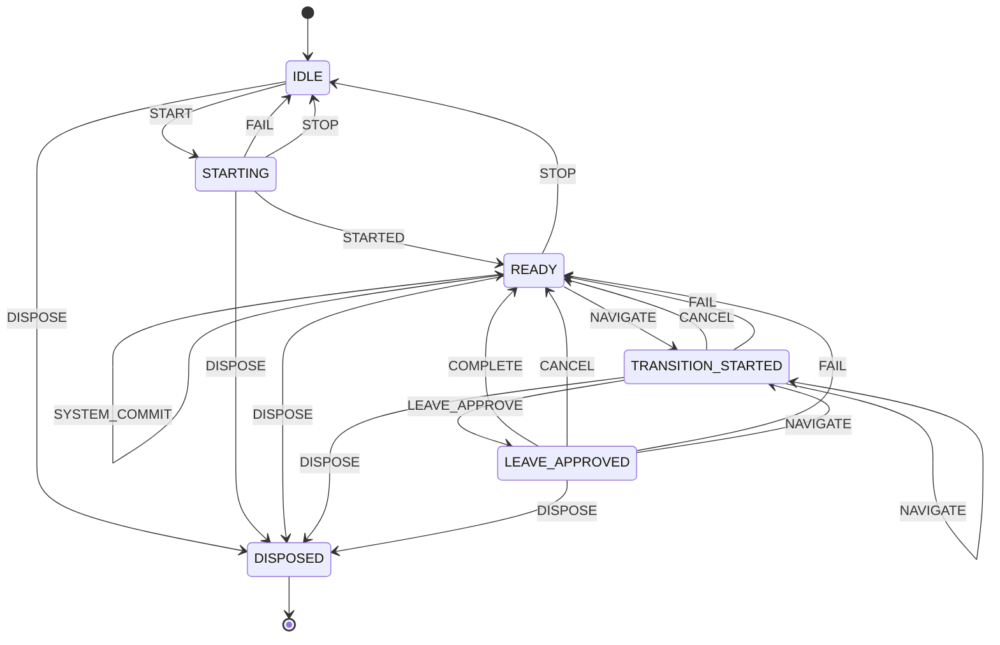
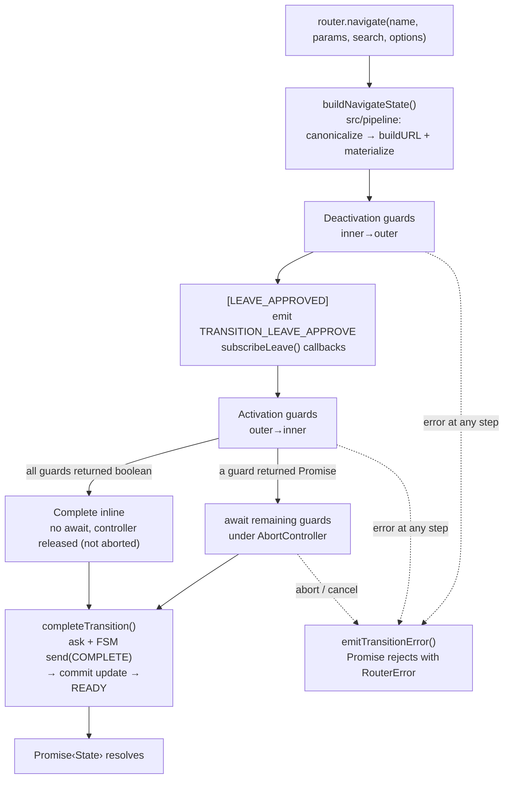

# Architecture

> High-level system design for contributors. See [Glossary](https://github.com/greydragon888/real-router/wiki/glossary) for project-specific terminology.

## Bird's Eye View

Real-Router is a **named, hierarchical, state-driven router** for JavaScript applications. Routes form a dot-notation tree (`users.profile.edit`), navigation is guarded by lifecycle functions, and the entire lifecycle is driven by a single finite state machine — no boolean flags, no ad-hoc state.

Key technical choices:

- **Segment Trie** for URL matching — O(segments) traversal, O(1) for static routes
- **Facade + Namespaces** — thin Router class delegates to single-responsibility namespace modules
- **Optimistic sync execution** — navigation runs synchronously unless a guard returns a Promise
- **Plugin interception** — plugins wrap router methods (onion-layer), they cannot block transitions
- **Deeply frozen state** — all `State` objects are `Object.freeze()`'d, never mutated

## Package Map

```
real-router/
├── packages/
│   ├── core/                      # Router implementation (facade + namespaces); routing engine at src/engine; navigation delivery at src/pipeline; channel correctness at src/channels; public types in src/types, exposed at @real-router/core/types
│   ├── react/                     # React integration (triple entry: main for 19.2+, /legacy for 18+, /ink for Ink 7+ terminal UIs)
│   ├── preact/                     # Preact integration (hooks, components, Suspense)
│   ├── solid/                     # Solid.js integration (hooks, components, directives)
│   ├── vue/                       # Vue 3 integration (composables, components, directives)
│   ├── svelte/                    # Svelte 5 integration (composables, components, actions)
│   ├── angular/                   # Angular 22+ integration (signals, inject* functions, components, directives, zoneless)
│   ├── sources/                   # Subscription layer for UI bindings: cached getTransitionSource / createDismissableError / createActiveNameSelector, canonicalJson params
│   ├── rx/                        # Reactive Observable API (state$, events$, operators)
│   ├── browser-plugin/            # Browser History API synchronization
│   ├── hash-plugin/               # Hash-based routing (#/path)
│   ├── logger-plugin/             # Development logging with timing and param diffs
│   ├── persistent-params-plugin/  # Parameter persistence across navigations
│   ├── ssr-data-plugin/           # SSR per-route data loading via start() interceptor
│   ├── rsc-server-plugin/         # RSC per-route ReactNode loading via start() interceptor (bundler-agnostic)
│   ├── lifecycle-plugin/          # Route-level lifecycle hooks: onEnter, onStay, onLeave
│   ├── preload-plugin/           # Preload on navigation intent (hover, touch) via event delegation
│   ├── memory-plugin/             # In-memory history stack: back/forward/go without browser History API
│   ├── navigation-plugin/         # Navigation API browser synchronization + route-level history
│   ├── validation-plugin/         # Opt-in argument validation (DX-only, 100% tree-shakeable)
│   ├── search-schema-plugin/     # Runtime search param validation via Standard Schema (Zod, Valibot, ArkType)
│   ├── route-utils/               # Route tree queries and segment testing
│   └── ssr-utils/                 # Router-level SSR/SSG/hydration helpers
├── shared/                         # Bare source files shared across packages via src/ symlinks (minimal workspace entry)
│   ├── package.json               # Minimal: name, type:commonjs, devDeps on @real-router/{core,sources} for transitive symlink resolution
│   ├── dom-utils/                 # Shared DOM utilities for adapters: route announcer, scroll restoration, scroll spy, view transitions, direction tracker, link helpers
│   ├── browser-env/               # Shared browser abstractions for URL plugins: history API, popstate, SSR fallback
│   └── ssr/                       # Shared SSR plugin scaffolding: createSsrLoaderPlugin generic factory + createLoadersValidator
├── examples/
│   ├── shared/                            # Shared store, API, abilities, styles
│   ├── web/
│   │   ├── react/      (28 vite apps)     # React 19.2+ (incl. animation-examples × 4 + ssr-examples × 5 [ssr, ssr-streaming, ssr-mixed, ssg, ssr-rsc]); 59 e2e specs
│   │   ├── preact/     (21 vite apps)     # Preact 10 (incl. animation-examples × 4 + ssr-examples × 4); 54 e2e specs
│   │   ├── solid/      (24 vite apps)     # Solid.js (incl. animation-examples × 4 + ssr-examples × 4); 54 e2e specs
│   │   ├── vue/        (24 vite apps)     # Vue 3 SFC (incl. animation-examples × 4 + ssr-examples × 4); 55 e2e specs
│   │   ├── svelte/     (25 vite apps)     # Svelte 5 (incl. animation-examples × 4 + ssr-examples × 4); 54 e2e specs
│   │   └── angular/    (16 vite apps)     # Angular 22+ (incl. animation-examples × 4 + ssr-examples × 4 using provideRealRouterFactory); 49 e2e specs
│   ├── console/
│   │   └── react-ink/  (1 app)            # CLI demo via @real-router/react/ink + memory-plugin
│   └── desktop/
│       ├── electron/   (3 apps)           # Electron: browser-plugin (app://), hash-plugin (file://), navigation-plugin
│       └── tauri/      (2 apps)           # Tauri v2: browser-plugin, navigation-plugin
```

**Public packages** (published to npm): `core`, `react`, `preact`, `solid`, `vue`, `svelte`, `angular`, `sources`, `rx`, `browser-plugin`, `hash-plugin`, `logger-plugin`, `persistent-params-plugin`, `ssr-data-plugin`, `rsc-server-plugin`, `lifecycle-plugin`, `preload-plugin`, `memory-plugin`, `navigation-plugin`, `validation-plugin`, `search-schema-plugin`, `route-utils`, `ssr-utils`

**Internal subsystems of `core`** (bundled into core, not standalone packages, not on npm): the **routing engine** (route-tree facade + path-matcher + search-params layers) lives at `core/src/engine`; the generic **FSM engine**, **typed event emitter**, and per-router **logger** live at `core/src/utils/{fsm, event-emitter, logger}`; **public types** live at `core/src/types`, exposed at `@real-router/core/types`. No standalone internal packages exist.

**Shared sources** (bundled via per-package `src/*` symlinks; `shared/` is a minimal workspace entry with no source files of its own, only a `package.json` declaring workspace devDeps for transitive resolution): `shared/dom-utils`, `shared/browser-env`, `shared/ssr`

## Package Dependencies


```mermaid
graph TD
    subgraph core [Core]
        CORE["core (+ engine at src/engine + public types at /types)"]
    end

    subgraph consumers [Consumer packages]
        BP["browser-plugin"]
        HP["hash-plugin"]
        SOURCES["sources"]
        REACT["react"]
        RX["rx"]
        LP["logger-plugin"]
        PPP["persistent-params-plugin"]
        NP["navigation-plugin"]
        ROUTEUTILS["route-utils"]
        SSRUTILS["ssr-utils"]
    end

    BROWSERENV["shared/browser-env<br/>(shared sources)"]
    DOMUTILS["shared/dom-utils<br/>(shared sources)"]
    SSRSHARED["shared/ssr<br/>(shared sources)"]

    BP -->|dep| CORE
    BP -.->|symlink| BROWSERENV

    HP -->|dep| CORE
    HP -.->|symlink| BROWSERENV

    NP -->|dep| CORE
    NP -.->|symlink| BROWSERENV

    LP -->|dep| CORE

    SOURCES -->|dep| ROUTEUTILS
    SOURCES -->|dep| CORE

    REACT["react<br/>(main + /legacy)"]
    REACT -->|dep| CORE
    REACT -->|dep| SOURCES
    REACT -->|dep| ROUTEUTILS
    REACT -.->|symlink| DOMUTILS

    PREACT["preact"]
    PREACT -->|dep| CORE
    PREACT -->|dep| SOURCES
    PREACT -->|dep| ROUTEUTILS
    PREACT -.->|symlink| DOMUTILS

    SOLID["solid"]
    SOLID -->|dep| CORE
    SOLID -->|dep| SOURCES
    SOLID -->|dep| ROUTEUTILS
    SOLID -.->|symlink| DOMUTILS

    VUE["vue"]
    VUE -->|dep| CORE
    VUE -->|dep| SOURCES
    VUE -->|dep| ROUTEUTILS
    VUE -.->|symlink| DOMUTILS

    SVELTE["svelte"]
    SVELTE -->|dep| CORE
    SVELTE -->|dep| SOURCES
    SVELTE -->|dep| ROUTEUTILS
    SVELTE -.->|symlink| DOMUTILS

    ANGULAR["angular"]
    ANGULAR -->|dep| CORE
    ANGULAR -->|dep| SOURCES
    ANGULAR -->|dep| ROUTEUTILS
    ANGULAR -->|dep| SSRUTILS
    ANGULAR -.->|copy| DOMUTILS

    RX -->|dep| CORE

    PPP -->|dep| CORE

    SDP["ssr-data-plugin"]
    SDP -->|dep| CORE
    SDP -.->|symlink| SSRSHARED

    RSP["rsc-server-plugin"]
    RSP -->|dep| CORE
    RSP -.->|symlink| SSRSHARED

    LCP["lifecycle-plugin"]
    LCP -->|dep| CORE

    PLP["preload-plugin"]
    PLP -->|dep| CORE

    MP["memory-plugin"]
    MP -->|dep| CORE

    VP["validation-plugin"]
    VP -->|dep| CORE

    SSP["search-schema-plugin"]
    SSP -->|dep| CORE

    ROUTEUTILS -.->|peer| CORE

    SSRUTILS -.->|peer| CORE
```

Solid arrows = runtime `dependencies`. Dashed arrows = bundled at build time (consumer's bundle includes the internal package). The `angular` adapter uses a git-tracked **copy** of `shared/dom-utils/` (not a symlink) because ng-packagr does not follow symlinks the same way tsdown does — `prebundle` re-materializes the copy before every build.

## Core Architecture

The `core` package uses a **facade + namespaces** pattern:

```
Router.ts (facade) ─────────────────────────────────────────────────
    │
    ├── RouterFSM              — finite state machine (lifecycle + navigation state)
    │
    ├── RoutesNamespace        — route tree, path operations, forwarding
    ├── StateNamespace         — state service; the committed pair lives in the FSM context
    ├── NavigationNamespace    — navigate(), transition pipeline
    ├── OptionsNamespace       — router configuration
    ├── DependenciesStore      — dependency injection container (plain store)
    ├── EventBusNamespace      — FSM + EventEmitter encapsulation, events, subscribe
    ├── PluginsNamespace       — plugin lifecycle management
    ├── RouteLifecycleNamespace — canActivate/canDeactivate guards
    └── RouterLifecycleNamespace — start/stop operations

api/ (standalone functions — tree-shakeable, access router via WeakMap)
    ├── getRoutesApi(router)      — route CRUD
    ├── getDependenciesApi(router) — dependency CRUD
    ├── getLifecycleApi(router)   — guard management
    ├── getPluginApi(router)      — plugin infrastructure, interception, router extension
    └── cloneRouter(router, deps) — SSR cloning

wiring/ (construction-time)
    ├── wireNamespaces         — wire* functions: namespace dependency wiring
    └── types                  — NamespaceBag (shared wiring input)
```

Router.ts is a thin facade — validates inputs and delegates to namespaces. All business logic lives in namespaces. Standalone API functions in `api/` access router internals via a `WeakMap<Router, RouterInternals>` registry — this enables tree-shaking.

## Router FSM

All router lifecycle and navigation state is managed by a single finite state machine — and since the state-ownership slice (#1641) the machine owns **data**, not only a state name:

```typescript
interface RouterFSMContext {
  epoch: number; // navigation epoch — bumped ONLY by the NAVIGATE update
  inflightToState: State | undefined; // target of the navigation in flight
  current: State | undefined; // the committed state…
  previous: State | undefined; // …and the one it displaced
}
```

Two forms of edge express that. A bare target is the unconditional transition; `{ target, when?, update? }` is the guarded one, where **`when` runs BEFORE the state swap and is the only thing that can refuse a declared transition, `update` runs AFTER it and is the only writer sanctioned to touch the context**. That ordering is what makes "decided" and "did" inseparable: an `update` cannot run for a transition that did not fire, and no action or listener can observe a fired transition whose `update` has not run. A refused `when` is indistinguishable from an undeclared event by every observable.

| Predicate     | On                                      | Refuses                                                                      |
| ------------- | --------------------------------------- | ---------------------------------------------------------------------------- |
| `mayCommit`   | `LEAVE_APPROVED --COMPLETE-->`          | a foreign epoch (superseded navigation) or an aborted external `opts.signal` |
| `mayFail`     | the two in-flight `FAIL` edges          | a report stamped with an epoch that is no longer the live one                |
| `isOwnEpoch`  | `TRANSITION_STARTED --LEAVE_APPROVE-->` | a leave approval belonging to another navigation                             |
| `hasInflight` | the two `CANCEL` edges                  | a cancel when there is nothing in flight                                     |

The four writers of the committed pair are likewise edges, not call sites: `commitNavigation` (`COMPLETE`), `commitSystemState` (`SYSTEM_COMMIT`), `clearCurrent` (`STOP`, shifts) and `resetState` (`DISPOSE`, zeroes both).


```mermaid
stateDiagram-v2
    [*] --> IDLE
    IDLE --> STARTING : START
    IDLE --> DISPOSED : DISPOSE

    STARTING --> READY : STARTED
    STARTING --> IDLE : FAIL
    STARTING --> IDLE : STOP
    STARTING --> DISPOSED : DISPOSE

    READY --> TRANSITION_STARTED : NAVIGATE
    READY --> READY : SYSTEM_COMMIT
    READY --> IDLE : STOP
    READY --> DISPOSED : DISPOSE

    TRANSITION_STARTED --> TRANSITION_STARTED : NAVIGATE
    TRANSITION_STARTED --> LEAVE_APPROVED : LEAVE_APPROVE
    TRANSITION_STARTED --> READY : CANCEL
    TRANSITION_STARTED --> READY : FAIL
    TRANSITION_STARTED --> DISPOSED : DISPOSE

    LEAVE_APPROVED --> READY : COMPLETE
    LEAVE_APPROVED --> READY : CANCEL
    LEAVE_APPROVED --> READY : FAIL
    LEAVE_APPROVED --> TRANSITION_STARTED : NAVIGATE
    LEAVE_APPROVED --> DISPOSED : DISPOSE

    DISPOSED --> [*]
```

**20 edges over 6 states and 10 events**, and the diagram is the whole table — read it as the complete inventory, because two of its ABSENCES are deliberate and measured. There is no `READY --FAIL--> READY`: that edge went with the two senders it had (#1641), so a stale `FAIL` in `READY` is a table no-op structurally rather than by a predicate. And `SYSTEM_COMMIT` has ONE self-loop, on `READY` — an edge on `STARTING` shipped alongside it and was removed once measured, because the two arcs said to need it both commit from `READY` (`completeStart()` leaves `STARTING` before `navigateToNotFound` runs, an order standing since #123).

`DISPOSE` is wired from every non-DISPOSED state so `router.dispose()` always settles the FSM at `DISPOSED`. For healthy flows the facade still orchestrates cleanup through `IDLE` (`STOP` → `IDLE` → `DISPOSE`); the direct transitions are a safety net for cases where the FSM cannot be returned to `IDLE` first (e.g. `dispose()` mid-`STARTING` after a start-pipeline throw). `STARTING --STOP--> IDLE` is the other non-obvious one (#1185): a `stop()` while `start()` is parked in an async interceptor cancels the start.

⛔ **This graph may not be cleaned by trace coverage.** An `onTransition` recorder over the full suite traverses 15 of the edges; every one of the rest was mutated away individually and none was dead. The two `NAVIGATE` self-loops are never taken and are load-bearing anyway — they are read through `canSend()`, and their DECLARATION is what makes supersede legal. The three direct `DISPOSE` edges are fail-safes for flows no test reaches. The full taxonomy lives above the table in `packages/core/src/routerFSM.ts`.

| State                | Description                                                                                         |
| -------------------- | --------------------------------------------------------------------------------------------------- |
| `IDLE`               | Router not started or stopped                                                                       |
| `STARTING`           | Start in progress — spans the WHOLE async start-interceptor chain, not a synchronous window (#1185) |
| `READY`              | Ready for navigation                                                                                |
| `TRANSITION_STARTED` | Navigation in progress                                                                              |
| `LEAVE_APPROVED`     | Deactivation guards passed, activation guards pending                                               |
| `DISPOSED`           | Terminal state, no transitions out                                                                  |

FSM events trigger observable emissions through two paths:

**Via `fsm.on(from, event, action)`** — events that go through the FSM's `send()` dispatch:

- `STARTED` → `emitRouterStart()`
- `STOP` → `emitRouterStop()`
- `CANCEL` (from `TRANSITION_STARTED` or `LEAVE_APPROVED`) → `emitTransitionCancel()`
- `FAIL` (from `STARTING`, `TRANSITION_STARTED` or `LEAVE_APPROVED`) → `emitTransitionError()`. **Not from `READY`** — that edge was removed with the two senders it had, both of which report to observers rather than failing a transition, so they emit directly (#1641 S7, answering RFC-10a §16.5). `STARTING --FAIL--> IDLE` is how a failed `start()` unwinds and is unconditional; the two in-flight edges carry `when: mayFail`, so a stale FAIL from a superseded navigation is a table no-op. ⚠ That last clause is **structural, not yet tested** — removing `when: mayFail` from both edges leaves the whole functional and property suite green (measured), so it is design intent without a discriminating pin

**Via the FSM table `send()` + emit action** — the navigation transitions dispatch through the FSM table via `send()`, which fires a registered action that emits; `forceState()` is **not** used in core (a bundle-invariant). An invalid transition (e.g. `COMPLETE` from IDLE/DISPOSED after a listener's `stop()`/`dispose()`) is a table no-op that emits nothing, so the table is the sole authority over state — the FSM cannot be resurrected out of a terminal state:

- `NAVIGATE` (`sendNavigate`) → `send(NAVIGATE, {toState, fromState})` → action `emitTransitionStart()`
- `LEAVE_APPROVE` (`sendLeaveApprove`) → `send(LEAVE_APPROVE, {…})` → action `emitTransitionLeaveApprove()`
- `COMPLETE` (`sendComplete`) → `send(COMPLETE, {…})` → action `emitTransitionSuccess()`
- `SYSTEM_COMMIT` (`systemCommit`) → `send(SYSTEM_COMMIT, {…})` → action `emitTransitionSuccess()` — the two commits that are NOT transitions (`navigateToNotFound`, the `replace()` revalidation). One edge, on `READY`: both commits happen after start has completed, and `systemCommit()` asks `canSend` before sending, so an attempt from anywhere else throws instead of silently not committing (#1186). ⚠ **That ask refuses wider than the `!isActive()` gate it replaced, and its error code does not say so**: declared on `READY` alone, it also throws in `STARTING` and mid-transition, calling all of them `ROUTER_DISPOSED` on a router whose `isActive()` is `true`. Two arcs changed behaviour against the pre-slice base and are undeclared in any changeset — see #1644

Cost: three transition-payload allocations per navigation (`NAVIGATE`, `LEAVE_APPROVE`, `COMPLETE` each carry one) — a deliberate trade of micro-optimization for structural determinism. Correctness is enforced by the state machine rather than by scattered re-checks: the #1169 commit-gate and the #1611/#1626 pre-`setState` sentinel are both gone, absorbed by `when: mayCommit`.

**The commit is asked of the table TWICE, and the second ask is not a duplicate of the first.** `completeTransition` runs one piece of destructive bookkeeping before it commits — the post-leave cleanup that unregisters the departing route's EXTERNAL `canDeactivate` — so it asks once **before** that (a cancelled navigation must not unregister the guard of the route the user is staying on; the absorbed #1169 gate used to give this for free by sitting one frame higher) and once immediately **before the send**, which is the ask that sees what a guard factory recompiled by that cleanup has just done (#1611). The first ask is gated on there actually being a slot to clear, so the common navigation pays a walk of a 1–3 element array and no `canSend` at all.

**The table also OWNS the committed state.** `current` / `previous` are fields of the FSM context written by the four edge `update`s above and by nothing else, so "committed" and "announced" cannot come apart — the silent commit (state written, `TRANSITION_SUCCESS` never emitted, no subscriber notified) stops being expressible rather than being guarded against (`packages/core/INVARIANTS.md`, "Committed-state ownership"). One observable consequence: the pair is zeroed on the `DISPOSE` edge, several steps earlier than the old `#state.reset()`, so a plugin `teardown()` reading `getPreviousState()` now sees `undefined`.

### Route-tree mutation channel — `TREE_CHANGED` (orthogonal to the FSM)

The ten events above are all about **transitions** (FSM state changes). A separate, **non-FSM** channel signals **structural route-tree mutations** (`add` / `remove` / `update` / `replace` / `clear` via `getRoutesApi`). It reuses the same `EventEmitter` through an **internal-only** key — `TREE_CHANGED` lives in `RouterEventMap` but **not** in the public `EventName` union / `events.*` registry / `Plugin` interface — and is observed only via `getRoutesApi(router).subscribeChanges(handler)`:

- **Post-commit, fire-and-forget** — emitted from the five `getRoutesApi` wrappers after the atomic commit, never from the shared internals that `dispose()`/`cloneRouter()`/`setRootPath()` reuse, so teardown and cloning stay silent.
- **Discriminated payload** (`TreeChangedEvent`, keyed by `op`); `update` emits only on structural fields (guard-only patches are silent).
- Per-listener error isolation comes for free from the shared emitter; a nested same-event emit (a listener that re-triggers the same event) is coalesced to a no-op, so the listener runs once and the mutation still commits.

Tree mutations are an **infrastructural** concern (DevTools, microfrontend coordinators, file-routes watch, caches keyed by route name), not an app-level event — there is deliberately no `router.subscribeTree()` facade and no `addEventListener` path. See [packages/core/CLAUDE.md](packages/core/CLAUDE.md) for the consumer pattern.

## Navigation Pipeline

All navigation methods return `Promise<State>`. The pipeline uses **optimistic sync execution** — guards run synchronously until one returns a Promise, then switches to the async path.


```mermaid
flowchart TD
    NAV["router.navigate(name, params, search, options)"] --> BUILD
    BUILD["buildNavigateState()
    src/pipeline: canonicalize → buildURL + materialize"] --> DEACTIVATE
    DEACTIVATE["Deactivation guards
    inner→outer"]

    DEACTIVATE --> LEAVE["[LEAVE_APPROVED]
    emit TRANSITION_LEAVE_APPROVE
    subscribeLeave() callbacks"]

    LEAVE --> ACTIVATE["Activation guards
    outer→inner"]

    ACTIVATE -->|all guards returned boolean| SYNC
    ACTIVATE -->|a guard returned Promise| ASYNC

    SYNC["Complete inline
    no await, controller released (not aborted)"]
    ASYNC["await remaining guards
    under AbortController"]

    SYNC --> COMPLETE
    ASYNC --> COMPLETE

    COMPLETE["completeTransition()
    ask + FSM send(COMPLETE)
    → commit update → READY"]
    COMPLETE --> RESOLVE["Promise‹State› resolves"]

    DEACTIVATE -.->|error at any step| ERR["emitTransitionError()
    Promise rejects with RouterError"]
    ACTIVATE -.->|error at any step| ERR
    ASYNC -.->|abort / cancel| ERR
```

On error at any step: `emitTransitionError()`, Promise rejects with `RouterError`.

**`navigateToNotFound()`** bypasses this pipeline — but neither the machine nor the deactivation guards. It emits only `TRANSITION_SUCCESS` (no `TRANSITION_START`, no AbortController) and always uses `replace: true`, while committing through a `SYSTEM_COMMIT` edge (#1641) and asking the current route's `canDeactivate` first (#1643) — a refusal throws `CANNOT_DEACTIVATE` instead of committing.

**Cancellation sources:** external AbortController (`opts.signal`), concurrent navigation (aborts previous), `stop()`, `dispose()`. The internal AbortController is created **synchronously** whenever the navigation has guards or `subscribeLeave` listeners (they receive `signal` before it is known whether they run async); only the pure hot path — no guards, no leave listeners — allocates none. It is aborted solely on cancellation/error, never on success.

## Extension Points

| Extension   | Purpose                        | Scope     | Can Block |
| ----------- | ------------------------------ | --------- | --------- |
| **Guards**  | Route access control           | Per-route | Yes       |
| **Plugins** | React to events, extend router | Global    | No        |

### Plugin Interception

Plugins intercept router methods via `addInterceptor()` on `PluginApi`. `InterceptableMethodMap` is fixed at compile time (`core/src/types/api.ts`):

| Method         | Signature                                                                             | Used by                                                                                                                                                                                     |
| -------------- | ------------------------------------------------------------------------------------- | ------------------------------------------------------------------------------------------------------------------------------------------------------------------------------------------- |
| `start`        | `(path?: string) => Promise<State>`                                                   | browser-plugin, hash-plugin, navigation-plugin (via `createStartInterceptor` from `shared/browser-env`); ssr-data-plugin, rsc-server-plugin (via `createSsrLoaderPlugin` from `shared/ssr`) |
| `buildPath`    | `(route: string, params?: Params, search?: SearchParams) => string`                   | persistent-params-plugin                                                                                                                                                                    |
| `forwardState` | `(routeName: string, routeParams: Params, routeSearch?: SearchParams) => SimpleState` | persistent-params-plugin, search-schema-plugin                                                                                                                                              |

Multiple interceptors per method execute in **LIFO** order (last-registered wraps first). Each receives `next` (original or previously-wrapped function) plus the method's arguments. Applied via `createInterceptable()` in `RouterInternals`.

### Router Extension

Plugins extend the router instance with new properties via `extendRouter()` on `PluginApi`. Throws `RouterError(PLUGIN_CONFLICT)` if any key already exists (atomic validation). Extensions are tracked in `RouterInternals.routerExtensions` and cleaned up on unsubscribe or `dispose()`.

### Context Namespace Claims

Plugins publish per-route data via `claimContextNamespace()` on `PluginApi`. Each plugin claims a unique namespace key at registration time (O(1) collision detection via `Set<string>`), receives a `{ write, release }` object, and publishes data to `state.context.<namespace>` from lifecycle hooks. Mirrors the `extendRouter()` ownership model: closure-based tracking, manual `release()` in `teardown()`, dispose safety net for orphaned claims. Six plugins use this — 8 claims in total:

| Plugin                   | Namespace key(s)    | Published fields (examples)                                               |
| ------------------------ | ------------------- | ------------------------------------------------------------------------- |
| browser-plugin           | `browser` + `url`   | source, fullUrl                                                           |
| navigation-plugin        | `navigation`        | direction, sourceElement                                                  |
| memory-plugin            | `memory`            | direction, historyIndex                                                   |
| persistent-params-plugin | `persistentParams`  | persisted query param snapshot                                            |
| ssr-data-plugin          | `data`              | per-route loader result (via `createSsrLoaderPlugin`)                     |
| rsc-server-plugin        | `rsc` + `rscAction` | per-route ReactNode (via `createSsrLoaderPlugin`) + server-action results |

### Validator Slot

`@real-router/validation-plugin` uses a unique extension mechanism — not interceptors, not event listeners, but a **nullable validator slot** in `RouterInternals`:

```typescript
ctx.validator?.routes.validateBuildPathArgs(route); // no-op when null
```

The slot is typed as `RouterValidator | null`. The plugin sets it on registration, clears it on teardown. All core call sites use optional chaining — zero overhead when absent.

## Invariants

These are deliberately designed constraints. Violating them will break the system in subtle ways.

### State & Immutability

- **All `State` objects are deeply frozen** (`Object.freeze`). Never mutate — always create new.
- **`State` has two param channels** — `state.params` (path params) and `state.search` (query params) are separate and independently typed (`State<Params, Search>`), split in RFC-4 M2 (#1548). Both are always present (a frozen `{}` when empty); `navigate` / `buildPath` / `isActiveRoute` take `search` as the argument after `params`.
- **The router never moves a key between the channels** — the slot IS the channel: `params` / `defaultParams` are the path, `search` / `defaultSearch` the query, and the two meet in exactly one place, the printed URL. Enforcement rather than convention: a key the route declares with `?` supplied in the path bag makes `navigate` / `makeState` / `buildNavigationState` throw synchronously and `navigateToState` reject, a `defaultParams` naming such a key is refused at registration, and `canNavigateTo` answers `false` for the shape the verbs refuse. There is no repair step — an earlier release moved the key silently, which let a producer believe its own bag had shipped.
- **Router options are immutable** — deep-frozen at construction time.

### FSM & Events

- **All transition events are consequences of FSM transitions** — never manual calls. The NAVIGATE/LEAVE_APPROVE/COMPLETE emits are FSM **actions** fired by `send()`, and `forceState()` is not used in core — so an event can only fire when the table actually took the transition. No boolean flags. (The `TREE_CHANGED` channel is the one deliberate exception — it is orthogonal to the FSM, emitted by `getRoutesApi` mutations, not by state changes.)
- **`dispose()` is terminal — structurally, not by convention** — DISPOSED has no outbound table transitions, and core reaches every transition through `send()` (never `forceState()`), so a post-dispose `send(COMPLETE)`/`send(LEAVE_APPROVE)` is a table no-op: the FSM cannot be resurrected. All mutating methods throw `RouterError(ROUTER_DISPOSED)` after disposal.
- **`TREE_CHANGED` is internal-only and wrapper-emitted** — never in the public `EventName` union, and emitted strictly from the five `getRoutesApi` CRUD wrappers, never from shared internals (`adoptRouteArtifacts`/`commitTreeChanges`/`resetStore`). This keeps `dispose()`, `cloneRouter()`, and `setRootPath()` from emitting it.

### Guards & Plugins

- **Guards return `boolean | Promise<boolean>` only** — no redirects, no state modification, no `State` return.
- **Plugins are observers** — they react to events but cannot block or modify the transition pipeline.
- **Guard execution order is fixed**: deactivation innermost → outermost, then activation outermost → innermost.
- **`navigateToNotFound()` bypasses ACTIVATION guards and plugins** — plugins only see `onTransitionSuccess`, and nothing is activated at `UNKNOWN_ROUTE`. It does consult the current route's `canDeactivate` (#1643): leaving is still leaving.

### Navigation

- **Concurrent navigation cancels previous** — the previous internal AbortController is aborted, promise rejects with `TRANSITION_CANCELLED`.
- **Navigating FROM `UNKNOWN_ROUTE` auto-forces `replace: true`** — prevents browser history pollution with 404 entries.
- **Fire-and-forget is safe** — `navigate()`, `navigateToDefault()`, and the `navigateToState()` plugin primitive internally suppress unhandled rejections for expected errors (`SAME_STATES`, `TRANSITION_CANCELLED`, `ROUTER_NOT_STARTED`, `ROUTE_NOT_FOUND`, `CANNOT_ACTIVATE`, `CANNOT_DEACTIVATE`). Guard blocks are an expected outcome, not an internal error — `await` the call (or use an `onTransitionError` plugin) to observe a guard rejection.

### Packages

- **Internal packages are never imported by end users** — they are bundled into consumer packages at build time.
- **`core` never depends on browser APIs** — platform-agnostic. The `start(path)` method requires a path; browser-plugin makes it optional by injecting `browser.getLocation()` via interceptor.

## Boundaries

### Layer Rules

```
┌──────────────────────────────────────────────────────────────────┐
│                     Consumer Packages                            │
├──────────────────────────────────────────────────────────────────┤
│ react │ preact │ solid │ vue │ svelte │ angular │ browser-plugin │
├──────────────────────────────────────────────────────────────────┤
│                           Core                                   │
├──────────────────────────────────────────────────────────────────┤
│                              core                                │
├──────────────────────────────────────────────────────────────────┤
│                core internals (bundled into core)                │
├──────────────────────────────────────────────────────────────────┤
│  src/engine · src/pipeline · src/channels                        │
│  src/utils/{fsm, event-emitter, logger}                          │
└──────────────────────────────────────────────────────────────────┘
```

**ALLOWED:**

- Consumer packages depend on `core`
- Consumer plugins inline the guards they need
- Consumer packages import shared sources via git-tracked symlinks (`src/dom-utils` → `shared/dom-utils`, `src/browser-env` → `shared/browser-env`, `src/shared-ssr` → `shared/ssr`)
- The `engine` subsystem (`core/src/engine`) is self-contained — the `route-tree` → `path-matcher` / `search-params` layering is an internal boundary within `src/engine`, enforced by core's lint
- The `channels` subsystem (`core/src/channels`) imports **nothing** from the namespaces, the engine or the pipeline — declared query names arrive as DATA (`readonly string[]` or a `queryNamesOf` accessor), so the one registry that classifies and prints cannot grow a second derivation. Also enforced by core's lint
- The `pipeline` subsystem (`core/src/pipeline`) reaches the routes layer only through its `RouteResolver` port, implemented by the router at wiring time — same inversion, so the module stays pure and mock-testable
- `shared/browser-env` is the **only** location that touches `window`, `history`, `addEventListener` (enforced by convention, not by package boundary)

**FORBIDDEN:**

- Shared sources must not depend on `core`
  - Exception: `shared/browser-env` files import `Router`, `PluginApi`, `RouterError` types from `@real-router/core` — resolved via the consumer's `node_modules` when accessed through the symlink
- Consumer packages must not depend on each other's internals
- No package may bypass the plugin system to mutate router state directly
- No circular dependencies between packages

### Extension Boundaries

- Plugins extend the router **only** via `extendRouter()` and publish per-route data **only** via `claimContextNamespace()` — never by mutating the router prototype or internals
- Interceptors wrap methods **only** from `InterceptableMethodMap` — the set is fixed at compile time
- Guards registered via route config are tracked separately from guards registered via `addActivateGuard()` — `replace()` clears only definition-sourced guards
- **`/ssr` subpath isolation** — every adapter ships a distinct `@real-router/{adapter}/ssr` entry-point for server-only types and components (`<ClientOnly>`, `<ServerOnly>`, `<Await>`, `<Streamed>`, `<HttpStatusCode>`, `useDeferred`). The main entry never re-exports SSR helpers; the `/ssr` entry never depends on history/navigation plugins. This guarantees client bundles cannot accidentally pull server-only types, enables RSC `react-server` export-condition composition, and makes ESLint rules like "no `*/ssr` import in client component" mechanically enforceable. See [IMPLEMENTATION_NOTES.md › Subpath isolation for SSR/RSC concerns](IMPLEMENTATION_NOTES.md)

## Cross-Cutting Concerns

### Error Handling

All navigation errors are `RouterError` instances with typed `code` from `errorCodes`. Common rejections (`SAME_STATES`, `ROUTER_NOT_STARTED`, `ROUTE_NOT_FOUND`) return **pre-allocated** `Promise.reject()` instances — zero allocation per rejection.

### Testing Strategy

- **100% code coverage** enforced in CI across all packages
- **Property-based testing** — 2000+ property test cases via fast-check across 31 packages: URL encoding, parameter serialization, route tree operations, reactive subscription ordering, canonical params, link helpers
- **Stress testing** — 700+ stress test cases across 183 `.stress.ts` files in 14 packages (core, plugins, all 6 framework adapters): concurrent navigations, guard removal mid-execution, route CRUD under load, heap snapshots confirming zero memory leaks, mount/unmount lifecycle, subscription fanout granularity, full SPA simulations
- **Playwright e2e testing** — 1800+ test cases across 330+ spec files (100+ playwright projects) covering all 6 framework adapters (React, Preact, Solid, Vue, Svelte, Angular). Tests verify real browser behavior: navigation, guards, data loading, error handling, hash routing, nested routes, dynamic routes, async guards, SSR/streaming/SSG/RSC pipelines, animations. Turbo-cached via `test:e2e` task.
- **Mutation testing** (Stryker) validates test suite quality beyond line coverage
- **`lint:e2e`** pre-commit check — verifies every example with `playwright.config.ts` has at least one spec file

### Build System

pnpm monorepo with Turborepo for task orchestration. Dual ESM/CJS output via tsdown (Rolldown-based bundler). Internal packages are bundled into consumers — not separate npm artifacts. `workspace:^` protocol for inter-package dependencies. All turbo tasks use `outputLogs: "errors-only"` — silent on success, full output on failure. `build:verbose`/`test:verbose` scripts override to full output for debugging. Turbo `test:e2e` task caches Playwright results based on source + spec + config inputs.

### Performance Hot Path

The navigate path is heavily optimized:

- **Optimistic sync execution** — no `await`/microtask on the sync path; AbortController allocated only when guards or `subscribeLeave` listeners exist (none on the pure hot path)
- **FSM `send()` (table-driven)** — NAVIGATE/LEAVE_APPROVE/COMPLETE dispatch through the table (emit is the action); `forceState()` is not used. A deliberate trade of micro-optimization for structural determinism
- **EventEmitter explicit params** — `emit(name, a?, b?, c?, d?)` avoids V8 rest-param array allocation
- **Cached error rejections** — pre-allocated for common error codes
- **Single-pass freeze** — `freezeStateInPlace` in one recursive traversal

## See Also

- `packages/core/CLAUDE.md` — detailed core internals for AI agents
- `IMPLEMENTATION_NOTES.md` — infrastructure and tooling decisions
- [Wiki](https://github.com/greydragon888/real-router/wiki) — full user documentation
- [Glossary](https://github.com/greydragon888/real-router/wiki/glossary) — project-specific terminology
