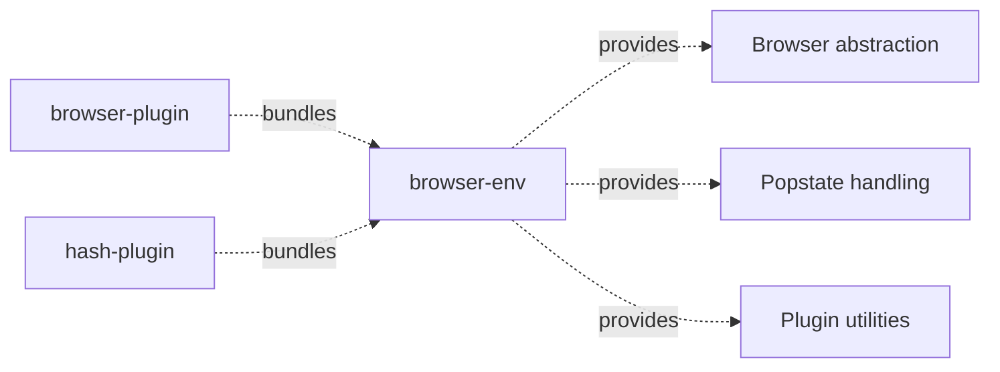

# Architecture

> Detailed architecture for AI agents and contributors

## Overview

`browser-env` is an **internal, unpublished** package that provides shared browser abstractions for both `@real-router/browser-plugin` (History API) and `@real-router/hash-plugin` (hash routing).

**Key role:** Centralises all browser-specific code that both plugins need: environment detection, History API wrappers, SSR no-op fallbacks, popstate event handling, and plugin helper utilities. Neither plugin imports browser globals directly — they always go through `browser-env`.

**Consumers:** `browser-plugin` (bundled), `hash-plugin` (bundled). Not published to npm.

## Package Structure

```
browser-env/
├── src/
│   ├── index.ts           — Public exports (38 lines)
│   ├── types.ts           — HistoryBrowser, Browser, SharedFactoryState interfaces
│   ├── detect.ts          — isBrowserEnvironment() — single-line env check
│   ├── history-api.ts     — Thin wrappers: pushState, replaceState, addPopstateListener, getHash
│   ├── safe-browser.ts    — createSafeBrowser() — returns real or SSR fallback Browser
│   ├── ssr-fallback.ts    — createWarnOnce, createHistoryFallbackBrowser (no-op impls)
│   ├── popstate-handler.ts — createPopstateHandler (deferred queue), createPopstateLifecycle
│   ├── popstate-utils.ts  — getRouteFromEvent, updateBrowserState
│   ├── plugin-utils.ts    — createStartInterceptor, createReplaceHistoryState, shouldReplaceHistory
│   ├── url-parsing.ts     — safeParseUrl — validates protocol, swallows parse errors
│   ├── utils.ts           — normalizeBase, safelyEncodePath
│   └── validation.ts      — createOptionsValidator — generic type-checking validator
```

## Dependencies

**Runtime dependencies:** `@real-router/core` (types only), `type-guards` (`isStateStrict`).

**Consumed by:**



| Consumer           | What it uses                                                                                        | Purpose                                        |
| ------------------ | --------------------------------------------------------------------------------------------------- | ---------------------------------------------- |
| **browser-plugin** | `createSafeBrowser`, `normalizeBase`, `safelyEncodePath`                                            | Factory setup and path normalization           |
| **browser-plugin** | `createPopstateHandler`, `createPopstateLifecycle`                                                  | Back/forward navigation handling               |
| **browser-plugin** | `createStartInterceptor`, `createReplaceHistoryState`, `shouldReplaceHistory`, `updateBrowserState` | Router extension methods and transition sync   |
| **browser-plugin** | `safeParseUrl`, `createOptionsValidator`                                                            | URL parsing and options validation             |
| **hash-plugin**    | Same set as browser-plugin                                                                          | Hash-based routing with identical abstractions |

## Types

```typescript
// Wraps the subset of History API used by plugins
interface HistoryBrowser {
  pushState: (state: State, path: string) => void;
  replaceState: (state: State, path: string) => void;
  addPopstateListener: (fn: (evt: PopStateEvent) => void) => () => void;
  getHash: () => string;
}

// Extends HistoryBrowser with location reading
interface Browser extends HistoryBrowser {
  getLocation: () => string;
}

// Shared mutable state across instances created by the same factory.
// Enables cleanup of the previous instance's popstate listener (e.g. during HMR).
interface SharedFactoryState {
  removePopStateListener: (() => void) | undefined;
}
```

`HistoryBrowser` is the subset used by SSR fallbacks and hash-plugin internals. `Browser` adds `getLocation`, whose implementation differs between browser-plugin (pathname + search) and hash-plugin (hash fragment).

## Browser Abstraction

### Environment Detection

```typescript
export const isBrowserEnvironment = (): boolean =>
  typeof globalThis.window !== "undefined" && !!globalThis.history;
```

Both `window` and `history` must be present — some SSR environments expose `window` but not `history`.

### Real Browser Implementation (`history-api.ts`)

Thin module-level wrappers — no state, no closures, no overhead:

```typescript
pushState = (state, path) => globalThis.history.pushState(state, "", path);
replaceState = (state, path) =>
  globalThis.history.replaceState(state, "", path);
addPopstateListener = (fn) => {
  globalThis.addEventListener("popstate", fn);
  return () => globalThis.removeEventListener("popstate", fn); // cleanup fn
};
getHash = () => globalThis.location.hash;
```

### `createSafeBrowser(getLocation, context): Browser`

Single decision point — called once per plugin factory:

```
isBrowserEnvironment()
    ├── YES → return { pushState, replaceState, addPopstateListener, getLocation, getHash }
    │                   (real globals from history-api.ts)
    └── NO  → return { ...createHistoryFallbackBrowser(context),
                        getLocation: () => { warnOnce("getLocation"); return ""; } }
```

The `getLocation` callback is injected by each plugin (not provided by `browser-env`) — browser-plugin reads pathname + search, hash-plugin reads the hash fragment.

## SSR Fallback

`createHistoryFallbackBrowser(context)` returns a `HistoryBrowser` where every method is a no-op that logs a single warning on first call:

```typescript
const createWarnOnce = (context: string) => {
  let hasWarned = false;
  return (method: string) => {
    if (!hasWarned) {
      console.warn(
        `[browser-env] ... context: "${context}" ... method "${method}" is a no-op ...`,
      );
      hasWarned = true;
    }
  };
};
```

**One warning per `Browser` instance** — deduped by the `hasWarned` closure. Expected in SSR; warns on accidental misuse.

`addPopstateListener` in the fallback returns `() => {}` (a no-op unsubscribe) — callers can always safely call the returned cleanup function.

## Popstate Handler

### `createPopstateHandler(deps)` — Deferred Queue Pattern

Handles `popstate` events fired by back/forward button clicks. Multiple events may fire before a transition completes.

```
User clicks back/forward
        │
        ▼
onPopState(evt)
        ├── isTransitioning === true?
        │     YES: deferredEvent = evt  ← overwrites previous (last-write-wins)
        │          return               ← skip this event
        │
        ├── isTransitioning = true
        │
        ├── getRouteFromEvent(evt, api, browser)
        │
        ├── route found?
        │     YES: await router.navigate(name, params, transitionOptions)
        │     NO + allowNotFound: router.navigateToNotFound(browser.getLocation())
        │     NO + !allowNotFound: await router.navigateToDefault({ ...opts, reload: true })
        │
        ├── catch (error):
        │     instanceof RouterError → ignore (CANNOT_DEACTIVATE, etc.)
        │     otherwise → recoverFromCriticalError(error)
        │
        └── finally: isTransitioning = false → processDeferredEvent()
```

**Last-write-wins semantics:** rapid clicks accumulate into `deferredEvent` but only the last one is processed. Intermediate states are intentionally skipped:

```
Click 1 → processing, isTransitioning = true
Click 2 → deferred = evt2
Click 3 → deferred = evt3  (evt2 discarded)
Click 1 completes → processDeferredEvent → processes evt3
```

### Critical Error Recovery

When a non-`RouterError` is thrown (unexpected error, guard throws, etc.):

```typescript
function recoverFromCriticalError(error: unknown): void {
  // 1. Log the critical error
  // 2. Try to restore browser URL to match current router state
  const currentState = deps.router.getState();
  if (currentState) {
    const url = deps.buildUrl(currentState.name, currentState.params);
    deps.browser.replaceState(currentState, url);
  }
  // If recovery itself fails, log that error too and give up
}
```

`RouterError` (e.g. `CANNOT_DEACTIVATE`) is expected and silently ignored — guard rejections are normal. Anything else indicates a bug and triggers recovery.

### `createPopstateLifecycle(deps)` — Plugin Lifecycle Hooks

Returns `Pick<Plugin, "onStart" | "onStop" | "teardown">`:

```
onStart   → removes previous listener (via shared.removePopStateListener)
            → registers new listener → stores unsubscribe in shared.removePopStateListener
onStop    → removes listener, clears shared.removePopStateListener
teardown  → removes listener, clears shared.removePopStateListener, calls cleanup()
```

`SharedFactoryState` allows the new instance to clean up the previous instance's listener when the factory is called again (e.g. HMR). `cleanup()` is provided by the plugin — it unregisters the start interceptor and router extensions.

## Popstate Utilities

### `getRouteFromEvent(evt, api, browser)`

Two-phase route resolution from a popstate event:

```
isState(evt.state)?   ← isStateStrict from type-guards validates { name, params, path }
    YES → { name: evt.state.name, params: evt.state.params }  (fast path — state already parsed)
    NO  → api.matchPath(browser.getLocation())                 (URL matching fallback)
         └── returns { name, params } or undefined
```

Falls back to URL matching when `history.state` is invalid (manually entered URL, external navigation, corrupted state).

### `updateBrowserState(state, url, replace, browser)`

Writes router state to browser history. Stores only the 3 fields needed for `getRouteFromEvent` to work:

```typescript
const historyState = {
  name: state.name,
  params: state.params,
  path: state.path,
};
replace
  ? browser.replaceState(historyState, url)
  : browser.pushState(historyState, url);
```

The full `State` object is not stored — only the 3 fields needed for route reconstruction. This keeps `history.state` lean.

## Plugin Utilities

### `createStartInterceptor(api, browser)`

Makes `router.start(path?)` path-optional. Registers an interceptor on the `"start"` method:

```typescript
api.addInterceptor("start", (next, path) =>
  next(path ?? browser.getLocation()),
);
```

If `path` is omitted, substitutes the current browser URL. Returns the unsubscribe function — callers store it for `teardown`.

### `createReplaceHistoryState(api, router, browser, buildUrl)`

Creates `router.replaceHistoryState(name, params)` — updates URL in-place without a router transition:

1. Validates route exists via `api.buildState(name, params)`
2. Constructs a `State` via `api.makeState(...)`
3. Calls `updateBrowserState(builtState, url, replace: true, browser)`

Throws if the route name is unknown (not a `RouterError` — callers should validate first).

### `shouldReplaceHistory(navOptions, toState, fromState): boolean`

```typescript
return (
  (navOptions.replace ?? !fromState) || // replace if explicitly set or no fromState (first nav)
  (!!navOptions.reload && toState.path === fromState?.path)
); // replace on same-state reload (avoid duplicate history entries)
```

## URL and Path Utilities

### `normalizeBase(base): string`

Ensures leading slash, removes trailing slash: `"app/"` → `"/app"`, `""` → `""` (empty preserved as-is).

### `safelyEncodePath(path): string`

`encodeURI(decodeURI(path))` — idempotent re-encoding. Swallows malformed URI errors (logs warning, returns original path).

### `safeParseUrl(url, loggerContext): URL | null`

Parses URL relative to `globalThis.location.origin`. Returns `null` for:

- Parse errors
- Non-`http:` / `https:` protocols

Returns a `URL` object on success. Used by hash-plugin and browser-plugin `urlToPath`.

### `createOptionsValidator<T>(defaults, loggerContext)`

Returns a validator `(opts) => void` that iterates provided keys and compares `typeof value` against `typeof defaults[key]`. Throws on type mismatch:

```
[browser-plugin] Invalid type for 'base': expected string, got number
```

Generic — works for any options object given a `Required<T>` defaults map.

## See Also

- [INVARIANTS.md](INVARIANTS.md) — Property-based test invariants
- [browser-plugin ARCHITECTURE.md](../browser-plugin/ARCHITECTURE.md) — Primary consumer, full plugin lifecycle
- [hash-plugin ARCHITECTURE.md](../hash-plugin/ARCHITECTURE.md) — Secondary consumer, hash-based routing
- [core CLAUDE.md](../core/CLAUDE.md) — Core package (PluginApi, addInterceptor, extendRouter)
- [ARCHITECTURE.md](../../ARCHITECTURE.md) — System-level architecture
