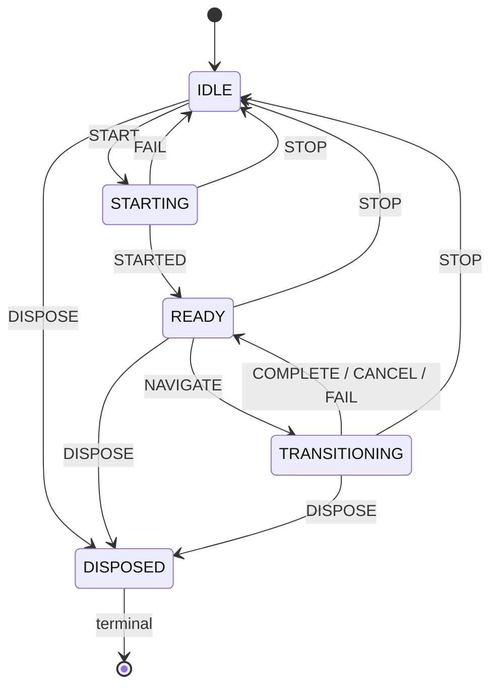

# RFC-2: RouterFSM Implementation

## Purpose

Define the Finite State Machine that manages the router's lifecycle, replacing the current boolean flag-based approach.

**RouterFSM is a singleton** — a private field of Router, created once in the constructor. It lives for the entire lifetime of the router instance.

## Architecture: Two FSMs as Private Fields

```typescript
class Router {
  #routerFSM: FSM<RouterState, RouterEvent, RouterContext, RouterPayloads>;
  #transitionFSM: FSM<TransitionPhase, TransitionEvent, TransitionContext, TransitionPayloads>;
}
```

Both FSMs live for the entire lifetime of the router. TransitionFSM is a reusable singleton that returns to IDLE after each navigation (see RFC-3).

## State Definitions

```typescript
type RouterState = "IDLE" | "STARTING" | "READY" | "TRANSITIONING" | "DISPOSED";
type RouterEvent =
  | "START"
  | "STARTED"
  | "NAVIGATE"
  | "COMPLETE"
  | "FAIL"
  | "CANCEL"
  | "STOP"
  | "DISPOSE";
```

## State Transitions

```typescript
const transitions = {
  IDLE:          { START: "STARTING", DISPOSE: "DISPOSED" },
  STARTING:      { STARTED: "READY", FAIL: "IDLE", STOP: "IDLE" },
  READY:         { NAVIGATE: "TRANSITIONING", STOP: "IDLE", DISPOSE: "DISPOSED" },
  TRANSITIONING: {
    COMPLETE: "READY",
    CANCEL: "READY",
    FAIL: "READY",
    STOP: "IDLE",
    DISPOSE: "DISPOSED",
  },
  DISPOSED:      {},  // terminal
};
```



## Key Differences from Previous Version

| Aspect | Previous RFC-2 | This RFC-2 (aligned with strategy) |
| --- | --- | --- |
| TransitionFSM | Ephemeral (new per navigate) | Singleton (reusable, private field) |
| STOP from TRANSITIONING | Error (not allowed) | Allowed → IDLE (cancels transition) |
| DISPOSE from TRANSITIONING | Error (not allowed) | Allowed → DISPOSED |
| Events | COMPLETE for start success | STARTED for start, COMPLETE for navigate |
| CANCEL event | Not present | TRANSITIONING → READY |
| Middleware | Side-effect of RouterFSM | Inside TransitionFSM pipeline (RFC-3) |
| Event emission | Direct plugin calls | Via `onTransition` listener |

## Events = FSM Transitions

Current plugin events are lifecycle transitions in disguise. Instead of manual `invokeEventListeners()` calls, events are emitted automatically from FSM transitions via `onTransition`:

```
// Current (manual calls scattered in code):
navigateToState() {
  invokeEventListeners(TRANSITION_START);   // manual
  transition(...);
  invokeEventListeners(TRANSITION_SUCCESS); // manual
}

// With FSM (automatic from transitions):
RouterFSM: READY → TRANSITIONING           →  emit TRANSITION_START
RouterFSM: TRANSITIONING → READY (COMPLETE) →  emit TRANSITION_SUCCESS
```

### Plugin Event Mapping (via onTransition)

```typescript
routerFSM.onTransition(({ from, to, event, payload }) => {
  // Router lifecycle
  if (from === "STARTING" && to === "READY") {
    invoke(ROUTER_START);
  }
  if (event === "STOP" && to === "IDLE") {
    invoke(ROUTER_STOP);
  }

  // Transition lifecycle
  if (from === "READY" && to === "TRANSITIONING") {
    invoke(TRANSITION_START, payload.toState, payload.fromState);
  }
  if (event === "COMPLETE" && from === "TRANSITIONING") {
    invoke(TRANSITION_SUCCESS, payload.state, payload.fromState, payload.opts);
  }
  if (event === "CANCEL" && from === "TRANSITIONING") {
    invoke(TRANSITION_CANCEL, payload.toState, payload.fromState);
  }
  if (event === "FAIL" && from === "TRANSITIONING") {
    invoke(TRANSITION_ERROR, payload.toState, payload.fromState, payload.error);
  }
});
```

## Payload

```typescript
type RouterPayloads = {
  NAVIGATE: { toState: State; fromState: State | undefined };
  COMPLETE: {
    state: State;
    fromState: State | undefined;
    opts: NavigationOptions;
  };
  FAIL: {
    toState: State;
    fromState: State | undefined;
    error: RouterErrorType;
  };
  CANCEL: { toState: State; fromState: State | undefined };
};
```

## Boolean Flags Replacement

```diff
- #started = false;
- #active = false;
+ // RouterFSM states replace both flags

  isStarted(): boolean {
-   return this.#started;
+   const s = this.#routerFSM.getState();
+   return s === 'READY' || s === 'TRANSITIONING';
  }

  isActive(): boolean {
-   return this.#active;
+   const s = this.#routerFSM.getState();
+   return s !== 'IDLE' && s !== 'DISPOSED';
  }
```

## State Implementation Details

### STARTING State

The STARTING state uses a **result-based approach** (no try/catch):

```typescript
async start(startPath: string): Promise<State> {
  // FSM guards against double-start: send() is no-op if not in IDLE
  const prevState = this.#routerFSM.getState();
  this.#routerFSM.send('START');

  if (this.#routerFSM.getState() === prevState) {
    // FSM didn't transition — already started or starting
    throw CACHED_ALREADY_STARTED_ERROR;
  }

  // Resolve route
  const matchedState = this.matchPath(startPath);

  if (!matchedState && !options.allowNotFound) {
    this.#routerFSM.send('FAIL');  // STARTING → IDLE
    throw new RouterError('ROUTE_NOT_FOUND', { path: startPath });
  }

  // Navigate via TransitionFSM (result communicated via onTransition → STARTED)
  const state = matchedState ?? this.makeNotFoundState(startPath);
  await this.navigateToState(state, undefined, { replace: true }, false);

  // If we reach here, transition succeeded and onTransition fired STARTED
  return this.getState();
}
```

### READY State

- Router fully operational
- Can accept `NAVIGATE`, `STOP`, `DISPOSE`
- `isStarted()` returns `true`

### TRANSITIONING State

- Navigation in progress (TransitionFSM is in DEACTIVATING/ACTIVATING/MIDDLEWARE)
- **STOP is allowed**: cancels the active transition, transitions to IDLE
- **DISPOSE is allowed**: cancels, cleans up, transitions to DISPOSED
- **NAVIGATE**: cancels current, starts new (stays in TRANSITIONING via CANCEL → READY → NAVIGATE → TRANSITIONING, or via concurrent navigation handling)
- `isStarted()` returns `true`

### IDLE State

- Router exists but is not operational
- Can accept `START`, `DISPOSE`
- `isStarted()` returns `false`

### DISPOSED State

- Terminal state — no transitions allowed
- All resources freed
- All methods throw `ROUTER_DISPOSED`

Complete cleanup sequence:
1. Clear all guards (canActivate/canDeactivate)
2. Clear plugins and middleware
3. Clear global caches
4. Replace all methods with error throwers
5. Release all references

## Stop Implementation

```typescript
stop(): void {
  const state = this.#routerFSM.getState();

  if (state === 'TRANSITIONING') {
    // Cancel active transition first
    this.#transitionFSM.send('CANCEL', {
      error: new RouterError('TRANSITION_CANCELLED'),
      state: currentToState,
    });
  }

  this.#routerFSM.send('STOP');
  // onTransition will fire ROUTER_STOP
}
```

**What stop() does:**
- Cancels active transition (if TRANSITIONING)
- Clears current state
- Emits ROUTER_STOP via onTransition

**What stop() does NOT do:**
- Does NOT clear guards
- Does NOT clear plugins
- Does NOT clear middleware

## Stop vs Dispose Comparison

| Aspect                   | stop()                     | dispose()           |
| ------------------------ | -------------------------- | ------------------- |
| **Target State**         | IDLE                       | DISPOSED            |
| **Reversible**           | Yes (can start() again)    | No (terminal)       |
| **Clears Current State** | Yes                        | Yes                 |
| **Clears Guards**        | No                         | All                 |
| **Clears Plugins**       | No                         | Yes                 |
| **Clears Middleware**     | No                         | Yes                 |
| **From TRANSITIONING**   | Allowed (cancels)          | Allowed (cancels)   |
| **From STARTING**        | Error                      | Error               |
| **Use Case**             | Temporary pause            | Complete cleanup    |
| **Common Scenarios**     | Route context switch       | Tests, HMR, unmount |

## Public API Mapping

Current API remains unchanged — FSM is internal:

```typescript
class Router {
  #routerFSM = new FSM(routerConfig);
  #transitionFSM = new FSM(transitionConfig);

  start(path) { /* send START, navigate, send STARTED */ }
  stop()      { /* send STOP */ }
  navigate()  { /* send NAVIGATE, drive TransitionFSM */ }

  isStarted() {
    const s = this.#routerFSM.getState();
    return s === 'READY' || s === 'TRANSITIONING';
  }

  isActive() {
    const s = this.#routerFSM.getState();
    return s !== 'IDLE' && s !== 'DISPOSED';
  }
}
```

## Event Emission Order: FSM vs Current Implementation

### Problem: Counter-intuitive Event Order in Current Implementation

The current implementation (Issue #50 two-phase start) emits events in this order:

```
TRANSITION_START → ROUTER_START → TRANSITION_SUCCESS
```

This is **counter-intuitive** because semantically "router started" should happen BEFORE "transition started".

### Why FSM Solves This

In FSM architecture, `isStarted()` is based on **machine state**, not on event emission:

```typescript
isStarted() {
  const s = this.#routerFSM.getState();
  return s === 'READY' || s === 'TRANSITIONING';
}
```

Events can be emitted in **intuitive order**. State consistency is guaranteed by FSM state, not by event order.

## Migration Path

See `rfc-migration-strategy-a-transition-fsm-first.md` for detailed iterative release plan.

Summary:
1. **Release 0**: Publish `@real-router/fsm` (RFC-1)
2. **Release 1**: Create both FSMs, wire events through `onTransition` (parallel with existing code)
3. **Release 2**: Rewrite RouterLifecycleNamespace — `start()`/`stop()` through RouterFSM, remove boolean flags
4. **Release 3**: Rewrite NavigationNamespace — `navigate()` through TransitionFSM
5. **Release 4**: DISPOSED + optimizations

Each release validated by **2189 existing tests** as safety net.

## Testing Strategy

### Core State Transitions

```typescript
describe("RouterFSM", () => {
  it("IDLE → STARTING → READY on successful start");
  it("STARTING → IDLE on failed start");
  it("READY → TRANSITIONING → READY on successful navigation");
  it("READY → IDLE on stop");
  it("TRANSITIONING → IDLE on stop during navigation");
  it("TRANSITIONING → READY on CANCEL (concurrent navigation)");
  it("TRANSITIONING → READY on FAIL (guard rejection)");
  it("DISPOSED — all methods throw");
});
```

### Event Emission via onTransition

- `STARTING → READY` emits `ROUTER_START`
- `STOP → IDLE` emits `ROUTER_STOP`
- `READY → TRANSITIONING` emits `TRANSITION_START`
- `COMPLETE from TRANSITIONING` emits `TRANSITION_SUCCESS`
- `CANCEL from TRANSITIONING` emits `TRANSITION_CANCEL`
- `FAIL from TRANSITIONING` emits `TRANSITION_ERROR`

## Open Questions

1. Should we expose FSM state for debugging? (`router.__fsm_state__`)
2. Do we need state history for debugging?
3. Should plugins have `onDispose()` lifecycle hook?
4. Should we use two-event model (`ROUTER_STARTING`/`ROUTER_READY`) or keep single `ROUTER_START`?

---

**Depends On**: RFC-1
**Required By**: RFC-3
**Target Version**: 0.x.0-alpha
**Priority**: High
