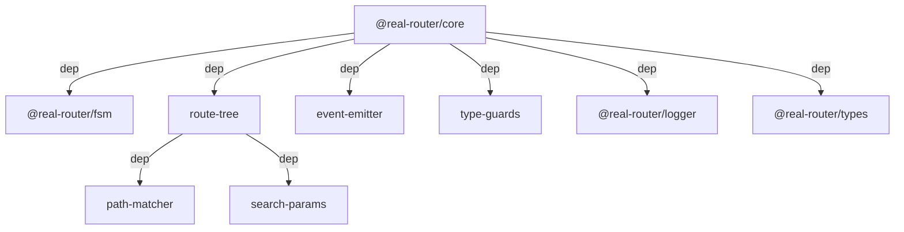
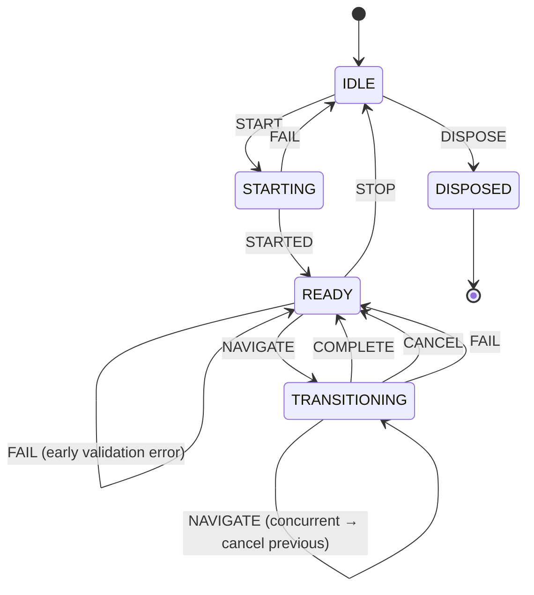

# Architecture

> Detailed architecture for AI agents and contributors

## Overview

`@real-router/core` is the **main package** of the router — a facade over 9 namespaces with FSM-driven lifecycle, plugin system, and tree-shakeable standalone API functions. 
All state transitions go through a finite state machine; all events flow through a typed event emitter.

**Key role:** Thin facade (`Router.ts`) validates inputs and delegates to namespace classes. No business logic in the facade itself. 
Standalone API functions (`getRoutesApi`, `getPluginApi`, etc.) access router internals via a `WeakMap` registry — enabling tree-shaking without exposing private state.

## Package Structure

```
core/
├── src/
│   ├── Router.ts                    — Facade class (~650 lines)
│   ├── createRouter.ts              — Factory function
│   ├── getNavigator.ts              — Navigator factory
│   ├── RouterError.ts               — Typed error class
│   ├── constants.ts                 — Error codes, events, limits
│   ├── internals.ts                 — WeakMap registry for API functions
│   ├── transitionPath.ts            — Transition path calculation
│   ├── helpers.ts                   — Utility functions
│   ├── typeGuards.ts                — Runtime type guards
│   ├── types.ts                     — Router-dependent types
│   │
│   ├── fsm/
│   │   └── routerFSM.ts            — FSM config (states, events, payloads)
│   │
│   ├── namespaces/
│   │   ├── RoutesNamespace/         — Route tree, path operations, forwarding
│   │   ├── StateNamespace/          — State storage (current, previous)
│   │   ├── NavigationNamespace/     — navigate(), transition pipeline
│   │   ├── EventBusNamespace/       — FSM + EventEmitter, subscribe
│   │   ├── PluginsNamespace/        — Plugin lifecycle
│   │   ├── RouteLifecycleNamespace/ — canActivate/canDeactivate guards
│   │   ├── RouterLifecycleNamespace/— start/stop
│   │   ├── OptionsNamespace/        — Router options (immutable)
│   │   └── DependenciesNamespace/   — DI store
│   │
│   ├── wiring/
│   │   ├── RouterWiringBuilder.ts   — Builder: namespace cross-references
│   │   └── wireRouter.ts           — Director: correct wiring order
│   │
│   └── api/
│       ├── getRoutesApi.ts          — Route CRUD (add/remove/update/replace/clear)
│       ├── getDependenciesApi.ts     — Dependency CRUD
│       ├── getLifecycleApi.ts       — Guard management
│       ├── getPluginApi.ts          — Plugin management
│       └── cloneRouter.ts           — SSR cloning
```

## Dependencies



| Dependency              | What it provides                         | Used by                                  |
| ----------------------- | ---------------------------------------- | ---------------------------------------- |
| **@real-router/fsm**    | `FSM` class                              | `EventBusNamespace` (router lifecycle)   |
| **route-tree**          | `createMatcher()`, route tree operations | `RoutesNamespace` (path matching, build) |
| **event-emitter**       | `EventEmitter` class                     | `EventBusNamespace` (event dispatch)     |
| **type-guards**         | `validateRouteName()`                    | Facade validation methods                |
| **@real-router/logger** | `logger` singleton                       | Warning/error logging across namespaces  |
| **@real-router/types**  | Shared type definitions                  | All modules                              |

## Public API

### Router — Facade Class

```typescript
class Router<D extends DefaultDependencies> {
  // Path & State Building
  buildPath(route: string, params?: Params): string;
  isActiveRoute(
    name: string,
    params?: Params,
    strictEquality?: boolean,
    ignoreQueryParams?: boolean,
  ): boolean;
  shouldUpdateNode(
    nodeName: string,
  ): (toState: State, fromState?: State) => boolean;

  // State Management
  getState(): State | undefined;
  getPreviousState(): State | undefined;
  areStatesEqual(
    state1?: State,
    state2?: State,
    ignoreQueryParams?: boolean,
  ): boolean;

  // Router Lifecycle
  start(startPath: string): Promise<State>;
  stop(): this;
  dispose(): void;
  isActive(): boolean;

  // Navigation
  navigate(
    routeName: string,
    routeParams?: Params,
    options?: NavigationOptions,
  ): Promise<State>;
  navigateToDefault(options?: NavigationOptions): Promise<State>;
  canNavigateTo(name: string, params?: Params): boolean;

  // Plugins & Subscription
  usePlugin(...plugins: PluginFactory[]): Unsubscribe;
  subscribe(listener: SubscribeFn): Unsubscribe;
}
```

### getNavigator()

Returns a frozen subset of router methods for passing to view layers (React, Vue, etc.):

```typescript
const navigator = getNavigator(router);
// { navigate, getState, isActiveRoute, canNavigateTo, subscribe }
```

All methods are pre-bound — safe to destructure.

### Standalone API Functions

```typescript
getRoutesApi(router): RoutesApi;
// add(routes, { parent? })  — add routes (optionally under parent)
// remove(name)              — remove route and all children
// update(name, updates)     — update route config in place
// replace(routes)           — atomic replacement of all routes
// clear()                   — remove all routes
// has(name): boolean        — check if route exists
// get(name): Route          — get route with all config (guards, encoders, etc.)
// getConfig(name): Record   — get custom config fields for route

getDependenciesApi(router): DependenciesApi;
// get(name): D[K]           — get dependency by name
// getAll(): Dependencies     — get all dependencies (shallow copy)
// set(name, value)           — set single dependency
// setAll(deps)               — set multiple dependencies at once
// remove(name)               — remove dependency
// reset()                    — clear all dependencies
// has(name): boolean         — check if dependency exists

getLifecycleApi(router): LifecycleApi;
// addActivateGuard(name, factory | boolean)   — register activation guard
// addDeactivateGuard(name, factory | boolean) — register deactivation guard
// removeActivateGuard(name)           — remove activation guard
// removeDeactivateGuard(name)         — remove deactivation guard

getPluginApi(router): PluginApi;
// makeState(name, params?, path?, meta?, forceId?)  — create State object
// buildState(routeName, routeParams)                — forwardState() + buildStateResolved()
// forwardState(routeName, routeParams)               — resolve forwarding → SimpleState
// matchPath(path): State | undefined                 — match URL to State
// buildNavigationState(name, params?): State | undefined — full navigation state with path
// navigateToState(toState, fromState?, opts?)         — direct state navigation
// addEventListener(eventName, cb): Unsubscribe        — manual event subscription
// setRootPath(rootPath)                               — set router root path prefix
// getRootPath(): string                               — get current root path
// getOptions(): Options                               — get router options
// getTree(): RouteTree                                — get compiled route tree
// getForwardState(): ForwardFn                        — get current forwardState function
// setForwardState(fn)                                 — replace forwardState (interception)

cloneRouter(router, deps?): Router;
// SSR cloning — see "Clone Router" section below
```

### Key Types

```typescript
interface State<P, MP> {
  name: string;
  params: P;
  path: string;
  meta?: {
    id: number; // auto-incremented state ID
    params: Params; // generic route parameters (Params type)
    options: NavigationOptions; // navigation options used for this state (required)
  };
  transition?: TransitionMeta; // attached after successful navigation
}

type TransitionReason = "success" | "blocked" | "cancelled" | "error";

interface TransitionMeta {
  phase: "deactivating" | "activating"; // always "activating" on success (type allows both)
  from?: string; // previous route name
  reason: TransitionReason; // outcome of the transition
  blocker?: string; // reserved in type but not currently populated by core
  segments: {
    deactivated: string[]; // segments deactivated (frozen via Object.freeze)
    activated: string[]; // segments activated (frozen via Object.freeze)
    intersection: string; // common ancestor segment
  };
}

interface NavigationOptions {
  replace?: boolean; // replace current history entry instead of pushing
  reload?: boolean; // force full re-entry even if same state
  force?: boolean; // alias for reload (both bypass SAME_STATES check)
  forceDeactivate?: boolean; // skip deactivation guards entirely
  redirected?: boolean; // internal flag — set by router during redirects
  signal?: AbortSignal; // external cancellation (AbortController)
}

type PluginFactory<D> = (
  router: Router<D>,
  getDependency: <K>(name: K) => D[K],
) => Plugin;
type GuardFnFactory<D> = (
  router: Router<D>,
  getDependency: <K>(name: K) => D[K],
) => GuardFn;
```

## Core Architecture

### Facade + Namespaces Pattern

```
Router.ts (facade — validates and delegates)
    │
    ├── OptionsNamespace          — immutable options store
    ├── DependenciesStore         — DI container (plain data interface)
    ├── StateNamespace            — current/previous state, makeState(), deep freeze
    ├── RoutesNamespace           — route tree, matchPath(), buildPath(), forwarding
    ├── RouteLifecycleNamespace   — canActivate/canDeactivate guard registry
    ├── PluginsNamespace          — plugin lifecycle (factory → instance → hooks)
    ├── NavigationNamespace       — navigate(), transition pipeline, AbortController
    ├── EventBusNamespace         — FSM + EventEmitter encapsulation
    └── RouterLifecycleNamespace  — start(), stop()
```

**Facade pattern:**

1. Facade method validates inputs (via static validators on namespace classes)
2. Delegates to namespace instance method (business logic)
3. Returns result to caller

```typescript
// Router.ts — facade
buildPath(route: string, params?: Params): string {
  if (!this.#noValidate) {
    validateBuildPathArgs(route);           // static validator
  }
  return this.#routes.buildPath(route, params, this.#options.get()); // delegate
}
```

### WeakMap Internals Registry

Standalone API functions need access to router internals without exposing them publicly:

```typescript
// internals.ts
const internals = new WeakMap<object, RouterInternals>();

export function getInternals(router: Router): RouterInternals {
  const ctx = internals.get(router);
  if (!ctx) throw new TypeError("Invalid router instance");
  return ctx;
}

// Router constructor
registerInternals(this, {
  makeState: (name, params, path, meta, forceId) => this.#state.makeState(...),
  matchPath: (path) => this.#routes.matchPath(...),
  buildPath: (route, params) => this.#routes.buildPath(...),
  forwardState: (name, params) => this.#routes.forwardState(...), // MUTABLE — plugin interception
  buildStateResolved: (name, params) => this.#routes.buildStateResolved(name, params),
  // ... ~23 fields total
});

// api/getRoutesApi.ts
export function getRoutesApi(router: Router): RoutesApi {
  const ctx = getInternals(router); // access via WeakMap
  return {
    add: (routes) => { /* use ctx.* methods */ },
    remove: (name) => { /* use ctx.* methods */ },
  };
}
```

**Why WeakMap?**

- No public exposure of private state
- Garbage collection: internals freed when router is GC'd
- Tree-shakeable: API functions not used → not bundled

### Wiring System (Builder + Director)

Namespaces have circular dependencies (e.g., `NavigationNamespace` needs `EventBusNamespace`, `RouterLifecycleNamespace` needs `NavigationNamespace`). Resolved via **setter injection** in a fixed order:

```typescript
// wireRouter.ts — Director
function wireRouter(builder: RouterWiringBuilder) {
  builder.wireLimits(); // 1. All namespaces get limits first
  builder.wireRouteLifecycleDeps(); // 2. Guard registry gets router + getDependency
  builder.wireRoutesDeps(); // 3. Routes gets guards + state (registers pending handlers)
  builder.wirePluginsDeps(); // 4. Plugins get addEventListener + canNavigate
  builder.wireNavigationDeps(); // 5. Navigation gets state, routes, eventBus
  builder.wireLifecycleDeps(); // 6. RouterLifecycle gets matchPath, completeStart
  builder.wireStateDeps(); // 7. State gets defaultParams, buildPath, getUrlParams
  builder.wireCyclicDeps(); // 8. Resolve circular: Navigation ↔ RouterLifecycle
}
```

**Order matters:**

- `wireRouteLifecycleDeps()` BEFORE `wireRoutesDeps()` — route registration triggers guard registration which requires `RouteLifecycleNamespace` to be ready
- `wireCyclicDeps()` LAST — resolves circular references via direct property assignment

## Router FSM

### States and Transitions



### FSM → Event Emitter Bridge

FSM actions trigger event emission. Registered in `EventBusNamespace.#setupFSMActions()`:

```typescript
fsm.on("STARTING", "STARTED", () => emitter.emit("$start"));
fsm.on("READY", "STOP", () => emitter.emit("$stop"));
fsm.on("READY", "NAVIGATE", (p) =>
  emitter.emit("$$start", p.toState, p.fromState),
);
fsm.on("TRANSITIONING", "COMPLETE", (p) =>
  emitter.emit("$$success", p.state, p.fromState, p.opts),
);
fsm.on("TRANSITIONING", "CANCEL", (p) =>
  emitter.emit("$$cancel", p.toState, p.fromState),
);
// FAIL actions on STARTING, READY, TRANSITIONING → emitter.emit("$$error", ...)
```

### Router Events

| Constant             | Event name  | Arguments                      |
| -------------------- | ----------- | ------------------------------ |
| `ROUTER_START`       | `$start`    | none                           |
| `ROUTER_STOP`        | `$stop`     | none                           |
| `TRANSITION_START`   | `$$start`   | `toState, fromState?`          |
| `TRANSITION_SUCCESS` | `$$success` | `toState, fromState?, opts?`   |
| `TRANSITION_ERROR`   | `$$error`   | `toState?, fromState?, error?` |
| `TRANSITION_CANCEL`  | `$$cancel`  | `toState, fromState?`          |

## Navigation Pipeline

### navigate() Flow

```
 router.navigate(name, params, opts)
           │
           ▼
┌──────────────────────┐
│  Validate arguments  │  NavigationNamespace.validateNavigateArgs()
│  (skipped if         │  NavigationNamespace.validateNavigationOptions()
│   noValidate=true)   │
└──────────┬───────────┘
           │
           ▼
┌──────────────────────┐
│  Check canNavigate() │  FSM canSend("NAVIGATE") → false = ROUTER_NOT_STARTED
└──────────┬───────────┘
           │
           ▼
┌──────────────────────┐
│  Build target state  │  buildStateWithSegments() (internally calls forwardState())
│  + SAME_STATES check │  areStatesEqual(from, to, false) → compares ALL params incl. query
└──────────┬───────────┘
           │
           ▼
┌──────────────────────┐
│  Cancel in-flight    │  if TRANSITIONING: abort prev controller, send CANCEL
│  navigation          │
└──────────┬───────────┘
           │
           ▼
┌──────────────────────┐
│  AbortController     │  new AbortController()
│  setup               │  link external opts.signal if provided
└──────────┬───────────┘
           │
           ▼
┌──────────────────────┐
│  FSM send(NAVIGATE)  │  → TRANSITIONING state
│  → emit $$start      │  → emitTransitionStart(toState, fromState)
└──────────┬───────────┘
           │
           ▼
┌──────────────────────┐
│  Deactivation guards │  for each segment in toDeactivate (reverse order):
│                      │    guardFn(toState, fromState, signal)
│                      │    false → RouterError(CANNOT_DEACTIVATE)
└──────────┬───────────┘
           │
           ▼
┌──────────────────────┐
│  Cancellation check  │  signal.aborted || !isActive()
└──────────┬───────────┘
           │
           ▼
┌──────────────────────┐
│  Activation guards   │  for each segment in toActivate (forward order):
│                      │    guardFn(toState, fromState, signal)
│                      │    false → RouterError(CANNOT_ACTIVATE)
└──────────┬───────────┘
           │
           ▼
┌──────────────────────┐
│  Cancellation check  │  signal.aborted || !isActive()
└──────────┬───────────┘
           │
           ▼
┌──────────────────────┐
│  Cleanup deactivated │  clearCanDeactivate() for inactive segments
│  segments            │
└──────────┬───────────┘
           │
           ▼
┌──────────────────────┐
│  Build TransitionMeta│  { phase, from, reason, segments }
│  + deep freeze       │  Object.freeze(transitionMeta)
└──────────┬───────────┘
           │
           ▼
┌──────────────────────┐
│  setState()          │  state.set(finalState)
│  FSM send(COMPLETE)  │  → READY state
│  → emit $$success    │  → emitTransitionSuccess(state, fromState, opts)
└──────────┬───────────┘
           │
           ▼
  Promise resolves with finalState
```

### Transition Path Calculation

`getTransitionPath(toState, fromState)` determines which route segments to deactivate and activate:

```typescript
// users.profile → admin.dashboard
{
  intersection: "",                    // no common ancestor
  toDeactivate: ["users.profile", "users"], // innermost first (reverse order)
  toActivate: ["admin", "admin.dashboard"], // outermost first (forward order)
}

// users.list → users.profile
{
  intersection: "users",               // common ancestor
  toDeactivate: ["users.list"],
  toActivate: ["users.profile"],
}
```

**`nameToIDs()` fast paths:** Optimized for 0-4 segments via `indexOf()`-based scanning (avoids `split()`). 5+ segments use `nameToIDsGeneral()` with hybrid approach (split + slice).

**Single-entry cache:** `getTransitionPath()` caches the last result by reference equality — eliminates N-1 redundant computations when `shouldUpdateNode()` calls it N times per navigation.

### Cancellation

```
User signal (opts.signal)  ──┐
Concurrent navigation  ──────┤──→  internal AbortController.abort()
router.stop()  ──────────────┤      │
router.dispose()  ───────────┘      ▼
                               Guard receives signal as 3rd param
                               AbortError auto-converted to TRANSITION_CANCELLED
```

**Fire-and-forget safety:** `navigate()` internally attaches `.catch()` to suppress expected errors (`SAME_STATES`, `TRANSITION_CANCELLED`, `ROUTER_NOT_STARTED`, `ROUTE_NOT_FOUND`), so calling `router.navigate(...)` without `await` is safe.

## Route Definition

### Route Configuration

```typescript
interface Route<D extends DefaultDependencies> {
  name: string; // dot-separated for nesting: "users.profile"
  path: string; // URL pattern: "/users/:id"
  children?: Route<D>[]; // nested child routes
  forwardTo?: string | ForwardToCallback<D>; // redirect to another route
  canActivate?: GuardFnFactory<D>; // activation guard factory
  canDeactivate?: GuardFnFactory<D>; // deactivation guard factory
  defaultParams?: Params; // default parameters for this route
  encodeParams?: (stateParams: Params) => Params; // state → URL params
  decodeParams?: (pathParams: Params) => Params; // URL → state params
  [key: string]: unknown; // custom fields (stored in routeCustomFields)
}
```

### Route Nesting

Routes can have `children`, creating a hierarchical tree:

```typescript
createRouter([
  {
    name: "users",
    path: "/users",
    children: [
      { name: "list", path: "/" }, // full name: "users.list"
      { name: "profile", path: "/:id" }, // full name: "users.profile"
    ],
  },
]);
```

Child names are automatically prefixed with parent name via dot notation. 
The resulting full name (e.g. `"users.profile"`) is used for navigation and guards.

**Dots are forbidden in route `name`** — hierarchy is defined only via `children` array or `{ parent }` option in `addRoute()`. 
A name containing a dot throws `TypeError` at registration time.

### ForwardTo (Route Aliasing)

`forwardTo` redirects navigation to another route — it creates a URL alias, not a transition chain:

```typescript
{ name: "old-page", path: "/old", forwardTo: "new-page" }
// navigate("old-page") → resolved as "new-page"

// Dynamic forwarding via callback (receives getDependency + params, NOT router):
{ name: "home", path: "/", forwardTo: (getDep, params) => getDep("defaultRoute") }
```

**Key behavior:**

- Guards on the **source route are NOT executed** — only guards on the final destination
- **Cycle detection:** `validateForwardToCycle()` prevents `A → B → A` chains
- **Parameter compatibility:** validated at registration time
- Pre-resolved at route registration and cached in `resolvedForwardMap` (rebuilt on each tree change)
- Can be updated at runtime via `getRoutesApi(router).update(name, { forwardTo })`
- Set to `null` to remove forwarding

### Parameter Transformations

`encodeParams` and `decodeParams` transform parameters between state and URL representations:

```typescript
{
  name: "users.profile",
  path: "/users/:id",
  decodeParams: (pathParams) => ({ ...pathParams, id: Number(pathParams.id) }),
  encodeParams: (stateParams) => ({ ...stateParams, id: String(stateParams.id) }),
}
```

- `decodeParams`: URL params → application state (during `matchPath`)
- `encodeParams`: application state → URL params (during `buildPath`)
- Return `undefined` to use original params unchanged

### Route Update API

`getRoutesApi(router).update(name, updates)` modifies a route in place:

```typescript
getRoutesApi(router).update("users.profile", {
  forwardTo: "users.profile-v2", // string | callback | null
  defaultParams: { tab: "info" }, // Params | null
  decodeParams: (p) => ({ ...p }), // function | null
  encodeParams: (p) => ({ ...p }), // function | null
  canActivate: authGuardFactory, // GuardFnFactory | null
  canDeactivate: unsavedChangesFactory, // GuardFnFactory | null
});
```

Setting any property to `null` removes it. Cannot be called during active navigation.

### UNKNOWN_ROUTE Constant

`constants.UNKNOWN_ROUTE = "@@router/UNKNOWN_ROUTE"` — special route name for 404 states:

- Created by `matchPath()` when no route matches the URL
- **Activation guards are skipped** for UNKNOWN_ROUTE in the transition pipeline
- Used by `start(path)` when path doesn't match any route and `allowNotFound` option is set

## Plugin System

### Plugin Lifecycle

```typescript
type PluginFactory<D> = (
  router: Router<D>,
  getDependency: <K>(name: K) => D[K],
) => Plugin;

interface Plugin {
  onStart?(): void;
  onStop?(): void;
  onTransitionStart?(toState: State, fromState?: State): void;
  onTransitionSuccess?(
    toState: State,
    fromState?: State,
    opts?: NavigationOptions,
  ): void;
  onTransitionError?(toState?: State, fromState?: State, error?: RouterError): void;
  onTransitionCancel?(toState: State, fromState?: State): void;
  teardown?(): void;
}
```

**Plugin hooks are bound to router events via `addEventListener()`:**

| Plugin method         | Router event | When                      |
| --------------------- | ------------ | ------------------------- |
| `onStart`             | `$start`     | `router.start()` succeeds |
| `onStop`              | `$stop`      | `router.stop()` called    |
| `onTransitionStart`   | `$$start`    | Navigation begins         |
| `onTransitionSuccess` | `$$success`  | Navigation completes      |
| `onTransitionError`   | `$$error`    | Navigation fails          |
| `onTransitionCancel`  | `$$cancel`   | Navigation cancelled      |

**Plugins are observers** — they react to events but cannot block or modify transitions. Guards handle blocking.

### Plugin Interception

Plugins can override `internals.forwardState` via `getPluginApi().setForwardState()` for interception:

```typescript
// persistent-params-plugin swaps forwardState for interception
const originalForwardState = ctx.forwardState;
ctx.forwardState = (name, params) => {
  const result = originalForwardState(name, params);
  return { ...result, params: withPersistentParams(result.params) };
};
```

`internals.forwardState` is the only **mutable** field in `RouterInternals` — specifically designed for plugin interception.

## State Management

### Deep Freeze Immutability

All states returned by `makeState()` are recursively frozen via `Object.freeze()`:

- State object itself
- `state.params`
- `state.meta`, `state.meta.params`
- `state.transition` and its nested `segments`

### State ID Counter

Each state gets a unique monotonically increasing `id` — used for reference equality checks and change detection.

## Guards

### Guard Execution Order

For navigation from `users.profile` to `admin.dashboard`:

```
1. canDeactivate "users.profile"  — innermost first
2. canDeactivate "users"
3. canActivate "admin"            — outermost first
4. canActivate "admin.dashboard"
```

### Guard Types

| Type      | Interface                                                      | Can redirect? | Used by                                                                                  |
| --------- | -------------------------------------------------------------- | ------------- | ---------------------------------------------------------------------------------------- |
| `GuardFn` | `(toState, fromState, signal?) => boolean \| Promise<boolean>` | No            | Route config `canActivate`/`canDeactivate`, `addActivateGuard()`, `addDeactivateGuard()` |

**Note:** `ActivationFn` (which allowed redirect via `State` return) was removed in PR #187. All guards now use `GuardFn` (boolean only). Guards cannot redirect — they can only block navigation.

### Guard Factory Pattern (DI)

Guards use a **factory pattern** for dependency injection:

```typescript
type GuardFnFactory<D> = (
  router: Router<D>,
  getDependency: <K>(name: K) => D[K],
) => GuardFn;

// Example: auth guard with DI
const authGuard: GuardFnFactory<AppDeps> = (router, getDep) => {
  const authService = getDep("authService");
  return (toState, fromState, signal) => authService.isAuthenticated();
};
```

The factory receives `router` and `getDependency` — called once at registration time. The returned `GuardFn` is called on every navigation through the guarded segment.

### Guard Origin Tracking

`RouteLifecycleNamespace` tracks guard origins via two `Set<string>` collections (`#definitionActivateGuardNames`, `#definitionDeactivateGuardNames`). The `isFromDefinition` parameter on `addCanActivate()`/`addCanDeactivate()` controls set membership:

- **Definition guards** — from route config (`canActivate`/`canDeactivate` in route definition)
- **External guards** — registered via `getLifecycleApi().addActivateGuard()`

`replace()` clears only definition guards; external guards survive route replacement.

### Segment Cleanup After Deactivation

After successful navigation, deactivated segments with `canDeactivate` guards are automatically cleaned up:

```typescript
// transition/index.ts
for (const name of toDeactivate) {
  if (!toActivate.includes(name) && canDeactivateFunctions.has(name)) {
    deps.clearCanDeactivate(name);
  }
}
```

Only clears guards for segments that are fully deactivated (not re-activated). Uses `Array.includes()` instead of `Set` — faster for 1-5 elements.

## Dispose Lifecycle

```typescript
router.dispose(); // Idempotent — safe to call multiple times
```

**Cleanup order:**

1. Abort current navigation
2. Cancel transition if running
3. Stop router (if READY or TRANSITIONING)
4. FSM → DISPOSED (terminal state)
5. Clear event listeners
6. Dispose plugins (remove event listeners + call `teardown()`)
7. Clear routes + lifecycle guards
8. Reset state
9. Clear dependencies
10. Replace mutating methods with `throwDisposed()`

After dispose: All mutating methods throw `RouterError(ROUTER_DISPOSED)`.

## Clone Router (SSR)

`cloneRouter(router, deps?)` creates an isolated router instance for server-side rendering:

```typescript
const ssrRouter = cloneRouter(router, { authService: requestScopedAuth });
```

**Cloning strategy:**

| What              | How cloned                                                                  |
| ----------------- | --------------------------------------------------------------------------- |
| Route definitions | Extracted via `routeTreeToDefinitions()`, re-built                          |
| Route config      | Shallow-copied (`Object.assign` for each map)                               |
| Options           | Shallow-copied via spread                                                   |
| Dependencies      | Shallow-copied, then merged with user overrides                             |
| All guards        | Re-registered via `getLifecycleApi().add*()` (both definition and external) |
| Plugins           | Re-instantiated via `router.usePlugin()` (factories re-run)                 |
| State             | Fresh (no current state — must call `start()`)                              |

**Key design:**

- Route tree is re-built from definitions (not shared) — each clone has independent tree
- Plugin factories re-run — each clone gets fresh plugin instances
- Dependencies can be overridden per request (e.g., per-request auth service for SSR)

## Root Path

Root path is a URL prefix added to all route paths during matching and building:

```typescript
const pluginApi = getPluginApi(router);
pluginApi.setRootPath("/app");
// Route "/users" now matches "/app/users"
pluginApi.getRootPath(); // "/app"
```

- Set via `getPluginApi()` — designed for plugins (e.g., `browser-plugin`)
- Not configurable via `Options` — only via plugin API
- Stored in `RoutesStore.rootPath`

## Limits System

| Limit                  | Default | Scope     | Exceeded behavior                   |
| ---------------------- | ------- | --------- | ----------------------------------- |
| `maxDependencies`      | 100     | Global    | `set()` throws Error                |
| `maxPlugins`           | 50      | Global    | `usePlugin()` throws Error          |
| `maxListeners`         | 10,000  | Per event | `addEventListener()` throws Error   |
| `warnListeners`        | 1,000   | Per event | Warning logged                      |
| `maxEventDepth`        | 5       | Per event | `emit()` throws RecursionDepthError |
| `maxLifecycleHandlers` | 200     | Per route | Guard registration throws Error     |

All limits have configurable bounds (`LIMIT_BOUNDS`) and can be set via `options.limits`.

## Error Codes

| Code                     | Value                      | When                                     |
| ------------------------ | -------------------------- | ---------------------------------------- |
| `ROUTER_NOT_STARTED`     | `"NOT_STARTED"`            | `navigate()` before `start()`            |
| `NO_START_PATH_OR_STATE` | `"NO_START_PATH_OR_STATE"` | `start()` without initial route          |
| `ROUTER_ALREADY_STARTED` | `"ALREADY_STARTED"`        | `start()` called twice                   |
| `ROUTE_NOT_FOUND`        | `"ROUTE_NOT_FOUND"`        | Navigation to non-existent route         |
| `SAME_STATES`            | `"SAME_STATES"`            | Navigate to current route without reload |
| `CANNOT_DEACTIVATE`      | `"CANNOT_DEACTIVATE"`      | Deactivation guard blocked navigation    |
| `CANNOT_ACTIVATE`        | `"CANNOT_ACTIVATE"`        | Activation guard blocked navigation      |
| `TRANSITION_ERR`         | `"TRANSITION_ERR"`         | Generic transition failure               |
| `TRANSITION_CANCELLED`   | `"CANCELLED"`              | Navigation cancelled (user/concurrent)   |
| `ROUTER_DISPOSED`        | `"DISPOSED"`               | Router has been disposed                 |

## Performance Characteristics

| Optimization                            | Purpose                                              |
| --------------------------------------- | ---------------------------------------------------- |
| `nameToIDs()` fast paths (0-4 segments) | Avoids `split()` for most common route depths        |
| Single-entry transition path cache      | N-1 redundant computations eliminated per navigation |
| `noValidate` option                     | Skips all argument validation in production          |
| `static #onSuppressedError` callback    | One allocation per class, not per `navigate()` call  |
| Deep freeze with WeakSet cache          | Avoids re-freezing already frozen state objects      |
| `Array.includes()` for segment cleanup  | Faster than `new Set()` for 1-5 elements             |
| FSM `canSend()` — O(1)                  | Cached `#currentTransitions` lookup                  |
| Lazy event listeners                    | No allocation until first subscription               |

## See Also

- [fsm ARCHITECTURE.md](../fsm/ARCHITECTURE.md) — FSM engine (drives lifecycle)
- [event-emitter ARCHITECTURE.md](../event-emitter/ARCHITECTURE.md) — Event emitter (dispatch layer)
- [route-tree ARCHITECTURE.md](../route-tree/ARCHITECTURE.md) — Route tree (path operations)
- [path-matcher ARCHITECTURE.md](../path-matcher/ARCHITECTURE.md) — URL matching engine
- [search-params ARCHITECTURE.md](../search-params/ARCHITECTURE.md) — Query string handling
- [ARCHITECTURE.md](../../ARCHITECTURE.md) — System-level architecture
