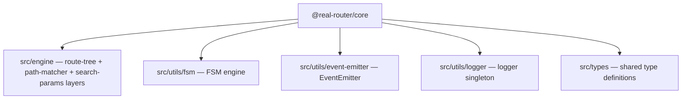

# Architecture

> Detailed core package architecture for contributors. See [root ARCHITECTURE.md](../../ARCHITECTURE.md) for system-level overview.

## Overview

`@real-router/core` is the **main package** — a facade over 9 namespaces with FSM-driven lifecycle, plugin system, and tree-shakeable standalone API functions. All state transitions go through a finite state machine; all events flow through a typed event emitter.

**Key role:** Router.ts is a thin facade that validates inputs and delegates to namespaces. No business logic in the facade. Standalone API functions (`getRoutesApi`, `getPluginApi`, etc.) access internals via a `WeakMap` registry — enabling tree-shaking without exposing private state.

## Package Structure

```
core/
├── src/
│   ├── index.ts                     — Public API barrel
│   ├── Router.ts                    — Facade class
│   ├── createRouter.ts              — Factory function
│   ├── getNavigator.ts              — Navigator factory (WeakMap-cached)
│   ├── RouterError.ts               — Typed error class
│   ├── constants.ts                 — Error codes, events, limits
│   ├── internals.ts                 — WeakMap registry for API functions
│   ├── transitionPath.ts            — Transition path calculation (reads route param-source meta via a RouteMetaLookup callback → getMetaForState, #1548)
│   ├── helpers.ts                   — Utility functions
│   ├── guards.ts                    — Input guards (deps, routes) + logger-config assertion
│   ├── routerFSM.ts                 — Router FSM config (states, events, payloads)
│   ├── validation.ts                — @real-router/core/validation subpath (plugin's door to the engine, #1301)
│   ├── types/                       — Public + internal types (the /types subpath + augmentation site)
│   │
│   ├── engine/                      — Merged routing engine: route-tree + path-matcher + search-params layers (#1510)
│   │
│   ├── namespaces/
│   │   ├── RoutesNamespace/         — Route tree, path operations, forwarding
│   │   ├── StateNamespace/          — State storage (current, previous)
│   │   ├── NavigationNamespace/     — navigate(), navigateToNotFound(), transition pipeline
│   │   ├── EventBusNamespace/       — FSM + EventEmitter, subscribe
│   │   ├── PluginsNamespace/        — Plugin lifecycle
│   │   ├── RouteLifecycleNamespace/ — canActivate/canDeactivate guards
│   │   ├── RouterLifecycleNamespace/— start/stop
│   │   ├── OptionsNamespace/        — Router options (immutable)
│   │   └── DependenciesNamespace/   — DI store
│   │
│   ├── wiring/
│   │   ├── wireNamespaces.ts        — wire* functions: namespace cross-references
│   │   └── types.ts                — NamespaceBag (shared wiring input)
│   │
│   ├── api/
│   │   ├── getRoutesApi.ts          — Route CRUD (add/remove/update/replace/clear)
│   │   ├── getDependenciesApi.ts    — Dependency CRUD
│   │   ├── getLifecycleApi.ts       — Guard management
│   │   ├── getPluginApi.ts          — Plugin management
│   │   └── cloneRouter.ts           — SSR cloning
│   │
│   └── utils/                       — Internal folded-in modules (NOT external deps)
│       ├── event-emitter/          — EventEmitter (folded from @real-router/event-emitter)
│       ├── fsm/                    — FSM engine (folded from @real-router/fsm)
│       └── logger/                 — logger singleton
```

(SSR/SSG/hydration helpers are no longer under `src/utils` — they were extracted to the separate `@real-router/ssr-utils` package, #1543.)

## Internal Modules

Core has **zero runtime `dependencies`** — the former sibling packages were folded in and now live under `src/` (engine-merge #1510 + foundation-dissolution). They are internal modules, not workspace deps:


```mermaid
graph TD
    CORE["@real-router/core"] --> ENGINE["src/engine — route-tree + path-matcher + search-params layers"]
    CORE --> FSM["src/utils/fsm — FSM engine"]
    CORE --> EE["src/utils/event-emitter — EventEmitter"]
    CORE --> LOG["src/utils/logger — logger singleton"]
    CORE --> TYPES["src/types — shared type definitions"]
```

| Internal module             | What it provides                               | Used by                                  |
| --------------------------- | ---------------------------------------------- | ---------------------------------------- |
| **src/engine**              | `createMatcher()`, tree ops, query parse       | `RoutesNamespace` (path matching, build) |
| **src/utils/fsm**           | `FSM` class                                    | `EventBusNamespace` (router lifecycle)   |
| **src/utils/event-emitter** | `EventEmitter` class                           | `EventBusNamespace` (event dispatch)     |
| **src/utils/logger**        | `logger` singleton                             | Warning/error logging across namespaces  |
| **src/types**               | Shared type definitions (the `/types` subpath) | All modules                              |

(The only workspace reference in `package.json` is a **dev**Dependency on `@real-router/ssr-utils` for SSR-helper tests — there are no runtime `dependencies`.)

## Facade + Namespaces Pattern

```
Router.ts (facade — validates and delegates)
    │
    ├── OptionsNamespace          — immutable options store
    ├── DependenciesStore         — DI container (plain data interface)
    ├── StateNamespace            — current/previous state, makeState(), deep freeze
    ├── RoutesNamespace           — route tree, matchPath(), buildPath(), forwarding
    ├── RouteLifecycleNamespace   — canActivate/canDeactivate guard registry
    ├── PluginsNamespace          — plugin lifecycle (factory → instance → hooks)
    ├── NavigationNamespace       — navigate(), navigateToNotFound(), transition pipeline
    ├── EventBusNamespace         — FSM + EventEmitter encapsulation
    └── RouterLifecycleNamespace  — start(), stop()
```

**Facade pattern flow:**

1. Facade method validates inputs via `ctx.validator?.ns.fn()` (opt-in plugin pattern)
2. Delegates to namespace instance method via `getInternals(this)` (WeakMap)
3. Returns result to caller

```typescript
// Router.ts — facade
buildPath(route: string, params?: Params, search?: SearchParams): string {
  const ctx = getInternals(this);
  ctx.validator?.routes.validateBuildPathArgs(route);      // no-op if plugin absent
  ctx.validator?.navigation.validateParams(params, "buildPath");
  return ctx.buildPath(route, params, search);             // search = query channel (M2 #1548)
}
```

### WeakMap Internals Registry

Standalone API functions need access to router internals without exposing them publicly:

```typescript
// internals.ts
const internals = new WeakMap<object, RouterInternals>();

// Router constructor registers ~24 fields
registerInternals(this, {
  makeState: ...,
  matchPath: ...,
  forwardState: createInterceptable("forwardState", ..., interceptorsMap),
  buildPath: createInterceptable("buildPath", ..., interceptorsMap),
  start: createInterceptable("start", ..., interceptorsMap),
  interceptors: interceptorsMap,  // shared ref — plugins push/splice via getPluginApi
  // ... ~24 fields total
});

// api/getRoutesApi.ts
export function getRoutesApi(router: Router): RoutesApi {
  const ctx = getInternals(router);  // access via WeakMap
  return { add: ..., remove: ..., replace: ... };
}
```

**Why WeakMap?** No public exposure of private state. GC-safe. Tree-shakeable.

### Wiring System

Namespaces are constructed independently, then wired via **dependency-bundle injection** — plain `wire*` functions over a shared `NamespaceBag`:

```typescript
// wireNamespaces.ts
function wireNamespaces(ns: NamespaceBag) {
  const compileFactory = createCompileFactory(ns); // shared by guards + plugins
  const getValidator = () => getInternals(ns.router).validator; // shared, never throws (#1331)
  wireLimits(ns); // dependenciesStore + eventBus get limits
  wireRouteLifecycle(ns, compileFactory, getValidator); // guard registry
  wireRoutes(ns); // routes get guard registration + state accessors
  wirePlugins(ns, compileFactory, getValidator); // plugins get addEventListener + canNavigate
  wireNavigation(ns); // navigation gets state, routes, eventBus, ...
  wireRouterLifecycle(ns); // start/stop get navigate, matchPath, ...
  wireState(ns); // state gets defaultParams, buildPath, getUrlParams, getQueryParams
}
```

**Call order is arbitrary (#1331).** No `wire*` function runs user code or eagerly reads another namespace's deps, so there is no ordering constraint between them. (`wireLimits` is the one eager _write_ — it hands the frozen limits object to dependenciesStore/eventBus; the rest only store deps-closures.) The initial-route guard factories that once forced "RouteLifecycle before Routes" are now flushed separately, from the constructor's `flushPendingGuards()` call after all wiring completes. (Before #1334 this was a `RouterWiringBuilder` class + `wireRouter` director; a builder that built nothing for one call-site collapsed into these functions.)

## FSM → Event Bridge

FSM actions trigger event emission. Registered in `EventBusNamespace.#setupFSMActions()`:

```typescript
fsm.on("STARTING", "STARTED", () => emitter.emit("$start"));
fsm.on("READY", "STOP", () => emitter.emit("$stop"));
fsm.on("READY", "NAVIGATE", (p) =>
  emitter.emit("$$start", p.toState, p.fromState),
);
fsm.on("TRANSITION_STARTED", "LEAVE_APPROVE", (p) =>
  emitter.emit("$$leaveApprove", p.toState, p.fromState),
);
fsm.on("LEAVE_APPROVED", "COMPLETE", (p) =>
  emitter.emit("$$success", p.state, p.fromState, p.opts),
);
fsm.on("TRANSITION_STARTED", "CANCEL", (p) =>
  emitter.emit("$$cancel", p.toState, p.fromState),
);
// FAIL actions on STARTING, READY, TRANSITION_STARTED, LEAVE_APPROVED → emitter.emit("$$error", ...)
```

**`send*` vs `emit*` naming convention** in `EventBusNamespace`:

- `send*` — routes through FSM (triggers FSM transition, FSM action emits event)
- `emit*` — emits directly to EventEmitter (bypasses FSM)

## Navigation Pipeline

### navigate() Flow

```
 router.navigate(name, params, search, opts)
           │
           ▼
┌──────────────────────┐
│  Validate arguments  │  validateNavigateArgs() + validateNavigationOptions()
│  (skipped if         │
│   noValidate=true)   │
└──────────┬───────────┘
           │
           ▼
┌──────────────────────┐
│  Check canNavigate() │  FSM canSend("NAVIGATE") → false = ROUTER_NOT_STARTED
└──────────┬───────────┘
           │
           ▼
┌──────────────────────┐
│  Build target state  │  buildNavigateState() (single-pass: forwardState + buildPath + makeState)
│  + force replace     │  forceReplaceFromUnknown(opts, fromState)
│  + SAME_STATES check │  fromState.path === toState.path — canonical path comparison
└──────────┬───────────┘
           │
           ▼
┌──────────────────────┐
│  Cancel in-flight    │  if TRANSITION_STARTED: abort prev controller, send CANCEL
└──────────┬───────────┘
           │
           ▼
┌──────────────────────┐
│  AbortController     │  new AbortController() + link external opts.signal
└──────────┬───────────┘
           │
           ▼
┌──────────────────────┐
│  FSM send(NAVIGATE)  │  → TRANSITION_STARTED → emitTransitionStart(toState, fromState)
└──────────┬───────────┘
           │
           ▼
┌──────────────────────┐
│  Deactivation guards │  for each segment in toDeactivate (innermost → outermost):
│                      │    guardFn(toState, fromState, signal)
│                      │    false → RouterError(CANNOT_DEACTIVATE)
└──────────┬───────────┘
           │
           ▼
┌──────────────────────┐
│  LEAVE_APPROVED      │  FSM send(LEAVE_APPROVE) → emit $$leaveApprove
│                      │    → subscribeLeave() callbacks fire (sync or async)
│                      │    listeners receive { route, nextRoute, signal: AbortSignal }
│                      │    async listeners block pipeline (Promise.allSettled)
│                      │    route state has NOT changed yet
└──────────┬───────────┘
           │
           ▼
┌──────────────────────┐
│  Activation guards   │  for each segment in toActivate (outermost → innermost):
│                      │    guardFn(toState, fromState, signal)
│                      │    false → RouterError(CANNOT_ACTIVATE)
└──────────┬───────────┘
           │
           ▼
┌──────────────────────┐
│  Cleanup deactivated │  clearCanDeactivate() for inactive segments
└──────────┬───────────┘
           │
           ▼
┌──────────────────────┐
│  Build TransitionMeta│  { reload?, replace?, redirected?, phase, from, reason, segments }
│  + deep freeze       │
└──────────┬───────────┘
           │
           ▼
┌──────────────────────┐
│  setState()          │  state.set(finalState)
│  FSM send(COMPLETE)  │  → READY → emitTransitionSuccess(state, fromState, opts)
└──────────┬───────────┘
           │
           ▼
  Promise resolves with finalState
```

### Error Routing

Errors during navigation are routed through two different paths depending on FSM state:

| Path            | Method                  | When                                                       | Effect                                   |
| --------------- | ----------------------- | ---------------------------------------------------------- | ---------------------------------------- |
| **Via FSM**     | `sendFail()` → FSM FAIL | FSM is in READY or TRANSITION_STARTED                      | FSM transitions → action emits `$$error` |
| **Direct emit** | `emitTransitionError()` | Error before FSM transition (ROUTE_NOT_FOUND, SAME_STATES) | Emits directly, FSM state unchanged      |

The branching logic lives in `EventBusNamespace.sendFailSafe()`. When an error occurs before `startTransition()`, `sendFailSafe()` checks `isReady()`: if READY — routes through FSM; if TRANSITION_STARTED — emits directly to avoid disturbing the ongoing transition. The wiring's `emitTransitionError` closure merely delegates to it.

### navigateToNotFound() — Pipeline Bypass

`navigateToNotFound(path?)` is **synchronous**. Bypasses the entire navigate() pipeline:

1. Check `isActive()` → throw ROUTER_NOT_STARTED if false
2. Resolve path → `path ?? currentState.path`
3. Build UNKNOWN_ROUTE state + deep freeze
4. `setState()` directly (no FSM transition)
5. `emitTransitionSuccess(state, fromState, { replace: true })`
6. Return State synchronously

**No guards, no FSM transition, no AbortController.** Only `TRANSITION_SUCCESS` is emitted (no `TRANSITION_START`). Plugin authors must not assume every `onTransitionSuccess` is preceded by `onTransitionStart`.

### Transition Path Calculation

`getTransitionPath(toState, fromState)` determines which route segments to deactivate and activate:

```typescript
// users.profile → admin.dashboard
{ intersection: "", toDeactivate: ["users.profile", "users"], toActivate: ["admin", "admin.dashboard"] }

// users.list → users.profile
{ intersection: "users", toDeactivate: ["users.list"], toActivate: ["users.profile"] }
```

**`nameToIDs()` fast paths:** Optimized for 0-4 segments via `indexOf()`-based scanning (avoids `split()`). 5+ segments use general path.

**Single-entry cache:** `getTransitionPath()` caches the last result by reference equality — eliminates N-1 redundant computations when `shouldUpdateNode()` calls it N times per navigation.

### Cancellation

```
User signal (opts.signal)  ──┐
Concurrent navigation  ──────┤──→  internal AbortController.abort()
router.stop()  ──────────────┤      │
router.dispose()  ───────────┘      ▼
                               Guard receives signal as 3rd param
                               AbortError auto-converted to TRANSITION_CANCELLED
```

**Fire-and-forget safety:** `navigate()`, `navigateToDefault()`, and the `navigateToState()` plugin primitive internally attach `.catch()` to suppress expected errors (`SAME_STATES`, `TRANSITION_CANCELLED`, `ROUTER_NOT_STARTED`, `ROUTE_NOT_FOUND`, `CANNOT_ACTIVATE`, `CANNOT_DEACTIVATE`). A guard block is an expected outcome, not an internal error — `await` the call (or subscribe via an `onTransitionError` plugin) to observe a guard rejection.

**Atomicity:** **State change is atomic** — `router.getState()` updates in one step via `completeTransition`. Either the full pipeline completes or nothing changes. However, the transition pipeline now has an observable intermediate phase: after deactivation guards pass and before activation guards run, the FSM enters `LEAVE_APPROVED`. This is the moment for safe side-effects — scroll preservation, fetch abort, analytics. Route state has not yet changed.

## Plugin System

Plugin hooks are bound to router events via `addEventListener()`:

| Plugin method              | Router event     | When                                          |
| -------------------------- | ---------------- | --------------------------------------------- |
| `onStart`                  | `$start`         | `router.start()` succeeds                     |
| `onStop`                   | `$stop`          | `router.stop()` called                        |
| `onTransitionStart`        | `$$start`        | Navigation begins                             |
| `onTransitionLeaveApprove` | `$$leaveApprove` | Deactivation guards passed, before activation |
| `onTransitionSuccess`      | `$$success`      | Navigation completes                          |
| `onTransitionError`        | `$$error`        | Navigation fails                              |
| `onTransitionCancel`       | `$$cancel`       | Navigation cancelled                          |

**Note:** `onTransitionSuccess` can fire without a preceding `onTransitionStart` — via `navigateToNotFound()`.

### Interception

Plugins intercept router methods via `addInterceptor()` on `PluginApi`:

| Interceptable method | Used by                                                                                                          |
| -------------------- | ---------------------------------------------------------------------------------------------------------------- |
| `start`              | browser-plugin, hash-plugin, navigation-plugin (path-optional); ssr-data-plugin, rsc-server-plugin (SSR loaders) |
| `buildPath`          | persistent-params-plugin                                                                                         |
| `forwardState`       | persistent-params-plugin                                                                                         |

Multiple interceptors per method execute in **LIFO** order (last-registered wraps first). Each receives `next` plus the method's arguments. Chains stored in `RouterInternals.interceptors` (`Map<string, InterceptorFn[]>`).

### Router Extension

`extendRouter(extensions)` on `PluginApi` assigns properties directly to the router instance. Conflict detection is atomic — all keys checked before any assigned. Throws `RouterError(PLUGIN_CONFLICT)` on collision. Extensions tracked in `RouterInternals.routerExtensions` for cleanup on unsubscribe or `dispose()`.

## Guards

### Guard Origin Tracking

`RouteLifecycleNamespace` tracks guard origins via **four `Map` collections** split by origin × phase — `#definitionActivateFactories`, `#externalActivateFactories`, `#definitionDeactivateFactories`, `#externalDeactivateFactories`:

- **Definition guards** — from route config (`canActivate`/`canDeactivate` in a route definition), stored in the `#definition*Factories` Maps
- **External guards** — registered via `getLifecycleApi().addActivateGuard()` / `addDeactivateGuard()`, stored in the `#external*Factories` Maps

Resolution is **external-wins regardless of registration order**: when a route holds both, the compiled slot is the external guard. `clearDefinitionGuards()` (run by `replace()`) clears only the two definition Maps and recompiles the compiled slot from the surviving external factory, so external guards survive route replacement (#1174/#1192).

### Segment Cleanup After Deactivation

After successful navigation, a deactivated segment's **external** (component-managed) `canDeactivate` guard is automatically cleaned up — the router5 mount/unmount contract, where a guard added via `getLifecycleApi().addDeactivateGuard()` is dropped once its component leaves. Only segments that are fully deactivated (not re-activated) are cleared, and only the **external** slot: a **definition** guard from route config survives the leave, so re-entry stays guarded — symmetric with definition `canActivate`, which lives as long as the route is in the tree (#1171). Uses `Array.includes()` instead of `Set` — faster for 1-5 elements.

## Dispose Lifecycle

`router.dispose()` — idempotent, safe to call multiple times. Cleanup order:

1. Abort current navigation
2. Cancel transition if running
3. Stop router (if READY or TRANSITION_STARTED)
4. FSM → DISPOSED (terminal state)
5. Clear event listeners
6. Dispose plugins (remove listeners + call `teardown()`)
7. Clean up remaining router extensions, context claims, and interceptors (per-plugin safety nets — #1199)
8. Clear routes + lifecycle guards
9. Reset state
10. Clear dependencies
11. Replace mutating methods with `throwDisposed()`

## Clone Router (SSR)

`cloneRouter(router, deps?)` creates an isolated instance for server-side rendering:

| What              | How cloned                                         |
| ----------------- | -------------------------------------------------- |
| Route definitions | Extracted via `routeTreeToDefinitions()`, re-built |
| Route config      | Shallow-copied (`Object.assign` for each map)      |
| Options           | Shallow-copied via spread                          |
| Dependencies      | Shallow-copied, then merged with user overrides    |
| All guards        | Re-registered (both definition and external)       |
| Plugins           | Re-instantiated (factories re-run)                 |
| State             | Fresh (no state — must call `start()`)             |

Route tree is re-built from definitions (not shared) — each clone has independent tree.

## Boundaries

### Namespace Rules

- Namespaces **never** call each other directly at construction time — all cross-references are wired via dependency-bundle injection in `wireNamespaces()`
- `NavigationNamespace` is the **only** namespace that orchestrates multi-namespace operations (state + routes + eventBus + lifecycle)
- `EventBusNamespace` is the **only** namespace that holds the FSM instance and EventEmitter
- `DependenciesStore` is a plain data interface — no class, no methods that call other namespaces
- Structural guards remain in namespace folders (`OptionsNamespace`, `PluginsNamespace`). DX validators live in `@real-router/validation-plugin`, accessed via `ctx.validator?.`

### Facade Rules

- Facade **never** contains business logic — only validation + delegation
- Facade validation uses `ctx.validator?.ns.fn()` — optional chaining means zero overhead when plugin is absent
- All facade methods access internals via `getInternals(this)` — never via direct namespace field access

### API Function Rules

- API functions access internals **only** via `getInternals(router)` WeakMap
- API functions **never** import namespace classes directly
- Each API function returns a frozen or plain object — never exposes `RouterInternals`

## Performance Characteristics

| Optimization                                | Purpose                                                                 |
| ------------------------------------------- | ----------------------------------------------------------------------- |
| `nameToIDs()` fast paths (0-4 segments)     | Avoids `split()` for most common route depths                           |
| Single-entry transition path cache          | N-1 redundant computations eliminated per navigation                    |
| validation-plugin opt-in                    | DX validation via `@real-router/validation-plugin` (skip in production) |
| `static #onSuppressed{Navigate,Start}Error` | One allocation per class, not per `navigate()`/`start()` call           |
| Deep freeze with WeakSet cache              | Avoids re-freezing already frozen state objects                         |
| `Array.includes()` for segment cleanup      | Faster than `new Set()` for 1-5 elements                                |
| FSM `canSend()` — O(1)                      | Cached `#currentTransitions` lookup                                     |
| `createInterceptable()` fast path           | Empty-array check skips iteration when no interceptors                  |
| Lazy event listeners                        | No allocation until first subscription                                  |
| Cached error rejections                     | Pre-allocated `Promise.reject()` for common errors                      |
| Async leave: no-abort on sync path          | AbortController.abort() skipped when all leave listeners are sync       |
| Async leave: deferred NavigationContext     | `{nav}` object created only in async branch, not on every navigate      |
| Async leave: `isCurrentNav` scoped          | Closure moved to guards block — not allocated on no-guards path         |

## Stress Test Coverage

115 stress tests across 34 `*.stress.ts` files in `tests/stress/` validate behavior under extreme conditions. The suite spans these categories (see `tests/stress/` for the current file set — per-category counts drift, so they are not enumerated here):

| Category              | What they verify                                                            |
| --------------------- | --------------------------------------------------------------------------- |
| Memory & leaks        | Heap stable across thousands of navigations; dispose releases all resources |
| Concurrent navigation | Fire-and-forget storm, AbortController churn, mixed concurrent operations   |
| Guards under load     | Guard execution under load, removal mid-execution, 1000+ error cycles       |
| Route CRUD            | Add/remove/replace under load, atomic replace, 1000+ route trees            |
| Lifecycle             | Rapid start/stop cycles, FSM transition correctness under churn             |
| Edge cases            | Deep forwarding chains, unknown route handling, utility function stress     |
| FSM & Events          | Event depth limits, listener cleanup, FSM state correctness                 |
| Utilities & Helpers   | Hot path utilities, navigator caching, state equality, active route checks  |

## See Also

- [root ARCHITECTURE.md](../../ARCHITECTURE.md) — system-level overview, FSM state diagram, package dependencies
- [INVARIANTS.md](INVARIANTS.md) — property-based test invariants (240+ invariants verified via fast-check)
- [src/utils/fsm/ARCHITECTURE.md](src/utils/fsm/ARCHITECTURE.md) — FSM engine
- [src/utils/event-emitter/ARCHITECTURE.md](src/utils/event-emitter/ARCHITECTURE.md) — event emitter
- [src/engine/ARCHITECTURE.md](src/engine/ARCHITECTURE.md) — merged routing engine (route tree + Segment Trie matching + query string handling)
