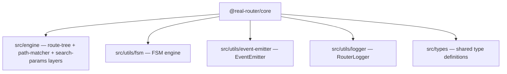

# Architecture

> Detailed core package architecture for contributors. See [root ARCHITECTURE.md](../../ARCHITECTURE.md) for system-level overview.

## Overview

`@real-router/core` is the **main package** — a facade over 9 namespaces with FSM-driven lifecycle, plugin system, and tree-shakeable standalone API functions. All state transitions go through a finite state machine; all events flow through a typed event emitter.

**Key role:** Router.ts is a thin facade that validates inputs and delegates to namespaces. No business logic in the facade. Standalone API functions (`getRoutesApi`, `getPluginApi`, etc.) access internals via a `WeakMap` registry — enabling tree-shaking without exposing private state.

## Package Structure

```
core/
├── src/
│   ├── index.ts                     — Public API barrel
│   ├── Router.ts                    — Facade class
│   ├── createRouter.ts              — Factory function
│   ├── getNavigator.ts              — Navigator factory (WeakMap-cached)
│   ├── RouterError.ts               — Typed error class
│   ├── constants.ts                 — Error codes, events, limits
│   ├── internals.ts                 — WeakMap registry for API functions
│   ├── transitionPath.ts            — Transition path calculation (reads route param-source meta via a RouteMetaLookup callback → getMetaForState)
│   ├── helpers.ts                   — Merge, comparison and state-freeze semantics
│   ├── limits.ts                    — createLimits() (per-router handler/listener caps)
│   ├── guards.ts                    — Input guards (deps, routes) + logger-config assertion
│   ├── routerFSM.ts                 — Router FSM config (states, events, payloads)
│   ├── validation.ts                — @real-router/core/validation subpath (plugin's door to the engine)
│   ├── types/                       — Public + internal types (the /types subpath + augmentation site)
│   │
│   ├── engine/                      — Routing engine: route-tree + path-matcher + search-params layers
│   │
│   ├── pipeline/                    — Navigation delivery: canonicalize → buildURL / materialize over the opaque `Canonical`
│   │
│   ├── channels/                    — Channel correctness: the always-on guard + the registration check + the mode gate (one rule, one place)
│   │
│   ├── namespaces/
│   │   ├── RoutesNamespace/         — Route tree, path operations, forwarding
│   │   ├── StateNamespace/          — State service (the pair lives in RouterFSMContext)
│   │   ├── NavigationNamespace/     — navigate(), navigateToNotFound(), transition pipeline
│   │   ├── EventBusNamespace/       — FSM + EventEmitter, subscribe
│   │   ├── PluginsNamespace/        — Plugin lifecycle
│   │   ├── RouteLifecycleNamespace/ — canActivate/canDeactivate guards
│   │   ├── RouterLifecycleNamespace/— start()
│   │   ├── OptionsNamespace/        — Router options (immutable)
│   │   └── DependenciesNamespace/   — DI store
│   │
│   ├── wiring/
│   │   ├── wireNamespaces.ts        — wire* functions: namespace cross-references
│   │   └── types.ts                — NamespaceBag (shared wiring input)
│   │
│   ├── api/
│   │   ├── getRoutesApi.ts          — Route CRUD (add/remove/update/replace/clear)
│   │   ├── getDependenciesApi.ts    — Dependency CRUD
│   │   ├── getLifecycleApi.ts       — Guard management
│   │   ├── getPluginApi.ts          — Plugin management
│   │   └── cloneRouter.ts           — SSR cloning
│   │
│   └── utils/                       — Generic engines, internal (NOT external deps)
│       ├── event-emitter/          — Typed EventEmitter with central listener-error isolation
│       ├── fsm/                    — FSM engine: the table interpreter routerFSM.ts configures
│       └── logger/                 — RouterLogger — one instance per router
```

SSR/SSG/hydration helpers live in the separate `@real-router/ssr-utils` package, not here — core stays a pure router with no SSR-specific surface.

## Internal Modules

Core has **zero runtime `dependencies`**. Everything it is built on lives under `src/` as an internal module, not as a workspace dep:


```mermaid
graph TD
    CORE["@real-router/core"] --> ENGINE["src/engine — route-tree + path-matcher + search-params layers"]
    CORE --> FSM["src/utils/fsm — FSM engine"]
    CORE --> EE["src/utils/event-emitter — EventEmitter"]
    CORE --> LOG["src/utils/logger — RouterLogger"]
    CORE --> TYPES["src/types — shared type definitions"]
```

| Internal module             | What it provides                               | Used by                                  |
| --------------------------- | ---------------------------------------------- | ---------------------------------------- |
| **src/engine**              | `createMatcher()`, tree ops, query parse       | `RoutesNamespace` (path matching, build) |
| **src/utils/fsm**           | `FSM` class                                    | `EventBusNamespace` (router lifecycle)   |
| **src/utils/event-emitter** | `EventEmitter` class                           | `EventBusNamespace` (event dispatch)     |
| **src/utils/logger**        | `RouterLogger` class — one instance per router | Warning/error logging across namespaces  |
| **src/types**               | Shared type definitions (the `/types` subpath) | All modules                              |

(The only workspace reference in `package.json` is a **dev**Dependency on `@real-router/ssr-utils` for SSR-helper tests — there are no runtime `dependencies`.)

## Facade + Namespaces Pattern

```
Router.ts (facade — validates and delegates)
    │
    ├── OptionsNamespace          — immutable options store
    ├── DependenciesStore         — DI container (plain data interface)
    ├── StateNamespace            — makeState(), deep freeze; the committed pair is owned by the FSM context
    ├── RoutesNamespace           — route tree, matchPath(), buildPath(), forwarding
    ├── RouteLifecycleNamespace   — canActivate/canDeactivate guard registry
    ├── PluginsNamespace          — plugin lifecycle (factory → instance → hooks)
    ├── NavigationNamespace       — navigate(), navigateToNotFound(), transition pipeline
    ├── EventBusNamespace         — FSM + EventEmitter encapsulation
    └── RouterLifecycleNamespace  — start() (stop() is the STOP edge's update, not a method)
```

**Facade pattern flow:**

1. Facade method validates inputs via `ctx.validator?.ns.fn()` (opt-in plugin pattern)
2. Delegates to namespace instance method via `getInternals(this)` (WeakMap)
3. Returns result to caller

```typescript
// Router.ts — facade
buildPath(route: string, params?: Params, search?: SearchParams): string {
  const ctx = getInternals(this);
  ctx.validator?.routes.validateBuildPathArgs(route);      // no-op if plugin absent
  ctx.validator?.navigation.validateParams(params, "buildPath");
  return ctx.buildPath(route, params, search);             // search = query channel
}
```

### WeakMap Internals Registry

Standalone API functions need access to router internals without exposing them publicly:

```typescript
// internals.ts
const internals = new WeakMap<object, RouterInternals>();

// Router constructor registers the internals bag
registerInternals(this, {
  makeState: ...,
  matchPath: ...,
  forwardState: createInterceptable("forwardState", ..., interceptorsMap),
  buildPath: createInterceptable("buildPath", ..., interceptorsMap),
  start: createInterceptable("start", ..., interceptorsMap),
  interceptors: interceptorsMap,  // shared ref — plugins push/splice via getPluginApi
  // ... the rest of the bag
});

// api/getRoutesApi.ts
export function getRoutesApi(router: Router): RoutesApi {
  const ctx = getInternals(router);  // access via WeakMap
  return { add: ..., remove: ..., replace: ... };
}
```

**Why WeakMap?** No public exposure of private state. GC-safe. Tree-shakeable.

### Wiring System

Namespaces are constructed independently, then wired via **dependency-bundle injection** — plain `wire*` functions over a shared `NamespaceBag`:

```typescript
// wireNamespaces.ts
function wireNamespaces(ns: NamespaceBag) {
  const compileFactory = createCompileFactory(ns); // shared by guards + plugins
  const getValidator = () => getInternals(ns.router).validator; // shared, never throws
  wireLimits(ns); // dependenciesStore + eventBus get limits
  wireRouteLifecycle(ns, compileFactory, getValidator); // guard registry
  wireRoutes(ns); // routes get guard registration + state accessors
  wirePlugins(ns, compileFactory, getValidator); // plugins get addEventListener + canNavigate
  wireNavigation(ns); // navigation gets state, routes, eventBus, ...
  wireRouterLifecycle(ns); // start/stop get navigate, matchPath, ...
  wireState(ns); // state gets defaultParams, buildPath, getUrlParams, getQueryParams
}
```

**Call order is arbitrary.** No `wire*` function runs user code or eagerly reads another namespace's deps, so there is no ordering constraint between them. (`wireLimits` is the one eager _write_ — it hands the frozen limits object to dependenciesStore/eventBus; the rest only store deps-closures.) Initial-route guard factories are flushed separately, by the constructor's `flushPendingGuards()` after all wiring completes — which is what keeps "RouteLifecycle before Routes" from being a constraint on this list.

## FSM → Event Bridge

FSM actions trigger event emission. Registered in `EventBusNamespace.#setupFSMActions()`:

```typescript
fsm.on("STARTING", "STARTED", () => emitter.emit("$start"));
fsm.on("READY", "STOP", () => emitter.emit("$stop"));

// NAVIGATE is registered on THREE states, and two of them never fire — the
// self-loops are a permission bit read through canSend(), not a transition
// (see the edge taxonomy above routerTransitions in routerFSM.ts).
fsm.on("READY", "NAVIGATE", (p) =>
  emitter.emit("$$start", p.toState, p.fromState),
);
fsm.on("TRANSITION_STARTED", "NAVIGATE" /* same action, unreachable */);
fsm.on("LEAVE_APPROVED", "NAVIGATE" /* same action, unreachable */);

fsm.on("TRANSITION_STARTED", "LEAVE_APPROVE", (p) =>
  emitter.emit("$$leaveApprove", p.toState, p.fromState),
);
fsm.on("LEAVE_APPROVED", "COMPLETE", (p) =>
  // the caller's AbortSignal is stripped here: it is an input to the
  // navigation, not part of what was committed — but the TABLE sees it,
  // because `when: mayCommit` refuses a commit whose signal was aborted
  emitter.emit("$$success", p.toState, p.fromState, stripSignal(p.opts)),
);

// SYSTEM_COMMIT — the two commits that are NOT transitions. ONE state: both
// happen after start completed, so both commit from READY.
fsm.on("READY", "SYSTEM_COMMIT", handleSystemCommit);

// CANCEL owns the abort: it aborts the in-flight controller (waking the parked
// async pipeline) and only then emits. The target comes from
// ctx.inflightToState, not the payload — both edges are in-band only.
fsm.on("TRANSITION_STARTED", "CANCEL", handleCancel);
fsm.on("LEAVE_APPROVED", "CANCEL", handleCancel);

// FAIL — NOT on READY: everything reporting a failure from READY reports to
// observers rather than failing a transition, so it emits directly.
//
// ⚑ SPLIT BY EDGE, which is why the payload carries no `toState`. The two
// in-band registrations read ctx.inflightToState; STARTING names NONE, because
// a failed start() is not a navigation failure and reading the context there
// would surface whatever a cancelled navigation left behind (leaving the band
// through CANCEL or FAIL deliberately does not clear the field).
fsm.on("TRANSITION_STARTED", "FAIL", emitNavigationFail); // ctx.inflightToState
fsm.on("LEAVE_APPROVED", "FAIL", emitNavigationFail); //     ctx.inflightToState
fsm.on("STARTING", "FAIL", (p) => emitter.emit("$$error", undefined, ...));
```

13 registrations, 11 of them reachable. The unreachable two are the NAVIGATE
self-loops above: they are read through `canSend()`, and their DECLARATION is
what makes supersede legal — so they are load-bearing precisely while never
firing, and trace coverage is not an argument for deleting them.

**`send*` vs `emit*` naming convention** in `EventBusNamespace`:

- `send*` — routes through FSM (triggers FSM transition, FSM action emits event)
- `emit*` — emits directly to EventEmitter (bypasses FSM)

## Navigation Pipeline

### The delivery pipeline (`src/pipeline/`)

"Navigation intent → committed State + URL" is owned by one module of three primitives over one opaque type, rather than re-composed at each entry point:

```ts
canonicalize(port, name, params, search?, opts?) // ① forwardTo resolution + ③ route defaults → Canonical
buildURL(canonical, port)                        // ⑤a — the URL of that intent
materialize(canonical, opts)                     // ⑤b — the State of that intent
```

`opts.resolveForward: false` selects the LITERAL form — the route the caller NAMED, no chain, no seam — taken by `buildPath`, `isActiveRoute`'s literal arm and `makeState`.

`Canonical` carries a `unique symbol` brand that is never exported, so it cannot be fabricated outside `canonicalize` — "build a URL or a State out of un-defaulted channels" is unrepresentable, not merely discouraged. The module reaches the routes layer through a narrow port (`RouteResolver`), implemented by the router at wiring time.

**Port wiring (deliberate, measured).** The port's `resolveForward` is the interceptable `forwardState` **seam**, so the seam's channel CHECK stays in the port implementation and never inside the pipeline; its `buildPath` is the interceptable `ctx.buildPath`, because one `navigate()` runs both interceptors and reaching for the engine's matcher would silently drop `persistent-params`' `buildPath` interceptor.

**Coverage.** Every producer of a URL or a State is on the pipeline: `navigate`, `matchPath`, `canNavigateTo`, `buildNavigationState`, `buildPath`, `isActiveRoute` and `makeState` — the last is not a second terminal beside `canonicalize` but its literal form. The one deliberate exception is `navigateToNotFound`: it wraps a URL string rather than building a state from an intent, so it has no channels to canonicalise.

### navigate() Flow

```
 router.navigate(name, params, search, opts)
           │
           ▼
┌──────────────────────┐
│  Validate arguments  │  validateNavigateArgs() + validateNavigationOptions()
│  (skipped if         │
│   noValidate=true)   │
└──────────┬───────────┘
           │
           ▼
┌──────────────────────┐
│  Check canNavigate() │  FSM canSend("NAVIGATE") → false = ROUTER_NOT_STARTED
└──────────┬───────────┘
           │
           ▼
┌──────────────────────┐
│  Build target state  │  buildNavigateState() → src/pipeline: canonicalize → buildURL + materialize
│  + force replace     │  forceReplaceFromUnknown(opts, fromState)
│  + SAME_STATES check │  fromState.path === toState.path — canonical path comparison
└──────────┬───────────┘
           │
           ▼
┌──────────────────────┐
│  Cancel in-flight    │  if TRANSITION_STARTED: abort prev controller, send CANCEL
└──────────┬───────────┘
           │
           ▼
┌──────────────────────┐
│  IMMEDIATE PATH      │  !hasGuards && !suspendable → completeImmediate():
│                      │    sendLeaveApprove + completeTransition, then RETURN
│                      │    Nothing below runs. The cancellation machinery is
│                      │    not skipped here — it is ABSENT: no controller, no
│                      │    liveness closure, and the return is a bare State
└──────────┬───────────┘
           │ (suspendable or guarded)
           ▼
┌──────────────────────┐
│  AbortController     │  ADOPTED, not manufactured — allocated only when this
│                      │  navigation has guards, or (on the guard-free arc)
│                      │  only if hasLeaveListeners(). An external opts.signal
│                      │  makes a navigation suspendable without giving it
│                      │  anything to hand a signal to, so a `take()` that
│                      │  created the controller would allocate on those arcs
└──────────┬───────────┘
           │
           ▼
┌──────────────────────┐
│  FSM send(NAVIGATE)  │  → TRANSITION_STARTED → emitTransitionStart(toState, fromState)
└──────────┬───────────┘
           │
           ▼
┌──────────────────────┐
│  Deactivation guards │  for each segment in toDeactivate (innermost → outermost):
│                      │    guardFn(toState, fromState, signal)
│                      │    false → RouterError(CANNOT_DEACTIVATE)
└──────────┬───────────┘
           │
           ▼
┌──────────────────────┐
│  LEAVE_APPROVED      │  FSM send(LEAVE_APPROVE) → emit $$leaveApprove
│                      │    → subscribeLeave() callbacks fire (sync or async)
│                      │    listeners receive { route, nextRoute, signal: AbortSignal }
│                      │    async listeners block pipeline (Promise.allSettled)
│                      │    route state has NOT changed yet
└──────────┬───────────┘
           │
           ▼
┌──────────────────────┐
│  Activation guards   │  for each segment in toActivate (outermost → innermost):
│                      │    guardFn(toState, fromState, signal)
│                      │    false → RouterError(CANNOT_ACTIVATE)
└──────────┬───────────┘
           │
           ▼
┌──────────────────────┐
│  Cleanup deactivated │  clearCanDeactivate() for inactive segments
└──────────┬───────────┘
           │
           ▼
┌──────────────────────┐
│  Build TransitionMeta│  { reload?, replace?, redirected?, phase, from, reason, segments }
│  + deep freeze       │
└──────────┬───────────┘
           │
           ▼
┌──────────────────────┐
│  ask, then fire      │  canCommitTransition(commit) — may refuse
│  FSM send(COMPLETE)  │  → commit update writes the pair → READY
│                      │  → emitTransitionSuccess(state, fromState, opts)
└──────────┬───────────┘
           │
           ▼
  Promise resolves with finalState
```

### Error Routing

Errors during navigation are routed through two different paths depending on FSM state:

| Path            | Method                  | When                                                                                                                                                 | Effect                                   |
| --------------- | ----------------------- | ---------------------------------------------------------------------------------------------------------------------------------------------------- | ---------------------------------------- |
| **Via FSM**     | `sendFail()` → FSM FAIL | A transition failed: FSM is in `STARTING`, `TRANSITION_STARTED` or `LEAVE_APPROVED`                                                                  | FSM transitions → action emits `$$error` |
| **Direct emit** | `emitTransitionError()` | A REPORT to observers, not a transition failure: early refusals (ROUTE_NOT_FOUND, SAME_STATES, the P3 channel guard) and the plugin-facing primitive | Emits directly, FSM state unchanged      |

**The row is never chosen at runtime, and that is the design.** Each has a fixed set of senders: a sender that reports to observers without a transition to fail always emits directly, and it neither knows nor should decide whether one is in flight. There is no `READY --FAIL--> READY` edge for it to take, so a stale `FAIL` in `READY` is a table no-op structurally — and since the emit rides the edge's action, it emits nothing at all rather than being filtered.

### navigateToNotFound() — Pipeline Bypass

`navigateToNotFound(path?)` is **synchronous**. Bypasses the entire navigate() pipeline:

1. Check `isActive()` → throw ROUTER_NOT_STARTED if false
2. Resolve path → `path ?? currentState.path`
3. Build UNKNOWN_ROUTE state + deep freeze
4. **Ask the current route's `canDeactivate`** → throw `CANNOT_DEACTIVATE` + emit `TRANSITION_ERROR` if it refuses
5. `systemCommit()` — a `SYSTEM_COMMIT` edge that writes the committed pair and announces it as ONE table fact
6. Return State synchronously

**No ACTIVATION guards, no AbortController, and only `TRANSITION_SUCCESS` is emitted** (no `TRANSITION_START`) — plugin authors must not assume every `onTransitionSuccess` is preceded by `onTransitionStart`. Only the ACTIVATION half of "bypasses the pipeline" follows from being a 404: there is nothing to activate at `UNKNOWN_ROUTE`, but there is very much something to deactivate, and this primitive is what the URL plugins call on an unmatched Back.

### Transition Path Calculation

`getTransitionPath(toState, fromState)` determines which route segments to deactivate and activate:

```typescript
// users.profile → admin.dashboard
{ intersection: "", toDeactivate: ["users.profile", "users"], toActivate: ["admin", "admin.dashboard"] }

// users.list → users.profile
{ intersection: "users", toDeactivate: ["users.list"], toActivate: ["users.profile"] }
```

**`nameToIDs()` fast paths:** Optimized for 0-4 segments via `indexOf()`-based scanning (avoids `split()`). 5+ segments use general path.

**Single-entry cache:** `getTransitionPath()` caches the last result by reference equality — eliminates N-1 redundant computations when `shouldUpdateNode()` calls it N times per navigation.

### Cancellation

```
User signal (opts.signal)  ──┐
Concurrent navigation  ──────┤──→  internal AbortController.abort()
router.stop()  ──────────────┤      │
router.dispose()  ───────────┘      ▼
                               Guard receives signal as 3rd param
                               AbortError auto-converted to TRANSITION_CANCELLED
```

**Fire-and-forget safety:** `navigate()`, `navigateToDefault()`, and the `navigateToState()` plugin primitive internally attach `.catch()` to suppress expected errors (`SAME_STATES`, `TRANSITION_CANCELLED`, `ROUTER_NOT_STARTED`, `ROUTE_NOT_FOUND`, `CANNOT_ACTIVATE`, `CANNOT_DEACTIVATE`). A guard block is an expected outcome, not an internal error — `await` the call (or subscribe via an `onTransitionError` plugin) to observe a guard rejection.

**Only a LIVE navigation reports.** Both failure arcs in `transition/executeNavigation.ts` — the asynchronous `finishAsyncNavigation` catch and the synchronous `handleNavigateError` — check liveness before `routeTransitionError`, and restate a lost-liveness failure as `TRANSITION_CANCELLED` via `errorHandling.asCancellation` (an outcome that already carries the code passes through, keeping its `reason`). Classifying by error CODE alone would let a guard verdict belonging to an already-cancelled navigation reach FSM `FAIL` — a real edge out of `TRANSITION_STARTED`/`LEAVE_APPROVED`, so the SUPERSEDING navigation's `COMPLETE` would become a table no-op and its `TRANSITION_SUCCESS` would never fire. The two arcs answer liveness differently on purpose: the async one owns its `AbortController` and reads `signal.aborted`, the sync one cannot (the guard-free leave arc releases its controller before rethrowing) and asks `isCurrent(myId) && isTransitioning()` instead.

**Atomicity:** **State change is atomic** — `router.getState()` updates in one step via `completeTransition`. Either the full pipeline completes or nothing changes. The transition does have one observable intermediate phase: after deactivation guards pass and before activation guards run, the FSM sits in `LEAVE_APPROVED`. This is the moment for safe side-effects — scroll preservation, fetch abort, analytics. Route state has not yet changed.

## Plugin System

Plugin hooks are bound to router events via `addEventListener()`:

| Plugin method              | Router event     | When                                          |
| -------------------------- | ---------------- | --------------------------------------------- |
| `onStart`                  | `$start`         | `router.start()` succeeds                     |
| `onStop`                   | `$stop`          | `router.stop()` called                        |
| `onTransitionStart`        | `$$start`        | Navigation begins                             |
| `onTransitionLeaveApprove` | `$$leaveApprove` | Deactivation guards passed, before activation |
| `onTransitionSuccess`      | `$$success`      | Navigation completes                          |
| `onTransitionError`        | `$$error`        | Navigation fails                              |
| `onTransitionCancel`       | `$$cancel`       | Navigation cancelled                          |

**Note:** `onTransitionSuccess` can fire without a preceding `onTransitionStart` — via `navigateToNotFound()`.

### Interception

Plugins intercept router methods via `addInterceptor()` on `PluginApi`:

| Interceptable method | Used by                                                                                                          |
| -------------------- | ---------------------------------------------------------------------------------------------------------------- |
| `start`              | browser-plugin, hash-plugin, navigation-plugin (path-optional); ssr-data-plugin, rsc-server-plugin (SSR loaders) |
| `buildPath`          | persistent-params-plugin                                                                                         |
| `forwardState`       | persistent-params-plugin                                                                                         |

Multiple interceptors per method execute in **LIFO** order (last-registered wraps first). Each receives `next` plus the method's arguments. Chains stored in `RouterInternals.interceptors` (`Map<string, InterceptorFn[]>`).

### Router Extension

`extendRouter(extensions)` on `PluginApi` assigns properties directly to the router instance. Conflict detection is atomic — all keys checked before any assigned. Throws `RouterError(PLUGIN_CONFLICT)` on collision. Extensions tracked in `RouterInternals.routerExtensions` for cleanup on unsubscribe or `dispose()`.

## Guards

### Guard Origin Tracking

`RouteLifecycleNamespace` tracks guard origins via **four `Map` collections** split by origin × phase — `#definitionActivateFactories`, `#externalActivateFactories`, `#definitionDeactivateFactories`, `#externalDeactivateFactories`:

- **Definition guards** — from route config (`canActivate`/`canDeactivate` in a route definition), stored in the `#definition*Factories` Maps
- **External guards** — registered via `getLifecycleApi().addActivateGuard()` / `addDeactivateGuard()`, stored in the `#external*Factories` Maps

Resolution is **external-wins regardless of registration order**: when a route holds both, the compiled slot is the external guard. `clearDefinitionGuards()` (run by `replace()`) clears only the two definition Maps and recompiles the compiled slot from the surviving external factory, so external guards survive route replacement.

### Segment Cleanup After Deactivation

After successful navigation, a deactivated segment's **external** (component-managed) `canDeactivate` guard is automatically cleaned up — the mount/unmount contract: a guard added via `getLifecycleApi().addDeactivateGuard()` is dropped once its component leaves. Only segments that are fully deactivated (not re-activated) are cleared, and only the **external** slot: a **definition** guard from route config survives the leave, so re-entry stays guarded — symmetric with definition `canActivate`, which lives as long as the route is in the tree. Uses `Array.includes()` instead of `Set` — faster for 1-5 elements.

## Dispose Lifecycle

`router.dispose()` — idempotent, safe to call multiple times. Cleanup order:

1. Cancel the in-flight transition — the FSM `CANCEL` action aborts its controller
2. Stop the router (if READY or transitioning)
3. FSM → DISPOSED (terminal state) — **the edge's `update` zeroes the committed pair here**, before plugin teardown, so a `teardown()` reading `getPreviousState()` sees `undefined`
4. Clear event listeners
5. Dispose plugins (remove listeners + call `teardown()`)
6. Clean up remaining router extensions, context claims, and interceptors (per-plugin safety nets)
7. Clear routes + lifecycle guards
8. Clear dependencies
9. Replace mutating methods with `throwDisposed()`

## Clone Router (SSR)

`cloneRouter(router, deps?)` creates an isolated instance for server-side rendering:

| What              | How cloned                                         |
| ----------------- | -------------------------------------------------- |
| Route definitions | Extracted via `routeTreeToDefinitions()`, re-built |
| Route config      | Shallow-copied (`Object.assign` for each map)      |
| Options           | Shallow-copied via spread                          |
| Dependencies      | Shallow-copied, then merged with user overrides    |
| All guards        | Re-registered (both definition and external)       |
| Plugins           | Re-instantiated (factories re-run)                 |
| State             | Fresh (no state — must call `start()`)             |

Route tree is re-built from definitions (not shared) — each clone has independent tree.

## Boundaries

### Namespace Rules

- Namespaces **never** call each other directly at construction time — all cross-references are wired via dependency-bundle injection in `wireNamespaces()`
- `NavigationNamespace` is the **only** namespace that orchestrates multi-namespace operations (state + routes + eventBus + lifecycle)
- `EventBusNamespace` is the **only** namespace that holds the FSM instance and EventEmitter
- `DependenciesStore` is a plain data interface — no class, no methods that call other namespaces
- Structural guards remain in namespace folders (`OptionsNamespace`, `PluginsNamespace`). DX validators live in `@real-router/validation-plugin`, accessed via `ctx.validator?.`

### Subsystem Rules (`src/channels`, `src/pipeline`)

- `src/channels` **never** imports a namespace, the engine or the pipeline. Declared query names arrive as DATA (`readonly string[]`, or a `queryNamesOf` accessor), so the one registry that both classifies and prints cannot grow a second derivation. **Lint-enforced** — `eslint.config.mjs` fails the import with that reason
- `src/pipeline` reaches the routes layer only through its `RouteResolver` port, implemented by the router at wiring time. Same inversion, same reason: the module stays pure and mock-testable

### Facade Rules

- Facade **never** contains business logic — only validation + delegation
- Facade validation uses `ctx.validator?.ns.fn()` — optional chaining means zero overhead when plugin is absent
- All facade methods access internals via `getInternals(this)` — never via direct namespace field access

### API Function Rules

- API functions access internals **only** via `getInternals(router)` WeakMap
- API functions **never** import namespace classes directly
- Each API function returns a frozen or plain object — never exposes `RouterInternals`

## Performance Characteristics

| Optimization                            | Purpose                                                                  |
| --------------------------------------- | ------------------------------------------------------------------------ |
| `nameToIDs()` fast paths (0-4 segments) | Avoids `split()` for most common route depths                            |
| Single-entry transition path cache      | N-1 redundant computations eliminated per navigation                     |
| validation-plugin opt-in                | DX validation via `@real-router/validation-plugin` (skip in production)  |
| Per-router suppressors, split by owner  | One allocation per router, not per `navigate()`/`start()`                |
| Deep freeze with WeakSet cache          | Avoids re-freezing already frozen state objects                          |
| `Array.includes()` for segment cleanup  | Faster than `new Set()` for 1-5 elements                                 |
| FSM `canSend()` — O(1)                  | Cached `#currentTransitions` lookup                                      |
| `createInterceptable()` fast path       | Empty-array check skips iteration when no interceptors                   |
| `canonicalize` fast-path gate: 2 reads  | One fact per side — no caller query bag, no route default on either slot |
| `store.hasAnyForward` — tree-wide gate  | isActiveRoute skips the forwardTo maps when nothing forwards             |
| Lazy event listeners                    | No allocation until first subscription                                   |
| Cached error rejections                 | Pre-allocated `Promise.reject()` for common errors                       |
| Async leave: no-abort on sync path      | AbortController.abort() skipped when all leave listeners are sync        |
| One context bag per navigation          | `NavigationPlan` IS the `NavigationContext` — no second literal          |
| Async leave: `isCurrentNav` scoped      | Closure moved to guards block — not allocated on no-guards path          |

## Stress Test Coverage

153 stress tests across 47 files in `tests/stress/` validate behavior under extreme conditions (both numbers as reported by `pnpm -F @real-router/core test:stress`, which is the authority — a `*.stress.ts` glob counts top-level files only, which is neither what the runner loads nor what it reports). The suite spans these categories (see `tests/stress/` for the current file set — per-category counts drift, so they are not enumerated here):

| Category              | What they verify                                                            |
| --------------------- | --------------------------------------------------------------------------- |
| Memory & leaks        | Heap stable across thousands of navigations; dispose releases all resources |
| Concurrent navigation | Fire-and-forget storm, AbortController churn, mixed concurrent operations   |
| Guards under load     | Guard execution under load, removal mid-execution, 1000+ error cycles       |
| Route CRUD            | Add/remove/replace under load, atomic replace, 1000+ route trees            |
| Lifecycle             | Rapid start/stop cycles, FSM transition correctness under churn             |
| Edge cases            | Deep forwarding chains, unknown route handling, utility function stress     |
| FSM & Events          | Event depth limits, listener cleanup, FSM state correctness                 |
| Utilities & Helpers   | Hot path utilities, navigator caching, state equality, active route checks  |

## See Also

- [root ARCHITECTURE.md](../../ARCHITECTURE.md) — system-level overview, FSM state diagram, package dependencies
- [INVARIANTS.md](INVARIANTS.md) — property-based test invariants (240+ invariants verified via fast-check)
- [src/utils/fsm/ARCHITECTURE.md](src/utils/fsm/ARCHITECTURE.md) — FSM engine
- [src/utils/event-emitter/ARCHITECTURE.md](src/utils/event-emitter/ARCHITECTURE.md) — event emitter
- [src/engine/ARCHITECTURE.md](src/engine/ARCHITECTURE.md) — routing engine (route tree + Segment Trie matching + query string handling)
