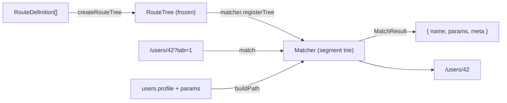

# engine — the routing engine of `@real-router/core`

> Route tree construction · URL matching · path building · route validation · query-string codec

The **engine** is the routing core of `@real-router/core` — the subsystem that turns route
definitions into an immutable tree, matches URLs to routes, builds URLs from route names, and
validates route paths. It is a self-contained, **zero-external-dependency** part of core (the
merged engine, [#1510](https://github.com/greydragon888/real-router/issues/1510)).

---

## ⚠️ Internal — not a public API

This directory is an **internal subsystem of core**, not a published package and not a public
import path.

- It has **no `package.json`** — it is bundled into `@real-router/core` at build time.
- **Do not import from `@real-router/core/engine` or a deep `src/engine/*` path.** There is no such
  public entry point. Application code uses the router through `@real-router/core` (and its
  `/api`, `/types`, `/validation` subpaths).
- The **only** in-repo consumer is core itself. `@real-router/validation-plugin` reaches the one
  engine function it needs (`validateRoute`) through core's `@real-router/core/validation`
  subpath — never by importing this directory ([#1301](https://github.com/greydragon888/real-router/issues/1301),
  enforced by a plugin-level guard test).

Everything below documents this subsystem for **core contributors**.

---

## What it is

Three routing concerns, one subsystem. The former standalone `route-tree`, `path-matcher`, and
`search-params` packages were merged here in engine-merge iteration 2 (#1510):

| Layer                 | Location            | Responsibility                                               |
| --------------------- | ------------------- | ------------------------------------------------------------ |
| **route-tree facade** | this directory root | Build the immutable `RouteTree`, tree ops, route validation  |
| **path-matcher**      | `path-matcher/`     | Segment-trie URL matching + path building (`SegmentMatcher`) |
| **search-params**     | `search-params/`    | Query-string parse/build (`parseQuery` / `build`)            |

`path-matcher` and `search-params` are **internal layers**, not workspace deps — the whole engine
is one zero-dependency subsystem. They are wired via a **dependency-injection seam**: `createMatcher`
bakes the search-params `parseQuery` / `build` functions into `SegmentMatcher`, so `path-matcher`
never imports `search-params` directly (the boundary is eslint-enforced).

## Public surface (what core imports)

Core imports only from the engine **barrel** (`index.ts`):

| Export                                                                                                       | Purpose                                                               |
| ------------------------------------------------------------------------------------------------------------ | --------------------------------------------------------------------- |
| `createRouteTree(name, path, routes)`                                                                        | Build an immutable `RouteTree` from route definitions (always frozen) |
| `createMatcher(options?)`                                                                                    | Create a `Matcher` with search-params DI baked in                     |
| `validateRoute(route, method, …)`                                                                            | Batch route validation with cross-batch duplicate detection           |
| `getSegmentsByName(tree, routeName)`                                                                         | O(1)-per-level lookup of route nodes by dot-notation name             |
| `routeTreeToDefinitions(tree)` / `nodeToDefinition(node)`                                                    | `RouteTree` → `RouteDefinition[]` (serialization / cloning)           |
| `DEFAULT_QUERY_PARAMS`                                                                                       | Default query-string options                                          |
| types: `RouteTree`, `RouteDefinition`, `Matcher`, `MatchResult`, `RouteTreeState`, `CreateMatcherOptions`, … | Engine type surface                                                   |

## Architecture at a glance



- **Two-phase build.** `createRouteTree` runs `buildTree` (mutable construction — tilde-strip +
  leading-slash normalization, [#1407](https://github.com/greydragon888/real-router/issues/1407))
  then `computeCaches` (param-meta extraction, `fullName`, `Object.freeze`).
- **Trees are immutable, always.** `createRouteTree` always freezes; `addRoute` / `replace` rebuild
  the whole tree. `paramMeta` and its arrays are frozen too (#747).
- **The matcher owns matching + building.** `createMatcher` returns a `Matcher` (backed by
  `SegmentMatcher`); `registerTree` inserts routes into the segment trie once, then `match` /
  `buildPath` / `hasRoute` serve lookups.

## Key concepts

- **3-token path grammar** — a segment is `static | :param | *splat`. There are **no** optional
  (`:x?`) or regex-constraint (`<re>`) forms; both were removed (M1). The single owner of segment
  grammar is the `parseSegment` tokenizer (`path-matcher/parseSegment.ts`).
- **Gate ↔ backstop parity** — the route-tree validation gate (`validateRoutePath`) and the matcher's
  own `registerTree` backstop read the **same** tokenizer, so they cannot drift on which paths they
  reject. Property tests lock the agreement (see `INVARIANTS.md`).
- **Zero external dependencies** — no runtime deps, no `package.json`; bundled into core.

## Directory map

```
builder/       — buildTree, computeCaches, createRouteTree (immutable tree construction)
operations/    — getSegmentsByName, routeTreeToDefinitions / nodeToDefinition
validation/    — validateRoute (batch) + validateRoutePath (path format gate)
path-matcher/  — SegmentMatcher, buildParamMeta, parseSegment, registration/ (the segment trie)
search-params/ — parseQuery / build, encoding strategies (query-string codec)
createMatcher.ts — Matcher factory (SegmentMatcher + search-params DI seam)
index.ts       — engine barrel (the surface core imports)
```

## Testing

Tests live in `packages/core/tests/engine/`:

| Tier          | What it covers                                                                                          |
| ------------- | ------------------------------------------------------------------------------------------------------- |
| `functional/` | Public-API (barrel-only) behavior — **white-box guardrail**: no deep `src/engine/*` imports (eslint §5) |
| `unit/`       | `path-matcher` / `search-params` layer-barrel tiers                                                     |
| `property/`   | Generative invariants (may import internal `src/engine/*` — exempt)                                     |
| `stress/`     | Build / round-trip throughput, deep-nesting recursion, anti-quadratic dup detection                     |

100% coverage is required (enforced in the vitest config).

## See Also

- [CLAUDE.md](CLAUDE.md) — facade-layer architecture, the full gotcha catalog, and the file map
- [ARCHITECTURE.md](ARCHITECTURE.md) — design decisions, build pipeline, and core-integration points
- [INVARIANTS.md](INVARIANTS.md) — property-based test invariants (grammar, immutability, gate↔backstop parity)
- [../../CLAUDE.md](../../CLAUDE.md) — the `@real-router/core` package architecture
