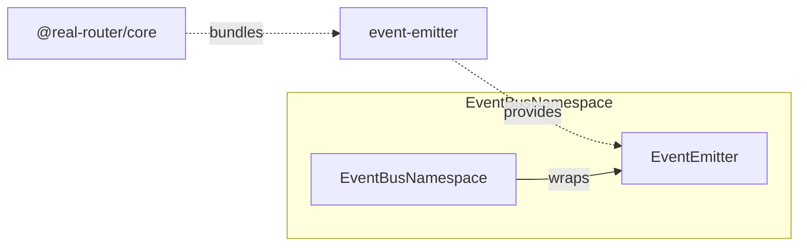

# Architecture

> Detailed architecture for AI agents and contributors

## Overview

`event-emitter` is an **internal, zero-dependency** package that provides a generic typed event emitter with listener limits, duplicate detection, re-entrancy coalescing, and per-listener error isolation.

**Key role:** All router events (start, stop, transition success/cancel/error) flow through this emitter. `@real-router/core` wraps it in `EventBusNamespace`.

## Package Structure

```
event-emitter/
├── src/
│   ├── EventEmitter.ts    — Main class: emit, on, off, re-entrancy coalescing, limits
│   ├── types.ts           — EventEmitterLimits, EventEmitterOptions, Unsubscribe
│   └── index.ts           — Public API exports
```

## Dependencies

**Zero runtime dependencies.** Uses only `Map`, `Set`, `Error`, `TypeError`.

**Consumed by:**



| Consumer              | What it uses         | Purpose                                          |
| --------------------- | -------------------- | ------------------------------------------------ |
| **EventBusNamespace** | `EventEmitter` class | Router event dispatch (start, stop, transitions) |
| **EventBusNamespace** | `Unsubscribe` type   | Return type for `addEventListener()`             |
| **Router options**    | `EventEmitterLimits` | `maxListeners`, `warnListeners`                  |

## Public API

### EventEmitter — Main Class

```typescript
class EventEmitter<TEventMap extends Record<string, unknown[]>> {
  constructor(options?: EventEmitterOptions);

  on<E extends keyof TEventMap & string>(
    eventName: E,
    cb: (...args: TEventMap[E]) => void,
  ): Unsubscribe;
  off<E extends keyof TEventMap & string>(
    eventName: E,
    cb: (...args: TEventMap[E]) => void,
  ): void;
  emit(
    eventName: keyof TEventMap & string,
    a?: unknown, b?: unknown, c?: unknown, d?: unknown,
  ): void;
  clearAll(): void;
  listenerCount(eventName: keyof TEventMap & string): number;
  isDispatching(eventName: keyof TEventMap & string): boolean;
  setLimits(limits: EventEmitterLimits): void;

  static validateCallback(
    cb: unknown,
    eventName: string,
  ): asserts cb is Function;
}
```

### Types

```typescript
interface EventEmitterLimits {
  maxListeners: number; // 0 = unlimited
  warnListeners: number; // 0 = no warning
}

interface EventEmitterOptions {
  limits?: EventEmitterLimits;
  onListenerError?: (eventName: string, error: unknown) => void;
  onListenerWarn?: (eventName: string, count: number) => void;
}

type Unsubscribe = () => void;
```

## Core Data Structures

### Internal State

```typescript
class EventEmitter<TEventMap> {
  readonly #callbacks = new Map<string, Set<AnyCallback>>();
  // Event name → Set of listeners. Lazy: Set created on first on() call.

  readonly #dispatching = new Set<string>();
  // Event names whose emit() is currently on the stack — the re-entrancy
  // coalesce guard. A re-entrant emit of a name already here is a no-op, so an
  // event never re-enters its own dispatch (depth ≤ 1). Each name self-releases
  // in emit()'s finally, so the Set never outlives its dispatch.

  #warnedEvents: Set<string> | null = null;
  // Event names that already fired onListenerWarn. Latches the warning to once
  // per emitter+event. Null until first warn; the entry is released when the
  // event's last listener is removed (off → empty Set) or on clearAll().

  #limits: EventEmitterLimits = DEFAULT_LIMITS;
  // Current limits (mutable via setLimits). Defaults to all-zero (disabled).

  readonly #onListenerError:
    | ((eventName: string, error: unknown) => void)
    | null;
  readonly #onListenerWarn: ((eventName: string, count: number) => void) | null;
}
```

**Why `Map<string, Set>`?**

- `Map`: O(1) lookup by event name
- `Set`: O(1) add/remove/has, automatic deduplication by identity

**Why `#dispatching` (the coalesce guard)?**

- A `Set<string>` of event names whose `emit()` is currently on the stack.
- `emit()` early-returns if the name is already present (**coalesce**), adds it before
  running listeners, and deletes it in a `finally`.
- So an event can never re-enter its own dispatch — recursion is structurally
  impossible (**depth ≤ 1**), with no depth bound and no stack-overflow path (#1033).
  The public `isDispatching(name)` reads this Set.

**Record lifecycle (no leak for dynamic names, #750 / #1033)**

All three per-event records (`#callbacks`, `#warnedEvents`, `#dispatching`) are released
the moment a name goes idle — `off()` deletes the listener `Set` (and warn latch) when
its last listener is removed, and `emit()` releases the `#dispatching` entry in its
`finally` when the dispatch returns (no re-entrancy, so the entry's lifetime is exactly
one dispatch). `listenerCount()` reports 0 either way, so the release is only observable
via heap — covered by `tests/stress/event-emitter.stress.ts` (S1 `#callbacks`,
S2 `#dispatching`, S3 `#warnedEvents`).

## Core Algorithms

### on() — Listener Registration (atomic: validate before mutate)

`on()` never mutates until every rejection check has passed, so a rejected registration
(duplicate, limit, or a throwing warn hook) leaves **no orphan record and no burnt latch**
(#1167 / #1168):

```typescript
on(eventName, cb) {
  // Validate-before-mutate — READ the record, do NOT create it yet.
  const set = this.#callbacks.get(eventName);            // may be undefined
  if (set?.has(cb)) throw new Error("Duplicate");        // duplicate check
  const size = set?.size ?? 0;
  if (size >= maxListeners) throw new Error("Limit reached"); // limit BEFORE warn
  // Warn once per event (latched): invoke the advisory hook BEFORE any mutation,
  // and set the latch only AFTER it returns without throwing…
  if (size === warnListeners && !this.#warnedEvents?.has(eventName)) {
    onListenerWarn?.(eventName, warnListeners);          // a throw here aborts on()…
    (this.#warnedEvents ??= new Set()).add(eventName);   // …so the latch is not burnt
  }
  // Mutate LAST: create the record (if absent) and add the listener. A rejection
  // above never allocated a Set nor touched the latch (atomic).
  const record = set ?? new Set();
  if (set === undefined) this.#callbacks.set(eventName, record);
  record.add(cb);
  return () => this.off(eventName, cb);                  // unsubscribe closure
}
```

### off() — Listener Removal

```typescript
off(eventName, cb) {
  const set = this.#callbacks.get(eventName);
  if (!set) return;                        // idempotent: no-op if event unknown
  set.delete(cb);                          // idempotent: no-op if cb not registered
  if (set.size === 0) {
    // Release the record once the last listener is gone, so consumers with
    // dynamic event names don't accumulate empty Sets unbounded (#750).
    this.#callbacks.delete(eventName);
    this.#warnedEvents?.delete(eventName); // warn latch released with the Set
  }
}
```

### emit() — Single-Path Dispatch (re-entrancy coalescing)

`emit()` is a **single** path — no dual dispatch, no separate depth-tracked branch. It
coalesces a re-entrant same-event emit, adds the name to `#dispatching`, runs the
listeners inside `try`, and releases the name in `finally`:

```
emit(eventName, a?, b?, c?, d?)
    │
    ├── argc = arguments.length - 1   // O(1) in V8 strict mode
    ▼
┌───────────────┐
│  Get Set      │  callbacks.get(eventName)
│  Empty check  │  → !set || size === 0 → return (fast exit)
└──────┬────────┘
       ▼
┌────────────────────────────────────────────┐
│  Coalesce: #dispatching.has(eventName)?     │
│  ├── YES → return (re-entrant no-op)        │
│  └── NO  → #dispatching.add(eventName)      │
└──────┬──────────────────────────────────────┘
       ▼
   dispatch, inside try / finally:
     • size === 1 → direct call (skip [...set] snapshot)
     • size  > 1  → iterate a [...set] snapshot
     • each listener in try/catch → onListenerError
   finally → #dispatching.delete(eventName)   // self-release
```

**Why coalesce?** Emitting an event that is already being dispatched (a listener that
synchronously re-emits the **same** event) is skipped — a no-op. So an event can never
re-enter its own dispatch, and recursion is structurally impossible (**depth ≤ 1**): no
depth bound, no `RecursionDepthError`, no stack-overflow path (#1033). The name is added
to `#dispatching` before listeners run and removed in the `finally`, so it self-releases
on **both** normal and abnormal exit.

**Single-listener fast path.** Inside this one path, `set.size === 1` calls the listener
directly, skipping the `[...set]` snapshot allocation. Single-subscriber events (the
common router case) get the shortcut on every emit.

**Why explicit params instead of `...args`?** V8 always materializes an array for rest
parameters, even when empty. With `(a?, b?, c?, d?)`, V8 passes `undefined` — zero
allocation. This eliminates one array allocation per `emit()` call (~5ns saved).

### #callListener() — Argument Dispatch

```typescript
switch (argc) {
  case 0: cb(); break;
  case 1: cb(a); break;
  case 2: cb(a, b); break;
  case 3: cb(a, b, c); break;
  default: cb(a, b, c, d);
}
```

Direct calls for 0-4 args by `argc` count — monomorphic call sites, V8 optimizes well. No `Function.prototype.apply` fallback needed (router uses max 3 args for `$$success`).

## Snapshot Iteration

`emit()` creates a snapshot `[...set]` before iterating (when `set.size > 1`):

- Listener **added** during emit → NOT called in current emit
- Listener **removed** during emit → STILL called (already in snapshot)
- **Single listener** → no snapshot, direct call from `set` (optimization: avoids array allocation) — the single-listener fast path inside the one dispatch path

Standard pattern in event systems (DOM, Node.js EventEmitter).

## Error Isolation

Per-listener isolation with one carve-out for a throwing error hook:

| Level                          | Behavior                                                                                                                                               |
| ------------------------------ | ------------------------------------------------------------------------------------------------------------------------------------------------------ |
| Per-listener `try/catch`       | Each listener call is isolated — one throwing doesn't stop the others; the error is forwarded to `onListenerError`. There is **no re-thrown sentinel** |
| `onListenerError` callback     | Called once per listener throw with `(eventName, error)`; if absent, the error is silently swallowed                                                    |
| `onListenerError` itself throws (#1165) | The throw **propagates and aborts the rest of the snapshot** (subsequent listeners do not run); `emit()`'s `finally` still releases the `#dispatching` guard on this abnormal exit |

## Limits System

| Limit           | Default | Per-event? | Behavior when exceeded              |
| --------------- | ------- | ---------- | ----------------------------------- |
| `maxListeners`  | 0 (off) | Yes        | `on()` throws Error                 |
| `warnListeners` | 0 (off) | Yes        | `onListenerWarn()` called, no throw |

- **0 = disabled** for both limits
- `maxListeners` checks `set.size >= limit` and throws **before** the warn check — a registration that hits the limit never warns
- `warnListeners` fires when `set.size === threshold`, latched to **exactly once per emitter+event** (off/on churn does not re-fire; `clearAll()` resets the latch). The advisory hook runs **before** the latch is set, so a hook that throws aborts `on()` without burning the latch (#1168)

Re-entrancy is **not** a limit — coalescing is the dispatch model (always on), not an opt-in bound. See the **emit() — Single-Path Dispatch** section above.

## Usage in @real-router/core

### Router Event Map

```typescript
type RouterEventMap = {
  $start: [];
  $stop: [];
  $$start: [toState, fromState?];
  $$success: [toState, fromState?, opts?];
  $$error: [toState?, fromState?, error?];
  $$cancel: [toState, fromState?];
};
```

### EventBusNamespace Wrapper

```typescript
// Construction
const emitter = new EventEmitter<RouterEventMap>({
  onListenerError: (name, error) => logger.error(...),
  onListenerWarn: (name, count) => logger.warn(...),
});

// Emit (called from FSM actions)
emitter.emit("$$success", toState, fromState, opts);

// Subscribe (exposed via router API)
emitter.on("$$success", callback);  // → Unsubscribe
```

### Limits from Router Options

```typescript
createRouter(routes, {
  limits: {
    maxListeners: 10_000, // per event
    warnListeners: 1_000, // warning threshold
  },
});
```

## Performance Characteristics

| Operation                | Time    | Notes                                |
| ------------------------ | ------- | ------------------------------------ |
| `emit()` — no listeners  | ~5.8 ns | Early return, zero work              |
| `emit()` — 1 listener    | ~30 ns  | Direct call, no snapshot (single-listener fast path) |
| `emit()` — 10 listeners  | ~90 ns  | Linear: ~18 ns + 5.5 ns per listener |
| `emit()` — 100 listeners | ~565 ns | Same linear scaling                  |
| `on()` + `off()` cycle   | ~56 ns  | Single listener add/remove           |

**Scaling model:** `emit(3 args, N listeners) ~ 18 ns + 5.5 ns * N`

### Memory

| Allocation          | Size          | When                                  |
| ------------------- | ------------- | ------------------------------------- |
| Snapshot `[...set]` | ~8 B/listener | Every emit with 2+ listeners (single-listener fast path skips it) |
| Closure per `on()`  | ~200 B        | Once per subscription                 |
| `emit()` args       | **0 B**       | Explicit params, no V8 rest-param array |

## See Also

- [INVARIANTS.md](INVARIANTS.md) — Property-based test invariants
- [fsm ARCHITECTURE.md](../fsm/ARCHITECTURE.md) — FSM engine (drives event emission)
- [core CLAUDE.md](../core/CLAUDE.md) — Core package architecture
- [ARCHITECTURE.md](../../ARCHITECTURE.md) — System-level architecture
