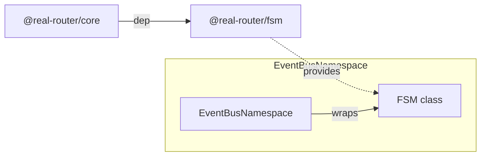
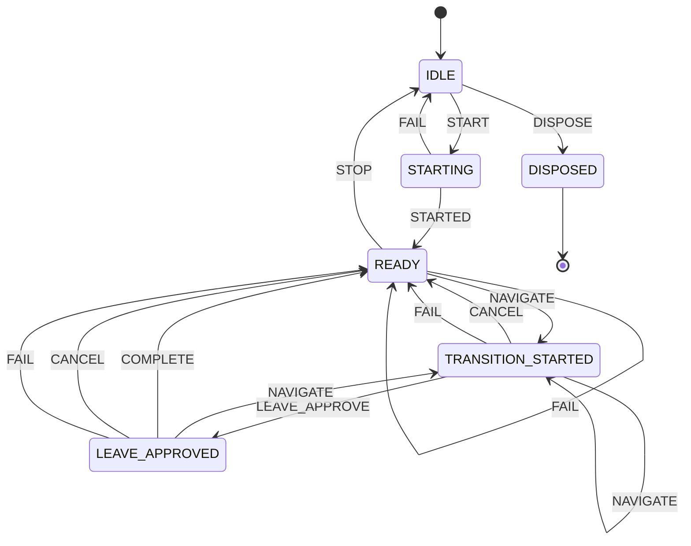

# Architecture

> Detailed architecture for AI agents and contributors

## Overview

`@real-router/fsm` is a **standalone, zero-dependency** synchronous finite state machine engine.
It drives the entire router lifecycle — all states (IDLE, STARTING, READY, TRANSITION_STARTED, LEAVE_APPROVED, DISPOSED) and transitions are managed by a single FSM instance.

**Key role:** No boolean flags, no ad-hoc state management. Every router state change is an FSM transition.
Events flow through FSM actions into the event emitter.

## Package Structure

```
fsm/
├── src/
│   ├── fsm.ts       — FSM class (all logic)
│   ├── types.ts     — FSMConfig, TransitionInfo, TransitionListener
│   └── index.ts     — Public API exports
```

## Dependencies

**Zero runtime dependencies.** Pure TypeScript, uses only `Map` and arrays.

**Consumed by:**



| Consumer              | What it uses    | Purpose                                     |
| --------------------- | --------------- | ------------------------------------------- |
| **EventBusNamespace** | `FSM` class     | Router lifecycle state machine              |
| **EventBusNamespace** | `fsm.on()`      | Trigger event emission on state transitions |
| **EventBusNamespace** | `fsm.canSend()` | Check if router can begin a transition      |

## Public API

### FSM — Main Class

```typescript
class FSM<
  TStates extends string,
  TEvents extends string,
  TContext,
  TPayloadMap extends Partial<Record<TEvents, unknown>> = Record<never, never>,
> {
  constructor(config: FSMConfig<TStates, TEvents, TContext>);

  send<E extends TEvents>(event: E, ...args: PayloadArgs<E>): TStates;
  canSend(event: TEvents): boolean;
  getState(): TStates;
  getContext(): TContext;
  on<E extends TEvents>(
    from: TStates,
    event: E,
    action: ActionFn<E>,
  ): () => void;
  onTransition(listener: (info: TransitionInfo) => void): () => void;
}
```

### Types

```typescript
interface FSMConfig<TStates, TEvents, TContext> {
  initial: TStates;
  context: TContext;
  transitions: Record<TStates, Partial<Record<TEvents, TStates>>>;
}

// Distributive union over the event (#886): narrowing `info.event` narrows
// `info.payload` to that event's payload — symmetric with `on`'s action.
type TransitionInfo<TStates, TEvents, TPayloadMap> = TEvents extends infer E extends TEvents
  ? {
      from: TStates;
      to: TStates;
      event: E;
      payload: E extends keyof TPayloadMap ? TPayloadMap[E] : undefined;
    }
  : never;
```

## Core Data Structures

### Internal State

```typescript
class FSM {
  #state: TStates;                                       // Current state
  #currentTransitions: Partial<Record<TEvents, TStates>>; // Cached lookup table
  #listenerCount: number = 0;                            // Fast-path check
  #actions: Map<TStates, Map<TEvents, (payload: unknown) => void>> | null = null; // Lazy nested map (state → event → action)
  readonly #context: TContext;                            // External mutable object
  readonly #transitions: Record<...>;                    // Full transition table
  readonly #listeners: (TransitionListener | null)[] = []; // Null-slot array
}
```

### Transition Table

The transition table is a nested record: `state → event → nextState`.

```typescript
// Example: Router FSM
{
  IDLE:               { START: "STARTING", DISPOSE: "DISPOSED" },
  STARTING:           { STARTED: "READY", FAIL: "IDLE" },
  READY:              { NAVIGATE: "TRANSITION_STARTED", FAIL: "READY", STOP: "IDLE" },
  TRANSITION_STARTED: { NAVIGATE: "TRANSITION_STARTED", LEAVE_APPROVE: "LEAVE_APPROVED", CANCEL: "READY", FAIL: "READY" },
  LEAVE_APPROVED:     { NAVIGATE: "TRANSITION_STARTED", COMPLETE: "READY", CANCEL: "READY", FAIL: "READY" },
  DISPOSED:           {},  // terminal — no outgoing transitions
}
```

## Core Algorithm

### send() — Transition Flow

```typescript
send(event, ...args) {
  // 1. Lookup next state — no-op if transition undefined
  const nextState = this.#currentTransitions[event];
  if (nextState === undefined) {
    return this.#state;
  }

  // 2. Update state BEFORE actions and listeners
  const from = this.#state;
  this.#state = nextState;
  this.#currentTransitions = this.#transitions[nextState];

  // 3. Execute action for specific (from, event) pair
  if (this.#actions !== null) {
    const action = this.#actions.get(from)?.get(event); // nested map: from → event
    if (action !== undefined) {
      action(args[0]);
    }
  }

  // 4. Fire generic transition listeners
  if (this.#listenerCount > 0) {
    const info = { from, to: nextState, event, payload: args[0] };
    for (const listener of this.#listeners) {
      if (listener !== null) {
        listener(info);
      }
    }
  }

  // May differ from nextState if reentrant send() occurred
  return this.#state;
}
```

**Critical ordering:**

1. State updated **before** actions and listeners
2. Actions fire **before** listeners
3. Return value is `#state`, not `nextState` (reflects reentrant mutations)

### on() — Action Registration

```typescript
on(from, event, action) {
  requireDeclared(this.#transitions, from, "on"); // #885 — reject undeclared `from`
  this.#actions ??= new Map();                     // lazy init (outer: state → inner map)

  let stateActions = this.#actions.get(from);      // inner map: event → action
  if (!stateActions) {
    stateActions = new Map();
    this.#actions.set(from, stateActions);
  }

  const capturedAction = action;
  stateActions.set(event, capturedAction);         // overwrites existing (last-write-wins)

  return () => {                                    // identity-guarded unsub (#427)
    const stateMap = this.#actions?.get(from);
    if (stateMap?.get(event) === capturedAction) { // only delete if still ours
      stateMap.delete(event);
    }
  };
}
```

- **Declared-`from` guard (#885):** `on()` starts with `requireDeclared` — an undeclared `from` throws instead of dead-registering an action that could never fire
- **Nested Map:** `#actions` is `Map<from, Map<event, action>>` — one inner map per source state (replaced the pre-#316 `${from}\0${event}` string key)
- **One action per (from, event) pair** — second `on()` overwrites the first (last-write-wins)
- **Identity-guarded unsubscribe (#427):** the returned unsubscribe deletes the entry **only if it is still the action this call registered** (`stateMap?.get(event) === capturedAction`) — a no-op once the pair was overwritten by a later `on()`, matching INVARIANTS "Action #5"
- **Lazy Map:** `#actions` is `null` until first `on()` call — zero allocation for consumers that don't use actions

### onTransition() — Listener Registration (Null-Slot Pattern)

```typescript
onTransition(listener) {
  const nullIndex = this.#listeners.indexOf(null);
  let index: number;

  if (nullIndex === -1) {
    index = this.#listeners.length;
    this.#listeners.push(listener);
  } else {
    this.#listeners[nullIndex] = listener;       // reuse vacated slot
    index = nullIndex;
  }

  this.#listenerCount++;
  let subscribed = true;

  return () => {
    if (!subscribed) return;                     // idempotent
    subscribed = false;
    this.#listeners[index] = null;
    this.#listenerCount--;
  };
}
```

**Why null-slot?**

- No array shifting/splicing on unsubscribe
- Prevents unbounded growth (reuses vacated slots)
- Null checks during iteration are O(1)

**Trade-off:** Listener order after unsubscribe may differ — new listeners fill vacated slots.

**No snapshot — live iteration (diverges from `event-emitter`).** `send()` iterates the **live** `#listeners` array, not a pre-iteration copy. Two consequences within a single `send()`:

- A listener **added during** the transition fires **in that same `send()`** (it occupies the next/reused slot the loop will reach).
- A listener **removed during** the transition is skipped (its slot is `null`).

```typescript
// A unsubscribes C and registers D, all during the same send():
// fired order = ["A", "D", "B"]   (C skipped; D called this same send)
```

This **intentionally differs** from the sibling `@real-router/event-emitter`, which snapshots the listener set (`[...set]`) before iterating, so mutations there only affect the *next* emit. Do not assume the two repo primitives share mutation-during-dispatch semantics. (See [#755](https://github.com/greydragon888/real-router/issues/755).)

**Actions, by contrast, are single-captured.** The matching `on()` action is read into a local **before** it fires (`const action = …; action(payload)`), so a reentrant `on()` that overwrites the `(from, event)` action **during its own dispatch** does *not* re-fire it in the current `send()` (it applies to the next `send`). Live iteration is a **listener-only** property — actions and listeners intentionally differ on mutation-during-dispatch.

## Hot-Path Optimizations

| Optimization                | Purpose                                                              |
| --------------------------- | -------------------------------------------------------------------- |
| `#currentTransitions` cache | O(1) event lookup — avoids `transitions[state][event]` double lookup |
| `#listenerCount` fast-path  | Skips listener iteration + `TransitionInfo` allocation when 0        |
| Lazy `#actions` (`null`)    | No Map allocation when `on()` not used                               |
| Null-slot listener array    | Reuses slots from unsubscribed listeners                             |
| Early exit on no-op         | Returns immediately if transition undefined                          |

## Declared-state guard

The constructor (`initial`), `on` (`from`), and every transition **target** in the table (validated for closure at construction, [#1159](https://github.com/greydragon888/real-router/issues/1159)) share a `requireDeclared` guard: an undeclared state throws **before** any mutation instead of silently leaving `#currentTransitions` undefined and bricking the next `canSend`/`send` ([#754](https://github.com/greydragon888/real-router/issues/754) originally the `forceState` guard; [#885](https://github.com/greydragon888/real-router/issues/885) constructor + `on`; [#1159](https://github.com/greydragon888/real-router/issues/1159) table targets). The closure check runs once at construction (cold path) and skips explicit `undefined` targets (the "no transition" no-op); post-construction mutation of the shared table stays a documented GIGO boundary.

```typescript
// shared guard — single source of truth for "the state is declared"
function requireDeclared(transitions, state, where) {
  const t = transitions[state];
  if (t === undefined) {
    throw new Error(`[FSM.${where}] state "${state}" is not declared in config.transitions`);
  }
  return t;
}
```

> **Historical:** `forceState(state)` — a direct `#state`/`#currentTransitions` write that bypassed actions/listeners — was the engine's hot-path escape hatch, added for core's navigate path (NAVIGATE/COMPLETE, ~30ns saved per call). Core dropped it in the #1169 commit-gate refactor (the FSM table is now the sole authority over state, no bypass), leaving zero consumers, so the method was removed. See CHANGELOG.

## Reentrancy

`send()` inside `onTransition` listener or action is allowed:

```typescript
fsm.onTransition(({ to }) => {
  if (to === "STARTING") {
    fsm.send("STARTED"); // reentrant — executes synchronously inline
  }
});
fsm.send("START"); // triggers IDLE → STARTING → READY
```

- State already updated before listeners — reentrant `send()` sees new state
- No queue, no deferred execution — synchronous inline
- **Caller responsible for preventing infinite loops**

### Sharp edge: `TransitionInfo` staleness under reentrancy

`info` is captured **once** per `send()` (before the listener loop) and the reentrant call mutates the shared `#state` without save/restore. Consequently:

- An **outer** listener's `info.to` reflects *its own* transition's target, but `getState()` may already reflect a deeper (nested) state — `info.to !== getState()` is possible.
- Observations run in **reverse-causal order**: the nested transition is fully observed *before* the outer transition's listener loop resumes.

```typescript
// transitions: { a:{go:"b"}, b:{go:"c"}, c:{} }
fsm.onTransition((info) => { if (first) { first = false; fsm.send("go"); }
  obs.push({ to: info.to, live: fsm.getState() }); });
fsm.send("go");
// obs = [ {to:"c", live:"c"},   ← reentrant (b→c) listener runs first
//         {to:"b", live:"c"} ]  ← outer (a→b) listener: info.to="b" but getState()="c"
```

**Do not** assume `info.to === getState()` in listeners that reentrant-`send()`. Reentrancy is intentionally unbounded and is **not** restricted; this is a documented edge, not a bug. (Router-unreachable: core's FSM actions emit events, they do not reentrant-`send()`.)

## Exception Semantics

If a listener or action throws:

1. Exception propagates to `send()` caller
2. State is **already updated** — `getState()` reflects new state
3. Remaining listeners in same `send()` call are **skipped** (no try/catch)

This is intentional: FSM prioritizes state consistency over listener execution guarantees. Error recovery is the caller's responsibility.

## Type-Safe Payloads

`TPayloadMap` enforces per-event payload types at compile time:

```typescript
interface RouterPayloads {
  NAVIGATE: { toState: State; fromState: State | undefined };
  COMPLETE: {
    state: State;
    fromState: State | undefined;
    opts: NavigationOptions;
  };
  FAIL: { toState?: State; fromState?: State; error?: unknown };
  CANCEL: { toState: State; fromState: State | undefined };
  // START, STARTED, STOP not listed → no payload allowed
}

fsm.send("NAVIGATE", { toState, fromState }); // required
fsm.send("START"); // no payload
fsm.send("NAVIGATE"); // TS error
fsm.send("START", {}); // TS error
```

Default `TPayloadMap = Record<never, never>` — all events are payload-free.

> **Enforced ([#753](https://github.com/greydragon888/real-router/issues/753)):** the contract above is enforced by a distributive `send<E extends TEvents>(event, ...payload: E extends keyof TPayloadMap ? [TPayloadMap[E]] : [undefined?])` signature — symmetric with `on`, the payload correlates to the **specific** event. Previously `send(event: TEvents, payload?: TPayloadMap[TEvents])` indexed by the **full** `TEvents` union (which collapses to `unknown`), so `send("NAVIGATE")` and a wrong-event payload both compiled. Runtime is unchanged; the fix is type-level only. Dormant for core (`RouterPayloads` is empty).

## Self-Transitions

When `from === to`, `onTransition` still fires and `#currentTransitions` is reassigned (same reference). Self-transitions are observable events:

```typescript
// TRANSITION_STARTED → NAVIGATE → TRANSITION_STARTED (same state)
// Listeners fire: { from: "TRANSITION_STARTED", to: "TRANSITION_STARTED", event: "NAVIGATE" }
```

## Usage in @real-router/core

### Router FSM States



### EventBusNamespace Integration

FSM actions trigger event emission:

```typescript
// Setup: FSM action → EventEmitter emit
fsm.on("STARTING", "STARTED", () => emitter.emit("$start"));
fsm.on("READY", "NAVIGATE", (payload) => emitter.emit("$$start", payload.toState, payload.fromState));
fsm.on("LEAVE_APPROVED", "COMPLETE", (payload) => emitter.emit("$$success", ...));
// ... etc for all events
```

### Flow: Navigation → FSM → Events

```typescript
// 1. Start transition
fsm.send("NAVIGATE", { toState, fromState });
//    → #state = TRANSITION_STARTED
//    → action: emitter.emit("$$start", toState, fromState)

// 2. Run guards, update state
// ...

// 3. Complete transition
fsm.send("COMPLETE", { state, fromState, opts });
//    → #state = READY
//    → action: emitter.emit("$$success", state, fromState, opts)
```

## Performance Characteristics

| Operation                     | Complexity  | Notes                                |
| ----------------------------- | ----------- | ------------------------------------ |
| `send()` — no-op              | O(1)        | Single property lookup, early return |
| `send()` — transition         | O(1) + O(L) | 1 lookup + L listeners               |
| `canSend()`                   | O(1)        | Cached `#currentTransitions` lookup  |
| `getState()` / `getContext()` | O(1)        | Direct field access                  |
| `on()` registration           | O(1)        | Map.set()                            |
| `onTransition()` registration | O(n)        | indexOf(null) scan for slot reuse    |
| Unsubscribe                   | O(1)        | Direct index null assignment         |

### Memory

- **Transition table** — stored as-is from config (no copying)
- **Listeners** — single array with null slots (no per-listener allocation beyond closure)
- **Actions Map** — null until first `on()` call
- **TransitionInfo** — allocated only when `#listenerCount > 0`

## See Also

- [INVARIANTS.md](INVARIANTS.md) — Property-based test invariants
- [event-emitter ARCHITECTURE.md](../event-emitter/ARCHITECTURE.md) — Event emitter (receives FSM events)
- [core CLAUDE.md](../core/CLAUDE.md) — Core package architecture
- [ARCHITECTURE.md](../../ARCHITECTURE.md) — System-level architecture
