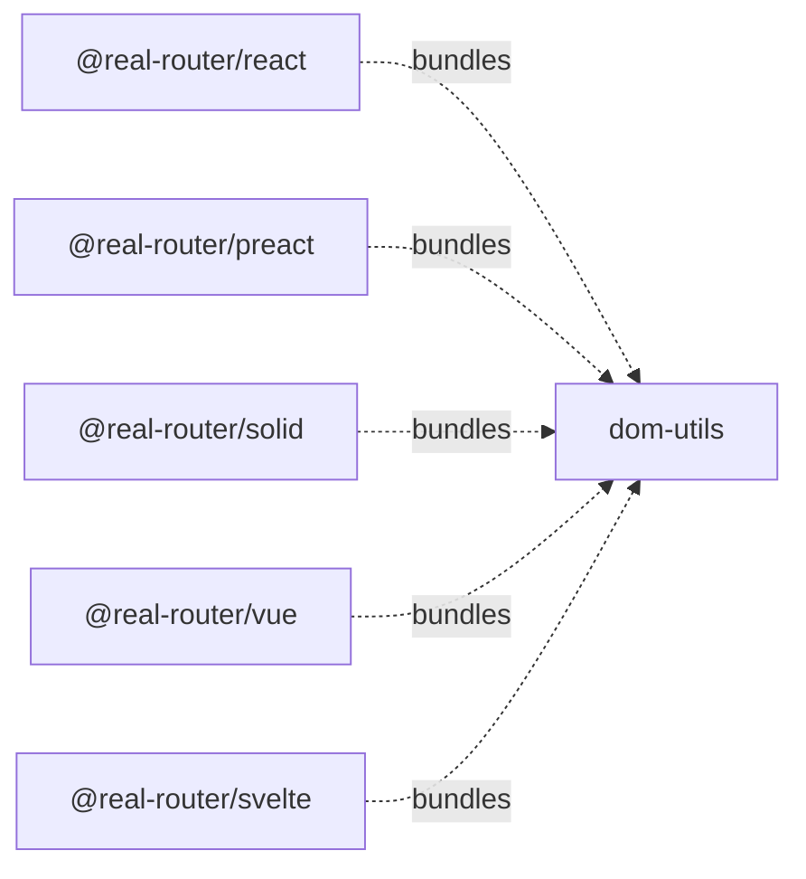

# Architecture

> Detailed architecture for AI agents and contributors

## Overview

`dom-utils` is an **internal, unpublished** package that provides shared DOM utilities for Real-Router framework adapters.

**Key role:** Centralises browser-specific DOM logic consumed by all framework adapters (React, Preact, Solid, Vue, Svelte). Contains accessibility announcements (`createRouteAnnouncer`) and shared Link/directive utilities (`shouldNavigate`, `buildHref`, `buildActiveClassName`, `applyLinkA11y`).

**Consumers:** `@real-router/react`, `@real-router/preact`, `@real-router/solid`, `@real-router/vue`, `@real-router/svelte`. Not published to npm — bundled into each adapter at build time.

## Package Structure

```
dom-utils/
├── src/
│   ├── index.ts            — Public exports
│   ├── route-announcer.ts  — createRouteAnnouncer() + a11y helpers
│   └── link-utils.ts       — shouldNavigate, buildHref, buildActiveClassName, applyLinkA11y
└── tests/
    └── functional/
        ├── route-announcer.test.ts  — 18 tests (jsdom environment)
        └── link-utils.test.ts       — Link utility tests (jsdom environment)
```

## Dependencies

**Runtime dependencies:** `@real-router/core` (types only — `Router`, `State`).

**Consumed by:**



## Public API

### Accessibility

| Export                                   | Type      | Description                                       |
| ---------------------------------------- | --------- | ------------------------------------------------- |
| `createRouteAnnouncer(router, options?)` | Function  | Creates route change announcer for screen readers |
| `RouteAnnouncerOptions`                  | Interface | Configuration options                             |

### Link Utilities

| Export                                                           | Type     | Description                                                       |
| ---------------------------------------------------------------- | -------- | ----------------------------------------------------------------- |
| `shouldNavigate(evt: MouseEvent): boolean`                       | Function | Checks modifier keys (ctrl, meta, alt, shift) and left button     |
| `buildHref(router, routeName, routeParams): string`              | Function | Constructs href via `buildUrl` → `buildPath` fallback             |
| `buildActiveClassName(isActive, activeClassName, base): string?` | Function | Concatenates active + base class names                            |
| `applyLinkA11y(element: HTMLElement): void`                      | Function | Sets `role="link"` and `tabindex="0"` on non-interactive elements |

## Key Design Decisions

### Singleton via `data-real-router-announcer`

The live region is a DOM singleton tracked by the `data-real-router-announcer` attribute. Multiple `createRouteAnnouncer` calls reuse the same element. Rationale: screen readers lose the "identity" of live regions that are recreated; the element must pre-exist before text is inserted.

### `aria-live="assertive"` + `aria-atomic="true"`

Route change is a **context switch**, not a background update. `assertive` interrupts immediately. `aria-atomic` guarantees the full text is read, not just the changed portion.

### Double `requestAnimationFrame`

The subscribe callback schedules `rAF → rAF → check`. The outer rAF fires before the next browser paint; the inner rAF guarantees the framework has committed DOM updates (React, Preact, Solid, Vue, Svelte all batch DOM writes before the second rAF).

### Safari 100ms readiness delay

Safari does not announce live regions created less than 100ms ago. A `setTimeout(100)` guards against this. `isReady` becomes `true` after 100ms and gates all announcements.

### Initial navigation guard

The first subscribe callback (fired by `router.start()`) is always skipped. On page load, the browser's standard behaviour handles focus — hijacking it breaks keyboard navigation.

### Fallback chain for announcement text

```
getAnnouncementText(route)  → custom callback (i18n, dynamic titles)
h1?.textContent?.trim()     → most specific page heading
document.title              → reliable fallback
route.name                  → dot-notation route name
window.location.pathname    → last resort
```

### `manageFocus()` with `preventScroll`

After navigation, the first `<h1>` receives programmatic focus (`tabindex="-1"` if not already present). `preventScroll: true` avoids unwanted scroll jump — the user already sees the new content. Existing `tabindex` values are preserved.

### Deduplication via `lastAnnouncedText`

Repeated announcements of identical text are suppressed. This prevents redundant announcements when navigating back and forth between two routes with the same page title.

### Auto-clear after 7 seconds

`announcer.textContent` is cleared 7 seconds after announcement. Prevents stale text from being re-read when the screen reader focus enters the live region later.
