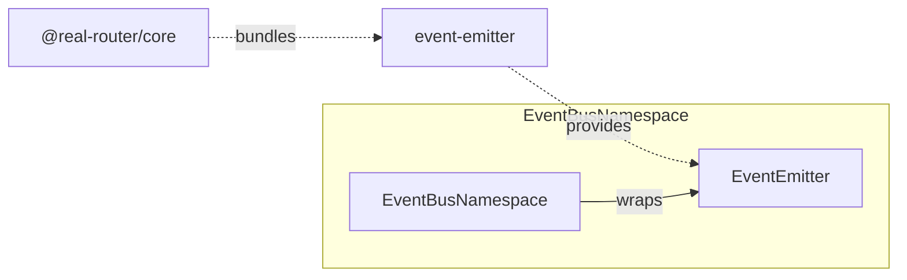

# Architecture

> Detailed architecture for AI agents and contributors

## Overview

`event-emitter` is an **internal, zero-dependency** package that provides a generic typed event emitter with listener limits, duplicate detection, recursion depth protection, and per-listener error isolation.

**Key role:** All router events (start, stop, transition success/cancel/error) flow through this emitter. `@real-router/core` wraps it in `EventBusNamespace`.

## Package Structure

```
event-emitter/
├── src/
│   ├── EventEmitter.ts    — Main class (265 lines)
│   ├── types.ts           — EventEmitterLimits, EventEmitterOptions, Unsubscribe
│   └── index.ts           — Public API exports
```

## Dependencies

**Zero runtime dependencies.** Uses only `Map`, `Set`, `Error`, `TypeError`.

**Consumed by:**



| Consumer              | What it uses         | Purpose                                          |
| --------------------- | -------------------- | ------------------------------------------------ |
| **EventBusNamespace** | `EventEmitter` class | Router event dispatch (start, stop, transitions) |
| **EventBusNamespace** | `Unsubscribe` type   | Return type for `addEventListener()`             |
| **Router options**    | `EventEmitterLimits` | `maxListeners`, `warnListeners`, `maxEventDepth` |

## Public API

### EventEmitter — Main Class

```typescript
class EventEmitter<TEventMap extends Record<string, unknown[]>> {
  constructor(options?: EventEmitterOptions);

  on<E extends keyof TEventMap & string>(
    eventName: E,
    cb: (...args: TEventMap[E]) => void,
  ): Unsubscribe;
  off<E extends keyof TEventMap & string>(
    eventName: E,
    cb: (...args: TEventMap[E]) => void,
  ): void;
  emit<E extends keyof TEventMap & string>(
    eventName: E,
    ...args: TEventMap[E]
  ): void;
  clearAll(): void;
  listenerCount(eventName: keyof TEventMap & string): number;
  setLimits(limits: EventEmitterLimits): void;

  static validateCallback(
    cb: unknown,
    eventName: string,
  ): asserts cb is Function;
}
```

### Types

```typescript
interface EventEmitterLimits {
  maxListeners: number; // 0 = unlimited
  warnListeners: number; // 0 = no warning
  maxEventDepth: number; // 0 = no depth tracking
}

interface EventEmitterOptions {
  limits?: EventEmitterLimits;
  onListenerError?: (eventName: string, error: unknown) => void;
  onListenerWarn?: (eventName: string, count: number) => void;
}

type Unsubscribe = () => void;
```

## Core Data Structures

### Internal State

```typescript
class EventEmitter<TEventMap> {
  readonly #callbacks = new Map<string, Set<AnyCallback>>();
  // Event name → Set of listeners. Lazy: Set created on first on() call.

  #depthMap: Map<string, number> | null = null;
  // Event name → current recursion depth. Null until first emit with depth tracking.

  #limits: EventEmitterLimits;
  // Current limits (mutable via setLimits).

  readonly #onListenerError:
    | ((eventName: string, error: unknown) => void)
    | null;
  readonly #onListenerWarn: ((eventName: string, count: number) => void) | null;
}
```

**Why `Map<string, Set>`?**

- `Map`: O(1) lookup by event name
- `Set`: O(1) add/remove/has, automatic deduplication by identity

**Why `#depthMap` is null?**

- Lazy initialization — zero allocation if depth tracking never enabled (`maxEventDepth === 0`)
- Created on first `emit()` via `??=`

## Core Algorithms

### on() — Listener Registration

```typescript
on(eventName, cb) {
  const set = this.#getCallbackSet(eventName);   // get or create Set (lazy)
  if (set.has(cb)) throw new Error("Duplicate"); // duplicate check
  if (set.size === warnListeners) onListenerWarn?.(eventName, warnListeners);
  if (set.size >= maxListeners) throw new Error("Limit reached");
  set.add(cb);
  return () => this.off(eventName, cb);          // unsubscribe closure
}
```

### off() — Listener Removal

```typescript
off(eventName, cb) {
  this.#callbacks.get(eventName)?.delete(cb);
  // Idempotent: no-op if event unknown or cb not registered
}
```

### emit() — Dual-Path Dispatch

```
emit(eventName, ...args)
    │
    ▼
┌───────────────┐
│  Get Set      │  callbacks.get(eventName)
│  Empty check  │  → !set || size === 0 → return (fast exit)
└──────┬────────┘
       │
       ▼
┌───────────────────────────────────────┐
│  maxEventDepth === 0?                 │
│  ├── YES → #emitFast()                │
│  └── NO  → #emitWithDepthTracking()   │
└───────────────────────────────────────┘
```

#### Fast Path (#emitFast)

No depth tracking, no try/finally overhead:

```typescript
#emitFast(set, eventName, args) {
  const listeners = [...set];                    // snapshot — freeze iteration order
  for (const cb of listeners) {
    try {
      this.#callListener(cb, args);
    } catch (error) {
      this.#onListenerError?.(eventName, error); // swallow, continue
    }
  }
}
```

#### Depth-Tracked Path (#emitWithDepthTracking)

```typescript
#emitWithDepthTracking(set, eventName, args) {
  this.#depthMap ??= new Map();                  // lazy init
  const depth = this.#depthMap.get(eventName) ?? 0;

  if (depth >= this.#limits.maxEventDepth) {
    throw new RecursionDepthError(/*...*/);
  }

  try {
    this.#depthMap.set(eventName, depth + 1);
    const listeners = [...set];                  // snapshot
    for (const cb of listeners) {
      try {
        this.#callListener(cb, args);
      } catch (error) {
        if (error instanceof RecursionDepthError) throw error; // re-throw
        this.#onListenerError?.(eventName, error);             // swallow others
      }
    }
  } finally {
    this.#depthMap.set(eventName, depth);        // always decrement
  }
}
```

### #callListener() — Argument Dispatch

```typescript
switch (args.length) {
  case 0:
    cb();
  case 1:
    cb(args[0]);
  case 2:
    cb(args[0], args[1]);
  case 3:
    cb(args[0], args[1], args[2]);
  default:
    Function.prototype.apply.call(cb, undefined, args);
}
```

Direct calls for 0-3 args — monomorphic call sites, V8 optimizes well. Fallback to `apply` for 4+ args (rare in router: max 3 args for `$$success`).

## Snapshot Iteration

`emit()` creates a snapshot `[...set]` before iterating:

- Listener **added** during emit → NOT called in current emit
- Listener **removed** during emit → STILL called (already in snapshot)

Standard pattern in event systems (DOM, Node.js EventEmitter).

## Error Isolation

Three-level error handling:

| Level                      | Behavior                                                             |
| -------------------------- | -------------------------------------------------------------------- |
| Per-listener `try/catch`   | Each listener isolated — one failing doesn't stop others             |
| `RecursionDepthError`      | Re-thrown (propagates to caller)                                     |
| `onListenerError` callback | Called for non-recursion errors; if absent, error silently swallowed |

## Limits System

| Limit           | Default | Per-event? | Behavior when exceeded              |
| --------------- | ------- | ---------- | ----------------------------------- |
| `maxListeners`  | 0 (off) | Yes        | `on()` throws Error                 |
| `warnListeners` | 0 (off) | Yes        | `onListenerWarn()` called, no throw |
| `maxEventDepth` | 0 (off) | Yes        | `emit()` throws RecursionDepthError |

- **0 = disabled** for all limits
- `warnListeners` fires when `set.size === threshold` (exact match, fires once)
- `maxListeners` checks `set.size >= limit` (prevents exceeding)
- `maxEventDepth` checks `depth >= limit` before incrementing

## Usage in @real-router/core

### Router Event Map

```typescript
type RouterEventMap = {
  $start: [];
  $stop: [];
  $$start: [toState, fromState?];
  $$success: [toState, fromState?, opts?];
  $$error: [toState?, fromState?, error?];
  $$cancel: [toState, fromState?];
};
```

### EventBusNamespace Wrapper

```typescript
// Construction
const emitter = new EventEmitter<RouterEventMap>({
  onListenerError: (name, error) => logger.error(...),
  onListenerWarn: (name, count) => logger.warn(...),
});

// Emit (called from FSM actions)
emitter.emit("$$success", toState, fromState, opts);

// Subscribe (exposed via router API)
emitter.on("$$success", callback);  // → Unsubscribe
```

### Limits from Router Options

```typescript
createRouter(routes, {
  limits: {
    maxListeners: 10_000, // per event
    warnListeners: 1_000, // warning threshold
    maxEventDepth: 5, // recursion protection
  },
});
```

## Performance Characteristics

| Operation                | Time    | Notes                                |
| ------------------------ | ------- | ------------------------------------ |
| `emit()` — no listeners  | ~5.8 ns | Early return, zero work              |
| `emit()` — 1 listener    | ~30 ns  | Direct call, snapshot of 1           |
| `emit()` — 10 listeners  | ~90 ns  | Linear: ~18 ns + 5.5 ns per listener |
| `emit()` — 100 listeners | ~565 ns | Same linear scaling                  |
| Depth tracking overhead  | +3.8 ns | +12.5% per emit                      |
| `on()` + `off()` cycle   | ~56 ns  | Single listener add/remove           |

**Scaling model:** `emit(3 args, N listeners) ~ 18 ns + 5.5 ns * N`

### Memory

| Allocation          | Size          | When                           |
| ------------------- | ------------- | ------------------------------ |
| Snapshot `[...set]` | ~8 B/listener | Every emit with listeners      |
| `#depthMap`         | ~400 B        | First emit with depth tracking |
| Closure per `on()`  | ~200 B        | Once per subscription          |

## See Also

- [fsm ARCHITECTURE.md](../fsm/ARCHITECTURE.md) — FSM engine (drives event emission)
- [core CLAUDE.md](../core/CLAUDE.md) — Core package architecture
- [ARCHITECTURE.md](../../ARCHITECTURE.md) — System-level architecture
