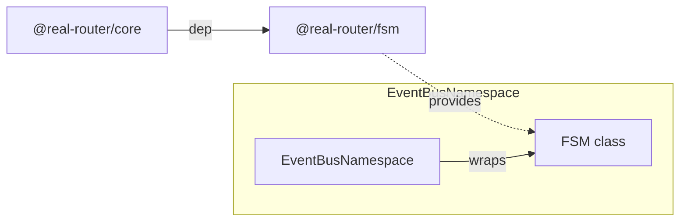
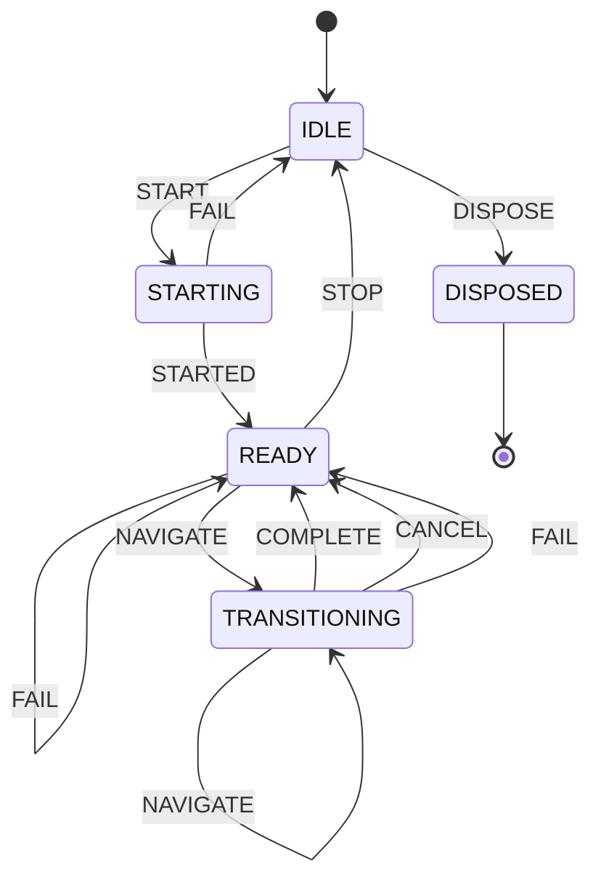

# Architecture

> Detailed architecture for AI agents and contributors

## Overview

`@real-router/fsm` is a **standalone, zero-dependency** synchronous finite state machine engine (107 LOC). It drives the entire router lifecycle — all states (IDLE, STARTING, READY, TRANSITIONING, DISPOSED) and transitions are managed by a single FSM instance.

**Key role:** No boolean flags, no ad-hoc state management. Every router state change is an FSM transition. Events flow through FSM actions into the event emitter.

## Package Structure

```
fsm/
├── src/
│   ├── fsm.ts      — FSM class (137 lines, all logic)
│   ├── types.ts     — FSMConfig, TransitionInfo, TransitionListener
│   └── index.ts     — Public API exports
```

## Dependencies

**Zero runtime dependencies.** Pure TypeScript, uses only `Map` and arrays.

**Consumed by:**



| Consumer              | What it uses         | Purpose                                     |
| --------------------- | -------------------- | ------------------------------------------- |
| **EventBusNamespace** | `FSM` class          | Router lifecycle state machine              |
| **EventBusNamespace** | `fsm.on()`           | Trigger event emission on state transitions |
| **EventBusNamespace** | `fsm.canSend()`      | Check if router can begin a transition      |
| **EventBusNamespace** | `TransitionInfo` type | Listener callback signature                 |

## Public API

### FSM — Main Class

```typescript
class FSM<
  TStates extends string,
  TEvents extends string,
  TContext,
  TPayloadMap extends Partial<Record<TEvents, unknown>> = Record<never, never>,
> {
  constructor(config: FSMConfig<TStates, TEvents, TContext>);

  send<E extends TEvents>(event: E, ...args: PayloadArgs<E>): TStates;
  canSend(event: TEvents): boolean;
  getState(): TStates;
  getContext(): TContext;
  on<E extends TEvents>(from: TStates, event: E, action: ActionFn<E>): () => void;
  onTransition(listener: (info: TransitionInfo) => void): () => void;
}
```

### Types

```typescript
interface FSMConfig<TStates, TEvents, TContext> {
  initial: TStates;
  context: TContext;
  transitions: Record<TStates, Partial<Record<TEvents, TStates>>>;
}

interface TransitionInfo<TStates, TEvents, TPayloadMap> {
  from: TStates;
  to: TStates;
  event: TEvents;
  payload: TPayloadMap[TEvents] | undefined;
}
```

## Core Data Structures

### Internal State

```typescript
class FSM {
  #state: TStates;                                       // Current state
  #currentTransitions: Partial<Record<TEvents, TStates>>; // Cached lookup table
  #listenerCount: number = 0;                            // Fast-path check
  #actions: Map<string, (payload: unknown) => void> | null = null; // Lazy
  readonly #context: TContext;                            // External mutable object
  readonly #transitions: Record<...>;                    // Full transition table
  readonly #listeners: (TransitionListener | null)[] = []; // Null-slot array
}
```

### Transition Table

The transition table is a nested record: `state → event → nextState`.

```typescript
// Example: Router FSM
{
  IDLE:          { START: "STARTING", DISPOSE: "DISPOSED" },
  STARTING:      { STARTED: "READY", FAIL: "IDLE" },
  READY:         { NAVIGATE: "TRANSITIONING", FAIL: "READY", STOP: "IDLE" },
  TRANSITIONING: { NAVIGATE: "TRANSITIONING", COMPLETE: "READY", CANCEL: "READY", FAIL: "READY" },
  DISPOSED:      {},  // terminal — no outgoing transitions
}
```

## Core Algorithm

### send() — Transition Flow

```
send(event, payload?)
    │
    ▼
┌─────────────────────┐
│  Lookup next state    │  nextState = #currentTransitions[event]
│  undefined → no-op    │  → return #state (no actions, no listeners)
└──────────┬──────────┘
           │
           ▼
┌─────────────────────┐
│  Update state        │  #state = nextState
│  (BEFORE listeners)  │  #currentTransitions = transitions[nextState]
└──────────┬──────────┘
           │
           ▼
┌─────────────────────┐
│  Execute action      │  if #actions !== null:
│  (specific to pair)  │    action = #actions.get(`${from}\0${event}`)
│                      │    action?.(payload)
└──────────┬──────────┘
           │
           ▼
┌─────────────────────┐
│  Fire listeners      │  if #listenerCount > 0:
│  (generic observers) │    info = { from, to, event, payload }
│                      │    for listener of #listeners:
│                      │      listener !== null → listener(info)
└──────────┬──────────┘
           │
           ▼
  return #state (may differ from nextState if reentrant send occurred)
```

**Critical ordering:**
1. State updated **before** actions and listeners
2. Actions fire **before** listeners
3. Return value is `#state`, not `nextState` (reflects reentrant mutations)

### on() — Action Registration

```typescript
on(from, event, action) {
  this.#actions ??= new Map();                   // lazy init
  const key = `${from}\0${event}`;               // null-char separator
  this.#actions.set(key, action);                 // overwrites existing
  return () => { this.#actions?.delete(key); };   // unsubscribe
}
```

- **One action per (from, event) pair** — second `on()` overwrites the first
- **Key format:** `${from}\0${event}` — null character prevents ambiguity (e.g., `"A\0BC"` vs `"AB\0C"`)
- **Lazy Map:** `#actions` is `null` until first `on()` call — zero allocation for consumers that don't use actions

### onTransition() — Listener Registration (Null-Slot Pattern)

```typescript
onTransition(listener) {
  const nullIndex = this.#listeners.indexOf(null);
  let index: number;

  if (nullIndex === -1) {
    index = this.#listeners.length;
    this.#listeners.push(listener);
  } else {
    this.#listeners[nullIndex] = listener;       // reuse vacated slot
    index = nullIndex;
  }

  this.#listenerCount++;
  let subscribed = true;

  return () => {
    if (!subscribed) return;                     // idempotent
    subscribed = false;
    this.#listeners[index] = null;
    this.#listenerCount--;
  };
}
```

**Why null-slot?**
- No array shifting/splicing on unsubscribe
- Prevents unbounded growth (reuses vacated slots)
- Null checks during iteration are O(1)

**Trade-off:** Listener order after unsubscribe may differ — new listeners fill vacated slots.

## Hot-Path Optimizations

| Optimization                 | Purpose                                                  |
| ---------------------------- | -------------------------------------------------------- |
| `#currentTransitions` cache  | O(1) event lookup — avoids `transitions[state][event]` double lookup |
| `#listenerCount` fast-path   | Skips listener iteration + `TransitionInfo` allocation when 0 |
| Lazy `#actions` (`null`)     | No Map allocation when `on()` not used                   |
| Null-slot listener array     | Reuses slots from unsubscribed listeners                 |
| Early exit on no-op          | Returns immediately if transition undefined              |

## Reentrancy

`send()` inside `onTransition` listener or action is allowed:

```typescript
fsm.onTransition(({ to }) => {
  if (to === "STARTING") {
    fsm.send("STARTED");  // reentrant — executes synchronously inline
  }
});
fsm.send("START");  // triggers IDLE → STARTING → READY
```

- State already updated before listeners — reentrant `send()` sees new state
- No queue, no deferred execution — synchronous inline
- **Caller responsible for preventing infinite loops**

## Exception Semantics

If a listener or action throws:

1. Exception propagates to `send()` caller
2. State is **already updated** — `getState()` reflects new state
3. Remaining listeners in same `send()` call are **skipped** (no try/catch)

This is intentional: FSM prioritizes state consistency over listener execution guarantees. Error recovery is the caller's responsibility.

## Type-Safe Payloads

`TPayloadMap` enforces per-event payload types at compile time:

```typescript
interface RouterPayloads {
  NAVIGATE: { toState: State; fromState: State | undefined };
  COMPLETE: { state: State; fromState: State | undefined; opts: NavigationOptions };
  FAIL: { toState?: State; fromState?: State; error?: unknown };
  CANCEL: { toState: State; fromState: State | undefined };
  // START, STARTED, STOP not listed → no payload allowed
}

fsm.send("NAVIGATE", { toState, fromState });  // required
fsm.send("START");                              // no payload
fsm.send("NAVIGATE");                          // TS error
fsm.send("START", {});                         // TS error
```

Default `TPayloadMap = Record<never, never>` — all events are payload-free.

## Self-Transitions

When `from === to`, `onTransition` still fires and `#currentTransitions` is reassigned (same reference). Self-transitions are observable events:

```typescript
// TRANSITIONING → NAVIGATE → TRANSITIONING (same state)
// Listeners fire: { from: "TRANSITIONING", to: "TRANSITIONING", event: "NAVIGATE" }
```

## Usage in @real-router/core

### Router FSM States



### EventBusNamespace Integration

FSM actions trigger event emission:

```typescript
// Setup: FSM action → EventEmitter emit
fsm.on("STARTING", "STARTED", () => emitter.emit("$start"));
fsm.on("READY", "NAVIGATE", (payload) => emitter.emit("$$start", payload.toState, payload.fromState));
fsm.on("TRANSITIONING", "COMPLETE", (payload) => emitter.emit("$$success", ...));
// ... etc for all events
```

### Flow: Navigation → FSM → Events

```
router.navigate(name, params)
    → fsm.send("NAVIGATE", { toState, fromState })
        → #state = TRANSITIONING
        → action: emitter.emit("$$start", toState, fromState)
    → [guards, state update]
    → fsm.send("COMPLETE", { state, fromState, opts })
        → #state = READY
        → action: emitter.emit("$$success", state, fromState, opts)
```

## Performance Characteristics

| Operation                   | Complexity | Notes                                   |
| --------------------------- | ---------- | --------------------------------------- |
| `send()` — no-op           | O(1)       | Single property lookup, early return    |
| `send()` — transition      | O(1) + O(L)| 1 lookup + L listeners                 |
| `canSend()`                | O(1)       | Cached `#currentTransitions` lookup     |
| `getState()` / `getContext()` | O(1)    | Direct field access                     |
| `on()` registration        | O(1)       | Map.set()                               |
| `onTransition()` registration | O(n)    | indexOf(null) scan for slot reuse       |
| Unsubscribe                | O(1)       | Direct index null assignment            |

### Memory

- **Transition table** — stored as-is from config (no copying)
- **Listeners** — single array with null slots (no per-listener allocation beyond closure)
- **Actions Map** — null until first `on()` call
- **TransitionInfo** — allocated only when `#listenerCount > 0`

## See Also

- [event-emitter ARCHITECTURE.md](../event-emitter/ARCHITECTURE.md) — Event emitter (receives FSM events)
- [core CLAUDE.md](../core/CLAUDE.md) — Core package architecture
- [ARCHITECTURE.md](../../ARCHITECTURE.md) — System-level architecture
