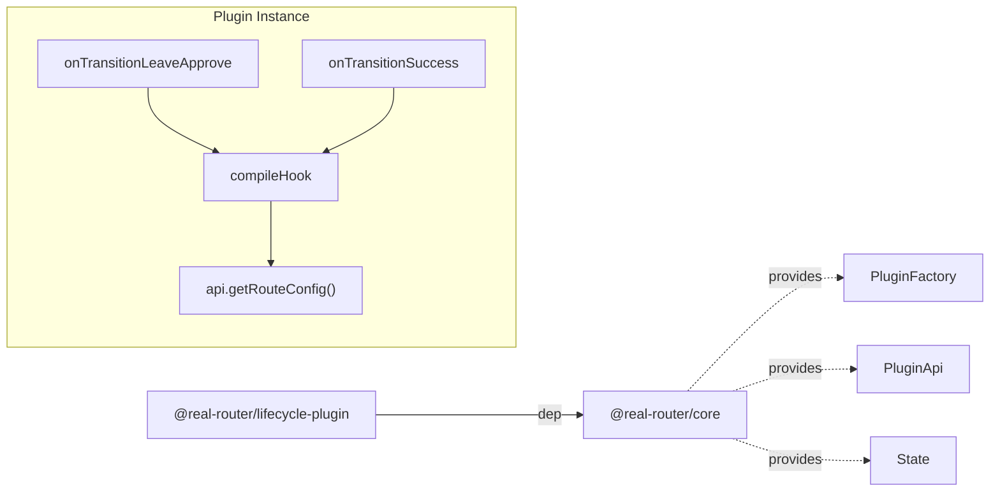

# Architecture

> Detailed architecture for AI agents and contributors

## Overview

`@real-router/lifecycle-plugin` is a **route-level lifecycle hooks plugin** for the router. It adds `onEnter`, `onStay`, `onLeave` callbacks to route definitions — declarative side-effects that fire on navigation events.

**Key role:** Bridges the gap between global plugin hooks (fire for every transition) and route guards (control flow). Lifecycle hooks are per-route side-effects — analytics, data prefetch, cleanup — without `subscribe()` boilerplate.

## Package Structure

```
lifecycle-plugin/
├── src/
│   ├── factory.ts    — compileHook (lazy compile + cache with factory invalidation),
│   │                   createPlugin, lifecyclePluginFactory
│   ├── types.ts      — LifecycleHook, LifecycleHookFactory types
│   └── index.ts      — Public exports + Route module augmentation
```

## Dependencies



| Import source              | What it uses                    | Purpose                    |
| -------------------------- | ------------------------------- | -------------------------- |
| **@real-router/core**      | `PluginFactory`, `State` types  | Plugin factory return type |
| **@real-router/core/api**  | `getPluginApi`, `PluginApi`     | Access route custom fields |

## Core Algorithm

### Hook Resolution

```
Navigation: home → users.view

onTransitionLeaveApprove(toState, fromState)
    │
    ├── toState.name !== fromState.name?
    │   ├── YES → compileHook("onLeave", "home") → call if resolved
    │   └── NO  → skip (same route = onStay, handled later)
    │
    ▼
onTransitionSuccess(toState, fromState)
    │
    ├── toState.name === fromState.name?
    │   ├── YES → compileHook("onStay", "users.view") → call if resolved
    │   └── NO  → compileHook("onEnter", "users.view") → call if resolved
```

### Lazy Compile + Cache Pattern

```typescript
compileHook(hookName: "onEnter" | "onStay" | "onLeave", routeName: string)
    │
    ├── Cache key: `${hookName}:${routeName}`
    │
    ├── api.getRouteConfig(routeName)?.[hookName] → factory reference
    │   ├── no factory → delete stale cache entry, return undefined
    │   ├── cache hit + factory === cached.factory → return cached.hook
    │   └── cache miss or factory changed → compile new hook
    │
    ├── Call factory: factory(router, getDependency) → LifecycleHook
    ├── Cache { hook, factory } in compiledHooks Map
    └── Return compiled hook
```

`router`, `getDependency`, `api`, and `compiledHooks` Map are captured once via closure in `createPlugin`. The compiled hook is reused on subsequent navigations as long as the factory reference stays the same.

### Factory Reference Cache Invalidation

The `compiledHooks` Map stores `{ hook, factory }` pairs. On every `compileHook()` call, the current factory reference from `getRouteConfig()` is compared against the cached `factory` via `===`. If the reference changed (e.g., after `getRoutesApi(router).replace(newRoutes)`), the old compiled hook is discarded and the new factory is compiled. This ensures HMR and dynamic route replacement work without plugin reinstallation.

Cost: one `getRouteConfig()` call per hook invocation (simple property lookup on `routeCustomFields`). The previous approach called `getRouteConfig()` only on cache miss but could not detect stale factories after `replaceRoutes()`.

### Route Custom Fields

Custom fields are extracted automatically by core's `registerSingleRouteHandlers` in `routesStore.ts`. Standard fields (`name`, `path`, `children`, `canActivate`, `canDeactivate`, `forwardTo`, `encodeParams`, `decodeParams`, `defaultParams`) are excluded. Everything else — including `onEnter`, `onStay`, `onLeave` — lands in `routeCustomFields[routeName]`.

## Design Decisions

### Why two hooks, not one

Using both `onTransitionLeaveApprove` and `onTransitionSuccess` instead of just `onTransitionSuccess`:

- `onLeave` semantically belongs to the **leaving** phase — it fires when deactivation guards pass
- `onEnter`/`onStay` belong to the **success** phase — they confirm the transition completed
- This matches the mental model: "cleanup before enter"

### Why leaf route only

Hooks fire only for `toState.name` / `fromState.name`, not for all segments in `transition.segments.activated` / `deactivated`. Reasons:

- Simpler mental model — one route, one hook call
- No loops, no Set allocations — just a property lookup
- Parent route hooks would fire on every child navigation, which is rarely desired

### Why no configuration

The plugin is stateless and has no options. The hooks themselves (defined on routes) are the configuration. Adding options like "fire for parent segments" would complicate both API and implementation for marginal benefit.

### Why no try/catch

Errors from user-defined hooks propagate to the EventEmitter, which logs them to stderr. Swallowing errors with `console.warn` would hide bugs from developers. The router continues operating regardless — the EventEmitter's error handling is robust.

## See Also

- [core CLAUDE.md](../core/CLAUDE.md) — Core package architecture (PluginFactory, getRouteConfig)
- [core routesStore.ts](../core/src/namespaces/RoutesNamespace/routesStore.ts) — Custom fields extraction (line 205-222)
- [preload-plugin ARCHITECTURE.md](../preload-plugin/ARCHITECTURE.md) — Same getRouteConfig + factory reference cache pattern
- [ARCHITECTURE.md](../../ARCHITECTURE.md) — System-level architecture
