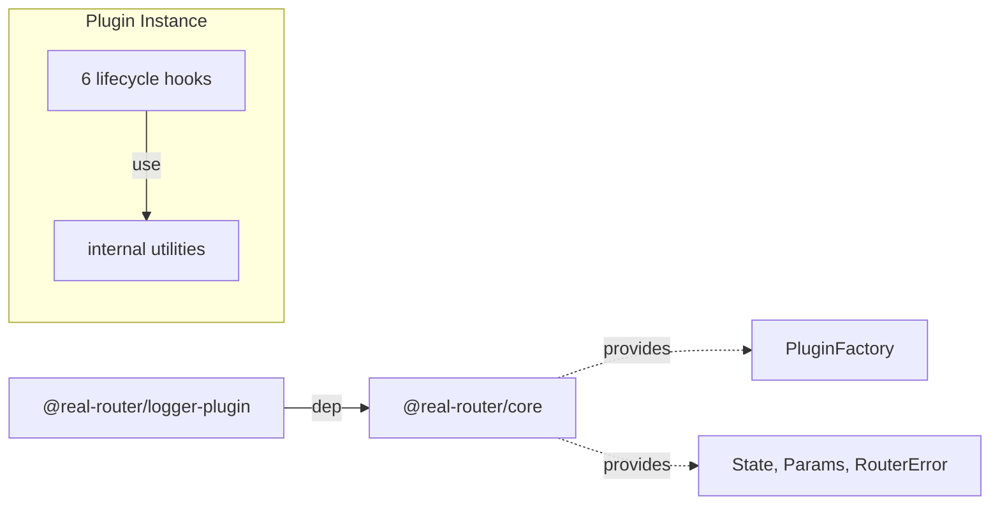

# Architecture

> Detailed architecture for AI agents and contributors

## Overview

`@real-router/logger-plugin` is a **development logging plugin** for the router with transition tracking, parameter diffing, and Performance API integration. It implements the `PluginFactory` interface from `@real-router/core` and passively observes all router lifecycle events.

**Key role:** Zero-overhead in production (tree-shakeable), rich diagnostics in development — console groups, adaptive timing (ms/μs), params diff for same-route navigation, and browser DevTools performance marks/measures.

## Package Structure

```
logger-plugin/
├── src/
│   ├── plugin.ts                      — Plugin factory + lifecycle hooks (242 lines)
│   ├── types.ts                       — LoggerPluginConfig, LogLevel
│   ├── constants.ts                   — DEFAULT_CONFIG
│   ├── index.ts                       — Public API exports
│   └── internal/
│       ├── console-groups.ts          — Console group manager (74 lines)
│       ├── formatting.ts             — Route name, timing, label formatting (56 lines)
│       ├── params-diff.ts            — Shallow params diff + logging (91 lines)
│       ├── performance-marks.ts      — Performance API wrapper (67 lines)
│       └── timing.ts                 — Monotonic time provider (52 lines)
```

## Dependencies



| Import source         | What it uses                        | Purpose                                |
| --------------------- | ----------------------------------- | -------------------------------------- |
| **@real-router/core** | `PluginFactory` type                | Plugin factory return type             |
| **@real-router/core** | `State`, `RouterError`, `Params`    | Lifecycle hook parameter types         |

## Public API

### loggerPluginFactory — Main Factory

```typescript
function loggerPluginFactory(
  options?: Partial<LoggerPluginConfig>,
): PluginFactory;
```

### loggerPlugin — Default Singleton

```typescript
const loggerPlugin: PluginFactory; // loggerPluginFactory() with defaults
```

### Types

```typescript
type LogLevel = "all" | "transitions" | "errors" | "none";

interface LoggerPluginConfig {
  usePerformanceMarks?: boolean; // Performance API marks/measures (default: false)
  level?: LogLevel;              // Log level filter (default: "all")
  showTiming?: boolean;          // Transition timing in ms/μs (default: true)
  showParamsDiff?: boolean;      // Params diff for same-route nav (default: true)
  context?: string;              // Console prefix (default: "logger-plugin")
}
```

## Core Data Structures

### Default Configuration (internal)

```typescript
const DEFAULT_CONFIG: Required<LoggerPluginConfig> = {
  level: "all",
  usePerformanceMarks: false,
  showParamsDiff: true,
  showTiming: true,
  context: "logger-plugin",
};
```

Not exported — used internally by `loggerPluginFactory` to merge with user options.

**Note:** `showParamsDiff` defaults to `true` in `DEFAULT_CONFIG`, while the JSDoc `@default` says `false`. The runtime default is `true`.

### Pre-Computed Flags

```typescript
// Computed once at factory creation — no runtime condition checks
const logLifecycle = config.level === "all";
const logTransition = config.level !== "none" && config.level !== "errors";
const logWarning = logTransition;
const logError = config.level !== "none";
const shouldLogParams = logTransition && config.showParamsDiff;
const shouldShowTiming = config.showTiming;
const prefix = `[${config.context}]`;
```

| Level          | logLifecycle | logTransition | logWarning | logError |
| -------------- | ------------ | ------------- | ---------- | -------- |
| `"all"`        | true         | true          | true       | true     |
| `"transitions"`| false        | true          | true       | true     |
| `"errors"`     | false        | false         | false      | true     |
| `"none"`       | false        | false         | false      | false    |

### Plugin Instance State

```typescript
// Created per router instance (inside factory return)
let transitionStartTime: number | null = null; // Timing start
let transitionLabel = "";                       // "{from}→{to}" for perf marks
let startMarkName = "";                         // "router:transition-start:{label}"
```

### Internal Managers

```typescript
const groups: GroupManager = createGroupManager(supportsConsoleGroups());
const perf: PerformanceTracker = createPerformanceTracker(config.usePerformanceMarks, config.context);
```

Both use the **capability detection + no-op pattern**: if the environment lacks `console.group` or `performance.mark`, all calls become no-ops.

## Core Algorithm

### Lifecycle Hook Flow

```
router.usePlugin(loggerPluginFactory(options))
    │
    ├── Config merge: { ...DEFAULT_CONFIG, ...options }
    ├── Pre-compute flags (logLifecycle, logTransition, etc.)
    └── Return factory → called per router instance
            │
            ├── Create GroupManager + PerformanceTracker
            └── Return plugin object with 6 hooks:

onStart()
    ├── perf.mark("router:start")
    └── if logLifecycle → console.log("[ctx] Router started")

onTransitionStart(toState, fromState?)
    ├── groups.open("Router transition")
    ├── transitionStartTime = now()
    ├── transitionLabel = "{from}→{to}"
    ├── perf.mark("router:transition-start:{label}")
    └── if logTransition:
            ├── console.log("[ctx] Transition: {from} → {to}", { from, to })
            └── if shouldLogParams && sameRoute → logParamsDiff

onTransitionSuccess(toState, fromState?)
    ├── perf.mark("router:transition-end:{label}")
    ├── perf.measure("router:transition:{label}", start, end)
    ├── if logTransition → console.log("[ctx] Transition success (Xms)", { to, from })
    └── resetTransitionState()

onTransitionCancel(toState, fromState?)
    ├── perf.mark("router:transition-cancel:{label}")
    ├── perf.measure("router:transition-cancelled:{label}", start, cancel)
    ├── if logWarning → console.warn("[ctx] Transition cancelled (Xms)", { to, from })
    └── resetTransitionState()

onTransitionError(toState?, fromState?, err)
    ├── perf.mark("router:transition-error:{label}")
    ├── perf.measure("router:transition-failed:{label}", start, error)
    ├── if logError → console.error("[ctx] Transition error: {code} (Xms)", { error, stack, to, from })
    └── resetTransitionState()

onStop()
    ├── groups.close()
    ├── perf.mark("router:stop")
    ├── perf.measure("router:lifetime", "router:start", "router:stop")
    └── if logLifecycle → console.log("[ctx] Router stopped")

teardown()
    └── resetTransitionState()
```

### resetTransitionState()

```typescript
const resetTransitionState = (): void => {
  groups.close();
  transitionLabel = "";
  startMarkName = "";
  transitionStartTime = null;
};
```

Called **after** timing is read — preserves `transitionStartTime` until log message is formatted.

## Internal Utilities

### timing.ts — Monotonic Time Provider

```
Module load
    │
    ├── performance.now available?
    │   ├── YES → nowFn = () => performance.now()
    │   └── NO  → nowFn = createMonotonicDateNow()
    │
    └── export now = () => nowFn()
```

**Monotonic fallback** (`createMonotonicDateNow`): tracks `lastTimestamp` and `timeOffset` at module level. If `Date.now()` goes backward (clock skew), adds offset to maintain monotonicity.

### formatting.ts — Adaptive Timing

```
formatTiming(startTime, now)
    ├── startTime === null → ""
    ├── durationMs is NaN/Infinity/negative → " (?)"
    ├── durationMs < 0.1 → " (X.XXμs)"
    └── durationMs ≥ 0.1 → " (X.XXms)"
```

Always 2 decimal places via `.toFixed(2)`.

### params-diff.ts — Shallow Diff

```
getParamsDiff(fromParams, toParams)
    ├── Iterate fromParams: detect changed + removed keys
    ├── Iterate toParams: detect added keys
    ├── hasChanges flag (perf: avoids Object.keys().length × 3)
    └── return { changed, added, removed } | null
```

Only triggered for **same-route navigation** (`toState.name === fromState.name`).

### console-groups.ts — Group Manager

Closure-based `isOpened` flag prevents duplicate `console.group()` calls. Opens on `onTransitionStart`, closes on `resetTransitionState` (success/cancel/error/stop/teardown).

### performance-marks.ts — Performance Tracker

```
createPerformanceTracker(enabled, context)
    ├── isSupported = enabled && supportsPerformanceAPI()
    ├── mark(name) → performance.mark(name) if supported
    └── measure(name, start, end) → try { performance.measure } catch → console.warn
```

## Performance API Marks

When `usePerformanceMarks: true`:

| Event              | Mark name                               | Measure name                              |
| ------------------ | --------------------------------------- | ----------------------------------------- |
| Router start       | `router:start`                          | —                                         |
| Transition start   | `router:transition-start:{from}→{to}`   | —                                         |
| Transition success | `router:transition-end:{from}→{to}`     | `router:transition:{from}→{to}`           |
| Transition cancel  | `router:transition-cancel:{from}→{to}`  | `router:transition-cancelled:{from}→{to}` |
| Transition error   | `router:transition-error:{from}→{to}`   | `router:transition-failed:{from}→{to}`    |
| Router stop        | `router:stop`                           | `router:lifetime`                         |

All marks/measures are visible in browser DevTools Performance tab.

## Console Output

| Hook                 | Method         | Guard          | Format                                          |
| -------------------- | -------------- | -------------- | ----------------------------------------------- |
| `onStart`            | `console.log`  | `logLifecycle` | `[ctx] Router started`                          |
| `onStop`             | `console.log`  | `logLifecycle` | `[ctx] Router stopped`                          |
| `onTransitionStart`  | `console.log`  | `logTransition`| `[ctx] Transition: {from} → {to}`               |
| `onTransitionSuccess`| `console.log`  | `logTransition`| `[ctx] Transition success (Xms)`                |
| `onTransitionCancel` | `console.warn` | `logWarning`   | `[ctx] Transition cancelled (Xms)`              |
| `onTransitionError`  | `console.error`| `logError`     | `[ctx] Transition error: {code} (Xms)`          |
| params diff          | `console.log`  | `shouldLogParams` | `[ctx]  Changed: { ... }, Added: {...}`      |

## Environment Detection

| API                  | Check                                                                   | Fallback                          |
| -------------------- | ----------------------------------------------------------------------- | --------------------------------- |
| `console.group`      | `typeof console !== "undefined"` + `group` + `groupEnd` are functions   | Groups disabled (no-op)           |
| `performance.mark`   | `typeof performance !== "undefined"` + `mark` + `measure` are functions | Marks/measures disabled (no-op)   |
| `performance.now`    | `typeof performance !== "undefined"` + `now` is a function              | Monotonic `Date.now()` wrapper    |

All checks happen once (at manager/provider creation), not per call.

## See Also

- [core CLAUDE.md](../core/CLAUDE.md) — Core package architecture (PluginFactory interface)
- [event-emitter ARCHITECTURE.md](../event-emitter/ARCHITECTURE.md) — Event emitter (delivers lifecycle events to plugins)
- [ARCHITECTURE.md](../../ARCHITECTURE.md) — System-level architecture
