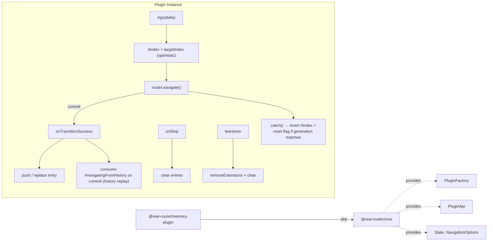

# Architecture

> Detailed architecture for AI agents and contributors

## Overview

`@real-router/memory-plugin` is an **in-memory history stack plugin** for the router. It maintains a `HistoryEntry[]` array and a current index, then exposes `back()`, `forward()`, `go(delta)`, `canGoBack()`, and `canGoForward()` as router extensions.

**Key role:** Provides browser-like history navigation without any dependency on `window.history`. Designed for React Native, testing environments, SSR navigation simulation, and any context where the browser History API is unavailable.

## Package Structure

```
memory-plugin/
├── src/
│   ├── factory.ts  — memoryPluginFactory: validates maxHistoryLength, freezes options, returns PluginFactory
│   ├── plugin.ts   — MemoryPlugin class: history array + index management, extendRouter, getPlugin()
│   ├── types.ts    — MemoryPluginOptions, HistoryEntry interfaces
│   └── index.ts    — Public exports + Router module augmentation
```

## Dependencies



| Import source             | What it uses                                                      | Purpose                          |
| ------------------------- | ----------------------------------------------------------------- | -------------------------------- |
| **@real-router/core**     | `PluginFactory`, `Plugin`, `Router`, `State`, `NavigationOptions` | Plugin types and router contract |
| **@real-router/core/api** | `getPluginApi`, `PluginApi`                                       | `extendRouter()` to add methods  |

## Core Algorithm

### History Management

```
Forward navigation: navigate("users", { id: "1" })
    │
    onTransitionSuccess(toState, fromState, opts)
    │
    ├── #navigatingFromHistory === true?
    │   └── YES → #navigatingFromHistory = false (consume on commit),
    │             rewrite context, return (skip recording — back/forward replay)
    │
    ├── opts.replace === true AND #index >= 0?
    │   └── YES → #entries[#index] = entry  (overwrite current)
    │
    └── NO → splice(#index + 1)             (discard forward history)
             push(entry)
             #index = #entries.length - 1
             │
             └── maxHistory > 0 AND length > maxHistory?
                 └── YES → splice(0, overflow), adjust #index
```

### Navigation Flow: `#go(delta)`

```
back() / forward() / go(delta)
    │
    └── #go(delta)
        │
        ├── delta === 0? → return (no-op)
        │
        ├── guard: delta === 0 || !Number.isFinite(delta) || !Number.isInteger(delta) → return
        ├── targetIndex = #index + delta
        ├── targetIndex out of bounds? → return (no-op)
        │
        ├── entry.path === currentState.path? → #index = targetIndex, return (short-circuit)
        │
        ├── previousIndex = #index
        ├── generation = ++#goGeneration
        ├── #navigatingFromHistory = true
        ├── #index = targetIndex  (optimistic sync update)
        │
        └── router.navigate(entry.name, entry.params, undefined, { replace: true })
            ├── SUCCESS → onTransitionSuccess consumes #navigatingFromHistory on commit
            └── .catch()  → if (generation === #goGeneration)
                               #index = previousIndex; #navigatingFromHistory = false
```

The `navigatingFromHistory` flag prevents `onTransitionSuccess` from recording the replayed navigation as a new history entry. It is consumed the moment the restore commit is observed inside `onTransitionSuccess` — **not** in a later microtask — so a `navigate()` issued in the same tick as `back()`/`forward()`/`go()` is still recorded as a fresh push ([#807](https://github.com/greydragon888/real-router/issues/807)). A guard-blocked or rejected replay never reaches `onTransitionSuccess`, so the `.catch()` handler clears the flag and reverts the optimistic index instead; the `#goGeneration` guard ensures only the latest in-flight `#go` call can do so — older superseded calls no-op on settle.

## Data Flow

### Forward navigation

```
router.navigate("page", params)
    │
    [transition pipeline]
    │
    onTransitionSuccess(toState, _, opts)
    │
    ├── navigatingFromHistory? NO
    ├── opts.replace? NO
    └── splice(#index + 1) → push entry → #index++
```

### Back / Forward

```
router.back()
    │
    #go(-1)
    │
    #navigatingFromHistory = true
    #index = targetIndex           (optimistic sync update)
    generation = ++#goGeneration
    │
    router.navigate(entry.name, entry.params, undefined, { replace: true })
    │
    ├── SUCCESS → onTransitionSuccess → #navigatingFromHistory = false (consume on commit)
    └── BLOCKED → .catch() → if (generation === #goGeneration)
                                #index = previousIndex; #navigatingFromHistory = false
```

### Guard blocks back navigation

```
router.back()
    │
    #go(-1)
    │
    #index = targetIndex    (optimistic)
    router.navigate(...)
    │
    CANNOT_ACTIVATE (guard returns false)
    │
    .catch() → #index = previousIndex (revert), #navigatingFromHistory = false
    (onTransitionSuccess never fired, so the flag is cleared here)

canGoBack() reflects the reverted position
```

## Design Decisions

### Why `void` not `Promise` for `back()`/`forward()`/`go()`

Plugin extensions registered via `extendRouter()` must be synchronous per the core contract — the router's type system expects `void` return values for these methods. The underlying `router.navigate()` call is async, but the result is discarded with `void`. Callers who need completion signals should subscribe to state changes before calling.

### Why `replace: true` in `#go()`

Navigating back or forward replays an existing history entry. Using `replace: true` prevents `onTransitionSuccess` from pushing a duplicate entry (even with the `navigatingFromHistory` guard in place, this is the correct semantic: the history position changes, not the history length).

### Why `#index` updates optimistically with revert-on-catch

`#go(delta)` updates `#index` **synchronously** before firing `router.navigate()` and reverts it in `.catch()` when the navigation fails. This is the **optimistic update pattern** — callers that inspect `canGoBack()`/`canGoForward()` immediately after `router.back()` see the expected post-navigation position instead of the stale pre-call state.

A `#goGeneration` counter protects against superseded reverts: if a second `#go()` runs before the first settles, it bumps the generation, so the first `.catch()` finds a mismatch and skips the revert. The optimistic target from the second call wins, matching what `canGoBack()` should report.

Historical note: earlier versions updated `#index` in `.then()`, which meant `canGoBack()` reported stale values during in-flight navigations. The switch to optimistic + revert happened in [#410](https://github.com/greydragon888/real-router/pull/410) to fix index desync on blocked guards (#294).

### Why `go(0)` is a no-op

Delta zero means "navigate to the current entry." This would trigger a full transition to the same state, which core rejects with `SAME_STATES`. The early return avoids the unnecessary navigate call and the resulting error.

### Why `HistoryEntry` is not exported

`HistoryEntry` is an internal implementation detail. Callers interact with history through the five router extension methods (`back`, `forward`, `go`, `canGoBack`, `canGoForward`). Exporting the type would imply a public API surface that doesn't exist.

## Plugin Lifecycle

```
router.usePlugin(memoryPluginFactory(options))
    │
    memoryPluginFactory(options)
    ├── validate maxHistoryLength (throws TypeError if negative)
    └── freeze options
        │
        return PluginFactory
            │
            (router) => Plugin
                │
                getPluginApi(router)
                new MemoryPlugin(router, api, options)
                    └── api.extendRouter({ back, forward, go, canGoBack, canGoForward })
                        └── returns removeExtensions()
                │
                return plugin.getPlugin()
                    └── { onTransitionSuccess, onStop, teardown }

router.stop()
    └── onStop → #clear() (entries + index reset, extensions remain)

router.usePlugin() unsubscribe / teardown
    └── teardown → #removeExtensions() + #clear()
```

## See Also

- [CLAUDE.md](CLAUDE.md) — Exports, gotchas, module structure
- [core CLAUDE.md](../core/CLAUDE.md) — Core package architecture (PluginFactory, extendRouter)
- [ARCHITECTURE.md](../../ARCHITECTURE.md) — System-level architecture
