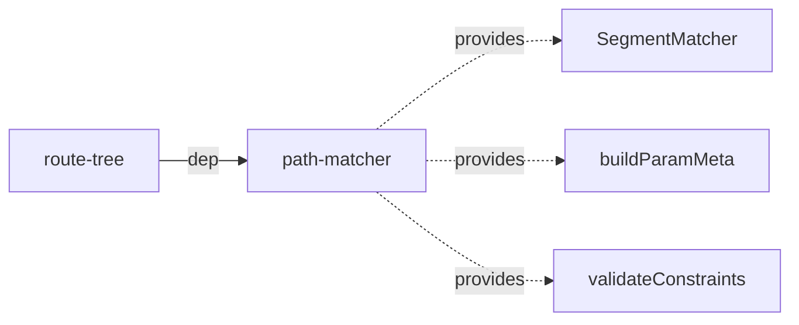

# Architecture

> Detailed architecture for AI agents and contributors

## Overview

`path-matcher` is an **internal, zero-dependency** package that provides URL matching and path building via a **Segment Trie** data structure. It is the lowest-level routing engine in the stack — `route-tree` wraps it and injects query string handling from `search-params`.

**Key role:** All URL path operations (matching, building, parameter extraction) are implemented here. Higher-level packages never parse URLs directly.

## Package Structure

```
path-matcher/
├── src/
│   ├── SegmentMatcher.ts         — Main class: match(), buildPath(), registerTree()
│   ├── registration.ts           — Route registration & trie building
│   ├── buildParamMeta.ts         — Parameter metadata extraction from patterns
│   ├── encoding.ts               — URL parameter encoding/decoding (4 strategies)
│   ├── percentEncoding.ts        — Percent encoding validation (%XX)
│   ├── constraintValidation.ts   — Regex constraint validation
│   ├── defaultQueryString.ts     — Default query string parse/build (encodeURIComponent key=value)
│   ├── pathUtils.ts              — SegmentNode factory, trailing slash normalization, buildFullPath
│   ├── types.ts                  — All type definitions
│   └── index.ts                  — Public API exports
```

## Dependencies

**Zero runtime dependencies.** Pure TypeScript implementation using only native JavaScript APIs (`encodeURIComponent`, `decodeURIComponent`, `RegExp`).

**Consumed by:**



| Consumer       | What it uses                          | Purpose                                         |
| -------------- | ------------------------------------- | ----------------------------------------------- |
| **route-tree** | `SegmentMatcher` class                | URL matching and path building                  |
| **route-tree** | `buildParamMeta()`                    | Extract param metadata during tree construction |
| **route-tree** | `ParamMeta`, `MatcherInputNode` types | Tree node structure, param type classification  |

**Key design:** `path-matcher` has **no query string handling** beyond a minimal default. `route-tree` injects `search-params` functions via dependency injection at matcher creation time.

## Public API

### SegmentMatcher — Main Class

```typescript
class SegmentMatcher {
  constructor(options?: SegmentMatcherOptions);

  get options(): ResolvedMatcherOptions;

  registerTree(node: MatcherInputNode): void;
  match(path: string): MatchResult | undefined;
  buildPath(
    name: string,
    params?: Record<string, unknown>,
    options?: BuildPathOptions,
  ): string;
  getSegmentsByName(name: string): readonly MatcherInputNode[] | undefined;
  getMetaByName(
    name: string,
  ): Readonly<Record<string, Record<string, "url" | "query">>> | undefined;
  hasRoute(name: string): boolean;
  setRootPath(rootPath: string): void;
}
```

### Standalone Functions

```typescript
buildParamMeta(path: string): ParamMeta
validateConstraints(params: Record<string, unknown>, constraintPatterns: ReadonlyMap<string, ConstraintPattern>, path: string): void
encodeParam(param: string | number | boolean, encoding: URLParamsEncodingType, isSpatParam: boolean): string
encodeURIComponentExcludingSubDelims(segment: string): string
createSegmentNode(): SegmentNode
ENCODING_METHODS: Record<URLParamsEncodingType, (param: string) => string>
DECODING_METHODS: Record<URLParamsEncodingType, (param: string) => string>
```

**Also re-exported from `SegmentMatcher.ts`** (not from main `index.ts`):

```typescript
defaultParseQueryString(queryString: string): Record<string, unknown>
defaultBuildQueryString(params: Record<string, unknown>): string
```

## Core Data Structures

### SegmentNode — Trie Node

```typescript
interface SegmentNode {
  readonly staticChildren: Record<string, SegmentNode>; // exact segment match
  paramChild?: { node: SegmentNode; name: string }; // :param capture
  splatChild?: { node: SegmentNode; name: string }; // *splat capture
  route?: CompiledRoute; // terminal route data
  slashChildRoute?: CompiledRoute; // slash-child optimization
}
```

**`staticChildren`** uses `Object.create(null)` — zero prototype chain for fastest property lookup.

**Matching priority:** static > param > splat (most specific wins).

### CompiledRoute — Pre-compiled Route

Created once at registration time, used on every `match()`/`buildPath()` call.

```typescript
interface CompiledRoute {
  readonly name: string; // "users.profile"
  readonly parent: CompiledRoute | null;
  readonly depth: number; // segments.length - 1 (tree depth excluding root)

  // Matching
  readonly matchSegments: readonly MatcherInputNode[];
  readonly meta: Readonly<Record<string, Record<string, "url" | "query">>>;
  readonly declaredQueryParams: readonly string[];
  readonly declaredQueryParamsSet: ReadonlySet<string>;
  readonly hasTrailingSlash: boolean;
  readonly constraintPatterns: ReadonlyMap<string, ConstraintPattern>;
  readonly hasConstraints: boolean;

  // Path building (pre-compiled)
  readonly buildStaticParts: readonly string[]; // ["/users/", "/posts/"]
  readonly buildParamSlots: readonly BuildParamSlot[]; // [{paramName: "id", encoder, isOptional}]
  readonly buildParamNamesSet: ReadonlySet<string>;

  readonly forwardTo?: string;
  readonly defaultParams?: Readonly<Record<string, unknown>>;
}
```

**Key insight:** Path building uses pre-compiled `buildStaticParts` + `buildParamSlots` — no regex at call time, only iteration and string concatenation.

### ParamMeta — Parameter Metadata

Extracted from route pattern by `buildParamMeta()`. Used by `route-tree` during tree construction.

```typescript
interface ParamMeta {
  readonly urlParams: readonly string[]; // ["id", "postId"] (no colon prefix)
  readonly queryParams: readonly string[]; // ["q", "page"]
  readonly spatParams: readonly string[]; // ["path"]
  readonly paramTypeMap: Readonly<Record<string, "url" | "query">>;
  readonly constraintPatterns: ReadonlyMap<string, ConstraintPattern>;
  readonly pathPattern: string; // path without query string
}
```

### MatchResult — Match Output

```typescript
interface MatchResult {
  readonly segments: readonly MatcherInputNode[];
  readonly params: Readonly<Record<string, unknown>>;
  readonly meta: Readonly<Record<string, Record<string, "url" | "query">>>;
}
```

## Segment Trie Algorithm

### Trie Structure

Routes are decomposed into path segments and inserted into a trie:

```
Routes:
  /users           → users
  /users/:id       → users.profile
  /users/:id/posts → users.profile.posts
  /files/*path     → files

Trie:
  root
  ├── "users" (static)
  │   ├── route: users
  │   └── :id (param)
  │       ├── route: users.profile
  │       └── "posts" (static)
  │           └── route: users.profile.posts
  └── "files" (static)
      └── *path (splat)
          └── route: files
```

### Match Flow

```
     match(path)
         │
         ▼
┌──────────────────┐
│  #preparePath()  │  Strip hash, validate, extract query string,
│                  │  strip rootPath prefix
└────────┬─────────┘
         │
         ▼
┌──────────────────┐
│  Static Cache    │  O(1) lookup for parameterless routes
│  (Map)           │  → hit? return immediately
└────────┬─────────┘
         │ miss
         ▼
┌──────────────────┐
│  #traverse()     │  Walk trie from root, segment by segment
│  #traverseFrom() │  Priority: static > param > splat
└────────┬─────────┘
         │
         ▼
┌──────────────────┐
│  Trailing Slash  │  Validate if strictTrailingSlash enabled
└────────┬─────────┘
         │
         ▼
┌──────────────────┐
│  Constraints     │  Test captured params against regex patterns
│  #validateConst. │  (:id<\d+> → /^(\d+)$/.test(value))
└────────┬─────────┘
         │
         ▼
┌──────────────────┐
│  #decodeParams() │  URL-decode captured values
│                  │  + validate percent encoding (%XX)
└────────┬─────────┘
         │
         ▼
┌──────────────────┐
│  Query Parsing   │  Parse query string via DI function
│  + strict check  │  Reject undeclared params if strict mode
└────────┬─────────┘
         │
         ▼
┌──────────────────┐
│  #buildResult()  │  → { segments, params, meta }
└──────────────────┘
```

### Trie Traversal Details

At each path segment, the traversal tries in order:

1. **Static child** — exact string match in `staticChildren[segment]`
2. **Param child** — captures segment value into `paramChild.name`
3. **Splat child** — tries splat's own static/param children first, then captures remaining path

**Splat backtracking:** Before capturing as wildcard, splat child attempts to match its own children for more specific routes. This ensures `/files/special` matches a static route under splat before falling back to `*path` capture.

### Path Preparation

`#preparePath()` performs validation and normalization:

- Strip hash fragment (`#...`)
- Reject paths not starting with `/`
- Reject raw Unicode characters (U+0080+) — must be percent-encoded
- Strip `rootPath` prefix
- Split into path and query string

### Static Cache

Parameterless routes are stored in a `Map<normalizedPath, CompiledRoute>`:

```
/users     → CompiledRoute{name: "users.list"}
/about     → CompiledRoute{name: "about"}
/dashboard → CompiledRoute{name: "dashboard"}
```

- Key is case-normalized when `caseSensitive: false`
- Populated during `registerTree()`
- O(1) lookup bypasses trie traversal entirely

## Route Registration

### Registration Pipeline

```
registerTree(node)
    │
    ▼
registerNode() — recursive walk of MatcherInputNode tree
    │
    ├── Compute full path (handle absolute paths)
    ├── Strip constraint patterns from path (for trie insertion)
    ├── compileAndRegisterRoute()
    │       ├── Detect slash-child routes
    │       ├── Freeze segments array
    │       ├── Build metadata (segment → paramTypeMap)
    │       ├── Collect declaredQueryParams + constraintPatterns
    │       ├── compileBuildParts() — pre-compile for buildPath
    │       ├── Create CompiledRoute object
    │       ├── Store in routesByName, segmentsByName, metaByName
    │       └── Insert into trie or static cache
    │
    └── Recurse into children
```

### Trie Insertion

`insertIntoTrie()` / `insertIntoTrieFrom()` — recursive insertion:

- **Static segments** → create entry in `staticChildren`
- **`:param` segments** → create `paramChild` with captured name
- **`*splat` segments** → create `splatChild` with captured name
- **Optional params** (`:param?`) → fork: insert both WITH and WITHOUT param node

### Build Parts Compilation

`compileBuildParts()` pre-compiles path into alternating static/param arrays:

```
Path: "/users/:id/posts/:postId"

buildStaticParts: ["/users/", "/posts/", ""]  // length = slots.length + 1
buildParamSlots: [
  { paramName: "id", encoder: encodeDefault, isOptional: false },
  { paramName: "postId", encoder: encodeDefault, isOptional: false }
]
```

At `buildPath()` time: iterate slots, interleave static parts with encoded param values. No regex, no parsing — only string concatenation.

### Slash-Child Optimization

A route whose path equals its parent path (e.g., child `""` under `/users`) is stored as `slashChildRoute` on the parent's trie node rather than creating a separate node. This handles the `/users` vs `/users/` distinction without duplicating trie branches.

## Path Building

### buildPath Flow

```
buildPath(name, params, options)
    │
    ▼
┌──────────────────┐
│  Route Lookup    │  Find CompiledRoute by name
└────────┬─────────┘
         │
         ▼
┌──────────────────┐
│  Constraint      │  Validate params against regex patterns
│  Validation      │  (only if route hasConstraints)
└────────┬─────────┘
         │
         ▼
┌──────────────────┐
│  #buildUrlPath() │  Iterate buildStaticParts + buildParamSlots
│                  │  Encode each param, skip optionals if undefined
└────────┬─────────┘
         │
         ▼
┌──────────────────┐
│  Trailing Slash  │  "default" / "always" / "never"
└────────┬─────────┘
         │
         ▼
┌──────────────────┐
│  Query String    │  Collect declared + extra params
│  Building        │  Encode via DI buildQueryString function
└──────────────────┘
```

### Query Params Mode

| Mode        | Behavior                                             |
| ----------- | ---------------------------------------------------- |
| `"default"` | Include only declared query params                   |
| `"strict"`  | Include only declared query params (same as default) |
| `"loose"`   | Include declared + any extra params not in URL path  |

## Parameter Encoding

### Encoding Strategies

```typescript
type URLParamsEncodingType = "default" | "uri" | "uriComponent" | "none";
```

| Strategy         | Encoder                                | Decoder              | Notes                         |
| ---------------- | -------------------------------------- | -------------------- | ----------------------------- |
| `"default"`      | `encodeURIComponentExcludingSubDelims` | `decodeURIComponent` | Preserves sub-delimiters `!$'()*+,:;` and `\|` |
| `"uri"`          | `encodeURI`                            | `decodeURI`          | Preserves more characters |
| `"uriComponent"` | `encodeURIComponent`                   | `decodeURIComponent` | Strictest encoding        |
| `"none"`         | identity                               | identity             | No encoding/decoding      |

### Default Encoding

`encodeURIComponentExcludingSubDelims` — uses `encodeURIComponent` but preserves RFC 3986 sub-delimiters: `! $ ' ( ) * + , : ; |`

**Fast path:** regex test `/[^\w!$'()*+,.:;|~-]/u` (without `g` flag) checks whether encoding is needed at all — most simple values skip encoding entirely.

### Splat Parameter Encoding

Splat params are split on `/`, each segment encoded separately, then rejoined with `/`. This preserves path structure while encoding special characters within segments.

### Percent Encoding Validation

`validatePercentEncoding(value)` — every `%` must be followed by exactly 2 hex digits. Invalid sequences (e.g., `%ZZ`, `%1`) cause the match to fail.

## Constraint System

### Pattern Extraction

`:paramName<regex>` in route patterns → compiled to `ConstraintPattern`:

```typescript
// Route: "/users/:id<\\d+>"
// Extracted: { pattern: /^(\d+)$/, constraint: "<\\d+>" }
```

### Validation Points

| When          | Function                      | Behavior                                 |
| ------------- | ----------------------------- | ---------------------------------------- |
| `match()`     | `#validateConstraints()`      | Test captured values, reject on fail     |
| `buildPath()` | `#validateBuildConstraints()` | Validate provided params before encoding |
| External      | `validateConstraints()`       | Public utility for external validation   |

## Matcher Options

```typescript
interface SegmentMatcherOptions {
  caseSensitive?: boolean; // default: true — case-sensitive path matching
  strictTrailingSlash?: boolean; // default: false — /path and /path/ both match
  strictQueryParams?: boolean; // default: false — allow undeclared query params
  urlParamsEncoding?: URLParamsEncodingType; // default: "default"
  parseQueryString?: (queryString: string) => Record<string, unknown>; // DI: query string parser
  buildQueryString?: (params: Record<string, unknown>) => string; // DI: query string builder
}
```

**Default query string handling:** simple `key=value&key=value` split/join (in `defaultQueryString.ts`). `route-tree` replaces these with `search-params` functions for full strategy support.

## Internal Module Dependencies

```
types.ts (leaf — no imports)
    ↓
    ├── percentEncoding.ts (leaf)
    ├── defaultQueryString.ts (leaf)
    ├── encoding.ts → types
    ├── pathUtils.ts → types
    ├── constraintValidation.ts → types
    ├── buildParamMeta.ts → types
    ├── registration.ts → types, pathUtils, encoding
    └── SegmentMatcher.ts → types, encoding, pathUtils, registration,
                            percentEncoding, defaultQueryString
```

No circular dependencies.

## Performance Characteristics

### Matching

| Scenario         | Complexity | Notes                                   |
| ---------------- | ---------- | --------------------------------------- |
| Static route     | O(1)       | Static cache hit, bypasses trie         |
| Dynamic route    | O(s)       | s = number of path segments             |
| With constraints | O(s + c)   | c = number of constraints (regex tests) |
| Case-insensitive | O(s)       | `toLowerCase()` per segment             |

### Path Building

| Scenario         | Complexity | Notes                                       |
| ---------------- | ---------- | ------------------------------------------- |
| Static route     | O(1)       | Single `buildStaticParts[0]` (no params to inject) |
| Dynamic route    | O(p)       | p = number of parameters                    |
| With constraints | O(p + c)   | Constraint validation before encoding       |

### Registration

| Operation               | Complexity | Notes                         |
| ----------------------- | ---------- | ----------------------------- |
| Register full tree      | O(r × d)   | r = routes, d = average depth |
| Constraint compilation  | O(c)       | One-time regex compilation    |
| Build parts compilation | O(p)       | One-time per route            |

### Memory

- **Trie** — nodes share common prefixes (structural sharing)
- **Static cache** — one `Map` entry per parameterless route
- **CompiledRoute** — one per declared route, frozen
- **`staticChildren`** — `Object.create(null)` (no prototype overhead)

## Edge Cases

| Case                     | Handling                                      |
| ------------------------ | --------------------------------------------- |
| Raw Unicode (U+0080+)    | Rejected — must be percent-encoded            |
| Double slashes (`//`)    | Rejected as invalid                           |
| Hash fragments (`#...`)  | Stripped before matching                      |
| Optional params (`:p?`)  | Only optional before `/` or end of path       |
| Invalid percent encoding | Match fails (e.g., `%ZZ`, `%1`)               |
| Splat with children      | Tries specific routes before wildcard capture |

## See Also

- [route-tree ARCHITECTURE.md](../route-tree/ARCHITECTURE.md) — Integration layer
- [search-params ARCHITECTURE.md](../search-params/ARCHITECTURE.md) — Query string handling
- [ARCHITECTURE.md](../../ARCHITECTURE.md) — System-level architecture
