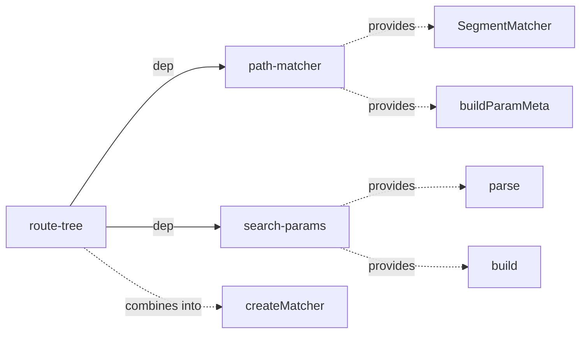
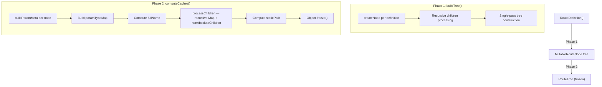
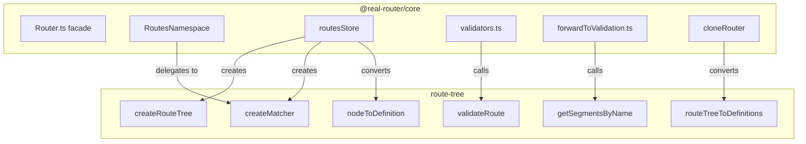

# Architecture

> Detailed architecture for AI agents and contributors

## Overview

`route-tree` is an **internal package** that provides the route tree data structure, URL matching, path building, and route validation for `@real-router/core`. It acts as an **integration layer** between two zero-dependency packages (`path-matcher` and `search-params`), combining them into a cohesive routing engine.

**Key role:** Core never touches `path-matcher` or `search-params` directly — all access goes through `route-tree`.

## Package Structure

```
route-tree/
├── src/
│   ├── builder/
│   │   ├── buildTree.ts           — Single-pass mutable tree construction
│   │   ├── computeCaches.ts       — Cache computation + freeze
│   │   ├── createRouteTree.ts     — Public API (function + builder)
│   │   ├── types.ts               — RouteTree, RouteDefinition, RouteTreeBuilder
│   │   └── index.ts
│   ├── operations/
│   │   ├── query.ts               — getSegmentsByName() — O(1) route lookup
│   │   ├── routeTreeToDefinitions.ts — Tree → RouteDefinition[] (for cloneRouter)
│   │   └── types.ts               — MatchResult, RouteTreeState, mode types
│   ├── validation/
│   │   ├── errors.ts              — RouteNodeError hierarchy
│   │   ├── route-batch.ts         — Full route validation with duplicate detection
│   │   └── routes.ts              — Path format validation
│   ├── createMatcher.ts           — Matcher factory (SegmentMatcher + search-params DI)
│   ├── types.ts                   — Central re-export hub
│   └── index.ts                   — Public API exports
```

## Dependencies



`route-tree` wraps `path-matcher` and `search-params` into a single facade:

| Dependency        | What route-tree uses   | Purpose                                                              |
| ----------------- | ---------------------- | -------------------------------------------------------------------- |
| **path-matcher**  | `SegmentMatcher` class | Segment Trie for URL matching and path building                      |
| **path-matcher**  | `buildParamMeta()`     | Extract param metadata from path patterns                            |
| **path-matcher**  | `ParamMeta` type       | Parameter metadata (urlParams, queryParams, spatParams, constraintPatterns, paramTypeMap, pathPattern) |
| **search-params** | `parse()`              | Query string parsing (DI into SegmentMatcher)                        |
| **search-params** | `build()`              | Query string building (DI into SegmentMatcher)                       |
| **search-params** | Type re-exports        | `ArrayFormat`, `BooleanFormat`, `NullFormat`, etc.                   |

**Key design:** `path-matcher` has no query string handling — `route-tree` injects `search-params` functions via dependency injection at matcher creation time.

## Core Data Structures

### RouteTree

Immutable tree node. Data-only (no methods). All caches pre-computed at build time.

```typescript
interface RouteTree {
  // === Core Properties ===
  readonly name: string; // "profile"
  readonly path: string; // "/:id"
  readonly absolute: boolean; // path starts with "~"
  readonly children: ReadonlyMap<string, RouteTree>; // O(1) lookup by name
  readonly paramMeta: ParamMeta; // from path-matcher

  // === Pre-computed Caches ===
  readonly parent: RouteTree | null; // null for root
  readonly nonAbsoluteChildren: readonly RouteTree[]; // filtered children
  readonly fullName: string; // "users.profile"
  readonly staticPath: string | null; // pre-built for parameterless routes
  readonly paramTypeMap: Readonly<Record<string, "url" | "query">>;
}
```

**Cache purpose:**

| Cache                 | Avoids                                       | Used by                          |
| --------------------- | -------------------------------------------- | -------------------------------- |
| `fullName`            | Runtime `parent.join(".")` on every lookup   | All name-based operations        |
| `staticPath`          | `inject()` + path building for static routes | `buildPath()` fast path          |
| `paramTypeMap`        | Recomputing url vs query classification      | `buildState()`, meta computation |
| `nonAbsoluteChildren` | Filtering on every match iteration           | Segment Trie matching            |
| `children` Map        | O(n) array scan for child lookup             | `getSegmentsByName()`            |

### RouteDefinition

User-facing input format. Extensible via index signature for custom fields (`canActivate`, `forwardTo`, `encodeParams`, etc.).

```typescript
interface RouteDefinition {
  [key: string]: unknown; // custom fields pass through
  name: string; // "users"
  path: string; // "/users/:id"
  children?: RouteDefinition[];
}
```

### MatchResult

Return type of `matcher.match(path)`.

```typescript
interface MatchResult<P extends RouteParams = RouteParams> {
  readonly segments: readonly RouteTree[]; // matched segments (root → leaf)
  readonly params: P; // merged URL + query params
  readonly meta: Readonly<RouteTreeStateMeta>; // segment → paramTypeMap
}
```

### RouteTreeState

Simplified state from matching (name + params + meta). Used by core to build full `State`.

```typescript
interface RouteTreeState<P extends RouteParams = RouteParams> {
  name: string; // "users.profile"
  params: P; // { id: "123" }
  meta: RouteTreeStateMeta; // { users: {}, "users.profile": { id: "url" } }
}
```

## Build Pipeline

Route tree construction is a two-phase process:



### Phase 1: buildTree() — Mutable Construction

Single-pass recursive algorithm. Creates `MutableRouteNode` tree from `RouteDefinition[]`.

```typescript
interface MutableRouteNode {
  name: string;
  path: string;
  absolute: boolean;
  children: MutableRouteNode[];
  parent: MutableRouteNode | null;
  nonAbsoluteChildren: MutableRouteNode[]; // initialized empty, populated in Phase 2
  fullName: string; // initialized empty, computed in Phase 2
}
```

- Absolute paths: detected by `path.startsWith("~")`, tilde stripped from stored `path`
- Children: recursively created via `createNode()`
- Parent references: set during construction

### Phase 2: computeCaches() — Immutable Output

Recursively processes each `MutableRouteNode` into `RouteTree`:

1. **`buildParamMeta(path)`** — extracts `urlParams`, `queryParams`, `spatParams`, `constraintPatterns` from path pattern (via `path-matcher`)
2. **`buildParamTypeMap(paramMeta)`** — maps param names to `"url"` | `"query"`
3. **`computeFullName(node)`** — builds dot-notation name from parent chain (`"users.profile"`)
4. **`processChildren()`** — recursively processes children, builds `ReadonlyMap`, filters `nonAbsoluteChildren`
5. **`computeStaticPath(node)`** — pre-builds full path string for parameterless routes (walks parent chain, checks all segments for params; returns `null` for empty-path nodes)
6. **`Object.freeze()`** — freezes node, children map, arrays, paramTypeMap

**Skeleton node pattern:** Node is created as a mutable skeleton, then fields are assigned after recursive child processing (children need parent reference).

## Matcher Factory

`createMatcher()` combines `SegmentMatcher` (from `path-matcher`) with `parse`/`build` (from `search-params`) via dependency injection:

```typescript
function createMatcher(options?: CreateMatcherOptions): Matcher {
  const qp = options?.queryParams;

  return new SegmentMatcher({
    caseSensitive, // from options
    strictTrailingSlash, // from options
    strictQueryParams, // from options
    urlParamsEncoding, // from options
    parseQueryString: (qs) => parse(qs, qp), // DI: search-params
    buildQueryString: (p) => build(p, qp), // DI: search-params
  });
}
```

**Opaque type:** `Matcher` is a type alias for `SegmentMatcher`. Consumers use it without knowing the implementation.

### Matcher Lifecycle

```
createMatcher(options) → matcher
matcher.registerTree(tree) → ready for matching
matcher.match(path) → MatchResult | undefined
matcher.buildPath(name, params, opts) → string
matcher.getSegmentsByName(name) → RouteTree[] | undefined
matcher.getMetaByName(name) → RouteTreeStateMeta | undefined
matcher.hasRoute(name) → boolean
```

### CreateMatcherOptions

```typescript
interface CreateMatcherOptions {
  readonly caseSensitive?: boolean; // default: true
  readonly strictTrailingSlash?: boolean; // default: false
  readonly strictQueryParams?: boolean; // default: false
  readonly urlParamsEncoding?: "default" | "uri" | "uriComponent" | "none";
  readonly queryParams?: QueryParamsConfig; // array/boolean/null format
}
```

## Route Validation

### validateRoute() — Full Route Validation

Entry point for validating route objects before adding to the tree. Used by core's `addRoute()`.

```
validateRoute(route, methodName, rootNode?, parentName?, seenNames?, seenPathsByParent?)
```

**Validation pipeline:**

1. **Type check** — must be plain object (not class instance), no getters/setters
2. **Name validation** — non-empty string, no dots, matches `/^[A-Z_a-z][\w-]*$/`, max 10,000 chars, `@@` prefix for system routes
3. **Path validation** — via `validateRoutePath()` (see below)
4. **Function properties** — `encodeParams`/`decodeParams` must be functions if present
5. **Tree duplicate check** — name doesn't exist in current tree
6. **Batch duplicate check** — name not seen in current batch
7. **Path duplicate check** — path not already defined at same parent level (tree + batch)
8. **Recursive children** — validates each child with accumulated parent name

### validateRoutePath() — Path Format Validation

```
validateRoutePath(path, routeName, methodName, parentNode?)
```

**Valid formats:**

| Format              | Example                   | Purpose                 |
| ------------------- | ------------------------- | ----------------------- |
| Empty string        | `""`                      | Grouping/root routes    |
| Absolute            | `"/users"`, `"/api/v2"`   | Standard paths          |
| Absolute with tilde | `"~/dashboard"`           | Override parent path    |
| Query-only          | `"?page"`, `"?q&limit"`   | Query parameter routes  |
| Relative segment    | `"profile"`, `"settings"` | Appended to parent path |
| Parameterized       | `"/:id"`, `"/:id<\\d+>"`  | Dynamic URL params      |
| Splat               | `"/*path"`                | Catch-all params        |
| Optional            | `"/:id?"`                 | Optional URL params     |

**Rejected:**

| Rule                             | Example                    | Reason             |
| -------------------------------- | -------------------------- | ------------------ |
| Non-string                       | `null`, `123`              | Type safety             |
| Whitespace (`\s`)                | `"/users /list"`           | Any whitespace rejected |
| Invalid path format              | `"#fragment"`              | Must match `/^([/?~]\|[^/]+$)/` |
| Double slashes                   | `"//users"`                | Malformed URLs          |
| Tilde under parameterized parent | `"~/admin"` under `"/:id"` | Ambiguous matching     |

### Error Hierarchy

```
RouteNodeError (base)                — not exported from package
├── DuplicateRouteError     — { duplicateValue, duplicateType: "name" | "path" }  ← exported
├── InvalidRouteError       — malformed route definition                          ← exported
├── RouteNotFoundError      — { routeName }                                       ← internal only
└── ParentNotFoundError     — { routeName }                                       ← internal only
```

**Note:** Only `DuplicateRouteError` and `InvalidRouteError` are exported from the package's public surface (via `builder/index.ts`). `RouteNotFoundError`, `ParentNotFoundError`, and the base `RouteNodeError` are defined in `validation/errors.ts` but not re-exported — consumers cannot `instanceof`-check these types.

## Query Operations

### getSegmentsByName()

O(1) per level lookup using `ReadonlyMap`. Returns segment chain from root to target.

```typescript
getSegmentsByName(tree, "users.profile");
// → [usersNode, profileNode]

getSegmentsByName(tree, "nonexistent");
// → null
```

**Optimizations:**

- Single-segment names skip `split(".")` allocation
- Root with non-empty path included as first segment

### routeTreeToDefinitions()

Converts `RouteTree` back to `RouteDefinition[]`. Used by `cloneRouter()` for SSR.

- Reconstructs `~` prefix for absolute paths
- Recursively converts children
- Does NOT preserve custom fields (`canActivate`, `forwardTo`, etc.)

## Usage in @real-router/core

### Integration Points



### routesStore — Tree Lifecycle

```typescript
// Initial creation (in createRoutesStore)
const tree = createRouteTree(DEFAULT_ROUTE_NAME, rootPath, definitions);
const matcher = createMatcher(matcherOptions);
matcher.registerTree(tree);

// After route changes (in commitTreeChanges)
const { tree, matcher } = rebuildTree(definitions, rootPath, matcherOptions);
// Both tree and matcher rebuilt together — always in sync
```

**Key invariant:** `tree` and `matcher` are always rebuilt as a pair. Never update one without the other.

### RoutesNamespace — Matcher Delegation

| Facade method                | Delegates to                                      | route-tree API                          |
| ---------------------------- | ------------------------------------------------- | --------------------------------------- |
| `matchPath(path)`            | `matcher.match(path)`                             | `MatchResult` extraction                |
| `buildPath(route, params)`   | `matcher.buildPath(route, params, opts)`          | Path string building                    |
| `hasRoute(name)`             | `matcher.hasRoute(name)`                          | Boolean check                           |
| `getUrlParams(name)`         | `matcher.getSegmentsByName(name)`                 | `segment.paramMeta.urlParams` iteration |
| `buildState(name, params)`   | `matcher.getSegmentsByName()` + `getMetaByName()` | `RouteTreeState` construction           |
| `forwardState(name, params)` | `getSegmentsByName()`                             | Forward chain validation                |

### cloneRouter — Tree Serialization

```typescript
// api/cloneRouter.ts
const routes = routeTreeToDefinitions(sourceStore.tree);
const newRouter = new Router(routes, options, mergedDeps);
```

Tree is immutable (`Object.freeze`) — safe to read from source router while building clone.

### Core Imports Summary

| Core module              | Imports from route-tree                                            |
| ------------------------ | ------------------------------------------------------------------ |
| `routesStore.ts`         | `createMatcher`, `createRouteTree`, `nodeToDefinition`, types      |
| `RoutesNamespace.ts`     | Types only (`CreateMatcherOptions`, `RouteParams`, `RouteTree`, `RouteTreeState`) |
| `validators.ts`          | `validateRoute`, `Matcher`, `RouteTree` types                      |
| `forwardToValidation.ts` | `getSegmentsByName`, `RouteTree` type                              |
| `cloneRouter.ts`         | `routeTreeToDefinitions`                                           |
| `Router.ts`              | `CreateMatcherOptions` type                                        |
| `internals.ts`           | `RouteTree` type                                                   |
| `StateNamespace`         | `RouteTreeStateMeta` type                                          |
| `getRoutesApi.ts`        | `RouteDefinition`, `RouteTree` types                               |

## Performance Characteristics

### Build Time

| Operation         | Complexity | Notes                         |
| ----------------- | ---------- | ----------------------------- |
| Tree construction | O(n)       | Single-pass, n = total routes |
| Cache computation | O(n)       | One pass per node             |
| Freeze            | O(n)       | `Object.freeze()` per node    |

### Runtime

| Operation                 | Complexity  | Notes                     |
| ------------------------- | ----------- | ------------------------- |
| `match(path)`             | O(segments) | Segment Trie traversal    |
| `buildPath(name, params)` | O(segments) | Path injection            |
| `buildPath` (static)      | O(1)        | Pre-computed `staticPath` |
| `getSegmentsByName(name)` | O(depth)    | Map.get() per level       |
| `hasRoute(name)`          | O(depth)    | Map.get() per level       |

### Memory Optimizations

- `staticPath` — avoids `inject()` overhead for parameterless routes
- `nonAbsoluteChildren` — pre-filtered array, no allocation during matching
- `children` Map — O(1) vs O(n) array iteration
- `paramTypeMap` — cached classification, avoids recomputing per navigation
- Conditional spread in `createMatcher()` — avoids `undefined` properties (exactOptionalPropertyTypes)

## Potential Development

Ideas grouped by what they actually optimize. The hot path (`match` → `buildPath`) is determined by `path-matcher` (Segment Trie), not `route-tree` — so most ideas here affect **build/load time**, not runtime navigation speed.

### Build/Load Time Optimization

#### Incremental Tree Updates

Currently, any route change (`addRoute`, `removeRoute`) triggers a full `rebuildTree()` — O(n) rebuild of tree + matcher from scratch. For applications with frequent dynamic route registration this is the main bottleneck.

- **What it optimizes:** `addRoute`/`removeRoute` — from O(n) to O(1)
- **What it does NOT optimize:** `match()`/`buildPath()` — the matcher is identical after construction regardless of how it was built
- **Approach:** Insert/detach nodes in existing tree, register/deregister segments in trie incrementally
- **Challenge:** Maintaining immutability guarantees — would require copy-on-write or structural sharing
- **Trigger:** Applications with 500+ routes and frequent runtime `addRoute` calls

#### Async Route Loading

Lazy-loaded route subtrees (code splitting) to reduce initial bundle and speed up first `start()`.

- **What it optimizes:** Initial load time — smaller bundle, faster first `start()`
- **What it does NOT optimize:** Runtime navigation by already-loaded routes
- **Approach:** Placeholder node replaced with full subtree after async load
- **Challenge:** Matcher registration for not-yet-loaded routes, fallback matching, race conditions with concurrent navigations
- **Trigger:** Large SPAs with 100+ routes where most are not visited in a typical session

### Developer Experience

#### Route Tree Diffing

Tree diff algorithm — identify exactly which routes changed between two trees.

- **Impact:** DX only (development tooling, logging). No production performance effect
- **Approach:** Compare old and new `RouteTree`, produce delta (added/removed/changed nodes)
- **Challenge:** Deep comparison of frozen objects, handling renamed vs removed+added
- **Prerequisite:** `SegmentMatcher.patchTree(delta)` — incremental trie updates (see "Incremental Tree Updates" above). Without it, diffing has no consumer — full rebuild is needed regardless
- **Note:** HMR does NOT require diffing. `routesApi.replace()` solves HMR via full tree rebuild + state revalidation

#### Constraint Composition

Reusable, composable constraints instead of inline regex patterns.

- **Impact:** DX/ergonomics only. No performance effect — regex execution time is identical
- **Approach:** Named constraint factories composed via helpers
- **Challenge:** API design, backward compatibility with string patterns
- **Trigger:** User demand for constraint reuse across routes

### Likely Not Worth Investigating

#### Lazy Cache Computation

Compute `staticPath`, `paramTypeMap` lazily (on first access) instead of eagerly for all nodes.

- **Why unlikely:** `computeCaches()` runs once at build time. For typical SPA (50-200 routes) this is microseconds. Lazy computation would add a "is computed?" check on every navigation — likely slower overall due to branch prediction overhead on the hot path
- **When it could matter:** Trees with 10,000+ routes where most are never matched (unlikely in practice)

## See Also

- [path-matcher ARCHITECTURE.md](../path-matcher/ARCHITECTURE.md) — Segment Trie URL matching (zero deps)
- [search-params ARCHITECTURE.md](../search-params/ARCHITECTURE.md) — Query string parsing/building (zero deps)
- [core CLAUDE.md](../core/CLAUDE.md) — Core package architecture
- [ARCHITECTURE.md](../../ARCHITECTURE.md) — System-level architecture
