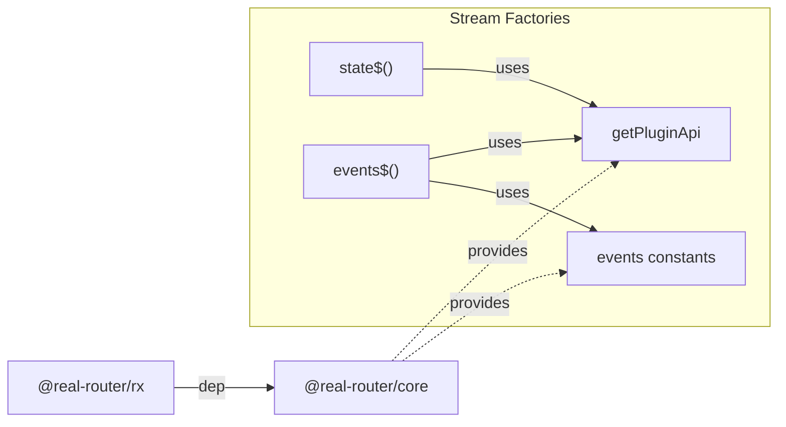

# Architecture

> Detailed architecture for AI agents and contributors

## Overview

`@real-router/rx` provides a **zero-cost opt-in** reactive programming interface for the router via TC39 Observable-compliant streams. Cold observables, composable operators, and `for await...of` support — all without requiring RxJS as a dependency.

**Key role:** Bridges the router's event system into a functional reactive model. `state$()` and `events$()` factories create observables from the router's plugin API. The `pipe()` method chains operators for filtering, mapping, and deduplication.

## Package Structure

```
rx/
├── src/
│   ├── RxObservable.ts                — Observable class (281 lines)
│   ├── state$.ts                      — State stream factory (36 lines)
│   ├── events$.ts                     — Event stream factory (115 lines)
│   ├── observable.ts                  — TC39 Observable wrapper (28 lines)
│   ├── types.ts                       — Observer, Subscription, Operator types
│   ├── index.ts                       — Public API exports
│   └── operators/
│       ├── createOperator.ts          — Operator factories (37 lines)
│       ├── map.ts                     — Value transformation (15 lines)
│       ├── filter.ts                  — Value filtering (21 lines)
│       ├── distinctUntilChanged.ts    — Deduplication (40 lines)
│       ├── debounceTime.ts            — Timer-based debounce (70 lines)
│       ├── takeUntil.ts              — Notifier-based completion (99 lines)
│       └── index.ts                   — Operator exports
```

## Dependencies



| Consumer      | What it uses                     | Purpose                                    |
| ------------- | -------------------------------- | ------------------------------------------ |
| **state$()**  | `getPluginApi`, `events.TRANSITION_SUCCESS` | Subscribe to state changes        |
| **events$()** | `getPluginApi`, all 6 event constants       | Subscribe to all lifecycle events |
| **observable()** | `state$()`                    | TC39 Observable interop wrapper            |

## Public API

### RxObservable — Main Class

```typescript
class RxObservable<T> {
  constructor(subscribeFn: SubscribeFn<T>);

  subscribe(
    observerOrNext: Observer<T> | ((value: T) => void),
    options?: ObservableOptions,
  ): Subscription;

  pipe(): this;
  pipe<A>(op1: Operator<T, A>): RxObservable<A>;
  // ... overloads up to 9 operators
  pipe<A, B, C, D, E, F, G, H, I>(
    op1: Operator<T, A>,
    op2: Operator<A, B>,
    op3: Operator<B, C>,
    op4: Operator<C, D>,
    op5: Operator<D, E>,
    op6: Operator<E, F>,
    op7: Operator<F, G>,
    op8: Operator<G, H>,
    op9: Operator<H, I>,
  ): RxObservable<I>;

  [Symbol.observable](): this;
  ["@@observable"](): this;
  [Symbol.asyncIterator](): AsyncIterableIterator<T>;
}
```

### Stream Factories

```typescript
function state$(
  router: Router,
  options?: { replay?: boolean },
): RxObservable<SubscribeState>;
function events$(router: Router): RxObservable<RouterEvent>;
function observable(router: Router): RxObservable<SubscribeState>;
```

### Operators

```typescript
function map<T, R>(project: (value: T) => R): Operator<T, R>;
function filter<T, S extends T>(
  predicate: (value: T) => value is S,
): Operator<T, S>;
function filter<T>(predicate: (value: T) => boolean): Operator<T, T>;
function distinctUntilChanged<T>(
  comparator?: (a: T, b: T) => boolean,
): Operator<T, T>;
function debounceTime<T>(duration: number): Operator<T, T>;
function takeUntil<T>(notifier: RxObservable<unknown>): Operator<T, T>;
```

### Types

```typescript
interface Observer<T> {
  next?: (value: T) => void;
  error?: (err: unknown) => void;
  complete?: () => void;
}

interface Subscription {
  unsubscribe: () => void;
  readonly closed: boolean;
}

interface ObservableOptions {
  signal?: AbortSignal;
  replay?: boolean;
}

type SubscribeFn<T> = (observer: Observer<T>) => void | (() => void);
type Operator<T, R> = (source: RxObservable<T>) => RxObservable<R>;
type UnaryFunction<T, R> = (source: T) => R;

// Re-exported from @real-router/core
type SubscribeState = { route: State; previousRoute: State | undefined };

type RouterEvent =
  | { type: "ROUTER_START" }
  | { type: "ROUTER_STOP" }
  | { type: "TRANSITION_START"; toState: State; fromState: State | undefined }
  | {
      type: "TRANSITION_SUCCESS";
      toState: State;
      fromState: State | undefined;
      options: NavigationOptions;
    }
  | {
      type: "TRANSITION_ERROR";
      toState: State | undefined;
      fromState: State | undefined;
      error: RouterError;
    }
  | { type: "TRANSITION_CANCEL"; toState: State; fromState: State | undefined };
```

## Core Data Structures

### Internal State

```typescript
class RxObservable<T> {
  #subscribeFn: SubscribeFn<T>; // The subscribe function (set once in constructor)
}
```

Minimal state — all subscription state (`closed`, `teardown`, `abortHandler`) lives in `subscribe()` closures, not on the instance. Each subscription is fully independent.

## Core Algorithms

### subscribe() — Subscription Flow

```
subscribe(observerOrNext, options?)
    │
    ▼
┌──────────────────────┐
│  Normalize observer    │  function → { next: fn }
│  Check AbortSignal     │  signal.aborted → return pre-closed Subscription
└──────────┬───────────┘
           │
           ▼
┌──────────────────────┐
│  Create safe wrappers  │  safeNext, safeError, safeComplete
│  (closed-guard +       │  - safeNext: try { next(value) } catch → safeError
│   try/catch each)      │  - safeError: try { error(err) } catch → silent
│                        │  - safeComplete: set closed, try { complete() } catch → silent
└──────────┬───────────┘
           │
           ▼
┌──────────────────────┐
│  Wire AbortSignal      │  signal.addEventListener("abort", unsubscribe)
│  (if provided)         │  Cleaned up on unsubscribe
└──────────┬───────────┘
           │
           ▼
┌──────────────────────┐
│  Call #subscribeFn     │  teardown = subscribeFn({ next, error, complete })
│  (may throw → error)  │  Errors caught → safeError
└──────────┬───────────┘
           │
           ▼
  return Subscription { unsubscribe(), get closed }
```

**Error boundaries:**
- Error in `next` callback → forwarded to `error` callback
- Error in `error` callback → caught silently
- Error in `complete` callback → caught silently
- Error in teardown → caught silently
- No `error` callback → `console.error("Unhandled error in RxObservable:", err)`

### pipe() — Operator Composition

```typescript
pipe(...operators) {
  if (operators.length === 0) return this;   // identity
  let result = this;
  for (const operator of operators)
    result = operator(result);               // left-to-right chaining
  return result;
}
```

Each operator receives the previous observable and returns a new one. Type-safe via 9 overloads.

### Symbol.asyncIterator — Latest-Value Semantics

```
for await (const value of observable) {
    │
    ▼
┌──────────────────────┐
│  Subscribe to source   │  Track: latestValue, hasValue, completed, error
└──────────┬───────────┘
           │
           ▼
┌──────────────────────────────┐
│  Loop while !completed        │
│  ├── hasValue?               │
│  │   ├── YES → yield value   │  (clears hasValue)
│  │   └── NO  → await Promise │  (resolved by next/error/complete)
│  └── error? → throw error    │
└──────────────────────────────┘
           │
           ▼
┌──────────────────────┐
│  finally: unsubscribe  │  Always runs (break, throw, or natural completion)
└──────────────────────┘
```

**Latest-value:** If multiple values arrive while the iterator is suspended in `yield`, only the most recent value is yielded next. Intermediate values are skipped.

## Stream Factories

### state$() — State Stream

```
state$(router, options?)
    │
    ▼
  new RxObservable(observer => {
    │
    ├── api = getPluginApi(router)
    ├── unsubscribe = api.addEventListener(TRANSITION_SUCCESS, (toState, fromState) =>
    │       observer.next({ route: toState, previousRoute: fromState })
    │   )
    │
    ├── if replay (default: true) && router.getState() exists:
    │       queueMicrotask(() =>
    │           observer.next({ route: currentState, previousRoute: undefined })
    │       )
    │
    └── return unsubscribe   // teardown
  })
```

- **Cold observable:** No work until `.subscribe()` is called
- **Replay via microtask:** Initial state emitted asynchronously to ensure subscriber's `next` is wired
- **Default `replay: true`** — always emits current state on subscribe

### events$() — Event Stream

```
events$(router)
    │
    ▼
  new RxObservable(observer => {
    │
    ├── api = getPluginApi(router)
    ├── Register 6 listeners (with partial-registration safety):
    │   ├── ROUTER_START      → { type: "ROUTER_START" }
    │   ├── ROUTER_STOP       → { type: "ROUTER_STOP" }
    │   ├── TRANSITION_START  → { type, toState, fromState }
    │   ├── TRANSITION_SUCCESS → { type, toState, fromState, options }
    │   ├── TRANSITION_ERROR  → { type, toState, fromState, error }
    │   └── TRANSITION_CANCEL → { type, toState, fromState }
    │
    ├── catch: Unsubscribe all registered listeners, re-throw error
    │
    └── return () => { unsubscribe all 6 }   // teardown
  })
```

- **Partial registration safety:** If any `addEventListener()` throws, all successfully registered listeners are cleaned up
- **Discriminated union:** `RouterEvent.type` field enables type narrowing via `filter()`

### observable() — TC39 Wrapper

Delegates to `state$(router)`. Enables `from(observable(router))` pattern for RxJS interop.

## Operator Architecture

### Two-Tier Factory System

```
createOperator(next)              — Stateless operators (map, filter)
    └── Wires: error/complete propagation, teardown
    └── Caller only implements: next(value, observer)

createStatefulOperator(subscribeFn) — Stateful operators (distinctUntilChanged)
    └── Caller owns: full subscription setup + teardown
    └── Returns: teardown function
```

### Operator Details

**map** — Transform each value. Errors in `project` → `observer.error`.

**filter** — Emit only values where `predicate(value)` is true. Type guard overload narrows `T → S`. Errors in `predicate` → `observer.error`.

**distinctUntilChanged** — Skip consecutive duplicates. Default comparator: `(a, b) => a === b`. First value always emitted. Stateful: tracks `hasLast` + `last`. Errors in comparator → `observer.error`.

**debounceTime** — Delay emissions by `duration` ms, emitting only the latest. Validates duration (non-negative, finite) or throws `RangeError`. Flushes pending value on `complete`. Clears timer on `error` (no flush). Clears timer on `unsubscribe`.

**takeUntil** — Complete when `notifier` emits. Manages two subscriptions with race condition guards:

| Event              | Action                              |
| ------------------ | ----------------------------------- |
| Notifier emits     | Complete + unsubscribe both         |
| Notifier errors    | Error + unsubscribe source          |
| Source emits       | Forward to observer                 |
| Source errors      | Error + unsubscribe notifier        |
| Source completes   | Complete + unsubscribe both         |
| Unsubscribe        | Unsubscribe both                    |

**Subscription order:** Notifier subscribes first (handles synchronous emission), then source. Early return if notifier completes/errors synchronously before source subscription.

## Error Isolation

Three-level error handling in `subscribe()`:

| Level                            | Behavior                                           |
| -------------------------------- | -------------------------------------------------- |
| Error in `next` callback         | Forwarded to `error` callback via `safeError`      |
| Error in `error`/`complete`/teardown | Caught silently (prevents cascade)             |
| No `error` callback provided     | `console.error("Unhandled error in RxObservable:", err)` |

Operators add their own try/catch around user-provided functions (project, predicate, comparator) and forward errors to `observer.error`.

## TC39 Observable / RxJS Interop

```typescript
// Symbol.observable — TC39 proposal
observable[Symbol.observable](); // returns self
observable["@@observable"](); // returns self (legacy RxJS)

// RxJS interop
import { from } from "rxjs";
const rxjsObservable = from(observable(router));
```

Both symbol methods return `this`, enabling any TC39/RxJS consumer to wrap `RxObservable` instances.

## Performance Characteristics

| Operation                    | Complexity | Notes                                     |
| ---------------------------- | ---------- | ----------------------------------------- |
| `subscribe()`                | O(1)       | Closure creation + optional signal wiring  |
| `pipe()` — no operators     | O(1)       | Returns `this`                             |
| `pipe()` — N operators      | O(N)       | One new `RxObservable` per operator        |
| `state$()` subscribe        | O(1)       | Single `addEventListener` + optional microtask |
| `events$()` subscribe       | O(1)       | 6 `addEventListener` calls                 |
| `map` / `filter` per value  | O(1)       | Single function call + forward             |
| `distinctUntilChanged`       | O(1)       | Compare + optional forward                 |
| `debounceTime` per value    | O(1)       | `clearTimeout` + `setTimeout`              |
| `takeUntil` per value       | O(1)       | Guard check + forward                      |

### Memory

| Allocation              | Size          | When                            |
| ----------------------- | ------------- | ------------------------------- |
| Per `subscribe()` call  | ~300 B        | Closures for safe wrappers      |
| Per operator in `pipe()`| ~200 B        | New `RxObservable` + closure    |
| `events$()` teardown    | ~100 B        | Array of 6 unsubscribe functions |
| `debounceTime` state    | ~50 B         | Timer ID + pending value        |

## See Also

- [core CLAUDE.md](../core/CLAUDE.md) — Core package architecture
- [event-emitter ARCHITECTURE.md](../event-emitter/ARCHITECTURE.md) — Event emitter (events are observed via plugin API)
- [ARCHITECTURE.md](../../ARCHITECTURE.md) — System-level architecture
