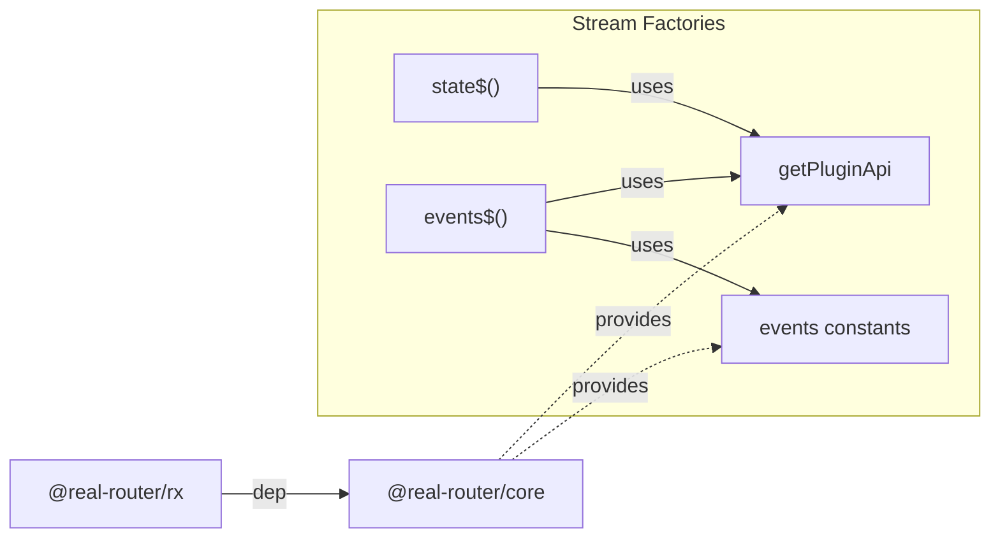

# Architecture

> Detailed architecture for AI agents and contributors

## Overview

`@real-router/rx` provides a **zero-cost opt-in** reactive programming interface for the router via TC39 Observable-compliant streams. Cold observables, composable operators, and `for await...of` support — all without requiring RxJS as a dependency.

**Key role:** Bridges the router's event system into a functional reactive model. `state$()` and `events$()` factories create observables from the router's plugin API. The `pipe()` method chains operators for filtering, mapping, and deduplication.

## Package Structure

```
rx/
├── src/
│   ├── RxObservable.ts                — Observable class: subscribe(), pipe(), [Symbol.asyncIterator]()
│   ├── state$.ts                      — State stream factory
│   ├── events$.ts                     — Event stream factory (all router events)
│   ├── observable.ts                  — TC39 Observable wrapper for RxJS interop
│   ├── types.ts                       — Observer, Subscription, Operator types
│   ├── index.ts                       — Public API exports
│   └── operators/
│       ├── createOperator.ts          — Shared operator factory
│       ├── map.ts                     — Value transformation
│       ├── filter.ts                  — Value filtering
│       ├── distinctUntilChanged.ts    — Consecutive deduplication
│       ├── debounceTime.ts            — Timer-based debounce
│       ├── takeUntil.ts              — Notifier-based completion
│       └── index.ts                   — Operator exports
```

## Dependencies


```mermaid
graph LR
    RX["@real-router/rx"] -->|dep| CORE["@real-router/core"]

    CORE -.->|provides| PAPI[getPluginApi]
    CORE -.->|provides| EVENTS[events constants]

    subgraph rx [Stream Factories]
        STATE["state$()"] -->|uses| PAPI
        EVT["events$()"] -->|uses| PAPI
        EVT -->|uses| EVENTS
    end
```

| Consumer         | What it uses                                | Purpose                           |
| ---------------- | ------------------------------------------- | --------------------------------- |
| **state$()**     | `getPluginApi`, `events.TRANSITION_SUCCESS` | Subscribe to state changes        |
| **events$()**    | `getPluginApi`, all 6 event constants       | Subscribe to all lifecycle events |
| **observable()** | `state$()`                                  | TC39 Observable interop wrapper   |

## Core Design

`RxObservable<T>` holds a single private field `#subscribeFn`. All subscription state (`closed`, `teardown`, `abortHandler`) lives in `subscribe()` closures, not on the instance. Each subscription is fully independent.

## Core Algorithms

### subscribe() — Subscription Flow

```
subscribe(observerOrNext, options?)
    │
    ▼
┌──────────────────────┐
│  Normalize observer  │  function → { next: fn }
│  Check AbortSignal   │  signal.aborted → return pre-closed Subscription
└──────────┬───────────┘
           │
           ▼
┌───────────────────────┐
│  Create safe wrappers │  safeNext, safeError, safeComplete, finalize
│  (closed-guard +      │  - safeNext: try { next(value) } catch → safeError
│   try/catch each)     │  - safeError: try { error(err) } catch → silent (non-terminal)
│                       │  - safeComplete: set closed, try { complete() } catch → silent, finalize()
│                       │  - finalize: removeEventListener("abort") + teardown() (once)
└──────────┬────────────┘
           │
           ▼
┌──────────────────────┐
│  Wire AbortSignal    │  signal.addEventListener("abort", unsubscribe)
│  (if provided)       │  Cleaned up by finalize() — on unsubscribe OR complete
└──────────┬───────────┘
           │
           ▼
┌──────────────────────┐
│  Call #subscribeFn   │  teardown = subscribeFn({ next, error, complete })
│  (may throw → error) │  Errors caught → safeError
└──────────┬───────────┘
           │
           ▼
┌──────────────────────┐
│  if (closed)         │  sync complete() inside subscribeFn ran finalize()
│    finalize()        │  before teardown existed — run it now (#772)
└──────────┬───────────┘
           │
           ▼
  return Subscription { unsubscribe(), get closed }
```

**Error boundaries:**

- Error in `next` callback → forwarded to `error` callback
- Error in `error` callback → caught silently
- Error in `complete` callback → caught silently
- Error in teardown → caught silently
- No `error` callback → `console.error("Unhandled error in RxObservable:", err)`

**Terminal teardown (#772):** teardown and abort-listener removal run via a shared `finalize()` on **every** terminal path — `unsubscribe()` AND `complete()` — so a self-completing source still releases its resource (`unsubscribe()` after `complete()` is a no-op). `finalize()` runs teardown at most once; a synchronous `complete()` inside the subscribe function defers it to the post-subscribe `if (closed) finalize()`. `error` is intentionally **non-terminal** (does not set `closed`, does not finalize) — resources release on the consumer's `unsubscribe()`.

### pipe() — Operator Composition

```typescript
pipe(...operators) {
  if (operators.length === 0) return this;   // identity
  let result = this;
  for (const operator of operators)
    result = operator(result);               // left-to-right chaining
  return result;
}
```

Each operator receives the previous observable and returns a new one. Type-safe via 9 overloads.

### Symbol.asyncIterator — Latest-Value Semantics

```
for await (const value of observable) {
    │
    ▼
┌──────────────────────┐
│  Subscribe to source │  Track: latestValue, hasValue, completed, error
└──────────┬───────────┘
           │
           ▼
┌──────────────────────────────┐
│  Loop while !completed       │
│  ├── hasValue?               │
│  │   ├── YES → yield value   │  (clears hasValue)
│  │   └── NO  → await Promise │  (resolved by next/error/complete)
│  └── error? → throw error    │
└──────────────────────────────┘
           │
           ▼
┌────────────────────────┐
│  finally: unsubscribe  │  Always runs (break, throw, or natural completion)
└────────────────────────┘
```

**Latest-value:** If multiple values arrive while the iterator is suspended in `yield`, only the most recent value is yielded next. Intermediate values are skipped.

## Stream Factories

### state$() — State Stream

```
state$(router, options?)
    │
    ▼
  new RxObservable(observer => {
    │
    ├── api = getPluginApi(router)
    ├── sawEvent = false
    ├── unsubscribe = api.addEventListener(TRANSITION_SUCCESS, (toState, fromState) => {
    │       sawEvent = true
    │       observer.next({ route: toState, previousRoute: fromState })
    │   })
    │
    ├── if replay (default: true) && router.getState() exists:
    │       queueMicrotask(() => {
    │           if (sawEvent) return   // a live event already delivered a fresher snapshot
    │           observer.next({ route: currentState, previousRoute: undefined })
    │       })
    │
    └── return unsubscribe   // teardown
  })
```

- **Cold observable:** No work until `.subscribe()` is called
- **Replay via microtask:** Initial state emitted asynchronously to ensure subscriber's `next` is wired
- **Replay yields to live events (#771):** a synchronous navigation can fire `TRANSITION_SUCCESS` inside the subscribe→microtask window (core's optimistic-sync commit). The `sawEvent` guard suppresses the deferred replay in that case — the live event already delivered a fresher snapshot, so emitting the captured (now stale) state afterwards would deliver values out of chronological order
- **Default `replay: true`** — emits current state on subscribe (unless a live event superseded it first, see above)

### events$() — Event Stream

```
events$(router)
    │
    ▼
  new RxObservable(observer => {
    │
    ├── api = getPluginApi(router)
    ├── Register 6 listeners (with partial-registration safety):
    │   ├── ROUTER_START      → { type: "ROUTER_START" }
    │   ├── ROUTER_STOP       → { type: "ROUTER_STOP" }
    │   ├── TRANSITION_START  → { type, toState, fromState }
    │   ├── TRANSITION_SUCCESS → { type, toState, fromState, options }
    │   ├── TRANSITION_ERROR  → { type, toState, fromState, error }
    │   └── TRANSITION_CANCEL → { type, toState, fromState }
    │
    ├── catch: Unsubscribe all registered listeners, re-throw error
    │
    └── return () => { unsubscribe all 6 }   // teardown
  })
```

- **Partial registration safety:** If any `addEventListener()` throws, all successfully registered listeners are cleaned up
- **Discriminated union:** `RouterEvent.type` field enables type narrowing via `filter()`

### observable() — TC39 Wrapper

Delegates to `state$(router)`. Enables `from(observable(router))` pattern for RxJS interop.

## Operator Architecture

### Two-Tier Factory System

```
createOperator(next)              — Stateless operators (map, filter)
    └── Wires: error/complete propagation, teardown
    └── Caller only implements: next(value, observer)

createStatefulOperator(subscribeFn) — Stateful operators (distinctUntilChanged)
    └── Caller owns: full subscription setup + teardown
    └── Returns: teardown function
```

### Operator Details

**map** — Transform each value. Errors in `project` → `observer.error`.

**filter** — Emit only values where `predicate(value)` is true. Type guard overload narrows `T → S`. Errors in `predicate` → `observer.error`.

**distinctUntilChanged** — Skip consecutive duplicates. Default comparator: `(a, b) => a === b`. First value always emitted. Stateful: tracks `hasLast` + `last`. Errors in comparator → `observer.error`.

**debounceTime** — Delay emissions by `duration` ms, emitting only the latest. Validates duration (non-negative, finite) or throws `RangeError`. Flushes pending value on `complete`. Clears timer on `error` (no flush). Clears timer on `unsubscribe`.

**takeUntil** — Complete when `notifier` emits. Manages two subscriptions with race condition guards:

| Event            | Action                       |
| ---------------- | ---------------------------- |
| Notifier emits   | Complete + unsubscribe both  |
| Notifier errors  | Error + unsubscribe both     |
| Source emits     | Forward to observer          |
| Source errors    | Error + unsubscribe notifier |
| Source completes | Complete + unsubscribe both  |
| Unsubscribe      | Unsubscribe both             |

**Subscription order:** Notifier subscribes first (handles synchronous emission), then source. Early return if notifier completes/errors synchronously before source subscription — the now-assigned notifier subscription is unsubscribed on that early return so it never dangles (#773).

## Error Isolation

Three-level error handling in `subscribe()`:

| Level                                | Behavior                                                 |
| ------------------------------------ | -------------------------------------------------------- |
| Error in `next` callback             | Forwarded to `error` callback via `safeError`            |
| Error in `error`/`complete`/teardown | Caught silently (prevents cascade)                       |
| No `error` callback provided         | `console.error("Unhandled error in RxObservable:", err)` |

Operators add their own try/catch around user-provided functions (project, predicate, comparator) and forward errors to `observer.error`.

## TC39 Observable / RxJS Interop

```typescript
// Symbol.observable — TC39 proposal
observable[Symbol.observable](); // returns self
observable["@@observable"](); // returns self (legacy RxJS)

// RxJS interop
import { from } from "rxjs";
const rxjsObservable = from(observable(router));
```

Both symbol methods return `this`, enabling any TC39/RxJS consumer to wrap `RxObservable` instances.

## Performance Characteristics

| Operation                  | Complexity | Notes                                          |
| -------------------------- | ---------- | ---------------------------------------------- |
| `subscribe()`              | O(1)       | Closure creation + optional signal wiring      |
| `pipe()` — no operators    | O(1)       | Returns `this`                                 |
| `pipe()` — N operators     | O(N)       | One new `RxObservable` per operator            |
| `state$()` subscribe       | O(1)       | Single `addEventListener` + optional microtask |
| `events$()` subscribe      | O(1)       | 6 `addEventListener` calls                     |
| `map` / `filter` per value | O(1)       | Single function call + forward                 |
| `distinctUntilChanged`     | O(1)       | Compare + optional forward                     |
| `debounceTime` per value   | O(1)       | `clearTimeout` + `setTimeout`                  |
| `takeUntil` per value      | O(1)       | Guard check + forward                          |

### Memory

| Allocation               | Size   | When                             |
| ------------------------ | ------ | -------------------------------- |
| Per `subscribe()` call   | ~300 B | Closures for safe wrappers       |
| Per operator in `pipe()` | ~200 B | New `RxObservable` + closure     |
| `events$()` teardown     | ~100 B | Array of 6 unsubscribe functions |
| `debounceTime` state     | ~50 B  | Timer ID + pending value         |

## Stress Test Coverage

46 stress tests across 8 files in `tests/stress/` validate behavior under extreme conditions:

| Category       | Tests (file count) | Test count | What they verify                                               |
| -------------- | ------------------ | ---------- | -------------------------------------------------------------- |
| Subscription   | 2 files            | 11 tests   | Rapid subscribe/unsubscribe churn, parallel pipeline isolation |
| Operators      | 3 files            | 18 tests   | Deep pipe chains, timer cleanup, takeUntil race conditions     |
| Error handling | 1 file             | 6 tests    | Error propagation through operator chains under load           |
| Backpressure   | 1 file             | 5 tests    | Async iterator under slow consumer / fast producer             |
| Fan-out        | 1 file             | 6 tests    | Many subscribers on single events$ stream                      |

## See Also

- [INVARIANTS.md](INVARIANTS.md) — Property-based test invariants
- [core CLAUDE.md](../core/CLAUDE.md) — Core package architecture
- [event-emitter ARCHITECTURE.md](../event-emitter/ARCHITECTURE.md) — Event emitter (events are observed via plugin API)
- [ARCHITECTURE.md](../../ARCHITECTURE.md) — System-level architecture
