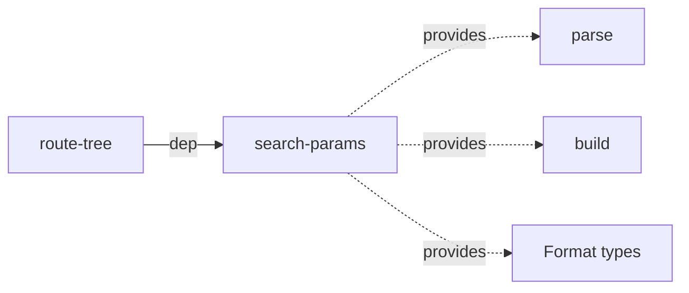

# Architecture

> Detailed architecture for AI agents and contributors

## Overview

`search-params` is an **internal, zero-dependency** package that provides query string parsing and building with configurable format strategies. It handles arrays, booleans, and nulls in query strings via a **Strategy pattern**.

**Key role:** All query string operations in the router go through this package. `path-matcher` has no query string handling — `route-tree` injects `search-params` functions via dependency injection.

## Package Structure

```
search-params/
├── src/
│   ├── searchParams.ts       — Core functions: parse, parseInto, build, omit, keep
│   ├── encode.ts             — Encoding logic + option resolution (makeOptions)
│   ├── decode.ts             — Decoding logic (value + strategy dispatch)
│   ├── utils.ts              — getSearch() — query string extraction
│   ├── strategies/
│   │   ├── index.ts          — Strategy factory & resolution (resolveStrategies)
│   │   ├── array.ts          — Array format strategies (4 implementations)
│   │   ├── boolean.ts        — Boolean format strategies (3 implementations)
│   │   └── null.ts           — Null format strategies (2 implementations)
│   ├── types.ts              — All type definitions
│   └── index.ts              — Public API exports
```

## Dependencies

**Zero runtime dependencies.** Pure TypeScript implementation using only `encodeURIComponent` / `decodeURIComponent`.

**Consumed by:**



| Consumer       | What it uses          | Purpose                                    |
| -------------- | --------------------- | ------------------------------------------ |
| **route-tree** | `parse()`             | DI into SegmentMatcher as `parseQueryString` |
| **route-tree** | `build()`             | DI into SegmentMatcher as `buildQueryString` |
| **route-tree** | `ArrayFormat`, etc.   | Type re-exports for public API             |

**Key design:** `route-tree` wraps `parse`/`build` with route-specific options at matcher creation time:

```typescript
// route-tree/createMatcher.ts
const qp = options?.queryParams;
new SegmentMatcher({
  parseQueryString: (qs) => parse(qs, qp),  // DI: search-params
  buildQueryString: (p) => build(p, qp),     // DI: search-params
});
```

## Public API

### Functions

```typescript
parse(path: string, opts?: Options): Record<string, unknown>
// Parse query string to object. Extracts "?" portion from full path.

parseInto(queryString: string, target: Record<string, unknown>): void
// Parse directly into existing object (allocation-free). No leading "?" expected.

build(params: Record<string, unknown>, opts?: Options): string
// Build query string from object. Returns string without leading "?".

omit(path: string, paramsToOmit: string[], opts?: Options): OmitResponse
// Remove specified parameters from query string.

keep(path: string, paramsToKeep: string[], opts?: Options): KeepResponse
// Keep only specified parameters from query string.
```

### Types

```typescript
// Format types
type ArrayFormat   = "none" | "brackets" | "index" | "comma";
type BooleanFormat = "none" | "string" | "empty-true";
type NullFormat    = "default" | "hidden";

// Options
interface Options {
  arrayFormat?: ArrayFormat;     // default: "none"
  booleanFormat?: BooleanFormat; // default: "none"
  nullFormat?: NullFormat;       // default: "default"
}

// Parameter types
type QueryParamPrimitive = string | number | boolean | null;
type QueryParamValue     = QueryParamPrimitive | QueryParamPrimitive[];
type SearchParams        = Record<string, QueryParamValue | undefined>;

// Response types
interface OmitResponse { querystring: string; removedParams: Record<string, unknown>; }
interface KeepResponse { querystring: string; keptParams: Record<string, unknown>; }

// Also exported
interface FinalOptions {
  arrayFormat: ArrayFormat;
  booleanFormat: BooleanFormat;
  nullFormat: NullFormat;
}
type DecodeResult = boolean | string | null;
```

## Strategy Pattern

### Architecture

Format-specific encoding/decoding is delegated to strategy objects, resolved once per call via `makeOptions()`:

```
Options { arrayFormat, booleanFormat, nullFormat }
    │
    ▼  makeOptions()
OptionsWithStrategies { ...options, strategies: ResolvedStrategies }
    │
    ├── strategies.boolean  — encode/decode boolean values
    ├── strategies.null     — encode null values
    └── strategies.array    — encode array values
```

### Strategy Interfaces

```typescript
interface BooleanStrategy {
  encode(name: string, value: boolean): string;
  decodeUndefined(): DecodeResult;        // key-only params (no "=")
  decodeRaw(rawValue: string): boolean | null;
  decodeValue(decodedValue: string): DecodeResult;
}

interface NullStrategy {
  encode(name: string): string;
}

interface ArrayStrategy {
  encodeArray(name: string, values: unknown[]): string;
}
```

### Format Implementations

#### Array Formats

| Format       | Encode example            | Parse example              |
| ------------ | ------------------------- | -------------------------- |
| `"none"`     | `a=1&a=2`                | Repeated keys → array      |
| `"brackets"` | `a[]=1&a[]=2`            | `[]` suffix → array        |
| `"index"`    | `a[0]=1&a[1]=2`          | Numeric index → array      |
| `"comma"`    | `a=1,2`                  | Comma-separated → array    |

#### Boolean Formats

| Format         | `true` encodes as | `false` encodes as | Parsing                             |
| -------------- | ----------------- | ------------------ | ----------------------------------- |
| `"none"`       | `flag=true`       | `flag=false`       | No conversion — remains string      |
| `"string"`     | `flag=true`       | `flag=false`       | `"true"`/`"false"` → `boolean`      |
| `"empty-true"` | `flag`            | `flag=false`       | Key-only → `true`, value passed through as string |

#### Null Formats

| Format      | Encodes as | Parsing                     |
| ----------- | ---------- | --------------------------- |
| `"default"` | `key`      | Key-only → `null` (via boolean strategy's `decodeUndefined()`) |
| `"hidden"`  | *(omitted)* | N/A (hidden nulls not in QS) |

## Core Algorithms

### Parse Flow

```
parse(path, opts?)
       │
       ▼
┌───────────────┐
│  getSearch()  │  Extract query string portion (after "?")
│               │  No "?" → returns entire input as-is
└──────┬────────┘
       │
       ▼
┌───────────────┐
│  Fast paths   │  Empty string → {}
│               │  No opts → parseSimple() (skip strategy resolution)
└──────┬────────┘
       │
       ▼
┌───────────────┐
│  makeOptions()│  Resolve strategies once (cached DEFAULT_OPTIONS)
└──────┬────────┘
       │
       ▼
┌───────────────┐
│  Single-pass  │  Iterate by "&" delimiter (index-based, no split())
│  iteration    │  For each chunk:
│               │    1. Extract name (strip "[]" suffix)
│               │    2. Decode name and value
│               │    3. Apply strategy decoding
│               │    4. addToParams() — handle array accumulation
└───────────────┘
```

**Dual parsing modes:**

| Mode                    | Trigger      | Behavior                        |
| ----------------------- | ------------ | ------------------------------- |
| `parseSimple()`         | No options   | String values only, no strategies |
| Full parse with strategies | Options provided | Boolean/null conversion, array handling |

### Build Flow

```
build(params, opts?)
       │
       ▼
┌───────────────┐
│  Fast path    │  Empty keys → ""
└──────┬────────┘
       │
       ▼
┌───────────────┐
│  makeOptions()│  Resolve strategies
└──────┬────────┘
       │
       ▼
┌───────────────┐
│  Single loop  │  For each key:
│               │    1. Skip undefined values
│               │    2. Dispatch by typeof:
│               │       string/number → encodeURIComponent
│               │       boolean → strategies.boolean.encode()
│               │       null → strategies.null.encode()
│               │       array → strategies.array.encodeArray()
│               │       object → String(obj) fallback
│               │    3. Skip empty results (nullFormat: "hidden")
└──────┬────────┘
       │
       ▼
  parts.join("&")
```

### Omit/Keep Flow

```
omit(path, paramsToOmit, opts?)
       │
       ▼
┌─────────────────┐
│  getSearch()    │  Extract query string
└──────┬──────────┘
       │
       ▼
┌─────────────────┐
│  Set creation   │  new Set(paramsToOmit) — O(1) lookup
└──────┬──────────┘
       │
       ▼
┌─────────────────┐
│  forEachParam() │  Iterate "&"-separated chunks
│                 │  Classify: omit set → removed[], else → kept[]
└──────┬──────────┘
       │
       ▼
  { querystring: hasPrefix ? `?${kept.join("&")}` : kept.join("&"),
    removedParams: parse(removed.join("&"), options) }
```

**`hasPrefix` logic:** If the input `path` started with `?`, the output `querystring` is re-prefixed with `?` (only when the result is non-empty — empty `querystring` is never prefixed).

**`keep()` is similar but inverted** — keeps chunks IN the set. Unlike `omit()`, `keep()` does NOT have the `hasPrefix` re-prefix logic — its `querystring` output never starts with `?`.

### Value Decoding

```typescript
decodeValue(value: string): string
```

**Two-check fast path:**

1. Check for `%` (percent-encoding) and `+` (space encoding)
2. Neither present → return as-is (**fast path** — most common case)
3. `+` present → replace with spaces via `split("+").join(" ")`
4. `%` present → `decodeURIComponent()`

### Array Accumulation

`addToParams()` handles multi-value parameters:

```
First value, no brackets   → params[name] = value        (scalar)
First value, with brackets → params[name] = [value]      (array)
Existing scalar + new      → params[name] = [old, new]   (convert to array)
Existing array + new       → params[name].push(new)      (append)
```

## Internal Module Dependencies

```
types.ts (leaf — no imports)
    ↓
    ├── utils.ts (leaf)
    ├── decode.ts → strategies, types
    ├── strategies/
    │   ├── array.ts → types (has own local encodeValue)
    │   ├── boolean.ts → types
    │   ├── null.ts → types
    │   └── index.ts → array, boolean, null
    ├── encode.ts → types, strategies
    └── searchParams.ts → decode, encode, utils, strategies, types
```

No circular dependencies.

## Performance Characteristics

### Complexity

| Operation    | Complexity | Notes                                   |
| ------------ | ---------- | --------------------------------------- |
| `parse()`    | O(n)       | n = query string length, single pass    |
| `build()`    | O(n)       | n = total value lengths                 |
| `omit()`     | O(n + m)   | n = query string length, m = omit set   |
| `keep()`     | O(n + m)   | n = query string length, m = keep set   |
| `parseInto()`| O(n)       | Same as parse, no object allocation     |

### Optimizations

| Optimization                  | Benefit                                      |
| ----------------------------- | -------------------------------------------- |
| Empty string fast path        | O(1) for empty query strings                 |
| No-options fast path          | Skip strategy resolution (most common case)  |
| `DEFAULT_OPTIONS` constant    | Cached default strategies, no allocation      |
| Index-based iteration         | No `split("&")` intermediate array            |
| `decodeValue` two-check       | Most values skip decoding entirely            |
| Set-based omit/keep           | O(1) per-param lookup instead of O(m) scan    |
| `parseInto()` mutation        | Avoids intermediate object + `Object.assign`  |

### Memory

- No intermediate arrays in parse (index-based iteration)
- `parseInto()` mutates target directly
- Strategy objects are singletons (one per format combination)
- `Set` for omit/keep (O(m) space, recycled after call)

## Error Handling

| Case                        | Behavior                                               |
| --------------------------- | ------------------------------------------------------ |
| Invalid array element type  | `TypeError` during `build()` (only string/number/boolean allowed) |
| `undefined` values          | Skipped in `build()` (not serializable)                |
| Objects in params            | Fallback to `String(obj)` → `"[object Object]"`        |
| Malformed query string       | Best-effort parse (missing `=` → `null` value)          |

## See Also

- [route-tree ARCHITECTURE.md](../route-tree/ARCHITECTURE.md) — Integration layer
- [path-matcher ARCHITECTURE.md](../path-matcher/ARCHITECTURE.md) — URL matching engine
- [ARCHITECTURE.md](../../ARCHITECTURE.md) — System-level architecture
