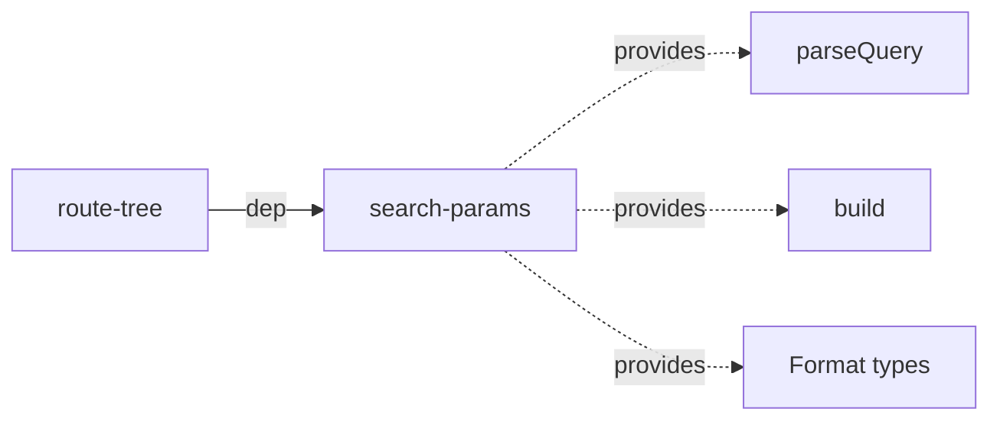

# Architecture

> Detailed architecture for AI agents and contributors

## Overview

`search-params` is an **internal, zero-dependency** package that provides query string parsing and building with configurable format strategies. It handles arrays, booleans, and nulls in query strings via a **Strategy pattern**.

**Key role:** All query string operations in the router go through this package. `path-matcher` has no query string handling — `route-tree` injects `search-params` functions via dependency injection.

## Package Structure

```
search-params/
├── src/
│   ├── searchParams.ts       — Core functions: parseQuery, build
│   ├── encode.ts             — Encoding logic + option resolution (makeOptions)
│   ├── decode.ts             — Decoding logic (value + strategy dispatch)
│   ├── utils.ts              — safeEncode() — total percent-encoding (lone-surrogate safe)
│   ├── strategies/
│   │   ├── index.ts          — Strategy factory & resolution (resolveStrategies)
│   │   ├── array.ts          — Array format strategies (4 implementations)
│   │   ├── boolean.ts        — Boolean format strategies (3 implementations)
│   │   ├── null.ts           — Null format strategies (2 implementations)
│   │   └── number.ts         — Number format strategies (2 implementations)
│   ├── types.ts              — All type definitions
│   └── index.ts              — Public API exports
```

## Dependencies

**Zero runtime dependencies.** Pure TypeScript implementation using only `encodeURIComponent` / `decodeURIComponent`.

**Consumed by:**


```mermaid
graph LR
    RT[route-tree] -->|dep| SP[search-params]

    SP -.->|provides| PARSE[parseQuery]
    SP -.->|provides| BUILD[build]
    SP -.->|provides| TYPES[Format types]
```

| Consumer       | What it uses        | Purpose                                      |
| -------------- | ------------------- | -------------------------------------------- |
| **route-tree** | `parseQuery()`      | DI into SegmentMatcher as `parseQueryString` |
| **route-tree** | `build()`           | DI into SegmentMatcher as `buildQueryString` |
| **route-tree** | `ArrayFormat`, etc. | Type re-exports for public API               |

**Key design:** `route-tree` wraps `parseQuery`/`build` with route-specific options at matcher creation time:

```typescript
// route-tree/createMatcher.ts
const qp = options?.queryParams;
new SegmentMatcher({
  parseQueryString: (qs) => parseQuery(qs, qp), // DI: search-params
  buildQueryString: (p) => build(p, qp), // DI: search-params
});
```

## Public API

### Functions

```typescript
parseQuery(search: string, opts?: Options): Record<string, unknown>
// Parse an ALREADY-extracted query string (no path prefix, no leading "?") into
// an object. The caller splits the URL at the first "?" itself — never re-split
// here, or a "?" inside a query value would drop the param (#1292). route-tree's
// matcher wires this as parseQueryString.

build(params: Record<string, unknown>, opts?: Options): string
// Build query string from object. Returns string without leading "?".
```

### Types

```typescript
// Format types
type ArrayFormat = "none" | "brackets" | "index" | "comma";
type BooleanFormat = "none" | "auto" | "empty-true";
type NullFormat = "default" | "hidden";
type NumberFormat = "none" | "auto";

// Options
interface Options {
  arrayFormat?: ArrayFormat; // default: "none"
  booleanFormat?: BooleanFormat; // default: "auto"
  nullFormat?: NullFormat; // default: "default"
  numberFormat?: NumberFormat; // default: "auto"
}

// Parameter types
type QueryParamPrimitive = string | number | boolean | null;
type QueryParamValue = QueryParamPrimitive | QueryParamPrimitive[];
type SearchParams = Record<string, QueryParamValue | undefined>;

// Also exported
interface FinalOptions {
  arrayFormat: ArrayFormat;
  booleanFormat: BooleanFormat;
  nullFormat: NullFormat;
  numberFormat: NumberFormat;
}
type DecodeResult = boolean | number | string | null;
```

## Strategy Pattern

### Architecture

Format-specific encoding/decoding is delegated to strategy objects, resolved once per call via `makeOptions()`:

```
Options { arrayFormat, booleanFormat, nullFormat, numberFormat }
    │
    ▼  makeOptions()
OptionsWithStrategies { ...options, strategies: ResolvedStrategies }
    │
    ├── strategies.boolean  — encode/decode boolean values
    ├── strategies.null     — encode null values
    ├── strategies.number   — decode numeric values
    └── strategies.array    — encode array values
```

### Strategy Interfaces

```typescript
interface BooleanStrategy {
  encode(name: string, value: boolean): string;
  decodeUndefined(): DecodeResult; // key-only params (no "=")
  decodeRaw(rawValue: string): boolean | null;
  decodeValue(decodedValue: string): DecodeResult;
}

interface NullStrategy {
  encode(name: string): string;
}

interface NumberStrategy {
  decode(decodedValue: string): number | null;
}

interface ArrayStrategy {
  // A `null` element encodes to the bare-key form via `nullStrategy` (the bare
  // key under `nullFormat: "default"`, dropped under `"hidden"`) so parseQuery's
  // null-in-array round-trips instead of throwing (#1155).
  encodeArray(
    name: string,
    values: unknown[],
    nullStrategy: NullStrategy,
  ): string;
  decodeValue?(rawValue: string): string[] | null; // comma: split raw into parts
  indexed?: boolean; // index: order elements by the bracket index `[n]` (#856)
}
```

### Format Implementations

#### Array Formats

| Format       | Encode example  | Parse example           |
| ------------ | --------------- | ----------------------- |
| `"none"`     | `a=1&a=2`       | Repeated keys → array   |
| `"brackets"` | `a[]=1&a[]=2`   | `[]` suffix → array     |
| `"index"`    | `a[0]=1&a[1]=2` | Ordered by `[n]` index  |
| `"comma"`    | `a=1,2`         | Comma-separated → array |

#### Boolean Formats

| Format         | `true` encodes as | `false` encodes as | Parsing                                           |
| -------------- | ----------------- | ------------------ | ------------------------------------------------- |
| `"auto"`       | `flag=true`       | `flag=false`       | `"true"`/`"false"` → `boolean`                    |
| `"none"`       | `flag=true`       | `flag=false`       | No conversion — remains string                    |
| `"empty-true"` | `flag`            | `flag=false`       | Key-only → `true`; `"true"`/`"false"` → `boolean` |

#### Number Formats

| Format   | Decoding                                                                                                                                                                                          |
| -------- | ------------------------------------------------------------------------------------------------------------------------------------------------------------------------------------------------- |
| `"none"` | No conversion — numbers remain strings                                                                                                                                                            |
| `"auto"` | `/^-?(0\|[1-9]\d*)(\.\d+)?$/` → `Number()` (codePointAt scan, no regex engine; rejects leading-zero/exponent/unsafe-int, and negative-zero via an `Object.is` guard the grammar alone would miss) |

Encoding is not needed — `encode.ts` handles `typeof value === "number"` via `encodeURIComponent` regardless of format.

#### Null Formats

| Format      | Encodes as  | Parsing                                                        |
| ----------- | ----------- | -------------------------------------------------------------- |
| `"default"` | `key`       | Key-only → `null` (via boolean strategy's `decodeUndefined()`) |
| `"hidden"`  | _(omitted)_ | N/A (hidden nulls not in QS)                                   |

## Core Algorithms

### Parse Flow

```
parseQuery(search, opts?)   ← input is already the extracted query (no leading "?")
       │
       ▼
┌───────────────┐
│  Fast path    │  Empty string / "?" → {}
└──────┬────────┘
       │
       ▼
┌───────────────┐
│  makeOptions()│  Resolve strategies once; no opts → cached DEFAULT_OPTIONS (auto)
└──────┬────────┘
       │
       ▼
┌───────────────┐
│  Single-pass  │  Iterate by "&" delimiter (index-based, no split())
│  iteration    │  For each chunk:
│               │    1. Extract name (strip "[]" suffix)
│               │    2. Decode name and value
│               │    3. Apply strategy decoding
│               │    4. addToParams() — handle array accumulation
└───────────────┘
```

**Parsing modes:**

| Mode                       | Trigger          | Behavior                                          |
| -------------------------- | ---------------- | ------------------------------------------------- |
| Default strategies         | No options       | Cached `DEFAULT_OPTIONS` (auto) — same as `build` |
| Full parseQuery with strategies | Options provided | Boolean/null/number conversion, array handling    |

### Build Flow

```
build(params, opts?)
       │
       ▼
┌───────────────┐
│  Fast path    │  Empty keys → ""
└──────┬────────┘
       │
       ▼
┌───────────────┐
│  makeOptions()│  Resolve strategies
└──────┬────────┘
       │
       ▼
┌───────────────┐
│  Single loop  │  For each key:
│               │    1. Skip undefined values
│               │    2. Dispatch by typeof:
│               │       string/number → encodeURIComponent
│               │       boolean → strategies.boolean.encode()
│               │       null → strategies.null.encode()
│               │       array → strategies.array.encodeArray()
│               │       object → String(obj) fallback
│               │    3. Skip empty results (nullFormat: "hidden")
└──────┬────────┘
       │
       ▼
  parts.join("&")
```

### Value Decoding

```typescript
decodeValue(value: string): string
```

**Two-check fast path:**

1. Check for `%` (percent-encoding) and `+` (space encoding)
2. Neither present → return as-is (**fast path** — most common case)
3. `+` present → replace with spaces via `replaceAll("+", " ")`
4. `%` present → `decodeURIComponent()`

### Array Accumulation

`addToParams()` handles multi-value parameters:

```
First value, no brackets   → params[name] = value        (scalar)
First value, with brackets → params[name] = [value]      (array)
Existing scalar + new      → params[name] = [old, new]   (convert to array)
Existing array + new       → params[name].push(new)      (append)
```

## Internal Module Dependencies

```
types.ts (leaf — no imports)
    ↓
    ├── utils.ts (leaf)
    ├── decode.ts → strategies, types
    ├── strategies/
    │   ├── array.ts → types (has own local encodeValue)
    │   ├── boolean.ts → types
    │   ├── null.ts → types
    │   ├── number.ts → types
    │   └── index.ts → array, boolean, null, number, types
    ├── encode.ts → types, strategies
    └── searchParams.ts → decode, encode, utils, strategies, types
```

No circular dependencies.

## Performance Characteristics

### Complexity

| Operation | Complexity | Notes                                |
| --------- | ---------- | ------------------------------------ |
| `parseQuery()` | O(n)       | n = query string length, single pass |
| `build()` | O(n)       | n = total value lengths              |

### Optimizations

| Optimization                              | Benefit                                                          |
| ----------------------------------------- | ---------------------------------------------------------------- |
| Empty string fast path                    | O(1) for empty query strings                                     |
| No-options path                           | Reuses cached `DEFAULT_OPTIONS` — no re-resolution or allocation |
| `DEFAULT_OPTIONS` constant                | Cached default strategies, no allocation                         |
| Index-based iteration                     | No `split("&")` intermediate array                               |
| `decodeValue` two-check                   | Most values skip decoding entirely                               |
| `replaceAll` instead of `split().join()`  | No intermediate array for `+` replacement                        |
| Inline bracket scan in parseQuery              | No `{ name, hasBrackets }` object allocation                     |
| Loop instead of `.map().join()` in arrays | No intermediate array during encoding                            |
| `codePointAt` scan in numberFormat        | No regex engine overhead                                         |

### Memory

- No intermediate arrays in parseQuery (index-based iteration)
- Strategy objects are singletons (one per format combination)
- No intermediate arrays in array strategies (loop instead of `.map().join()`)
- No object allocation for param name extraction (inline index scan)

## Error Handling

| Case                       | Behavior                                                                                                                                                                                                  |
| -------------------------- | --------------------------------------------------------------------------------------------------------------------------------------------------------------------------------------------------------- |
| Invalid array element type | `TypeError` during `build()` for `undefined` / objects only; a `null` element round-trips via the bare-key form per array format (#1155)                                                                  |
| `undefined` values         | Skipped in `build()` (not serializable)                                                                                                                                                                   |
| Objects in params          | Fallback to `encodeURIComponent(obj)` → `"%5Bobject%20Object%5D"`                                                                                                                                         |
| Malformed query string     | Best-effort parseQuery: missing `=` → `null` (scalar or array element — round-trips via the bare-key form, #1155); empty chunks (`&&`, leading/trailing `&`) are skipped, not injected as a `""` param (#1156) |

## See Also

- [INVARIANTS.md](INVARIANTS.md) — Property-based test invariants
- [route-tree ARCHITECTURE.md](../route-tree/ARCHITECTURE.md) — Integration layer
- [path-matcher ARCHITECTURE.md](../path-matcher/ARCHITECTURE.md) — URL matching engine
- [ARCHITECTURE.md](../../ARCHITECTURE.md) — System-level architecture
