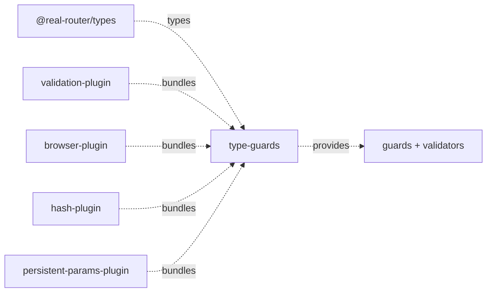

# Architecture

> Detailed architecture for AI agents and contributors

## Overview

`type-guards` is an **internal** package that provides centralized runtime type validation for the entire router ecosystem. It depends only on `@real-router/types`.

**Key role:** Single source of truth for all runtime type checks and assertions. Two validation layers:

- **Guards** (`is*`) — return `boolean`, narrow TypeScript types via type predicates
- **Validators** (`validate*`) — use `asserts` narrowing, throw `TypeError` if invalid

## Package Structure

```
type-guards/
├── src/
│   ├── index.ts                  — Public API exports
│   ├── guards/
│   │   ├── index.ts              — Re-exports all guards
│   │   ├── primitives.ts         — isString, isBoolean, isObjKey, isPrimitiveValue
│   │   ├── params.ts             — isParams, isParamsStrict
│   │   ├── routes.ts             — isRouteName
│   │   ├── navigation.ts         — isNavigationOptions
│   │   └── state.ts              — isState, isStateStrict
│   ├── validators/
│   │   ├── index.ts              — Re-exports all validators
│   │   ├── routes.ts             — validateRouteName
│   │   └── state.ts              — validateState
│   ├── utilities/
│   │   └── type-description.ts   — getTypeDescription
│   └── internal/
│       ├── meta-fields.ts        — isRequiredFields, isMetaFields (not exported; isMetaFields always returns true for backward compat)
│       └── router-error.ts       — FULL_ROUTE_PATTERN, createRouterError (not exported)
```

## Dependencies

**Single runtime dependency:** `@real-router/types`.

**Consumed by:**



| Consumer                             | What it uses                                                          | Purpose                                             |
| ------------------------------------ | --------------------------------------------------------------------- | --------------------------------------------------- |
| **validation-plugin**                | `isParams`, `isString`, `isBoolean`, `isObjKey`, `getTypeDescription` | Opt-in runtime validation + error messages          |
| **browser-plugin** / **hash-plugin** | `isStateStrict` (re-exported as `isState`)                            | Public `history.state` guard                        |
| **shared/browser-env**               | `isStateStrict` (as `isState`)                                        | popstate state validation (browser/hash/navigation) |
| **persistent-params-plugin**         | `isPrimitiveValue`                                                    | URL-safe param value check                          |

> `@real-router/core` is **not** a consumer — it uses its own structural `isStateStructural` guard, not `type-guards`.

## Public API

### Guards

```typescript
// Primitives
function isString(value: unknown): value is string;
function isBoolean(value: unknown): value is boolean;
function isObjKey<T extends object>(
  key: string,
  obj: T,
): key is Extract<keyof T, string>;
function isPrimitiveValue(value: unknown): value is string | number | boolean;
// Rejects NaN and Infinity for numbers

// Params
function isParams(value: unknown): value is Params;
// Allows nested objects/arrays; two-phase validation
function isParamsStrict(value: unknown): value is Params;
// Only primitives and arrays of primitives; no nested objects

// Routes
function isRouteName(name: unknown): name is string;

// Navigation
function isNavigationOptions(value: unknown): value is NavigationOptions;

// State
function isState(value: unknown): value is State;
// Checks presence of name, params, path
function isStateStrict(value: unknown): value is State;
// Behaviorally identical to isState (same required-field check); no deeper validation
```

### Validators

```typescript
function validateRouteName(
  name: unknown,
  methodName: string,
): asserts name is string;
// Throws: TypeError("[router.{method}] Invalid route name ...")

function validateState(state: unknown, method: string): asserts state is State;
// Throws: TypeError("[{method}] Invalid state structure: {type} ...")
```

### Utilities

```typescript
function getTypeDescription(value: unknown): string;
// "null" | "array[N]" | "ClassName" | "object" | typeof value
```

## Two Validation Levels

**Guards** (`is*`) return `boolean` and narrow types. Used for conditional branching:

```typescript
if (isParams(value)) {
  // value is Params here
}
```

**Validators** (`validate*`) use TypeScript's `asserts` narrowing — they throw `TypeError` if invalid, otherwise the compiler treats the argument as the asserted type. Used when invalid data is a programming error that should never be silently ignored:

```typescript
validateRouteName(name, "navigate");
// After this line, TypeScript knows: name is string
// Caller sees: TypeError: [router.navigate] Invalid route name "123bad"...
```

Error messages always include the calling method name for easier stack trace reading.

## Strictness Levels

### `isParams` vs `isParamsStrict`

Both require a plain object (`proto === null || proto === Object.prototype`). They differ in allowed value types:

| Feature              | `isParams`                                                              | `isParamsStrict`             |
| -------------------- | ----------------------------------------------------------------------- | ---------------------------- |
| Primitive values     | ✅                                                                      | ✅                           |
| `null` / `undefined` | ✅                                                                      | ✅                           |
| Arrays of primitives | ✅                                                                      | ✅                           |
| Nested plain objects | ✅ (deep)                                                               | ❌                           |
| Arrays of objects    | ✅ (deep)                                                               | ❌                           |
| Circular references  | ❌ detected via `WeakSet`                                               | ❌                           |
| Class instances      | ❌                                                                      | ❌                           |
| Algorithm            | Two-phase fast → slow path                                              | Single-pass                  |
| Used by              | `validation-plugin`, `isState`/`isStateStrict` (via `isRequiredFields`) | — (currently unused; latent) |

**Why two levels?** `isParams` supports the full `Params` type — arbitrary serializable objects for state management. `isParamsStrict` restricts to URL-encodable values that round-trip through a query string without loss. (`isParamsStrict` currently has no callers — it is a latent part of the public surface.)

### `isState` vs `isStateStrict`

| Feature         | `isState`                                                 | `isStateStrict`                                        |
| --------------- | --------------------------------------------------------- | ------------------------------------------------------ |
| Required fields | `isRouteName(name)` + `isParams(params)` + `path: string` | Same (via `isRequiredFields`)                          |
| `params` field  | `isParams` (allows nested objects)                        | `isParams` (identical — see below)                     |
| Used by         | not consumed by core (core has its own structural guard)  | browser-plugin, hash-plugin (re-exported as `isState`) |

**Why two names?** Both currently reduce to the same `isRequiredFields` check — `isStateStrict` is **behaviorally identical** to `isState` (the "strict" name is historical; it does not deep-validate `meta`). Browser and hash plugins re-export `isStateStrict` as their public `isState` for validating `history.state`.

## Params Validation Algorithm (`isParams`)

Two-phase design — the fast path handles the 95%+ case (flat objects) with no recursion or allocation:

```
isParams(value)
    │
    ├── Reject: not object, null, array, or custom prototype → false
    │
    ├── Phase 1 — fast path: iterate own properties
    │   ├── All values primitive? → return true     (no WeakSet, no recursion)
    │   ├── function or symbol found? → return false (early reject)
    │   └── non-primitive found → set needsDeepCheck, break
    │
    └── Phase 2 — slow path: isSerializable(value)
        ├── Iteratively validates nested arrays and objects (explicit work-stack)
        ├── on-path set → rejects cycles; done-set → accepts shared refs (diamonds)
        └── Rejects class instances (proto !== Object.prototype)
```

The slow path is **iterative**, not recursive: a recursive walk overflows the call
stack with `RangeError` at ~2.4k levels of nesting, which would break the boolean
contract on adversarial input reachable via `history.state` / user-supplied params.
A heap-allocated work-stack scales to any depth (#901), so `isParams` returns a
boolean at any nesting depth instead of throwing.

`isParamsStrict` skips both phases entirely — one loop, primitives and flat arrays only.

## Internal Helpers

Not exported. Used across guards and validators internally.

### `internal/meta-fields.ts`

- `isRequiredFields(obj)` — checks `name` (via `isRouteName`), `path` (`string`), `params` (via `isParams`). Shared by `isState` and `isStateStrict`.
- `isMetaFields(meta)` — always returns `true` (backward compat with old `history.state` entries that had a `meta` field). No longer validates anything.

### `internal/router-error.ts`

- `FULL_ROUTE_PATTERN` — `/^[A-Z_a-z][\w-]*(?:\.[A-Z_a-z][\w-]*)*$/` — validates route name segments
- `HAS_NON_WHITESPACE` — `/\S/` — rejects whitespace-only strings
- `MAX_ROUTE_NAME_LENGTH` — `10_000` — technical DoS protection limit
- `createRouterError(methodName, message)` — creates `TypeError("[router.{method}] {message}")`

## Route Name Rules

`isRouteName` and `validateRouteName` enforce identical rules:

| Rule                        | Example                     | Valid     |
| --------------------------- | --------------------------- | --------- |
| Empty string (root node)    | `""`                        | ✅        |
| Single segment              | `"home"`                    | ✅        |
| Dot-separated segments      | `"users.profile"`           | ✅        |
| Underscore and hyphen       | `"admin_panel"`, `"api-v2"` | ✅        |
| System routes (`@@` prefix) | `"@@router/UNKNOWN_ROUTE"`  | ✅ bypass |
| Whitespace-only             | `"   "`                     | ❌        |
| Leading or trailing dot     | `".users"`, `"users."`      | ❌        |
| Consecutive dots            | `"users..profile"`          | ❌        |
| Segment starting with digit | `"users.123"`               | ❌        |

System routes bypass `FULL_ROUTE_PATTERN` validation — they are created only in router code, not from user input.

## See Also

- [core CLAUDE.md](../core/CLAUDE.md) — Core package architecture and consumer context
- [ARCHITECTURE.md](../../ARCHITECTURE.md) — System-level architecture
